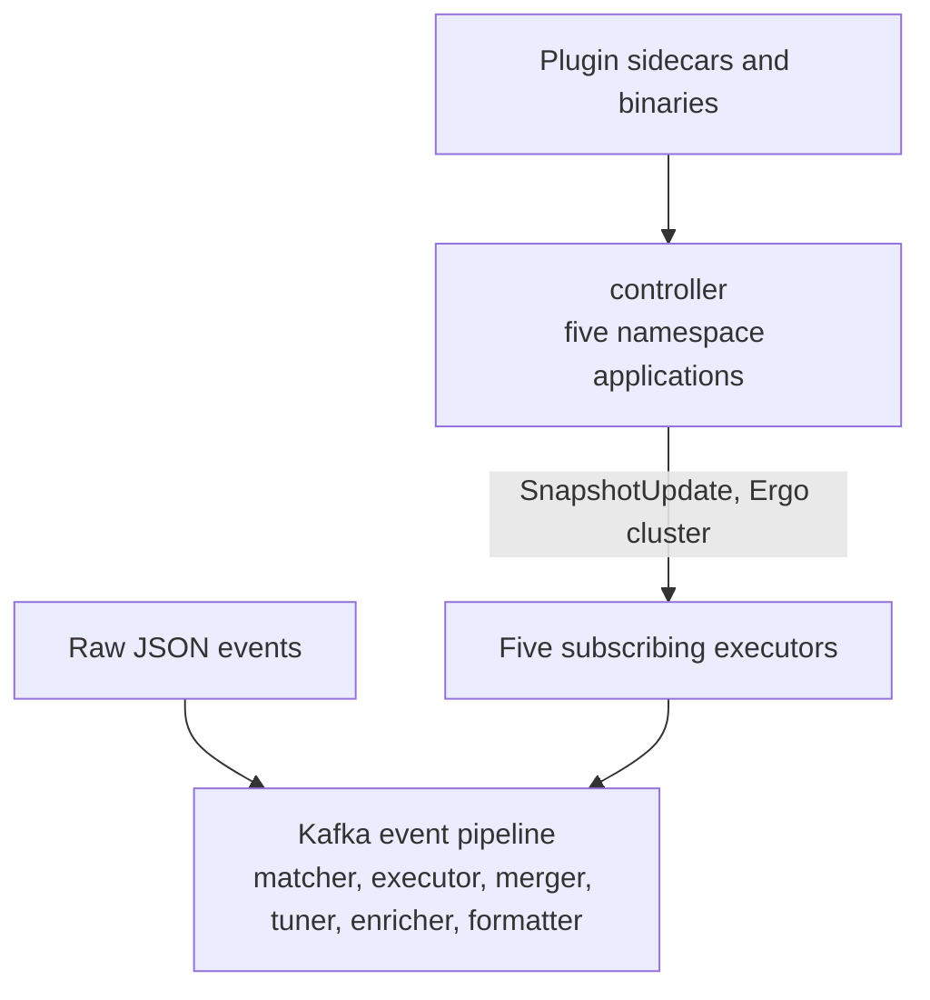

# Blink

**A pluggable runtime for the next generation of threat detection**

Blink is building an event-driven Go runtime where detection logic, correlation, enrichment, and investigation can evolve independently. Isolated plugins and focused stages make
capabilities easier to test, roll out safely, and improve without turning detection engineering into a monolith.

> [!IMPORTANT]
> **Current features are narrower than the project direction.** The documented runtime today is `controller` and `event_matcher`; the wider pipeline below describes
> where Blink is going, not a claim that every stage is implemented.

## Vision

- **One runtime, multiple detection models.** Run compiled Go plugins today while making room for CEL, stateful correlation, and graph-based detection.
- **Capabilities are safe delivery units.** Rules, matchers, tuners, enrichments, formatters, and future actors can be versioned, isolated, tested, and rolled out
  independently.
- **Correlation is a first-class detection layer.** Sequence, composite, aggregation, and graph rules should be native detection models rather than afterthoughts.
- **AI agents are governed pipeline actors.** Agents should investigate and enrich under the same contracts, tests, observability, and rollout controls as deterministic capabilities.
- **The pipeline grows through bounded services.** New services can join an extensible event flow without making the runtime a monolith.

## What Blink is building

| Area                  | Available today                                                                                                      | Project direction                                         |
| --------------------- | -------------------------------------------------------------------------------------------------------------------- | --------------------------------------------------------- |
| Plugin runtime        | Separate Go plugin subprocesses over gRPC; five families: rules, matchers, tuning rules, enrichments, and formatters | CEL and other detection models alongside compiled plugins |
| Control plane         | `controller` scans artifacts and pushes desired state to executors over the Ergo cluster, for five plugin families   | More bounded consumers of the same contracts              |
| Event matching        | `event_matcher` evaluates matcher plugins and emits `ExecMessage`, terminal DLQ, or no output                        | Detection execution and additional models downstream      |
| Rollout and delivery  | Blue-green, canary, and shadow deployments; bounded retries and explicit Kafka commits/DLQs                          | Common lifecycle, observability, and rollout controls     |
| Later pipeline stages | Tuning, enrichment, and format contracts exist; no data-plane actor services are documented yet                      | Correlate, tune, enrich/investigate, format, and deliver  |

## Target pipeline

```text
Events
  -> Match                 current: event_matcher
  -> Detect                planned/migrating downstream stage
  -> Correlate             planned
  -> Tune                  planned; tuning plugin contracts exist
  -> Enrich/Investigate    planned; enrichment plugin contracts exist
  -> Format                planned; formatter plugin contracts exist
  -> Deliver               planned
```

This is the target architecture, not a claim that every stage is complete. `controller` currently publishes the desired state used by `event_matcher`; the remaining stages
are planned or migrating service boundaries connected through Kafka.

## Current runtime

Six binaries run an Ergo node and join one native Ergo cluster, using etcd for discovery: `controller` plus five executors. `alert_merger` runs no node. The controller owns one application per plugin namespace and pushes each committed generation straight to that namespace's subscribers. Kafka carries the event pipeline between stages.



Each executor subscribes to its own namespace; `event_matcher` is the only one that needs two.

| Namespace    | Controller application  | Subscribing executor             |
| ------------ | ----------------------- | -------------------------------- |
| `rule`       | `controller-rule`       | `rule_executor`, `event_matcher` |
| `matcher`    | `controller-matcher`    | `event_matcher`                  |
| `tuning`     | `controller-tuning`     | `rule_tuner`                     |
| `enrichment` | `controller-enrichment` | `alert_enricher`                 |
| `formatter`  | `controller-formatter`  | `alert_formatter`                |

| Message                             | Direction                                                      | Meaning                                                              |
| ----------------------------------- | -------------------------------------------------------------- | -------------------------------------------------------------------- |
| Plugin sidecars and binaries        | Plugin filesystem → `controller`                               | Each namespace's `artifact_scanner` reads its own catalog artifacts. |
| `SubscribeRequest`/`SnapshotUpdate` | executor ↔ its namespace application (Ergo cluster)            | Registers a subscriber, then pushes each committed generation to it. |
| `MessageExecutorReport`             | executor snapshot supervisor → namespace application (cluster) | Which generation that executor received and which it holds live.     |
| Events and alerts                   | stage → stage, Kafka                                           | The data plane: one topic per hop, plus a DLQ per stage.             |

There is no broker in the snapshot path: no Kafka snapshot topic, no compacted-topic reader.

## Current services

| Service           | Purpose                                                                                                            | Reference                                           |
| ----------------- | ------------------------------------------------------------------------------------------------------------------ | --------------------------------------------------- |
| `controller`      | Scans, persists, and pushes desired state for the rule, matcher, tuning, formatter, and enrichment catalogs.       | [Service reference](docs/services/controller.md)    |
| `event_matcher`   | Reads events, selects eligible rules via plugins, and emits protobuf `ExecMessage` or terminal DLQ/no-op outcomes. | [Service reference](docs/services/event_matcher.md) |
| `rule_executor`   | Evaluates rule plugins against matched events and emits alerts.                                                    | Not documented yet                                  |
| `alert_merger`    | Groups and merges related alerts. Runs no Ergo node.                                                               | Not documented yet                                  |
| `rule_tuner`      | Applies tuning-rule plugins to adjust alert confidence.                                                            | Not documented yet                                  |
| `alert_enricher`  | Applies enrichment plugins to alerts.                                                                              | Not documented yet                                  |
| `alert_formatter` | Applies formatter plugins to produce the delivered alert shape.                                                    | Not documented yet                                  |

## Runtime foundation

Each service process runs one Ergo node with cluster networking enabled. Applications, supervisors, actors, and meta processes isolate failure domains. Actors serialize mutable
control state instead of acting as parallel workers. Bounded invocation admission plus the dynamic router → route → manager → plugin process hierarchy provides
concurrency. Dynamic routes are not supervisors. Horizontal scale remains at the service, Kafka, and KEDA layers.

- Plugins run as separate Go subprocesses over gRPC, so a failing capability is isolated from its host service.
- `controller` persists desired state to SQLite and pushes each committed generation straight to subscribed executors over the Ergo cluster. Executors report back which generation they hold, so drift is visible from the controller.
- The plugin runtime supports blue-green, canary, and shadow deployments for controlled production changes and offline evaluation.
- `controller` bounds meta-process and write retries. `event_matcher` retries pending matching and publication failures, writes terminal DLQ records when
  appropriate, and commits source offsets only after terminal outcomes and required writes are acknowledged.

## Delivery and testing

Blink treats safe rollout and testability as runtime concerns: isolated plugin subprocesses, generation-tracked desired state, bounded retries, explicit terminal outcomes,
and at-least-once Kafka delivery make failures and reversions observable. Use focused service and runtime tests during development, then deploy with Helm and KEDA.

## Quick start

Blink requires Go 1.26 or newer.

```bash
go build ./cmd/controller ./cmd/event_matcher
go test ./cmd/controller
go test ./cmd/event_matcher/matcher
go test ./internal/runtime/controller ./internal/runtime/plugin ./internal/runtime/snapshot
```

## Documents

- [Services index](docs/services/README.md)
- [Controller service](docs/services/controller.md)
- [Event matcher service](docs/services/event_matcher.md)
- [Ergo runtime overview](docs/internals/README.md)
- [Controller runtime](docs/internals/controller-runtime.md)
- [Plugin runtime](docs/internals/plugin-runtime.md)
- [Snapshot runtime](docs/internals/snapshot-runtime.md)
- [Message flow](docs/internals/message-flow.md)
- [Concurrency knobs](docs/internals/concurrency-knobs.md)
- [Schema reference](docs/internals/schemas/README.md)
- [Deployment runbook](deployments/README.md)
- [Development](DEVELOPMENT.md)
- [Contributing](CONTRIBUTING.md)

## Repository

```text
cmd/          service entry points
internal/     runtime (controller, plugin, snapshot), brokers, dlq, exec, services
pkg/          plugin SDKs and shared contracts
docs/         service, runtime, message-flow, and schema references
deployments/  Helm charts and Kubernetes deployment runbook
```

Contributions are welcome; start with [CONTRIBUTING.md](CONTRIBUTING.md) and [DEVELOPMENT.md](DEVELOPMENT.md).
