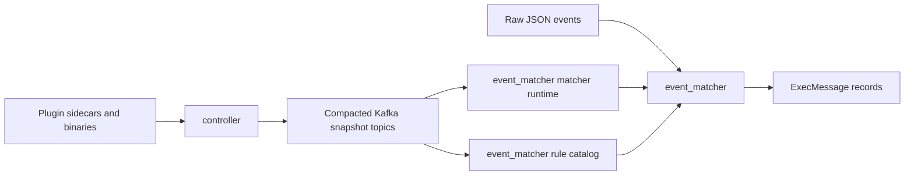

# Blink

### A pluggable runtime for the next generation of threat detection

Blink is building an event-driven Go runtime where detection logic, correlation, enrichment, and investigation can evolve independently. Isolated plugins and focused stages make
capabilities easier to test, roll out safely, and improve without turning detection engineering into a monolith.

> [!IMPORTANT]
> **Current features are narrower than the project direction.** The documented runtime today is `controller` and `event_matcher`; the wider pipeline below describes
> where Blink is going, not a claim that every stage is implemented.

## Vision

- **One runtime, multiple detection models.** Run compiled Go plugins today while making room for CEL, stateful correlation, and graph-based detection.
- **Capabilities are safe delivery units.** Rules, matchers, tuners, enrichments, formatters, and future actors can be versioned, isolated, tested, and rolled out
  independently.
- **Correlation is a first-class detection layer.** Sequence, composite, aggregation, and graph rules should be native detection models rather than afterthoughts.
- **AI agents are governed pipeline actors.** Agents should investigate and enrich under the same contracts, tests, observability, and rollout controls as deterministic capabilities.
- **The pipeline grows through bounded services.** New services can join an extensible event flow without making the runtime a monolith.

## What Blink Is Building

| Area | Available today | Project direction |
| --- | --- | --- |
| Plugin runtime | Separate Go plugin subprocesses over gRPC; five families: rules, matchers, tuning rules, enrichments, and formatters | CEL and other detection models alongside compiled plugins |
| Control plane | `controller` scans artifacts and publishes compacted desired-state snapshots for five plugin families | More bounded consumers of the same contracts |
| Event matching | `event_matcher` evaluates matcher plugins and emits `ExecMessage`, terminal DLQ, or no output | Detection execution and additional models downstream |
| Rollout and delivery | Blue-green, canary, and shadow deployments; bounded retries and explicit Kafka commits/DLQs | Common lifecycle, observability, and rollout controls |
| Later pipeline stages | Tuning, enrichment, and format contracts exist; no data-plane actor services are documented yet | Correlate, tune, enrich/investigate, format, and deliver |

## Target Pipeline

```text
Events
  -> Match                 current: event_matcher
  -> Detect                planned/migrating downstream stage
  -> Correlate             planned
  -> Tune                  planned; tuning plugin contracts exist
  -> Enrich/Investigate    planned; enrichment plugin contracts exist
  -> Format                planned; formatter plugin contracts exist
  -> Deliver               planned
```

This is the target architecture, not a claim that every stage is complete. `controller` currently publishes the desired state used by `event_matcher`; the remaining stages
are planned or migrating service boundaries connected through Kafka.

## Current Runtime

Blink currently documents two runtime services: `controller` and `event_matcher`. Both are Go processes with a local, non-networked Ergo node; Kafka is the cross-process boundary.



| Message | Direction | Meaning |
| --- | --- | --- |
| Plugin sidecars and binaries | Plugin filesystem → `controller` | The controller's `artifact_scanner` reads catalog artifacts. |
| Kafka snapshot entries and `__blink_generation__` marker | `controller` → compacted Kafka snapshot topics | Publishes effective catalog entries and their completed generation. |
| Kafka snapshot entries and `__blink_generation__` marker | Compacted Kafka snapshot topics → matcher runtime and rule catalog | Builds the matcher and rule projections used by `event_matcher`. |
| Raw JSON events | Event producer → `event_matcher` | Supplies events for matching. |
| Committed matcher and rule projections | Matcher runtime and rule catalog → `event_matcher` | Supplies the current matching state. |
| Protobuf `execpb.ExecMessage` records | `event_matcher` → `ExecMessage` records | Emits eligible rule executions. |

## Current Services

| Service | Purpose | Runtime reference |
| --- | --- | --- |
| `controller` | Scans, persists, and publishes desired state for rule, matcher, tuning, formatter, and enrichment catalogs. | [Service reference](docs/services/controller.md) |
| `event_matcher` | Reads events, selects eligible rules via plugins, and emits protobuf `ExecMessage` or terminal DLQ/no-op outcomes. | [Service reference](docs/services/event_matcher.md) |

## Runtime Foundation

Each service process owns a local, non-networked Ergo node. Applications, supervisors, actors, and meta processes isolate failure domains. Actors serialize mutable
control state instead of acting as parallel workers. Bounded invocation admission plus the dynamic router → route → manager → plugin process hierarchy provides
concurrency. Dynamic routes are not supervisors. Horizontal scale remains at the service, Kafka, and KEDA layers.

- Plugins run as separate Go subprocesses over gRPC, so a failing capability is isolated from its host service.
- `controller` publishes desired state as log-compacted Kafka snapshots, including a generation marker; consumers rebuild committed projections from that state.
- The plugin runtime supports blue-green, canary, and shadow deployments for controlled production changes and offline evaluation.
- `controller` bounds meta-process and publication retries. `event_matcher` retries pending matching and publication failures, writes terminal DLQ records when
  appropriate, and commits source offsets only after terminal outcomes and required writes are acknowledged.

## Delivery and Testing

Blink treats safe rollout and testability as runtime concerns: isolated plugin subprocesses, compacted desired-state snapshots, bounded retries, explicit terminal outcomes,
and at-least-once Kafka delivery make failures and reversions observable. Use focused service and runtime tests during development, then deploy the current controller
and matcher topology with Helm and KEDA.

## Quick Start

Blink requires Go 1.26 or newer.

```bash
go build ./cmd/controller ./cmd/event_matcher
go test ./cmd/controller
go test ./cmd/event_matcher/matcher
go test ./internal/runtime/controller ./internal/runtime/plugin ./internal/runtime/snapshot
```

## Documentation

- [Service index](docs/services/README.md)
- [Ergo runtime overview](docs/internals/README.md)
- [Controller runtime](docs/internals/controller-runtime.md)
- [Plugin runtime](docs/internals/plugin-runtime.md)
- [Snapshot runtime](docs/internals/snapshot-runtime.md)
- [Message flow](docs/internals/message-flow.md)
- [Schema reference](docs/internals/schemas/README.md)
- [Deployment](deployments/README.md)
- [Development](DEVELOPMENT.md)
- [Contributing](CONTRIBUTING.md)

## Repository

```text
cmd/          service entry points
internal/     controller, plugin, snapshot, broker, and service runtime code
pkg/          plugin SDKs and shared contracts
docs/         current service, runtime, message-flow, and schema references
deployments/  Helm charts and Kubernetes deployment runbook
```

Contributions are welcome; start with [CONTRIBUTING.md](CONTRIBUTING.md) and [DEVELOPMENT.md](DEVELOPMENT.md).
