# Blink Kubernetes Deployment

## Prerequisites

### Podman

```bash
brew install podman
podman system connection default podman-machine-default-root
podman machine init --cpus 5 --memory 16384 --disk-size 100
podman machine set --rootful
podman machine start
```

### Minikube

```bash
minikube config set cpus 2
minikube config set memory 4096
minikube config set disk-size 40
minikube config set rootless false
minikube config set container-runtime crio
minikube config set driver podman
minikube start
```

### Required operators

Install the Strimzi operator before the Kafka chart and the KEDA operator before the
KEDA chart. The three Blink charts are independent; the operators are not packaged by
this repository.

```bash
kubectl create namespace kafka
kubectl create -f 'https://strimzi.io/install/latest?namespace=kafka' -n kafka
kubectl get pods -n kafka --watch # wait for them to be ready
```

```bash
helm repo add kedacore https://kedacore.github.io/charts
helm repo update
helm install keda kedacore/keda --namespace keda --create-namespace
kubectl get pods -n keda --watch # wait for them to be ready
```

The Blink KEDA chart creates Kafka-lag `ScaledObject`s. The controller deliberately
has no scaler because it publishes snapshots and has no consumer lag to scale on.

## Canonical Helm deployment

```bash
# Validate and render every chart from the repository root.
helm lint deployments/helm/kafka -f deployments/helm/values.yaml
helm template blink-kafka deployments/helm/kafka --namespace kafka -f deployments/helm/values.yaml
helm lint deployments/helm/blink -f deployments/helm/values.yaml
helm template blink deployments/helm/blink --namespace blink -f deployments/helm/values.yaml
helm lint deployments/helm/keda -f deployments/helm/values.yaml
helm template blink-keda deployments/helm/keda --namespace blink -f deployments/helm/values.yaml

# Install in dependency order. The Blink chart requires Kafka topics and the KEDA
# chart targets Deployments created by the Blink chart.
helm upgrade --install blink-kafka deployments/helm/kafka --namespace kafka --create-namespace -f deployments/helm/values.yaml
kubectl wait kafka/blink-kafka-cluster --for=condition=Ready --timeout=300s --namespace kafka
helm upgrade --install blink deployments/helm/blink --namespace blink --create-namespace -f deployments/helm/values.yaml
helm upgrade --install blink-keda deployments/helm/keda --namespace blink -f deployments/helm/values.yaml
```

Build and publish or load the Blink service images before installing the Blink chart;
its defaults reference `localhost` images with `image.pullPolicy=Never` for Minikube.
For a registry-based cluster, override `image.registry`, `image.tag`, and
`image.pullPolicy`.

The Kafka chart creates the controller prerequisites: `rule-snapshot-topic`,
`matcher-snapshot-topic`, `tuning-snapshot-topic`, `formatter-snapshot-topic`, and
`enrichment-snapshot-topic`. Each has one partition and `cleanup.policy: compact`.

### Shared-stage topology and names

`global.sharedStages` in `deployments/helm/values.yaml` is the canonical topology
for the shared alert pipeline. Every chart must receive that same values file. Its
stage key derives the primary topic as `<stage>-topic` and consumer group as
`<stage>-group`; `workload` supplies the Deployment and Service name.

| Stage        | Deployment         | Topic / group                           | DLQ (`withDLQ`)       | ScaledObject (`withScaler`) |
| ------------ | ------------------ | --------------------------------------- | --------------------- | --------------------------- |
| `merger`     | `alert-merger`     | `merger-topic` / `merger-group`         | disabled              | disabled                    |
| `tuner`      | `rule-tuner`       | `tuner-topic` / `tuner-group`           | `tuner-dlq-topic`     | `rule-tuner-scaler`         |
| `enricher`   | `alert-enricher`   | `enricher-topic` / `enricher-group`     | `enricher-dlq-topic`  | `alert-enricher-scaler`     |
| `formatter`  | `alert-formatter`  | `formatter-topic` / `formatter-group`   | `formatter-dlq-topic` | `alert-formatter-scaler`    |
| `dispatcher` | `alert-dispatcher` | `dispatcher-topic` / `dispatcher-group` | disabled              | `alert-dispatcher-scaler`   |

`withDLQ: true` conditionally creates `<stage>-dlq-topic` and supplies its service
configuration; `withScaler: true` conditionally creates `<workload>-scaler` for the
stage's topic and group. Merger and dispatcher DLQs remain disabled pending runtime
support. Do not enable either merely by creating a topic.

For the default `application` log type, the derived Deployments are
`event-matcher-application` and `rule-executor-application`; their topics/groups are
`matcher-application-topic` / `matcher-application-group` and
`exec-application-topic` / `exec-application-group`, with ScaledObjects
`event-matcher-application-scaler` and `rule-executor-application-scaler`.

### Add a log type

`global.logTypes` in `deployments/helm/values.yaml` is the canonical map of enabled
log types; add `cloudtrail: {}` there once, then render or install every chart with
that shared values file. Chart-local `logTypeOverrides` only tune chart-specific
behavior for an already enabled key: Kafka topic capacity/retention, Blink workload
resources/tuning, or KEDA scaler thresholds/replica bounds.

For `cloudtrail`, the no-prefix naming contract derives the `event-matcher-cloudtrail`
and `rule-executor-cloudtrail` Deployments, matcher topic/group
`matcher-cloudtrail-topic` / `matcher-cloudtrail-group`, executor topic/group
`exec-cloudtrail-topic` / `exec-cloudtrail-group`, and matching `-scaler` names.

## Pipeline flow

```mermaid
flowchart LR
    subgraph application[application log type]
        appMatcherTopic([matcher-application-topic<br/>Kafka topic]) --> appMatcher[event-matcher-application<br/>Deployment]
        appMatcher --> appExecutorTopic([exec-application-topic<br/>Kafka topic]) --> appExecutor[rule-executor-application<br/>Deployment]
    end

    subgraph authentication[authentication log type]
        authMatcherTopic([matcher-authentication-topic<br/>Kafka topic]) --> authMatcher[event-matcher-authentication<br/>Deployment]
        authMatcher --> authExecutorTopic([exec-authentication-topic<br/>Kafka topic]) --> authExecutor[rule-executor-authentication<br/>Deployment]
    end

    appExecutor --> mergerTopic([merger-topic<br/>Kafka topic])
    authExecutor --> mergerTopic
    otherLogTypes[Each other configured log type<br/>same matcher/executor branch] --> mergerTopic

    mergerTopic --> merger[alert-merger<br/>Deployment] --> tunerTopic([tuner-topic<br/>Kafka topic])
    tunerTopic --> tuner[rule-tuner<br/>Deployment] --> enricherTopic([enricher-topic<br/>Kafka topic])
    enricherTopic --> enricher[alert-enricher<br/>Deployment] --> formatterTopic([formatter-topic<br/>Kafka topic])
    formatterTopic --> formatter[alert-formatter<br/>Deployment] --> dispatcherTopic([dispatcher-topic<br/>Kafka topic])
    dispatcherTopic --> dispatcher[alert-dispatcher<br/>Deployment]

    classDef topic fill:#e8f1ff,stroke:#1a73e8,color:#000
    classDef deployment fill:#e6f4ea,stroke:#188038,color:#000
    class appMatcherTopic,appExecutorTopic,authMatcherTopic,authExecutorTopic,mergerTopic,tunerTopic,enricherTopic,formatterTopic,dispatcherTopic topic
    class appMatcher,appExecutor,authMatcher,authExecutor,merger,tuner,enricher,formatter,dispatcher deployment
```



Every configured log type creates the same branch: matcher Kafka topic →
event-matcher Deployment → executor Kafka topic → rule-executor Deployment. Each
per-log-type executor branch fans in to the single shared `merger-topic`.

## Plugin binaries

The controller watches the YAML configuration in the plugin directories and publishes
the effective snapshots; pipeline pods consume those snapshots and use the same
directories as their binary artifact store. Therefore the controller and every
pipeline pod must mount the same plugin tree at `/plugins`. The chart defaults to a
`hostPath` of `/blink/plugins`; for production, configure a shared ReadWriteMany PVC
through `plugins.volume.persistentVolumeClaim` instead. This shared, flat `/plugins`
mount is intentional for now; it is not split per log type.

- Mount the plugin local folder in minikube

```bash
minikube mount ~/.blink/plugins:/blink/plugins
```

- The chart mounts this HostPath into every pod, including the controller.

- Compile and write the plugin in that local folder

```bash
GOOS=linux GOARCH=arm64 go build -o ~/.blink/plugins/matchers/allow-all ./examples/matchers/allow-all/
```
