# Blink Kubernetes Deployment

## Prerequisites

### Podman

```bash
brew install podman
podman system connection default podman-machine-default-root
podman machine init --cpus 5 --memory 16384 --disk-size 100
podman machine set --rootful
podman machine start
```

### Minikube

```bash
minikube config set cpus 2
minikube config set memory 4096
minikube config set disk-size 40
minikube config set rootless false
minikube config set container-runtime crio
minikube config set driver podman
minikube start
```

Build the controller and event-matcher images directly in Minikube before installing
the Blink chart. Their tags match the chart's local defaults:

```bash
minikube image build --tag localhost/blink-controller:latest --file cmd/controller/Dockerfile .
minikube image build --tag localhost/blink-event-matcher:latest --file cmd/event_matcher/Dockerfile .
```

### Required operators

Install the Strimzi operator before the Kafka chart and the KEDA operator before the
KEDA chart. The three Blink charts are independent; the operators are not packaged by
this repository.

```bash
kubectl create namespace kafka
kubectl create -f 'https://strimzi.io/install/latest?namespace=kafka' -n kafka
kubectl get pods -n kafka --watch # wait for them to be ready
```

```bash
helm repo add kedacore https://kedacore.github.io/charts
helm repo update
helm install keda kedacore/keda --namespace keda --create-namespace
kubectl get pods -n keda --watch # wait for them to be ready
```

The Blink KEDA chart creates Kafka-lag `ScaledObject`s. The controller deliberately
has no scaler because it publishes snapshots and has no consumer lag to scale on.

## Canonical Helm deployment

```bash
# Validate and render every chart from the repository root.
helm lint deployments/helm/kafka -f deployments/helm/values.yaml
helm template blink-kafka deployments/helm/kafka --namespace kafka -f deployments/helm/values.yaml
helm lint deployments/helm/blink -f deployments/helm/values.yaml
helm template blink deployments/helm/blink --namespace blink -f deployments/helm/values.yaml
helm lint deployments/helm/keda -f deployments/helm/values.yaml
helm template blink-keda deployments/helm/keda --namespace blink -f deployments/helm/values.yaml

# Install in dependency order. The Blink chart requires Kafka topics and the KEDA
# chart targets Deployments created by the Blink chart.
helm upgrade --install blink-kafka deployments/helm/kafka --namespace kafka --create-namespace -f deployments/helm/values.yaml
kubectl wait kafka/blink-kafka-cluster --for=condition=Ready --timeout=300s --namespace kafka
helm upgrade --install blink deployments/helm/blink --namespace blink --create-namespace -f deployments/helm/values.yaml
helm upgrade --install blink-keda deployments/helm/keda --namespace blink -f deployments/helm/values.yaml
```

Build and publish or load the Blink service images before installing the Blink chart;
its defaults reference `localhost` images with `image.pullPolicy=Never` for Minikube.
For a registry-based cluster, override `image.registry`, `image.tag`, and
`image.pullPolicy`.

After rebuilding an image under the same local tag, restart its deployment so new
pods load the replacement image:

```bash
minikube image build --tag localhost/blink-event-matcher:latest --file cmd/event_matcher/Dockerfile .
kubectl rollout restart deployment/event-matcher --namespace blink
kubectl rollout status deployment/event-matcher --namespace blink --timeout=120s
```

The Kafka chart creates the controller prerequisites declared as `topic.snapshot`
on each plugin stage. Each name comes from that workload's
`kafka_topic_<stage>_snapshot` environment entry; the checked-in values follow the
`<workload>-snapshot-topic` convention. Shared capacity defaults provide the
replication factor and `cleanup.policy: compact`. Snapshot topics are always
rendered with one partition.

### Shared-stage topology and names

`global.stages` in `deployments/helm/values.yaml` is the canonical topology
for the shared alert pipeline. Every chart must receive that same values file. Its
`workload.name` supplies the Deployment and Service name. Each workload declares its
own Kafka bindings under `workload.environment` using matching
`kafka_topic_<stage>` and `kafka_group_<stage>` keys. Their checked-in values follow
the `<workload>-topic` and `<workload>-group` naming convention; these are explicit
values, not names inferred by the templates.

Put all service-specific environment variables, including only the Kafka topics,
groups, snapshots, DLQs, and plugin directories that service consumes, under
`workload.environment` using `snake_case` keys; the Blink chart uppercases each key
(`kafka_topic_matcher` becomes `KAFKA_TOPIC_MATCHER`). The non-stage controller is configured separately under
`global.controller.workload`, which supports the same capacity, resource, and
environment overrides as stage workloads.

The shared ConfigMap contains only the common Kafka broker address. Kafka and KEDA
resolve a stage's primary topic and consumer group from that stage's workload
environment, keeping the runtime and infrastructure values identical.

| Stage        | Deployment         | Topic / group                                       | DLQ                         | ScaledObject              |
| ------------ | ------------------ | --------------------------------------------------- | --------------------------- | ------------------------- |
| `merger`     | `alert-merger`     | `alert-merger-topic` / `alert-merger-group`         | disabled                    | disabled                  |
| `tuner`      | `rule-tuner`       | `rule-tuner-topic` / `rule-tuner-group`             | `rule-tuner-dlq-topic`      | `rule-tuner-scaler`       |
| `enricher`   | `alert-enricher`   | `alert-enricher-topic` / `alert-enricher-group`     | `alert-enricher-dlq-topic`  | `alert-enricher-scaler`   |
| `formatter`  | `alert-formatter`  | `alert-formatter-topic` / `alert-formatter-group`   | `alert-formatter-dlq-topic` | `alert-formatter-scaler`  |
| `dispatcher` | `alert-dispatcher` | `alert-dispatcher-topic` / `alert-dispatcher-group` | disabled                    | `alert-dispatcher-scaler` |

The presence of `topic.dlq` creates the DLQ named by the matching
`kafka_topic_<stage>_dlq` workload environment entry. The presence of `scaler`
conditionally creates `<workload>-scaler` for the stage's environment-defined topic
and group. Scaler settings inherit the KEDA chart defaults, including
`offsetResetPolicy: earliest`. Merger and dispatcher DLQs remain disabled pending
runtime support. Do not enable either merely by creating a topic.
Per-stage `topic` values override the Kafka chart's shared primary and DLQ
capacity defaults.

### Event pipeline topology

All log sources use one shared matcher/executor lane. Producers publish events to
`event-matcher-topic`; `event-matcher` selects matchers and rules from each event's
`log_type`, publishes eligible events to `rule-executor-topic`, and sends exhausted failures
to `event-matcher-dlq-topic`. `rule-executor` evaluates the routed rules and publishes
alerts to the shared `alert-merger-topic`.

| Stage          | Deployment / group                      | Topic                     |
| -------------- | --------------------------------------- | ------------------------- |
| Event matching | `event-matcher` / `event-matcher-group` | `event-matcher-topic`     |
| Rule execution | `rule-executor` / `rule-executor-group` | `rule-executor-topic`     |
| Matcher DLQ    | -                                       | `event-matcher-dlq-topic` |

Matcher and executor pods do not use a deployment-level `LOG_TYPE`. The event's
`log_type` selects the relevant rules from the shared snapshots, so adding a log source
does not create another Kafka topic, consumer group, Deployment, or ScaledObject.

### Event key

Producers construct the event key once at ingress and set those exact bytes as the Kafka key:

```text
blink.event.pk|<tenant-bytes>:<tenant_id>,<log-type-bytes>:<log_type>,<kind-bytes>:<kind>,<origin-bytes>:<origin>,
```

Each length is a UTF-8 byte count, not a character count. `tenant_id` and `log_type` are required
non-empty UTF-8 strings. Use literal `stream_id` and its value when `stream_id` is present; only
when it is absent use literal `source_id` and its value. A present but invalid `stream_id` is an
error, not a fallback to `source_id`. Test vector:

```text
{tenant_id: "acme", log_type: "cloud", stream_id: "stream-7"}
blink.event.pk|4:acme,5:cloud,9:stream_id,8:stream-7,
```

The UTF-8 test vector with `tenant_id` bytes `74c3a9`, `log_type` bytes `e697a5e5bf97`, and
`stream_id` bytes `e6ba90` produces hex
`626c696e6b2e6576656e742e706b7c333a74c3a92c363ae697a5e5bf972c393a73747265616d5f69642c333ae6ba902c`.
Producers reject or quarantine missing, empty, non-string, or invalid-UTF-8 required components;
they never emit a partial or sentinel key. The matcher preserves the supplied key byte-for-byte
on executor and matcher-DLQ writes.

Blink's current Kafka writer uses the FNV-1a `kafka.Hash` balancer. Equal non-nil key bytes retain
ordering and select the same partition only within one topic. Do not claim equal numeric partitions
across topics: topics are independently partitioned and may have different partition counts.
Increasing a topic's partition count remaps some existing keys, breaking their prior partition
ordering; resize an active topic only when that remapping is acceptable. Keep each stage's replica
and KEDA maximum at or below its topic partition count.

### Add a log type

Adding a log type does not change the deployment topology:

1. Ensure producers set the event's `log_type` and the standard Kafka key.
2. Add or update the matcher and rule sidecars that support that `log_type`.
3. Deploy the plugin artifacts and let the controller publish the updated snapshots.

## Pipeline flow

```mermaid
flowchart LR
    producers[All log sources] --> eventTopic([event-matcher-topic<br/>Kafka topic])
    eventTopic --> matcher[event-matcher<br/>Deployment]
    matcher --> execTopic([rule-executor-topic<br/>Kafka topic]) --> executor[rule-executor<br/>Deployment]
    matcher -. exhausted record .-> matcherDLQ([event-matcher-dlq-topic<br/>Kafka topic])
    executor --> mergerTopic([alert-merger-topic<br/>Kafka topic])
    mergerTopic --> merger[alert-merger<br/>Deployment] --> tunerTopic([rule-tuner-topic<br/>Kafka topic])
    tunerTopic --> tuner[rule-tuner<br/>Deployment] --> enricherTopic([alert-enricher-topic<br/>Kafka topic])
    enricherTopic --> enricher[alert-enricher<br/>Deployment] --> formatterTopic([alert-formatter-topic<br/>Kafka topic])
    formatterTopic --> formatter[alert-formatter<br/>Deployment] --> dispatcherTopic([alert-dispatcher-topic<br/>Kafka topic])
    dispatcherTopic --> dispatcher[alert-dispatcher<br/>Deployment]

    classDef topic fill:#e8f1ff,stroke:#1a73e8,color:#000
    classDef deployment fill:#e6f4ea,stroke:#188038,color:#000
    class eventTopic,execTopic,matcherDLQ,mergerTopic,tunerTopic,enricherTopic,formatterTopic,dispatcherTopic topic
    class matcher,executor,merger,tuner,enricher,formatter,dispatcher deployment
```



The shared matcher and executor deployments handle every log source. Stateful alert
processing remains in the shared downstream stages.

The matcher and executor acknowledge input offsets only after synchronous Kafka output writes
(`RequireAll`) succeed. This yields at-least-once delivery: an output acknowledged before a later
offset-commit failure can be written again after replay. `event_matcher` writes malformed records
and exhausted matcher failures to `KAFKA_TOPIC_MATCHER_DLQ` using the protobuf
`dlq.DLQEnvelope`, which retains source topic/partition/offset, original payload, stage, reason,
attempts, and timestamp; the original key remains Kafka message metadata. These failures are
terminal per record. Only shutdown cancellation leaves the whole fetched batch uncommitted.
The matcher readiness probe succeeds after both snapshot readers drain, including when both
catalogs are empty. Before opening its grouped reader, the matcher additionally waits for
non-empty parsed primary matcher and rule catalogs; disabled
primaries count, but candidate-only catalogs do not. This startup gate does not prove a controller
heartbeat/freshness or stop an already-running reader if either catalog later becomes empty. The
executor waits only for its rule snapshot reader to drain before opening its grouped reader, then
commits only after all rule evaluations and alert writes for the batch succeed.
Kafka readers wait on the caller context for a first record, use `MinBytes=1`, then give a partial
batch one absolute 100 ms linger window; this avoids low-volume batch stalls without extending the
deadline for each later record.

## Plugin binaries

The controller watches the YAML configuration in the plugin directories and publishes
the effective snapshots; pipeline pods consume those snapshots and use the same
directories as their binary artifact store. Therefore the controller and every
pipeline pod must mount the same plugin tree at `/plugins`. The chart defaults to a
`hostPath` of `/blink/plugins`; for production, configure a shared ReadWriteMany PVC
through `plugins.volume.persistentVolumeClaim` instead. This shared, flat `/plugins`
mount is intentional for now; it is not split per log type.

- Mount the plugin local folder in minikube

```bash
mkdir -p ~/.blink/plugins/{rules,matchers,tuning_rules,formatters,enrichments,dispatchers}
minikube mount ~/.blink/plugins:/blink/plugins
```

Keep the `minikube mount` process running while Blink is deployed.

- The chart mounts this HostPath into every pod, including the controller.

- Compile and write the plugin in that local folder

```bash
GOOS=linux GOARCH=arm64 go build -o ~/.blink/plugins/matchers/allow-all ./examples/matchers/allow-all/
```
