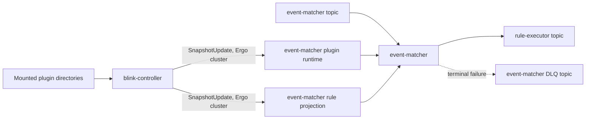

# Blink Kubernetes Deployment

This runbook documents the deployed `controller` and `event-matcher` runtime. The Helm templates are generic: `deployments/helm/blink/templates/workloads.yaml` renders the controller and every key in
`global.stages`. This page makes no runtime claim for stage entries outside the controller and matcher configuration.

## Local prerequisites

### Podman

```bash
brew install podman
podman system connection default podman-machine-default-root
podman machine init --cpus 5 --memory 16384 --disk-size 100
podman machine set --rootful
podman machine start
```

### Minikube

```bash
minikube config set cpus 2
minikube config set memory 4096
minikube config set disk-size 40
minikube config set rootless false
minikube config set container-runtime crio
minikube config set driver podman
minikube start
```

### Kafka

```bash
kubectl create namespace kafka
kubectl create -f 'https://strimzi.io/install/latest?namespace=kafka' -n kafka
kubectl get pods -n kafka --watch # wait for them to be ready
```

### KEDA

```bash
helm repo add kedacore https://kedacore.github.io/charts
helm repo update
helm install keda kedacore/keda --namespace keda --create-namespace
kubectl get pods -n keda --watch # wait for them to be ready
```

### etcd

Unlike Kafka and KEDA, etcd is not an external operator to install first - `deployments/helm/blink/templates/etcd.yaml` deploys a dedicated 3-member etcd cluster as part of the Blink chart itself, for Blink's exclusive use as its Ergo cluster registrar (every workload, including the controller, requires it; see `docs/internals/controller-runtime.md`). The only prerequisite here is setting the values that authenticate against it before installing the Blink chart:

```bash
# cluster.cookie authenticates node-to-node connections; etcd.username/etcd.password authenticate
# against etcd itself. All three default to "" and must be overridden for any shared environment.
helm upgrade --install blink deployments/helm/blink --namespace blink --create-namespace \
  -f deployments/helm/values.yaml \
  --set cluster.cookie="$CLUSTER_COOKIE" \
  --set etcd.username="$ETCD_USERNAME" \
  --set etcd.password="$ETCD_PASSWORD"
```

### Build images

For Minikube, build the two documented images into its image store:

```bash
minikube image build --tag localhost/blink-controller:latest --file cmd/controller/Dockerfile .
minikube image build --tag localhost/blink-event-matcher:latest --file cmd/event_matcher/Dockerfile .
```

## Helm validation and install

Every chart must receive the same topology file:

```bash
# Validate and render every chart from the repository root.
helm lint deployments/helm/kafka -f deployments/helm/values.yaml
helm template blink-kafka deployments/helm/kafka --namespace kafka -f deployments/helm/values.yaml
helm lint deployments/helm/blink -f deployments/helm/values.yaml
helm template blink deployments/helm/blink --namespace blink -f deployments/helm/values.yaml
helm lint deployments/helm/keda -f deployments/helm/values.yaml
helm template blink-keda deployments/helm/keda --namespace blink -f deployments/helm/values.yaml

# Install in dependency order. The Blink chart requires Kafka topics and the KEDA
# chart targets Deployments created by the Blink chart.
helm upgrade --install blink-kafka deployments/helm/kafka --namespace kafka --create-namespace -f deployments/helm/values.yaml
kubectl wait kafka/blink-kafka-cluster --for=condition=Ready --timeout=300s --namespace kafka
helm upgrade --install blink deployments/helm/blink --namespace blink --create-namespace -f deployments/helm/values.yaml
helm upgrade --install blink-keda deployments/helm/keda --namespace blink -f deployments/helm/values.yaml
```

The Blink chart defaults to `localhost`, `latest`, and `image.pullPolicy: Never`. Override image settings for a registry-backed cluster.

## Controller and matcher topology

`global.controller.workload` configures `blink-controller`; it is constrained by the template to exactly one replica and mounts controller state at `/var/lib/blink/controller`. Its environment
supplies five plugin directories.

Every workload joins a native Ergo cluster to reach the controller - `deployments/helm/blink/templates/etcd.yaml` deploys a dedicated 3-member etcd cluster for node discovery, and `cluster.cookie` (in `deployments/helm/blink/values.yaml`, sensitive - override per environment) authenticates connections between nodes. This is the only path for snapshot distribution; the Kafka snapshot topics and compacted-topic reader/publisher this replaced are gone (see `docs/internals/controller-runtime.md`).

`global.stages.matcher.workload` configures `event-matcher`. Its input, consumer group, executor output, DLQ, plugin directory, and matcher retry settings are all in
its `environment` map. Snake-case keys in that map render as uppercase environment variables.



| Message                         | Direction                                                                  | Meaning                                                                     |
| -------------------------------- | ---------------------------------------------------------------------------- | ------------------------------------------------------------------------------ |
| Mounted plugin directories       | Plugin volume → `blink-controller`                                         | The controller's `artifact_scanner` reads catalog artifacts.                |
| `SubscribeRequest`/`SnapshotUpdate` | `blink-controller` ↔ event-matcher plugin runtime and rule projection (Ergo cluster) | Pushes committed catalog entries directly to every subscriber - no Kafka topic in this path. |
| Raw JSON events                  | `event-matcher` topic → `event-matcher`                                    | Supplies events for matching.                                               |
| Committed matcher and rule projections | Plugin runtime and rule projection → `event-matcher`                 | Supplies the current matching state.                                        |
| Protobuf `execpb.ExecMessage` records | `event-matcher` → `rule-executor` topic                               | Emits eligible rule executions.                                             |
| DLQ envelope                     | `event-matcher` → `event-matcher` DLQ topic                                | Records a terminal failure.                                                 |

The controller and matcher mount the configured plugin volume. Local values use the host path `/blink/plugins`; a production deployment can use `plugins.volume.persistentVolumeClaim`. The controller
needs the rules, matchers, tuning-rules, formatters, and enrichments directories; the matcher needs the matchers directory.

## Verify

```bash
kubectl get deployments,pods,services -n blink
kubectl get kafka,kafkatopic -n kafka
kubectl get scaledobjects -n blink
kubectl rollout status deployment/event-matcher --namespace blink --timeout=120s
```

Both workloads serve `/health/live`, `/health/ready`, and `/metrics` on port 8080. Event matcher becomes ready after its matcher runtime and rule projection are ready; startup additionally waits
for non-empty primary matcher and rule catalogs before it begins consuming events.

## Operational commands

These assume the `blink` (workloads) and `kafka` (broker) namespaces from this runbook. Substitute
your own namespaces if you installed elsewhere.

### Restart one service

Picks up a new image tag or an env var change without touching anything else:

```bash
kubectl rollout restart deployment/event-matcher --namespace blink
kubectl rollout status deployment/event-matcher --namespace blink --timeout=60s
```

### Rebuild and redeploy one service

`imagePullPolicy: Never` plus reusing the `:latest` tag means Kubernetes can skip pulling your
rebuilt image - tag every rebuild uniquely so the Deployment is guaranteed to pick it up:

```bash
TAG="dev-$(date +%s)"
minikube image build -t "localhost/blink-event-matcher:$TAG" -f cmd/event_matcher/Dockerfile .
kubectl set image deployment/event-matcher -n blink event-matcher="localhost/blink-event-matcher:$TAG"
kubectl rollout status deployment/event-matcher -n blink --timeout=60s
```

### Send test events

Produce newline-delimited JSON directly into a topic. `kafka-console-producer.sh` runs inside the
broker pod, so copy the file in first if it's larger than the broker's `/tmp` (often a few MB tmpfs
- copy to `/home/kafka` instead for anything sizable):

```bash
BROKER=$(kubectl get pods -n kafka -l app.kubernetes.io/name=kafka -o jsonpath='{.items[0].metadata.name}')
kubectl cp events.jsonl kafka/"$BROKER":/home/kafka/events.jsonl
kubectl exec -n kafka "$BROKER" -- bash -c \
  "bin/kafka-console-producer.sh --bootstrap-server localhost:9092 --topic event-matcher-topic < /home/kafka/events.jsonl"
```

### Restart one topic (empty it)

Strimzi has no "truncate" operation - delete and let the Topic Operator recreate it from its
`KafkaTopic` CR. A client that queries the topic name before the operator finishes recreating it
can trigger Kafka's own topic auto-create with the wrong (default 1) partition count, which the
operator then silently adopts as correct; wait a few seconds and confirm the partition count before
sending anything:

```bash
BROKER=$(kubectl get pods -n kafka -l app.kubernetes.io/name=kafka -o jsonpath='{.items[0].metadata.name}')
kubectl exec -n kafka "$BROKER" -- bin/kafka-topics.sh --bootstrap-server localhost:9092 \
  --delete --topic event-matcher-topic
sleep 15
kubectl exec -n kafka "$BROKER" -- bin/kafka-topics.sh --bootstrap-server localhost:9092 \
  --describe --topic event-matcher-topic | head -1   # confirm PartitionCount matches the KafkaTopic CR
```

### Clean up (empty every pipeline topic)

For a clean load-test slate. Restart every consuming service afterward so it rejoins each
topic's consumer group with a fresh assignment - a consumer that was mid-session during the delete
can otherwise get stuck holding a stale partition assignment:

```bash
BROKER=$(kubectl get pods -n kafka -l app.kubernetes.io/name=kafka -o jsonpath='{.items[0].metadata.name}')
kubectl exec -n kafka "$BROKER" -- bin/kafka-topics.sh --bootstrap-server localhost:9092 --delete --topic \
  'event-matcher-topic,event-matcher-dlq-topic,rule-executor-topic,alert-merger-topic,alert-merger-dlq-topic,rule-tuner-topic,rule-tuner-dlq-topic,alert-enricher-topic,alert-enricher-dlq-topic,alert-formatter-topic,alert-formatter-dlq-topic,alert-dispatcher-topic'
sleep 15
kubectl rollout restart deployment/event-matcher --namespace blink
kubectl rollout status deployment/event-matcher --namespace blink --timeout=60s
```

## References

- [Service index](../docs/services/README.md)
- [Controller](../docs/services/controller.md)
- [Event matcher](../docs/services/event_matcher.md)
- [Runtime overview](../docs/internals/README.md)
