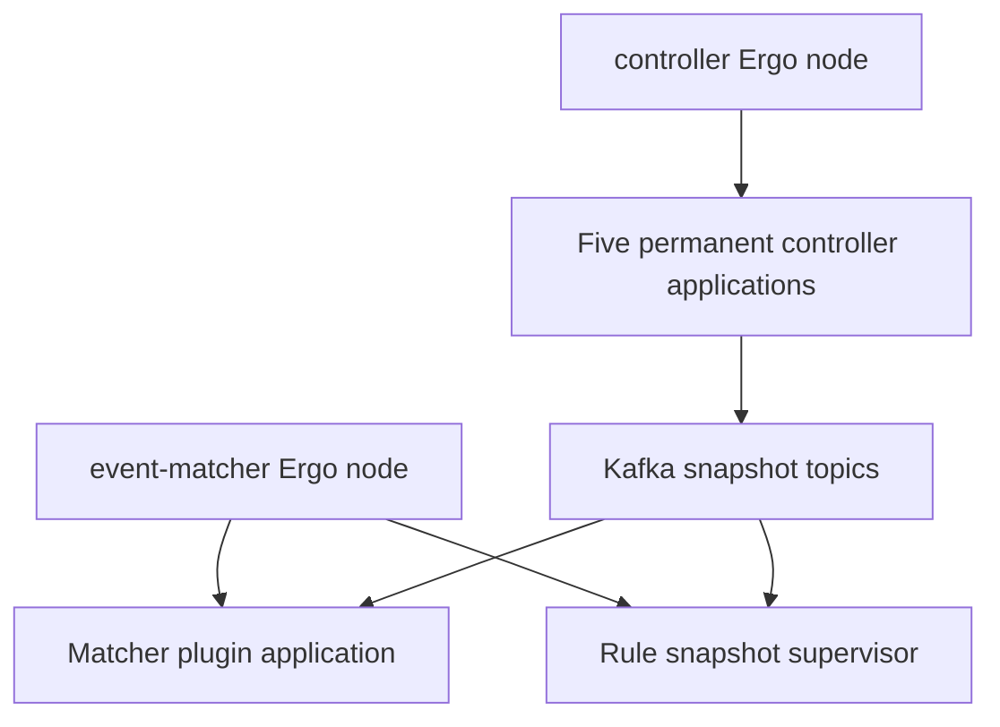

# Blink Ergo runtime

Blink's documented runtime is local to each service process. `NodeHost` starts one Ergo node with networking disabled; Kafka remains the durable boundary between processes. Radar is installed on every node, while `ENVIRONMENT=dev` also enables the local observer and MCP applications.

## Composition

| Message                                                  | Direction                                                                         | Meaning                                                             |
| -------------------------------------------------------- | --------------------------------------------------------------------------------- | ------------------------------------------------------------------- |
| Controller application lifecycle                         | Controller Ergo node → five permanent controller applications                     | Starts the independent catalog applications.                        |
| Kafka snapshot entries and `__blink_generation__` marker | Controller applications → Kafka snapshot topics                                   | Publishes effective catalog entries and their completed generation. |
| Event-matcher application lifecycle                      | Event-matcher Ergo node → matcher plugin application and rule snapshot supervisor | Starts the matcher runtime and rule projection owners.              |
| Kafka snapshot entries and `__blink_generation__` marker | Kafka snapshot topics → matcher plugin application and rule snapshot supervisor   | Builds the committed matcher and rule projections.                  |

- A controller application owns one `OneForOne` supervisor, its controller actor, and actor-owned artifact_scanner and publisher metas. The controller process runs independent applications for rules, matchers, tuning rules, formatters, and enrichments.
- An event-matcher attempt owns a permanent matcher plugin application plus a rule snapshot supervisor. The plugin runtime uses a `RestForOne` subtree for its snapshot, reconciler, and catalog actors; its application is drained, stopped, and unloaded when the service attempt ends.
- A snapshot supervisor owns a reader and typed projection in `RestForOne` order, so a reader restart also replaces its projection. It exposes the current parsed projection to its owning runtime.

The controller artifact_scanner reads sidecars and binaries, reconciles desired state, and publishes keyed snapshot entries. The matcher reads immutable projection state per batch, routes through its plugin runtime, and performs its own Kafka input/output work. Detailed actor state machines intentionally belong in the runtime implementation rather than this index.

## References

- [Controller service](../services/controller.md)
- [Event matcher service](../services/event_matcher.md)
- [Message flow](message-flow.md)
- [Schema reference](schemas/README.md)
