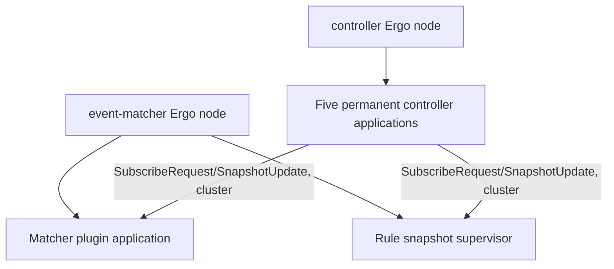

# Blink Ergo runtime

The runtime is local to each service process, but every process joins one native Ergo cluster: `NodeHost` starts one Ergo node with cluster networking enabled, backed by etcd for node discovery, and snapshot distribution between the controller and executors is direct actor-to-actor messaging over that cluster - not a broker. Kafka remains the transport for the primary event/alert pipeline (matcher → executor → merger → tuner → enricher → formatter → dispatcher), which this page does not cover. Radar is installed on every node. `ENVIRONMENT=dev` also enables the local observer and MCP applications.

## Composition

| Message                             | Direction                                                                         | Meaning                                                             |
| -------------------------------------- | ------------------------------------------------------------------------------------ | ------------------------------------------------------------------------ |
| Controller application lifecycle    | Controller Ergo node → five permanent controller applications                     | Starts the independent catalog applications.                        |
| `SubscribeRequest`/`SnapshotUpdate` | Controller applications ↔ subscribing reader actors, over the cluster             | Registers a subscriber and pushes each completed generation to it.  |
| Event-matcher application lifecycle | Event-matcher Ergo node → matcher plugin application and rule snapshot supervisor | Starts the matcher runtime and rule projection owners.              |

- A controller application owns one `OneForOne` supervisor, its controller actor, and one actor-owned artifact_scanner meta (a separate meta persists snapshots to SQLite, but does not distribute them). The controller process runs one such application per namespace: rules, matchers, tuning rules, formatters, and enrichments.
- An event-matcher attempt owns a permanent matcher plugin application plus a rule snapshot supervisor. The plugin runtime keeps its snapshot, reconciler, and catalog actors in a `RestForOne` subtree. Its application is drained, stopped, and unloaded when the attempt ends.
- A snapshot supervisor owns a reader and a typed projection in `RestForOne` order, so a reader restart replaces its projection too. It exposes the current parsed projection to its owning runtime.

The controller artifact_scanner reads sidecars and binaries, reconciles desired state, and pushes changed snapshots to every subscribed executor over the cluster. The matcher reads immutable projection state per batch, routes through its plugin runtime, and does its own Kafka I/O for the event pipeline (unrelated to snapshot distribution). Actor state machines live in the pages below, not in this index.

## References

- [Controller service](../services/controller.md)
- [Event matcher service](../services/event_matcher.md)
- [Message flow](message-flow.md)
- [Concurrency knobs](concurrency-knobs.md)
- [Schema reference](schemas/README.md)
