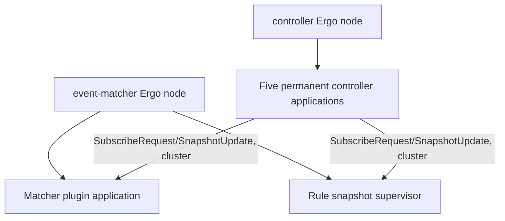

# Blink Ergo runtime

The runtime is local to each service process, but every process joins one native Ergo cluster. `NodeHost` starts one Ergo node with cluster networking enabled, backed by etcd for node discovery. Snapshot distribution between the controller and executors is direct actor-to-actor messaging over that cluster, not a broker.

Kafka remains the transport for the primary event/alert pipeline (matcher → executor → merger → tuner → enricher → formatter → dispatcher). This page does not cover that pipeline.

A node can serve three HTTP endpoints, each off unless its own variable enables it, independent of the others and of `ENVIRONMENT`: radar (`RADAR_ENABLED`, metrics and per-namespace readiness), Ergo's observer UI (`OBSERVER_ENABLED`), and its MCP server (`MCP_ENABLED`). `*_HOST`/`*_PORT` bind each, defaulting to `0.0.0.0` and 9090/9911/9922. `DEBUG=true` raises the process logger and its node to debug level.

## Composition

| Message                             | Direction                                                                         | Meaning                                                            |
| ----------------------------------- | --------------------------------------------------------------------------------- | ------------------------------------------------------------------ |
| Controller application lifecycle    | Controller Ergo node → five permanent controller applications                     | Starts the independent catalog applications.                       |
| `SubscribeRequest`/`SnapshotUpdate` | Controller applications ↔ subscribing reader actors, over the cluster             | Registers a subscriber and pushes each completed generation to it. |
| Event-matcher application lifecycle | Event-matcher Ergo node → matcher plugin application and rule snapshot supervisor | Starts the matcher runtime and rule projection owners.             |

- A controller application owns one `OneForOne` supervisor, its controller actor, and one actor-owned artifact_scanner meta. A separate meta persists snapshots to SQLite but does not distribute them. The controller process runs one such application per namespace: rules, matchers, tuning rules, formatters, and enrichments.
- An event-matcher attempt owns a permanent matcher plugin application plus a rule snapshot supervisor. The plugin runtime keeps its snapshot, reconciler, and catalog actors in a `RestForOne` subtree. Its application is drained, stopped, and unloaded when the attempt ends.
- A snapshot supervisor owns a reader and a typed projection in `RestForOne` order, so a reader restart replaces its projection too. It exposes the current parsed projection to its owning runtime.

The controller artifact scanner reads sidecars and binaries. Its owning actor reconciles desired state, commits snapshots, and pushes them to subscribed executors over the cluster. The matcher reads immutable projection state per batch and routes through its plugin runtime. It does its own Kafka I/O for the event pipeline, which is unrelated to snapshot distribution.

Actor state machines live in the pages below, not in this index.

## Runtime conventions

- `status()` derives a component's status; `publishGauges()` emits measurements without changing lifecycle or sending status messages. `reconcileStatus()` coordinates the status, gauges, and readiness that component owns. Where status publication is deduplicated, unchanged status does not suppress gauge refreshes.
- Live state and published state are separate fields. `lifecycle` and `err` are plain fields the component mutates; `lastStatus` is the status it last published, using the same field names, so `err` is its own failure and `lastStatus.err` the rollup its parent has seen. Status is always recomputed by `status()`, never stored in a field, so there is no cache to invalidate. `lifecycle` is a stored field where the component owns its transitions, and derived in `status()` where it only translates a child's; components that derive it keep a `stopped` flag, since the child state is gone once they terminate.
- `propagateStatus(...)` sends an already-reconciled status without creating a new timestamp. `propagateReadiness()` updates the supervisor's Radar signal. Query-only components and metrics-only metas do not create a status-message stream for symmetry. [Status ordering and recovery](runtime-recovery.md#status-ordering-across-runtimes) defines timestamp ownership and replacement behavior.
- All four supervisor constructors create their namespace-bound labels and readiness signal; `newHealthSignal` lives in each package's `metrics.go`. `Init` schedules asynchronous registration. `reconcileRadar`, `watchRadar`, and `radarUnavailableOnce` manage registration, monitoring, and outage logging.
- High priority is for lifecycle/recovery and messages that release capacity or I/O fences. Business work, metrics, and convergence reports normally use normal priority; FIFO protocol requirements take precedence. Controller and processor `MessageRadarTick` messages stay high because they release completed I/O fences; plugin and snapshot ticks are normal. The Kafka reader's coordinator-drained notification stays normal so it follows normal-priority results.
- Broker payload ownership uses `Message.Clone()` or `brokers.CloneMessages`; `brokers.TotalBytes` counts key/value bytes, not topic/partition/offset metadata. These helpers live in [`internal/brokers/broker.go`](../../internal/brokers/broker.go).
- Primitives shared across the independent subtrees live in [`internal/runtime`](../../internal/runtime/status.go), not in any one package. `Availability` is the tri-state `unavailable`/`degraded`/`ready`, and `Routable()` reports whether existing capacity may still take work, so a degraded component keeps serving. `FirstError` picks one active failure in the caller's priority order. Component lifecycle enums stay per-package. Sentinel errors belong to the package that owns the failure: `plugin.ErrPluginUnavailable`, `plugin.ErrQueueFull`, `snapshot.ErrSnapshotRead`.
- `runtime.IOBarrier` ([`io_barrier.go`](../../internal/runtime/io_barrier.go)) fences resources that shutdown owns: `Acquire`/`Release` per operation, `Seal` from shutdown orchestration, then `WaitQuiesced` on a bounded context. A timeout does not establish quiescence, and a sealed barrier is not reusable. Never wait from an actor callback.

## Documents

- [Controller runtime](controller-runtime.md)
- [Plugin runtime](plugin-runtime.md)
- [Snapshot runtime](snapshot-runtime.md)
- [Message flow](message-flow.md)
- [Concurrency knobs](concurrency-knobs.md)
- [Runtime recovery](runtime-recovery.md)
- [Schema reference](schemas/README.md)
- [Controller service](../services/controller.md)
- [Event matcher service](../services/event_matcher.md)
- [Rule executor service](../services/rule_executor.md)
- [Rule tuner service](../services/rule_tuner.md)
