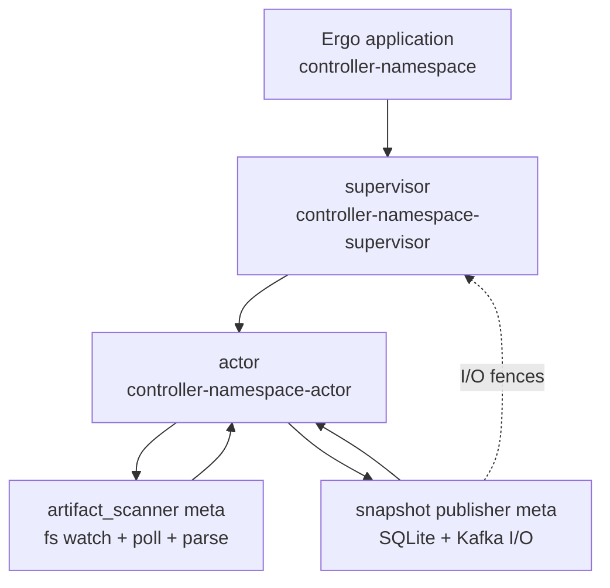
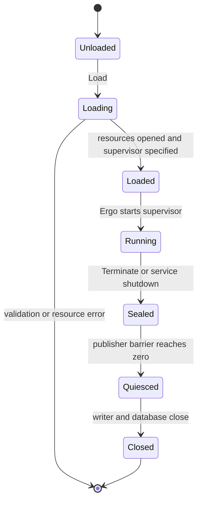
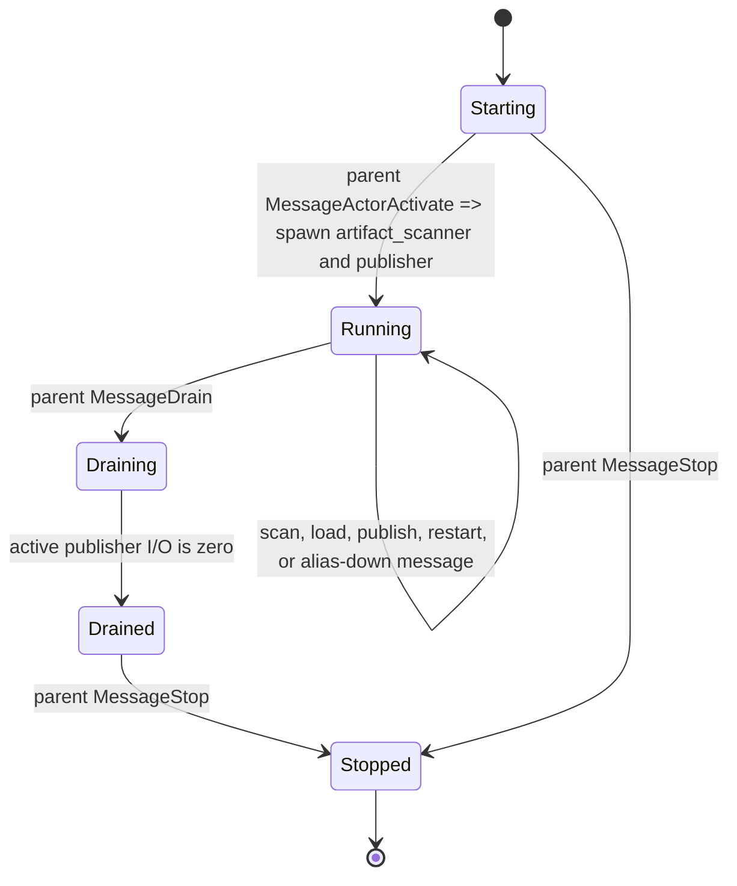
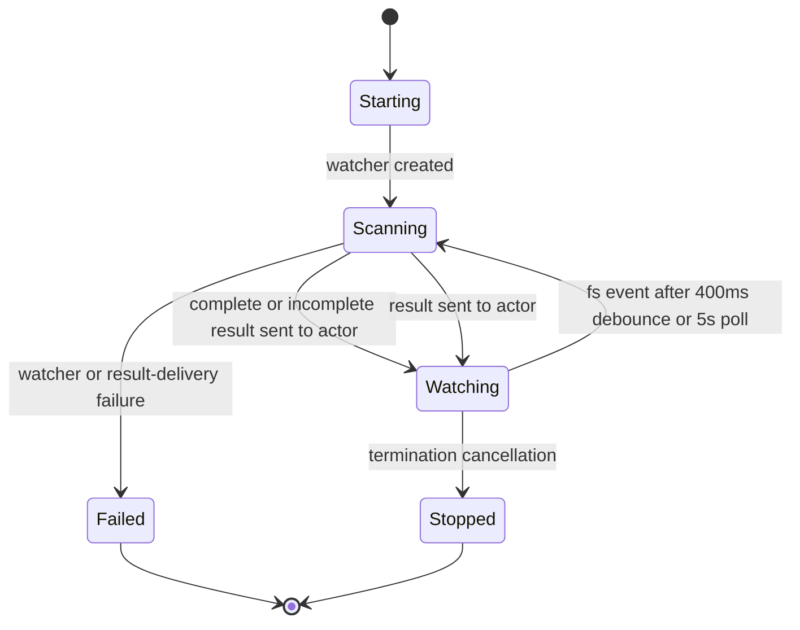
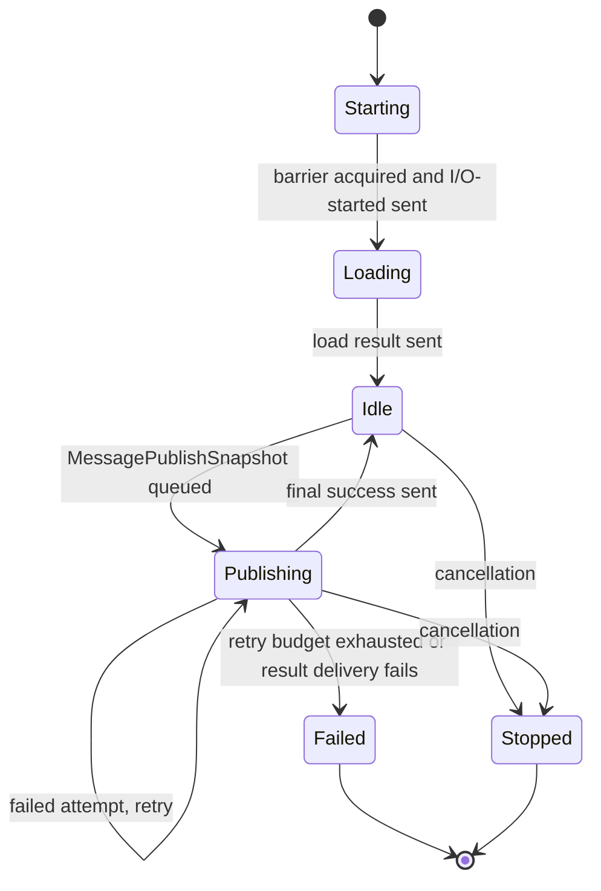
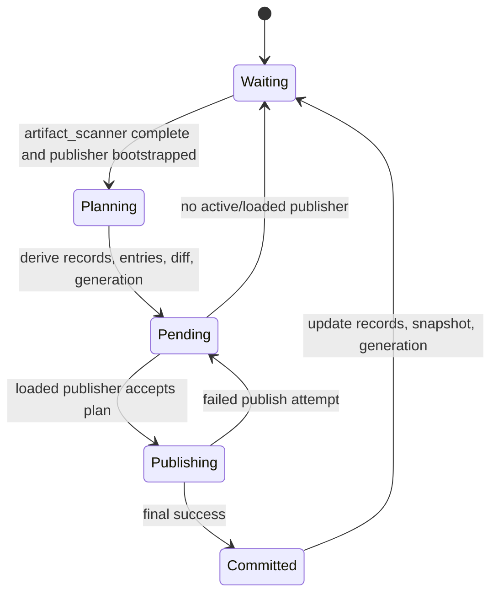
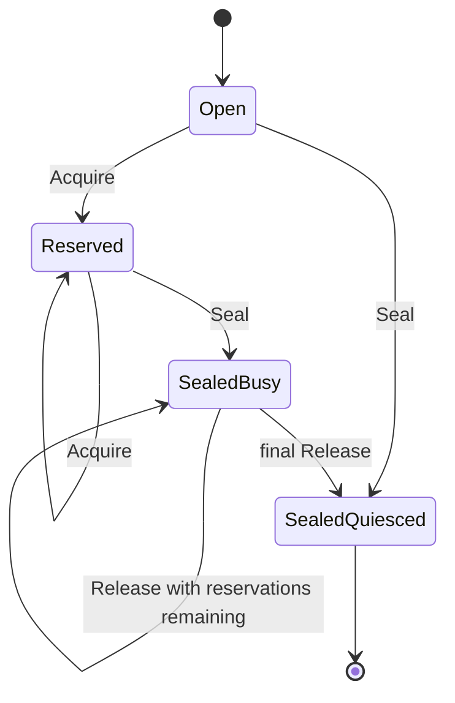

# Controller Runtime

[Internals index](README.md) · [Controller service](../services/controller.md)

This is the authoritative implementation reference for the Ergo controller runtime in `internal/runtime/controller`. One application manages one catalog namespace;
`cmd/controller` creates five such applications.
The design has one supervisor child (the controller actor) and two actor-owned meta processes.

## Composition

The application owns the root supervisor. The supervisor owns one controller actor, and that actor owns the `artifact_scanner` and snapshot publisher meta processes.

## Messages

| Message | Direction | Meaning |
| --- | --- | --- |
| `gen.ApplicationSpec.Group` | application → supervisor | `Application.Load` supplies the root-supervisor factory. |
| `act.SupervisorSpec.Children` | supervisor → actor | `supervisor.Init` supplies the controller-actor child factory. |
| `SpawnMeta` | actor → artifact_scanner meta | The actor starts the filesystem scanner. |
| `SpawnMeta` | actor → snapshot publisher meta | The actor starts the publisher after its I/O barrier reservation. |
| `MessageArtifactScanResult` | artifact_scanner meta → actor | Delivers the effective catalog and present IDs. |
| `MessageSnapshotLoadResult`, `MessageSnapshotPublishResult` | snapshot publisher meta → actor | Delivers bootstrap state and publication outcomes. |
| `MessageSnapshotPublisherIOStarted` | snapshot publisher meta → supervisor | Registers the publisher I/O fence. |
| `MessageSnapshotPublisherIOStopped` | snapshot publisher meta → supervisor → owning actor | Releases the fence and notifies the owning actor only if it is still current. |

## Roles

| Role | Default name or identity | Owner | Responsibility |
| --- | --- | --- | --- |
| Application | `controller-<namespace>` | service | Owns the SQLite handle, Kafka writer, barrier, and root supervisor. |
| Supervisor | `<application>-supervisor` | application | Starts, restarts, activates, drains, and stops the actor. |
| Actor | `<application>-actor` | supervisor | Serializes catalog state, reconciliation, readiness, and worker restart decisions. |
| `artifact_scanner` meta | `gen.Alias` | actor | Watches, polls, parses, validates, and elects catalog entries. |
| Snapshot publisher meta | `gen.Alias` | actor | Loads state; persists and publishes plans without blocking the actor. |

`optionsWithDefaults` supplies the application, supervisor, and actor names; `cmd/controller` relies on those defaults. Meta processes are addressed and monitored by `gen.Alias`, not a stable
registered name.

## Readiness

| Component | Readiness summary |
| --- | --- |
| Controller application | `Load` must validate its options and open the database, namespace store, and writer; it exposes no independent availability status. |
| Controller supervisor | It tracks the current actor's status and publisher fences; it exposes no independent availability status. |
| Controller actor | It reports `ready` only while running when the scanner is complete and ready and the publisher is loaded and ready. |
| `artifact_scanner` meta | The actor derives its status from scan completeness and any nonfatal watch-attachment error. |
| Snapshot publisher meta | The actor derives its status from bootstrap, pending work, and publication failures. |

## Controller Application

### Lifecycle

`Application.Load` validates name, supervisor name, namespace, topic, and broker; opens SQLite; initializes a namespace-scoped store; creates a topic writer; and returns a permanent
Ergo application with the root supervisor.

### Messages

| Message | Direction | Meaning |
| --- | --- | --- |
| `Application.Load` | service → application | Validates options and constructs the application specification. |
| `backends.OpenSQLite`, `backends.NewSQLite`, `Broker.NewWriter` | application → resources | Opens SQLite, creates the namespace store, and creates the topic writer. |
| `gen.Node.ApplicationStart` | service → Ergo application | Starts the configured root supervisor. |
| `Application.Terminate` | Ergo application → barrier | Seals the application during Ergo termination. |
| `Application.Seal` | service → barrier | Seals the application during service shutdown. |
| `Application.WaitQuiesced`, `Application.Close` | service → application resources | Waits for publisher I/O, then closes the writer and database. |

### Readiness

The application has no independent availability enum. It is prepared to start only after `Load` validates its required options and constructs the supervisor specification with open resources.
`Close` rejects resource closure until the barrier proves the application is quiesced.

## Controller Supervisor

### Lifecycle

The supervisor is one-for-one, transient, has one actor child, preserves that child's mailbox, handles child events, and disables automatic shutdown.
Its restart intensity is five restarts in ten seconds.
An abnormal child exit is eligible for restart; a normal or shutdown child exit outside supervisor draining or stopping fails the supervisor. Restart intensity exhaustion terminates the application.
After `plugin.MessageStop`, it forwards `plugin.MessageDrain` to the actor.

```mermaid
stateDiagram-v2
  [*] --> Starting
  Starting --> Running: child started, no publisher fence, activate actor
  Running --> Running: abnormal child exit / transient restart
  Running --> Draining: plugin.MessageStop; forwards plugin.MessageDrain
  Draining --> Stopping: actor drained and no publisher fences
  Stopping --> Stopped: actor exited and no publisher fences
  Stopped --> [*]
  Starting --> [*]: unexpected clean child exit
  Running --> [*]: restart intensity exceeded or unexpected clean child exit
```

### Messages

| Message | Direction | Meaning |
| --- | --- | --- |
| `HandleChildStart`, `MessageActorActivate` | Ergo supervisor → actor | Tracks and activates the child after publisher fences clear. |
| `HandleChildTerminate` | Ergo → supervisor | A transient abnormal child exit is eligible for restart; an unexpected clean exit fails the supervisor. |
| `plugin.MessageStop` | service → supervisor | Starts supervisor draining. |
| `plugin.MessageDrain` | supervisor → actor | Stops new work after the supervisor receives `plugin.MessageStop`. |
| `MessageActorStatusChanged` | actor → supervisor | Reports that the actor is drained so shutdown can advance. |
| `MessageSnapshotPublisherIOStarted` | snapshot publisher meta → supervisor | Registers a publisher fence before the meta accesses application resources. |
| `MessageSnapshotPublisherIOStopped` | snapshot publisher meta → supervisor → owning actor | Releases the fence and is forwarded to the owning actor only if it is still current. |
| `plugin.MessageStop` | supervisor → actor | Stops the drained actor after all publisher fences clear. |

### Readiness

The supervisor initializes the tracked actor as `starting` and `unavailable`; it has no independent availability enum. It activates a current actor only after publisher fences clear and waits
for that actor's `drained` status plus all fences before stopping it.

## Controller Actor

### Lifecycle

The actor owns all mutable control-plane state: artifact_scanner result, loaded records, committed snapshot, generation, pending plan, publisher status, and restart schedules.
It accepts lifecycle messages only from its parent and worker results only from itself with the currently tracked alias.

### Messages

| Message | Direction | Meaning |
| --- | --- | --- |
| `MessageActorActivate` | supervisor → actor | Starts artifact_scanner and publisher once. |
| `plugin.MessageDrain`, `plugin.MessageStop` | supervisor → actor | Stop new work and then terminate, respectively. |
| `MessageArtifactScanResult` | artifact_scanner meta → actor | Complete or incomplete effective catalog and present IDs. |
| `MessageSnapshotLoadResult` | snapshot publisher meta → actor | Bootstrap records, generation, and prior snapshot. |
| `MessagePublishSnapshot` | actor → snapshot publisher meta | One pending reconciliation plan. |
| `MessageSnapshotPublishResult` | snapshot publisher meta → actor | Per-attempt failure or final success. |
| `MessageArtifactScannerMetaRestart`, `MessageSnapshotPublisherMetaRestart` | actor → actor | Token-checked worker replacement timer messages. |
| `gen.MessageDownAlias` | Ergo → actor | Observes worker termination. |
| `MessageSnapshotPublisherIOStopped` | snapshot publisher meta → supervisor → owning actor | If the owner remains current, it clears `activeIO`. |
| `MessageActorStatusChanged` | actor → supervisor | Reports lifecycle, availability, and committed generation. |

### Readiness

The actor reports `ready` only while running when the artifact_scanner is complete and ready and the publisher is loaded and ready. It otherwise reports `degraded` while running, or
`unavailable` outside that condition.

## Artifact Scanner Meta

### Lifecycle

The artifact_scanner starts with an immediate scan, then observes the directory with `fsnotify`, a 400 ms debounce, and a five-second poll. It rescans directly in its meta-process `Start`,
leaving the actor mailbox unblocked.

### Messages

| Message | Direction | Meaning |
| --- | --- | --- |
| `Start`, `fsnotify.NewWatcher` | artifact_scanner meta → filesystem | Creates the watcher and begins the immediate scan. |
| `sendScan`, `MessageArtifactScanResult` | artifact_scanner meta → actor | Scans the directory and reports the effective catalog. |
| `fsnotify.Event`, `time.NewTimer` | filesystem → artifact_scanner meta | Debounces a filesystem event for 400 ms before rescanning. |
| `time.NewTicker` | artifact_scanner meta → artifact_scanner meta | Triggers the five-second polling rescan. |
| `Terminate` | actor → artifact_scanner meta | Cancels filesystem observation. |
| `os.ReadDir` | artifact_scanner meta → filesystem | Produces an incomplete, unavailable result and continues scanning. |
| `fsnotify.NewWatcher`, `Send` | artifact_scanner meta → actor | Watcher or result-delivery failure terminates the meta process. |

### Readiness

The actor owns the scanner status. A complete result without an error is `ready`; a complete result with a watch-attachment error is `degraded`; an `os.ReadDir` failure produces an
incomplete, `unavailable` result, blocks reconciliation, and continues scanning. A failed spec read or parse retains a previously parsed value while the file is still present.

It reads only direct directory entries. YAML files (`.yaml`, `.yml`) are parsed through the catalog loader; executable files are SHA-256 indexed by filename. For each logical ID it accepts one
blue-green baseline and at most one canary/shadow candidate, then emits an effective entry with YAML-marshaled metadata and the matching binary hash. A disabled artifact can be represented
without a binary; enabled artifacts require their matching binary hash. Invalid groups produce no new effective entry; reconciliation can retain a previously committed entry for their
still-present ID.

## Snapshot Publisher Meta

### Lifecycle

The publisher reserves the application I/O barrier before it runs. It loads records, generation, and the latest stored snapshot, reports the result, and then handles a single buffered
publish job at a time.

### Messages

| Message | Direction | Meaning |
| --- | --- | --- |
| `publisherIOBarrier.Acquire`, `MessageSnapshotPublisherIOStarted` | snapshot publisher meta → supervisor | Reserves application I/O and registers its fence. |
| `Database.LoadAll`, `Database.LoadGeneration`, `Database.LoadSnapshot` | snapshot publisher meta → SQLite | Loads bootstrap records, generation, and snapshot. |
| `MessageSnapshotLoadResult` | snapshot publisher meta → actor | Delivers the bootstrap result. |
| `MessagePublishSnapshot` | actor → snapshot publisher meta | Queues the one buffered publication job. |
| `MessageSnapshotPublishResult` | snapshot publisher meta → actor | Reports each failed attempt and final success. |
| `Terminate` | actor → snapshot publisher meta | Cancels loading or publication. |
| `MessageSnapshotPublisherIOStopped` | snapshot publisher meta → supervisor → owning actor | Releases the fence and notifies the owning actor only if it is still current when `Start` returns. |
| `publisherIOBarrier.Release` | snapshot publisher meta → barrier | Releases the application I/O reservation when `Start` returns. |

### Readiness

The actor owns the publisher status. After a successful bootstrap it is `ready` only when there is no pending plan, last error, or exhausted
publication-failure threshold; failed publication attempts make it `degraded`, and a pending plan, load error, or exhausted threshold makes it `unavailable`. A replacement cannot start
until the prior publisher's I/O-stopped completion clears `activeIO`.

Each job has five total publication attempts, using an exponential backoff with the actor's retry minimum and maximum, a multiplier of two, and no elapsed-time limit. Each failed attempt is
reported at high priority. A final success commits the actor's pending plan. Failure leaves that plan pending; after the publisher stops and its I/O fence clears, a replacement loads state
and retries it.

## Reconciliation and Commit

### Lifecycle

### Messages

| Message | Direction | Meaning |
| --- | --- | --- |
| `MessageArtifactScanResult`, `MessageSnapshotLoadResult` | worker metas → actor | A complete scan and bootstrap permit reconciliation. |
| `makePlan` | actor → actor | Derives records, entries, diff, and the next generation. |
| `MessagePublishSnapshot` | actor → snapshot publisher meta | Queues the pending plan when the publisher is loaded. |
| `MessageSnapshotPublishResult` | snapshot publisher meta → actor | A failed attempt retains the plan; final success commits it. |
| `gen.MessageDownAlias` | Ergo → actor | A missing publisher returns the pending plan to waiting for replacement/bootstrap. |

### Readiness

Reconciliation waits for both a complete `artifact_scanner` result and `publisher` bootstrap. It has at most one pending plan; artifact_scanner changes while that plan is pending are
coalesced into the next reconciliation after completion.

Planning marks every present parsed ID active and updates `last_seen_at`; an active stored ID no longer present becomes absent. It elects valid artifact_scanner entries, carries forward a
prior entry for a still-present ID missing from the new effective set, sorts entries by ID, and increments generation only when entries differ or bootstrap requires full republishing. The
first bootstrap uses the greater of stored generation and saved snapshot generation. A missing or mismatched saved snapshot requests a full republish.

For a changed plan the publisher persists records, reserves generation, writes keyed Kafka upserts and tombstones plus the generation marker, then saves the full snapshot. The actor
updates its committed snapshot, generation, and records only after the publisher reports final success.

## Publisher I/O Barrier and Shutdown

The barrier separates actor lifecycle from blocking publisher I/O. `Acquire` succeeds only before `Seal`; every accepted publisher `Start` reports a supervisor fence and releases its
barrier reservation when it returns.

### Lifecycle

### Messages

| Message | Direction | Meaning |
| --- | --- | --- |
| `Acquire` | snapshot publisher meta → publisher I/O barrier | Reserves I/O unless the barrier is sealed. |
| `Seal` | application/service → publisher I/O barrier | Rejects new reservations and begins shutdown quiescence. |
| `Release` | snapshot publisher meta → publisher I/O barrier | Frees one reservation; the final release makes the sealed barrier quiescent. |

### Readiness

`Close` requires the barrier to be sealed and quiesced. Shutdown order is: service seals application; supervisor drains actor; actor cancels worker restart timers and asks artifact_scanner
and publisher metas to stop; publisher meta → supervisor → owning actor reports stopped completion only if that actor is still current; supervisor stops the drained actor; service waits for
barrier quiescence, closes writer and database, and unloads the application. The service allows 45 seconds for graceful shutdown, then requests an Ergo force-stop.

## Retry Domains

| Domain | Policy | Exhaustion |
| --- | --- | --- |
| artifact_scanner/publisher meta replacement | Five scheduled exponential retries; defaults 100 ms–5 s. | Actor fails; the transient supervisor restarts it subject to its intensity. |
| Publication of one plan | Five total exponential attempts. | Publisher exits; actor retains plan and schedules replacement. |
| Actor child | Transient one-for-one supervisor restart; five restarts/10 s. | Supervisor/application terminates. |
| Controller service | Runner exponential 1 s–60 s plus up to 25% jitter. | Continues until process context cancellation. |

## Source References

- `internal/runtime/controller/{service.go,controller_application.go,controller_supervisor.go,controller_actor.go}` - lifecycle ownership and message handling.
- `internal/runtime/controller/{artifact_scanner_meta.go,snapshot_publisher_meta.go,reconcile.go,publisher_io_barrier.go,options.go,defaults.go}` - worker behavior, planning, shutdown barrier,
  names, and timing defaults.
- `internal/runtime/backoff.go` - scheduled worker-restart budget and backoff implementation.
- `internal/backends/{database.go,sql.go,record.go}` - namespace-scoped persistence and schema.
- `internal/snapshot/{snapshot.go,convert.go}` - effective entry and Kafka generation-marker wire format.
