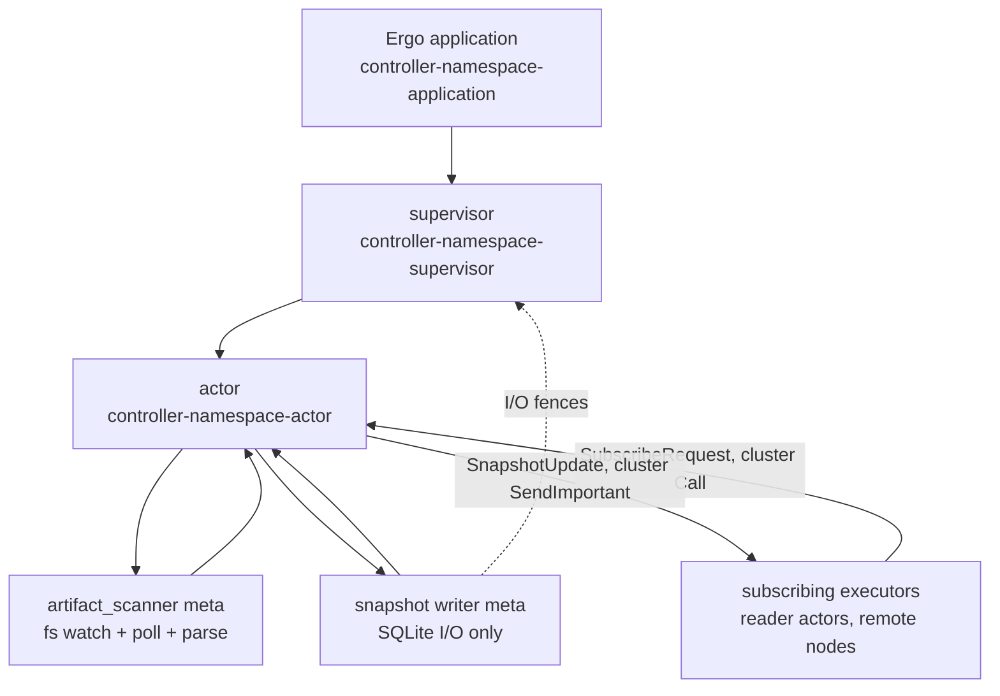
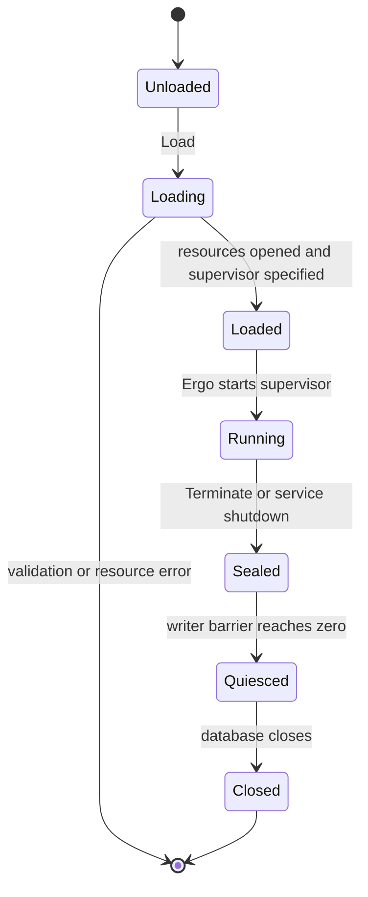
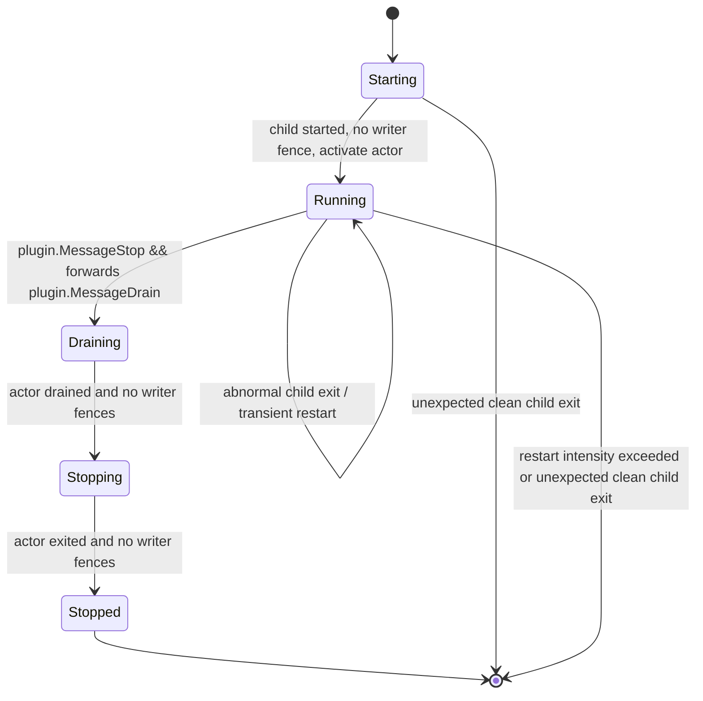
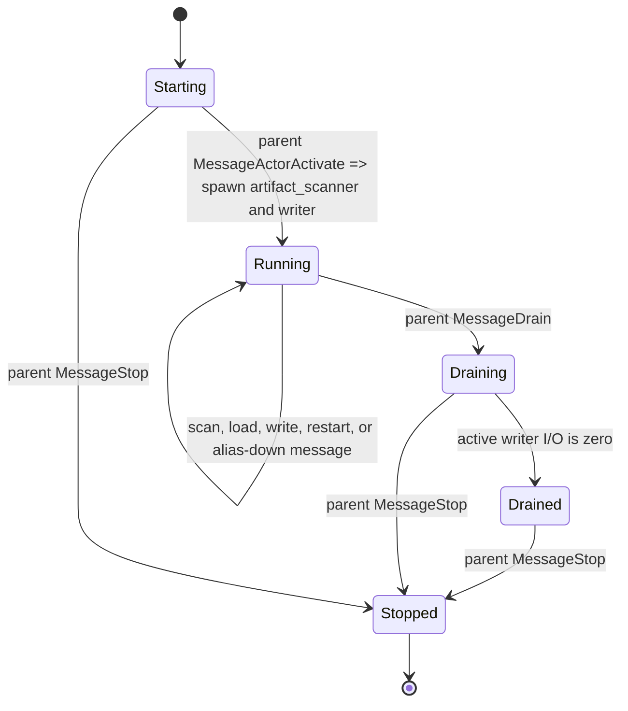
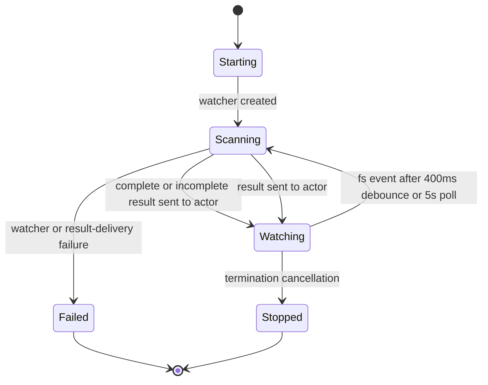
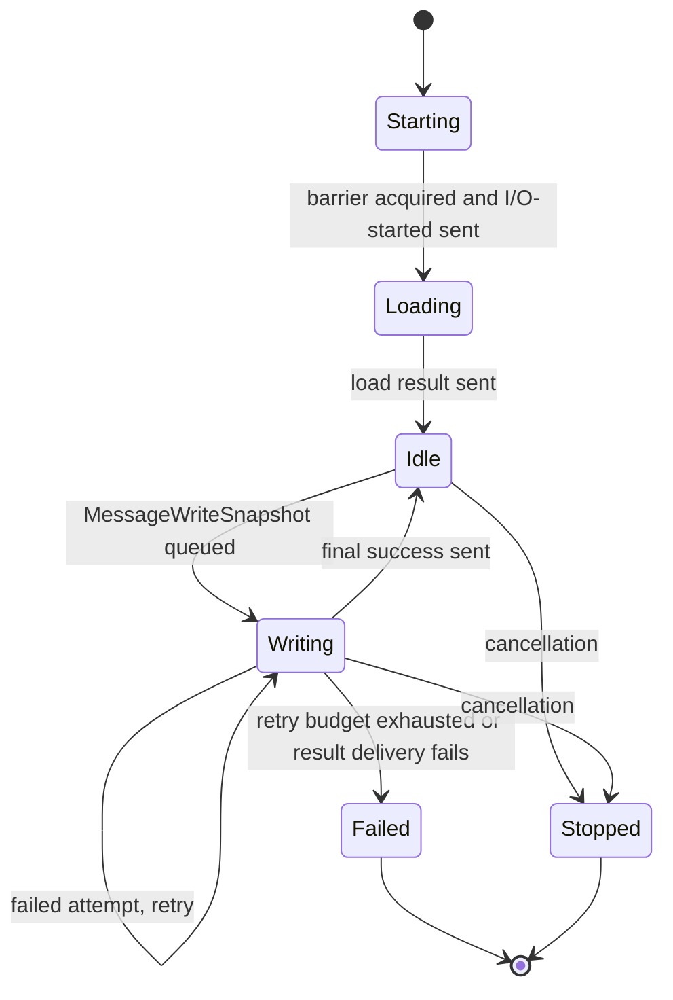
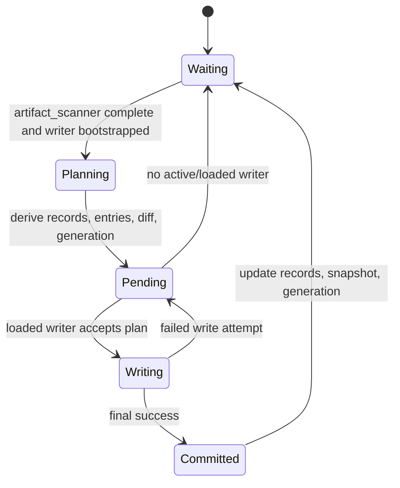
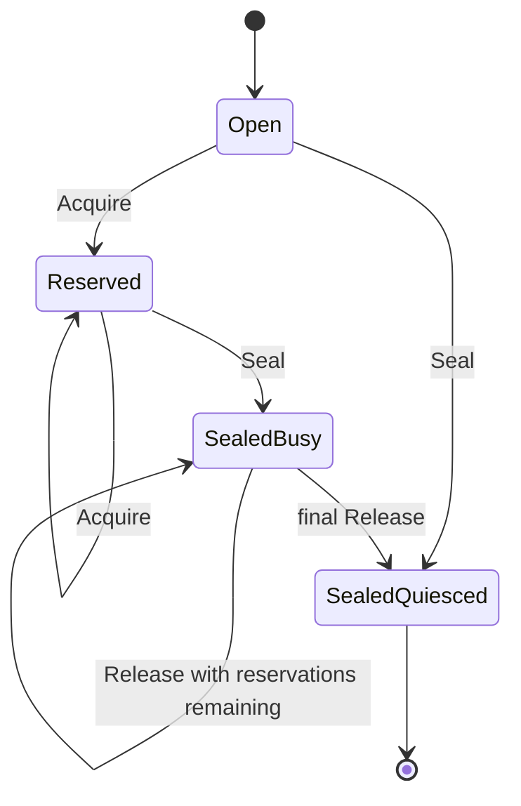

# Controller runtime

[Internals index](README.md) · [Plugin runtime](plugin-runtime.md) · [Snapshot runtime](snapshot-runtime.md) · [Runtime recovery](runtime-recovery.md) · [Controller service](../services/controller.md)

Ergo controller runtime in `internal/runtime/controller`. One application per catalog namespace; `cmd/controller` runs five. Each has one supervisor child - the controller actor - plus two actor-owned metas: a filesystem scanner, and a snapshot writer owning SQLite persistence only, not distribution. Subscribing executors are pushed updates actor-to-actor over the native Ergo cluster, no broker.

## Composition

## Messages

| Message                                                   | Direction                                                        | Meaning                                                                     |
| --------------------------------------------------------- | ---------------------------------------------------------------- | --------------------------------------------------------------------------- |
| `gen.ApplicationSpec.Group`                               | application → supervisor                                         | `Application.Load` supplies the root-supervisor factory.                    |
| `act.SupervisorSpec.Children`                             | supervisor → actor                                               | `supervisor.Init` supplies the controller-actor child factory.              |
| `SpawnMeta`                                               | actor → artifact_scanner meta                                    | Starts the filesystem scanner.                                              |
| `SpawnMeta`                                               | actor → snapshot writer meta                                     | Starts the writer after its I/O barrier reservation.                        |
| `MessageArtifactScanResult`                               | artifact_scanner meta → actor                                    | Effective catalog and present IDs.                                          |
| `MessageSnapshotLoadResult`, `MessageSnapshotWriteResult` | snapshot writer meta → actor                                     | Bootstrap state and write outcomes.                                         |
| `MessageSnapshotWriterIOStarted`                          | snapshot writer meta → supervisor                                | Registers the writer I/O fence and its completion barrier.                  |
| `MessageSnapshotWriterIOStopped`                          | snapshot writer meta → supervisor → owning actor                 | Releases a quiesced fence; notifies the owning actor if still current.      |
| `SubscribeRequest`/`Response`                             | executor reader actor → controller actor (cluster `Call`)        | Registers caller PID; returns the committed snapshot.                       |
| `SnapshotUpdate`                                          | controller actor → subscriber PID (cluster `SendImportant`)      | Pushes one commit's full state to every subscriber.                         |
| `MessageExecutorReport`                                   | executor snapshot supervisor → controller actor (cluster `Send`) | That executor's received and live generations; every 30s and on any change. |

## Roles

| Role                    | Default name or identity             | Owner       | Responsibility                                                                                 |
| ----------------------- | ------------------------------------ | ----------- | ---------------------------------------------------------------------------------------------- |
| Application             | `controller-<namespace>-application` | service     | Owns the SQLite handle, barrier, root supervisor.                                              |
| Supervisor              | `controller-<namespace>-supervisor`  | application | Starts, restarts, activates, drains, stops the actor.                                          |
| Actor                   | `controller-<namespace>-actor`       | supervisor  | Serializes catalog state, reconciliation, readiness, subscriber distribution, worker restarts. |
| `artifact_scanner` meta | `gen.Alias`                          | actor       | Watches, polls, parses, validates, elects catalog entries.                                     |
| Snapshot writer meta    | `gen.Alias`                          | actor       | Loads state; persists plans to SQLite without blocking the actor.                              |

Naming:

- `Namespace` is the only configured name; `ApplicationName`, `SupervisorName`, `ActorName` derive from it.
- `cmd/controller`'s `/status` and executor subscribe endpoints are `ActorName(namespace)`.
- `ActorName` alone crosses the cluster, defined as `snapshot.ControllerActorName`, re-exported here.
- The supervisor hands the actor `telemetry.Labels` built from the namespace, not the namespace.
- `NewService` and `NewApplication` take the typed loader and thread it to the actor.
- Metas are addressed and monitored by `gen.Alias`, not a registered name.

## Readiness

| Component               | Readiness summary                                                                              |
| ----------------------- | ---------------------------------------------------------------------------------------------- |
| Controller application  | `Load` validates options, opens the database and namespace store; no independent availability. |
| Controller supervisor   | Derives subtree availability from its lifecycle and current actor; owns Radar readiness.       |
| Controller actor        | `ready` only while running, scanner complete and ready, writer loaded and ready.               |
| `artifact_scanner` meta | Status from scan completeness and any nonfatal watch-attachment error.                         |
| Snapshot writer meta    | Status from bootstrap, pending work, write failures.                                           |

Scanner and writer health is derived by the controller from current-alias operation results, not a separate meta status-message stream. Their cached statuses therefore have no independent status epoch, though each still carries its own lifecycle - `starting`, `running`, `restarting`, `stopped` - which the actor moves on spawn, on a scheduled replacement, and on `gen.MessageDownAlias`.

### Status composition

`err` composes first-non-nil, never last-writer-wins. The actor reports `runtime.FirstError(own terminate reason, writer, scanner)`, and its own reason counts only once its lifecycle is `stopped`, so a live controller surfaces worker diagnostics rather than masking them; a terminating one surfaces its exit reason without erasing them. The supervisor reports `runtime.FirstError(subtree terminate reason, tracked child status)`, and `HandleChildTerminate` records the child's exit reason there. A recovered worker clears the field at both layers on the next reconcile.

Publication is deduplicated. The actor's `reconcileStatus` compares a pre-handler snapshot against the recomputed status on lifecycle, availability, generation, and `runtime.ErrorText(err)`; an identical status publishes nothing and leaves the epoch alone. A change stamps `runtime.NextStatusEpoch` - `max(now in nanoseconds, previous + 1)` - so epochs stay strictly monotonic even across a backwards clock step.

The supervisor drops any `MessageActorStatusChanged` whose sender is not the tracked actor PID or whose `statusEpoch` is not greater than the recorded watermark. `HandleChildStart` resets that watermark to zero, so a replacement's first epoch is accepted while the previous PID's late facts stay fenced out.

## Controller application

### Lifecycle

`Application.Load` validates the namespace, opens SQLite, initializes a namespace-scoped store, and returns a permanent Ergo application with the root supervisor. It registers this namespace's EDF network types (`snapshotruntime.NetworkTypes()`), so `SubscribeRequest`/`Response`, `SnapshotUpdate`, and the rest of the cross-node wire vocabulary decode before any cluster connection to this node forms.

### Messages

| Message                                         | Direction                       | Meaning                                         |
| ----------------------------------------------- | ------------------------------- | ----------------------------------------------- |
| `Application.Load`                              | service → application           | Validates options; builds the application spec. |
| `backends.OpenSQLite`, `backends.NewSQLite`     | application → resources         | Opens SQLite; creates the namespace store.      |
| `gen.Node.ApplicationStart`                     | service → Ergo application      | Starts the configured root supervisor.          |
| `Application.Terminate`                         | Ergo application → barrier      | Seals during Ergo termination.                  |
| `Application.Seal`                              | service → barrier               | Seals during service shutdown.                  |
| `Application.WaitQuiesced`, `Application.Close` | service → application resources | Waits for writer I/O, then closes the database. |

### Readiness

No availability enum. `Close` refuses until the barrier proves the application quiesced.

## Controller supervisor

### Lifecycle

One-for-one and transient, one actor child. Preserves the child's mailbox, handles child events, disables automatic shutdown.

- Intensity five restarts / ten seconds; exhausting it terminates the application.
- Abnormal child exit is eligible for restart.
- Normal or shutdown exit outside draining or stopping fails the supervisor.
- On `plugin.MessageStop` while running it forwards `plugin.MessageDrain` to the actor; the message is ignored in any other lifecycle.

### Messages

| Message                                    | Direction                                        | Meaning                                                                                                   |
| ------------------------------------------ | ------------------------------------------------ | --------------------------------------------------------------------------------------------------------- |
| `HandleChildStart`, `MessageActorActivate` | Ergo supervisor → actor                          | Tracks and activates the child after writer fences clear.                                                 |
| `HandleChildTerminate`                     | Ergo → supervisor                                | Transient abnormal exit eligible for restart; unexpected clean exit fails it.                             |
| `plugin.MessageStop`                       | service → supervisor                             | Starts supervisor draining.                                                                               |
| `plugin.MessageDrain`                      | supervisor → actor                               | Stops new work after `plugin.MessageStop`.                                                                |
| `MessageActorStatusChanged`                | actor → supervisor                               | Epoch-stamped lifecycle, availability, generation, first error; also advances draining.                   |
| `MessageSnapshotWriterIOStarted`           | snapshot writer meta → supervisor                | Registers a fence, plus the completion barrier that later proves it done.                                 |
| `MessageSnapshotWriterIOStopped`           | snapshot writer meta → supervisor → owning actor | Releases the fence once quiesced; forwarded to the owning actor if current.                               |
| `plugin.MessageStop`                       | supervisor → actor                               | Stops the drained actor after all writer fences clear.                                                    |
| `MessageRadarTick`                         | supervisor → supervisor                          | High-priority Radar reconcile and completed-I/O fence polling, every 30 s; not rescheduled once stopping. |

### Readiness

`status()` returns the supervisor lifecycle, derived availability, and `runtime.FirstError(subtree reason, child status)`. Availability is `unavailable` unless the supervisor is running with a live actor; otherwise it follows that actor's `ready`/`degraded`/`unavailable` status. `propagateReadiness()` raises the Radar signal only for `ready`. The supervisor starts the tracked actor `starting`/`unavailable`, activates it only after writer fences clear, and waits for `drained` plus all fences before stopping it.

A fence clears only against proof. `completeIOFence` requires the reporting PID to own the fence and the fence's completion barrier to read `Quiesced()`; anything else is dropped, so a stale or forged notification cannot unblock a replacement or a drain. Losing the notification entirely is not terminal: each `MessageRadarTick` runs `pollIOCompletions`, which sweeps every registered fence and completes the ones already quiesced. Forwarding the completion to a live owning actor is the one send whose failure fails the supervisor, because a dropped completion would stall both writer replacement and drain.

## Controller actor

### Lifecycle

Owns all mutable control-plane state: artifact_scanner result, loaded records, committed snapshot, generation, pending plan, writer status, restart schedules. Lifecycle messages come only from its parent; worker results only from itself, carrying the currently tracked alias.

While `draining` or `drained` the actor accepts only four messages - `gen.MessageDownAlias`, `gen.MessageDownPID`, `MessageSnapshotWriterIOStopped`, and `snapshot.UnsubscribeRequest` - so no late scan, write result, or executor report can restart work or reopen a plan. `plugin.MessageStop` from the parent terminates normally from any lifecycle; the supervisor sends it after `drained`, or while still `draining` once every writer fence has cleared.

### Messages

| Message                                                                 | Direction                             | Meaning                                                                                                         |
| ----------------------------------------------------------------------- | ------------------------------------- | --------------------------------------------------------------------------------------------------------------- |
| `MessageActorActivate`                                                  | supervisor → actor                    | Starts artifact_scanner and writer once.                                                                        |
| `plugin.MessageDrain`, `plugin.MessageStop`                             | supervisor → actor                    | Stop new work, then terminate.                                                                                  |
| `MessageArtifactScanResult`                                             | artifact_scanner meta → actor         | Complete or incomplete effective catalog, present IDs.                                                          |
| `MessageSnapshotLoadResult`                                             | snapshot writer meta → actor          | Bootstrap records, generation, prior snapshot.                                                                  |
| `MessageWriteSnapshot`                                                  | actor → snapshot writer meta          | One pending reconciliation plan.                                                                                |
| `MessageSnapshotWriteResult`                                            | snapshot writer meta → actor          | Per-attempt failure or final success.                                                                           |
| `MessageArtifactScannerMetaRestart`, `MessageSnapshotWriterMetaRestart` | actor → actor                         | Token-checked worker replacement timer messages.                                                                |
| `MessageExecutorDriftCheck`                                             | actor → actor                         | Self-scheduled drift scan over tracked executors.                                                               |
| `gen.MessageDownAlias`                                                  | Ergo → actor                          | Observes worker termination.                                                                                    |
| `MessageSnapshotWriterIOStopped`                                        | supervisor → owning actor             | Accepted only from the parent for a tracked alias; clears `activeIO`, then drains or schedules the replacement. |
| `MessageActorStatusChanged`                                             | actor → supervisor                    | Epoch-stamped lifecycle, availability, generation, first error; sent only on a change.                          |
| `StatusRequest`/`Response`                                              | `/status` handler → actor (same node) | Committed generation and every tracked executor.                                                                |

### Readiness

`ready` only while running with artifact_scanner complete and ready and writer loaded and ready; otherwise `degraded` while running, `unavailable` when not running.

### Subscriber distribution

The actor is the distribution point for every subscribing executor; there is no separate transport layer.

`HandleCall(SubscribeRequest{ExecutorID, KnownGeneration})` registers the caller's PID in `a.subscribers`, `MonitorPID`s it, and returns `SubscribeResponse{Current: a.committed.Clone(), Changes, ControllerPID: a.PID()}` unconditionally, even when `a.committed` is nil. The PID is `HandleCall`'s `from` parameter, not a request field.

On a changed commit - `MessageSnapshotWriteResult` with `a.pending.next.Generation != a.generation` - `notifySubscribers` calls `SendImportant(pid, SnapshotUpdate{Snapshot, Changes, Tombstones})` for every registered PID. A failure (mailbox full, unreachable) is logged; the loop continues, the subscriber stays registered. `gen.MessageDownPID` from `MonitorPID` is the authoritative removal signal; `UnsubscribeRequest` is a best-effort hint sent on executor shutdown.

`MessageExecutorReport{ExecutorID, Heartbeat, Applied, LastError}` carries one executor's convergence status, folded into `a.executors[ExecutorID]` by `ExecutorStatus.Apply`. The executor's `snapshot.Supervisor` sends it; the reader sends none.

- `Heartbeat.CommittedGeneration` - what this controller pushed to the reader.
- `Heartbeat.ReadyGeneration` - what the executor's projection holds live.

They differ when a generation is received but not yet adopted; under `ProjectionCommitExternal` the gap is the plugin runtime fetching binaries. See [Executor reporting](snapshot-runtime.md#executor-reporting).

`Apply` overwrites `ExecutorStatus.Err` only when the report carries a heartbeat or a `LastError` of its own, so an applied-only report keeps the last heartbeat's diagnosis and a healthy heartbeat clears it. `Applied` alone advances `ReadyGeneration` without touching availability.

Reports arrive every `executorReportInterval` (30s, a quarter of the stale threshold), and on any change to either generation, reader availability, or reader liveness.

Every `executorDriftCheckInterval` (30s), self-scheduled `MessageExecutorDriftCheck` runs `checkExecutorDrift`, tracking how long each executor has lagged the committed generation:

- past `executorDriftGrace` (2m) - flagged
- silent past `executorStaleThreshold` (2m) - excluded from drift evaluation, not counted as drifting
- stale with no subscription - forgotten, so `blink_controller_executors` stops counting it; the ID is a pod name and never returns

`StatusRequest`/`StatusResponse` surfaces this; `/status` queries every namespace's controller actor over a same-node `CallProcessID`, never crossing the cluster.

## Artifact scanner meta

### Lifecycle

Scans immediately, then watches the directory with `fsnotify`, a 400 ms debounce, and a five-second poll. Rescans run in its meta-process `Start`, keeping the actor mailbox unblocked.

A scan reads a file only when its size or modification time differs from the one the cached spec or digest came from. A poll over an unchanged directory re-parses no YAML and re-checksums no binary; a rewrite preserving both is invisible. The plugin runtime re-checksums binaries against the published digest before launch, so a stale digest stalls that rollout.

### Messages

| Message                                 | Direction                                     | Meaning                                                 |
| --------------------------------------- | --------------------------------------------- | ------------------------------------------------------- |
| `Start`, `fsnotify.NewWatcher`          | artifact_scanner meta → filesystem            | Creates the watcher; begins the immediate scan.         |
| `sendScan`, `MessageArtifactScanResult` | artifact_scanner meta → actor                 | Scans the directory; reports the effective catalog.     |
| `fsnotify.Event`, `time.NewTimer`       | filesystem → artifact_scanner meta            | Debounces an event 400 ms before rescanning.            |
| `time.NewTicker`                        | artifact_scanner meta → artifact_scanner meta | Triggers the five-second polling rescan.                |
| `Terminate`                             | actor → artifact_scanner meta                 | Cancels filesystem observation.                         |
| `os.ReadDir`                            | artifact_scanner meta → filesystem            | Incomplete, unavailable result; scanning continues.     |
| `fsnotify.NewWatcher`, `Send`           | artifact_scanner meta → actor                 | Watcher or result-delivery failure terminates the meta. |

### Readiness

The actor owns the scanner status:

- complete, no error - `ready`
- complete with a watch-attachment error - `degraded`
- `os.ReadDir` failure - incomplete and `unavailable`; reconciliation blocks and scanning continues

A failed spec read or parse keeps the previously parsed value while the file is present.

Direct directory entries only. YAML (`.yaml`, `.yml`) goes through the catalog loader; executables are SHA-256 indexed by filename. Each logical ID takes one blue-green baseline plus at most one canary or shadow candidate, emitting an effective entry with YAML-marshaled metadata and the matching binary hash. Disabled artifacts need no binary; enabled ones require the hash. An invalid group emits no new entry; reconciliation may keep a previously committed entry for its still-present ID.

## Snapshot writer meta

### Lifecycle

Reserves the application I/O barrier before running. Loads records, generation, and the latest stored snapshot, reports the result, then handles one buffered write job at a time.

### Messages

| Message                                                                | Direction                                        | Meaning                                                                              |
| ---------------------------------------------------------------------- | ------------------------------------------------ | ------------------------------------------------------------------------------------ |
| `runtime.IOBarrier.Acquire`, `MessageSnapshotWriterIOStarted`          | snapshot writer meta → supervisor                | Reserves application I/O; registers its fence and completion barrier.                |
| `Database.LoadAll`, `Database.LoadGeneration`, `Database.LoadSnapshot` | snapshot writer meta → SQLite                    | Loads bootstrap records, generation, snapshot.                                       |
| `MessageSnapshotLoadResult`                                            | snapshot writer meta → actor                     | Delivers the bootstrap result.                                                       |
| `MessageWriteSnapshot`                                                 | actor → snapshot writer meta                     | Queues the one buffered write job.                                                   |
| `MessageSnapshotWriteResult`                                           | snapshot writer meta → actor                     | Reports each failed attempt and final success.                                       |
| `Terminate`                                                            | actor → snapshot writer meta                     | Cancels loading or writing.                                                          |
| `MessageSnapshotWriterIOStopped`                                       | snapshot writer meta → supervisor → owning actor | Releases the fence once quiesced; notifies the owning actor if still current.        |
| `runtime.IOBarrier.Release`                                            | snapshot writer meta → both barriers             | Releases the completion proof, then the application reservation, as `Start` returns. |

### Readiness

The actor owns the writer status. After a successful bootstrap:

- `ready` - loaded, no pending plan, no last error, no consecutive failures
- `degraded` - at least one consecutive failed write attempt, still under the threshold
- `unavailable` - a pending plan, a last error, or consecutive failures at the five-attempt threshold

A replacement cannot start until the prior writer's I/O-stopped completion clears `activeIO`, and that completion only reaches the actor after the supervisor's fence proof (see [Writer I/O barrier and shutdown](#writer-io-barrier-and-shutdown)).

Each job gets five attempts, exponential between the actor's retry minimum and maximum, multiplier two, no elapsed-time limit. Every failed attempt is reported at high priority. Final success commits the pending plan; failure leaves it pending, and once the writer stops and its fence clears a replacement loads state and retries.

## Reconciliation and commit

### Lifecycle

### Messages

| Message                                                  | Direction                    | Meaning                                                                       |
| -------------------------------------------------------- | ---------------------------- | ----------------------------------------------------------------------------- |
| `MessageArtifactScanResult`, `MessageSnapshotLoadResult` | worker metas → actor         | A complete scan and bootstrap permit reconciliation.                          |
| `makePlan`                                               | actor → actor                | Derives records, entries, diff, next generation.                              |
| `MessageWriteSnapshot`                                   | actor → snapshot writer meta | Queues the pending plan when the writer is loaded.                            |
| `MessageSnapshotWriteResult`                             | snapshot writer meta → actor | A failed attempt retains the plan; final success commits it.                  |
| `gen.MessageDownAlias`                                   | Ergo → actor                 | Missing writer returns the pending plan to waiting for replacement/bootstrap. |

### Readiness

Waits for a complete `artifact_scanner` result and a writer bootstrap. At most one plan is pending; scanner changes arriving meanwhile coalesce into the next reconciliation.

Planning:

- marks every present parsed ID active, updates `last_seen_at`; an active stored ID no longer present becomes absent
- elects valid scanner entries, carrying forward a prior entry for a still-present ID missing from the new effective set
- sorts entries by ID
- increments generation only when entries differ or bootstrap needs a full rewrite

First bootstrap takes the greater of stored generation and saved snapshot generation; a missing or mismatched saved snapshot asks for a full rewrite.

The writer always persists record upserts, changed or not. A changed plan also reserves the generation and saves the full snapshot - all to SQLite, no broker write. The actor updates committed snapshot, generation, and records only on final success, and calls `notifySubscribers` (see [Subscriber distribution](#subscriber-distribution)) only when the commit changed the generation.

## Writer I/O barrier and shutdown

`runtime.IOBarrier` in `internal/runtime/io_barrier.go` is a shared counting primitive, not a controller type: the controller application and the stage runtime both use it. Here it separates actor lifecycle from blocking writer I/O. `Acquire` succeeds only before `Seal`; a sealed barrier with no reservations left is quiesced.

Each accepted writer holds two of them. The application's barrier is shared by every writer instance and gates `Close`. A private completion barrier, created and sealed in the writer's own `Init` with one reservation held, exists only to prove that one instance finished: `MessageSnapshotWriterIOStarted` hands the supervisor a pointer to it, and the supervisor releases the fence only once it reads `Quiesced()`. The writer's `Start` releases the completion barrier before sending `MessageSnapshotWriterIOStopped`, so the proof is already in place when the notification lands.

### Lifecycle

### Messages

| Message        | Direction                                                                       | Meaning                                                                   |
| -------------- | ------------------------------------------------------------------------------- | ------------------------------------------------------------------------- |
| `Acquire`      | snapshot writer meta → application barrier, own completion barrier              | Reserves I/O unless that barrier is sealed.                               |
| `Seal`         | application/service → application barrier; writer meta → own completion barrier | Rejects new reservations; begins quiescence.                              |
| `Release`      | snapshot writer meta → both barriers                                            | Frees one reservation; the final release makes a sealed barrier quiesced. |
| `Quiesced`     | supervisor → a registered fence's completion barrier                            | Non-blocking proof that one writer instance returned.                     |
| `WaitQuiesced` | service → application barrier                                                   | Blocks cleanup until every accepted writer has released.                  |

### Readiness

`Close` requires the barrier sealed and quiesced. Shutdown order:

1. Service seals the application.
2. Supervisor drains the actor.
3. Actor cancels worker restart timers and asks both metas to stop.
4. Writer meta releases its completion barrier, then reports stopped; the supervisor releases the fence once that barrier reads quiesced, and forwards the completion to the owning actor only if still current.
5. Supervisor stops the drained actor.
6. Service waits for quiescence, closes the database, unloads the application.

The service allows 45 seconds, then requests an Ergo force-stop.

## Telemetry

Every layer publishes into the node's radar application (`RADAR_HOST:RADAR_PORT`, `0.0.0.0:9090` under the Helm chart), labelled by namespace. Metric names are in [the controller service doc](../services/controller.md#metrics). The plumbing - collector specs, one subject's bound label values, the readiness signal - lives in `internal/runtime/telemetry`, shared by controller, plugin, snapshot, and stage.

| Layer       | Registers                                           | Publishes through | Notes                                                                                                                                                                                                           |
| ----------- | --------------------------------------------------- | ----------------- | --------------------------------------------------------------------------------------------------------------------------------------------------------------------------------------------------------------- |
| Application | every collector                                     | `gen.Node`        | Registration at `Load` and emission go through the node, so collectors survive actor and supervisor restarts.                                                                                                   |
| Supervisor  | every collector and the readiness signal, once each | itself            | Owns the namespace's radar session and the `controller-<namespace>` readiness signal. Lifecycle and writer-fence gauges plus child start/termination counters are the only series left while the actor is down. |
| Actor       | -                                                   | itself            | Own gauges, counters, histograms through a plain `telemetry.Labels`, republished every drift-check tick.                                                                                                        |
| Metas       | -                                                   | `gen.MetaProcess` | `Send` but no `Call`, so it cannot register; carries a copy of the actor's `telemetry.Labels`.                                                                                                                  |

`reconcileStatus()` refreshes owned gauges even when status is unchanged; the drift-check and Radar ticks provide periodic refreshes. It runs on every supervisor and actor handler, deferred, so a handler returning an error still leaves gauges and Radar current. The two layers differ in what else it does: the actor's dedupes and may publish `MessageActorStatusChanged`, the supervisor's always re-evaluates the Radar signal. `publishGauges()` itself does not change lifecycle or propagate status/readiness. All emission is best-effort: an unreachable radar produces a discarded `Send` error, and `telemetry.Labels` with no namespace stays silent, since a label count mismatching the registered collector panics radar's metrics actor.

### Readiness signal

The supervisor owns `controller-<namespace>`, not the actor. `MessageActorStatusChanged` reports the actor's availability upward, so the supervisor marks a crashed or draining controller unready immediately; actor-owned, radar would infer it only 90 seconds later from a lapsed heartbeat.

The supervisor constructor creates the namespace-bound labels and named signal. `Init` sets up lifecycle state and schedules registration; it does not recreate that telemetry identity.

`MessageRadarTick` drives the session: sent from `Init` to itself without delaying supervisor initialization, then rescheduled every `telemetry.RadarTickInterval` (30 s), radar's deadline at three ticks so one missed beat does not flip readiness. Health registration waits for a successful monitor so a failed watch cannot disable restart recovery. Until the first registration completes, Radar cannot account for this namespace's readiness.

- Registered **once**: `handleRegister` overwrites the signal with `up: true`.
- Heartbeaten **only while up**: `handleHeartbeat` treats a beat on a down signal as recovery and raises it.
- Up/down **only on a change**: handlers are idempotent, but a resend logs a transition that did not happen.
- **Never unregistered**, only held down: radar reports a node with no signals as healthy, so unregistering on drain would make a draining pod read ready.

Collectors register once on the same tick: radar keeps them in its metrics application's shared registry, not the pool worker that took the call. The supervisor monitors `radar_metrics` and `radar_health`; `gen.MessageDownProcessID` clears only what that process held, so a metrics restart leaves the signal alone and a health restart rebuilds its recorded state.

A namespace serves only when the supervisor is running, its child alive, and that child reports `AvailabilityReady`. An unreachable radar leaves the supervisor running, logs once per outage, retries next tick.

## Retry domains

| Domain                                   | Policy                                                        | Exhaustion                                                              |
| ---------------------------------------- | ------------------------------------------------------------- | ----------------------------------------------------------------------- |
| artifact_scanner/writer meta replacement | Five scheduled exponential retries; defaults 100 ms–5 s.      | Actor fails; the transient supervisor restarts it within its intensity. |
| Writing one plan                         | Five total exponential attempts.                              | Writer exits; actor retains the plan and schedules replacement.         |
| Actor child                              | Transient one-for-one supervisor restart; five restarts/10 s. | Supervisor/application terminates.                                      |
| Controller service                       | Runner exponential 1 s–60 s plus up to 25% jitter.            | Continues until process context cancellation.                           |

## Source references

- `internal/runtime/controller/{service.go,controller_application.go,controller_supervisor.go,controller_actor.go}` - lifecycle ownership, message handling.
- `internal/runtime/controller/{artifact_scanner_meta.go,snapshot_writer_meta.go,reconcile.go,options.go,defaults.go}` - worker behavior, planning, names, timing defaults.
- `internal/runtime/{io_barrier.go,status.go}` - the shared I/O barrier, `Availability`, `FirstError`, `ErrorText`, `NextStatusEpoch`.
- `internal/runtime/controller/metrics.go` - metric specs, gauge publishing, readiness signal.
- `internal/runtime/telemetry/{metrics.go,signal.go}` - shared radar plumbing: collector specs, bound label values, readiness signal.
- `internal/runtime/backoff.go` - scheduled worker-restart budget and backoff.
- `internal/backends/{database.go,sql.go,record.go}` - namespace-scoped persistence, schema.
- `internal/runtime/snapshot/types.go` - effective entry and snapshot types.
- `internal/runtime/snapshot/{snapshot_reader_actor.go,subscription.go}` - cross-node wire vocabulary (`SubscribeRequest`/`Response`, `SnapshotUpdate`, `UnsubscribeRequest`, `MessageExecutorReport`) shared with a subscribing executor's reader actor, plus its EDF type registration list.
