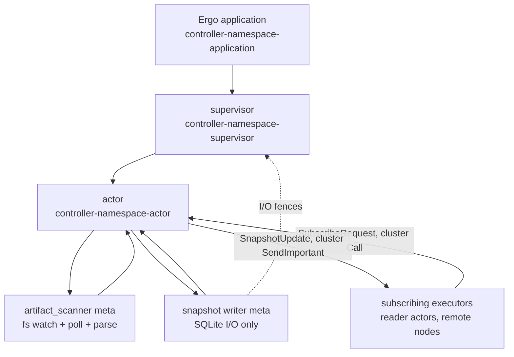
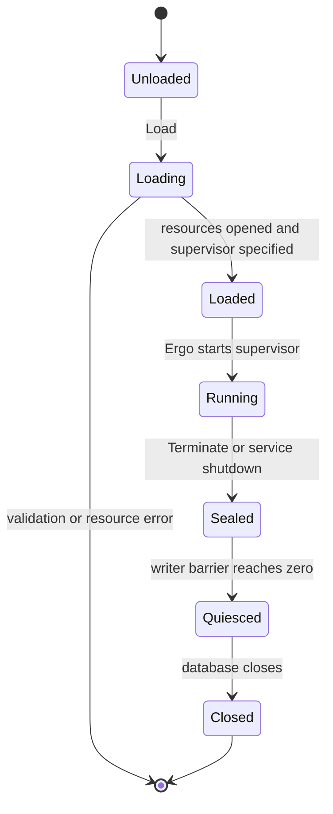
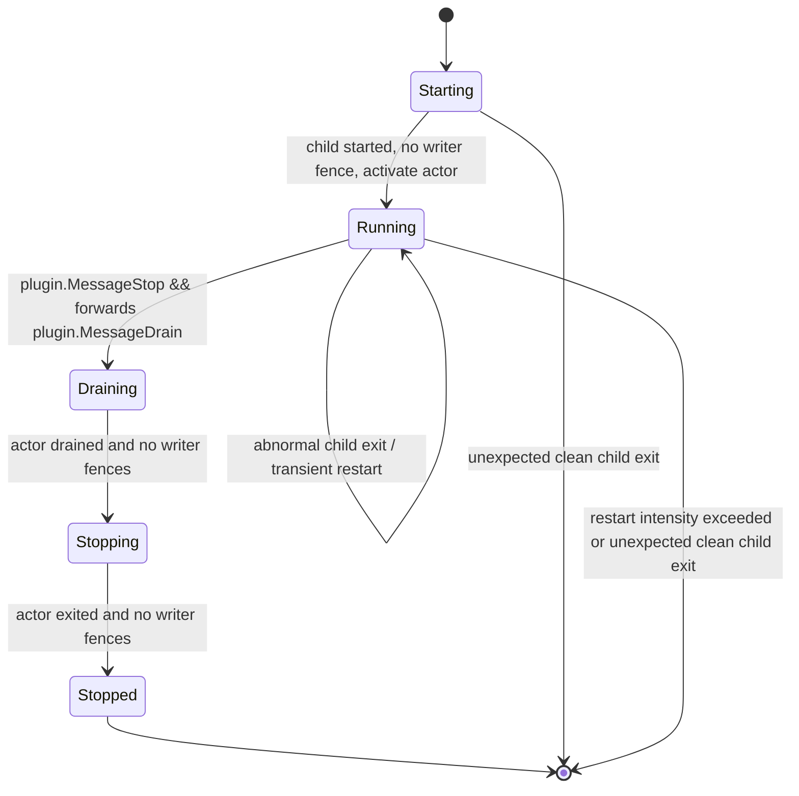
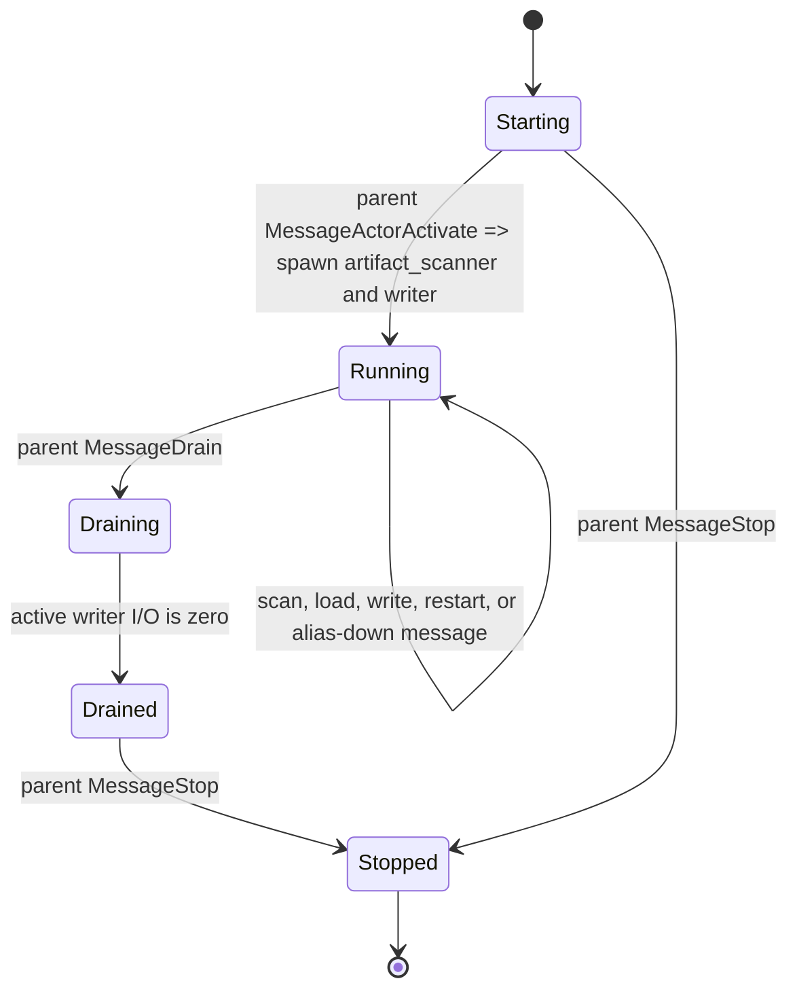
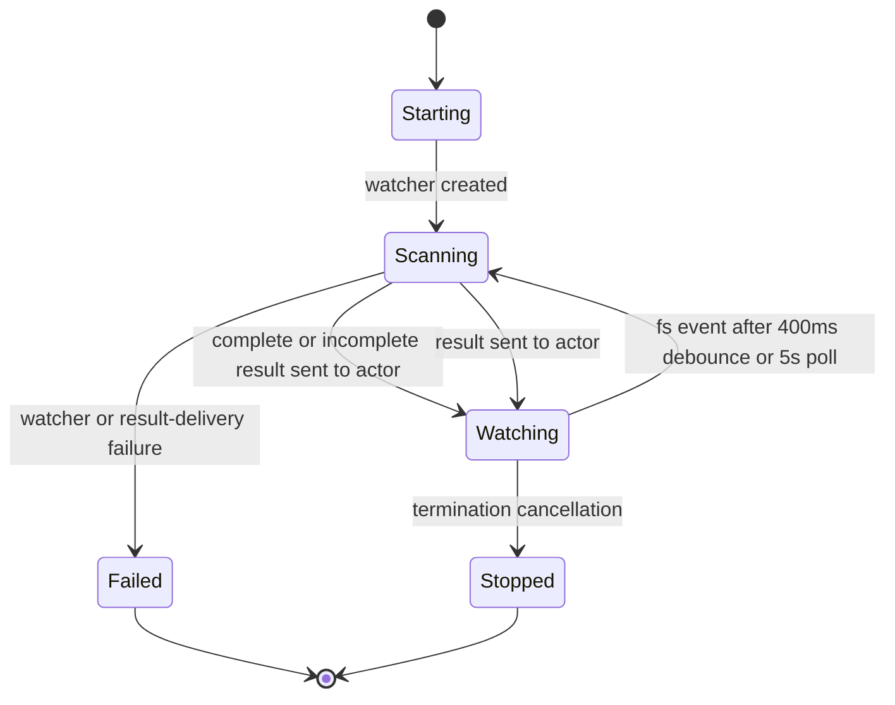
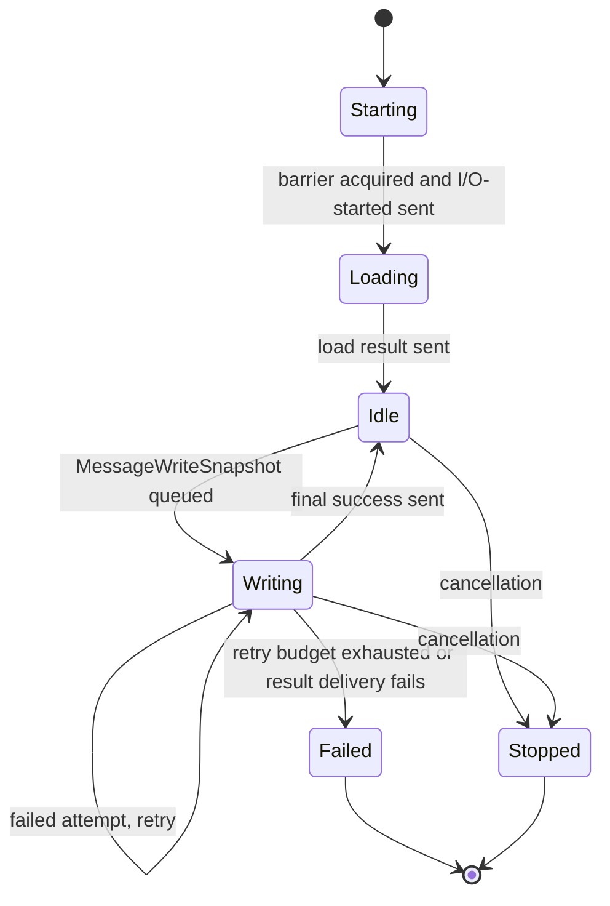
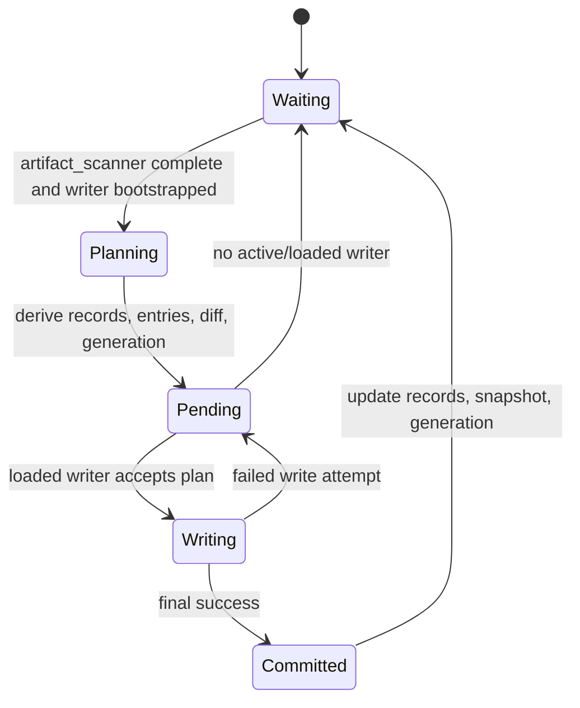
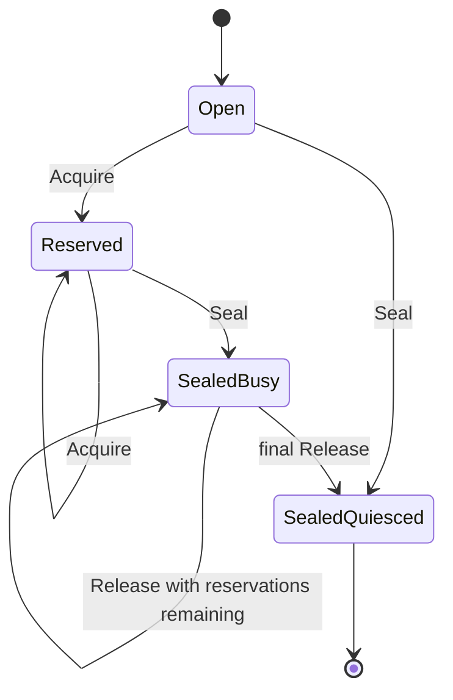

# Controller Runtime

Implementation reference for the Ergo controller runtime in `internal/runtime/controller`. One application manages one catalog namespace, and `cmd/controller` runs five of them. Each has one supervisor child - the controller actor - and two actor-owned meta processes: the filesystem scanner, and a snapshot writer that now owns SQLite persistence only, not distribution. Distribution to subscribing executors is push-based, direct actor-to-actor messaging over the native Ergo cluster - there is no broker in the loop.

## Composition

## Messages

| Message                                                   | Direction                                                        | Meaning                                                                                         |
| --------------------------------------------------------- | ---------------------------------------------------------------- | ----------------------------------------------------------------------------------------------- |
| `gen.ApplicationSpec.Group`                               | application → supervisor                                         | `Application.Load` supplies the root-supervisor factory.                                        |
| `act.SupervisorSpec.Children`                             | supervisor → actor                                               | `supervisor.Init` supplies the controller-actor child factory.                                  |
| `SpawnMeta`                                               | actor → artifact_scanner meta                                    | The actor starts the filesystem scanner.                                                        |
| `SpawnMeta`                                               | actor → snapshot writer meta                                     | The actor starts the writer after its I/O barrier reservation.                                  |
| `MessageArtifactScanResult`                               | artifact_scanner meta → actor                                    | Delivers the effective catalog and present IDs.                                                 |
| `MessageSnapshotLoadResult`, `MessageSnapshotWriteResult` | snapshot writer meta → actor                                     | Delivers bootstrap state and write outcomes.                                                    |
| `MessageSnapshotWriterIOStarted`                          | snapshot writer meta → supervisor                                | Registers the writer I/O fence.                                                                 |
| `MessageSnapshotWriterIOStopped`                          | snapshot writer meta → supervisor → owning actor                 | Releases the fence and notifies the owning actor only if it is still current.                   |
| `SubscribeRequest`/`Response`                             | executor reader actor → controller actor (cluster `Call`)        | Registers the caller (by PID) as a subscriber and returns the current committed snapshot.       |
| `SnapshotUpdate`                                          | controller actor → subscriber PID (cluster `SendImportant`)      | Pushes one commit's full state to every subscriber on a changed commit.                         |
| `MessageExecutorReport`                                   | executor snapshot supervisor → controller actor (cluster `Send`) | Reports that executor's received and live generations, every 30s and on every change to either. |

## Roles

| Role                    | Default name or identity             | Owner       | Responsibility                                                                                              |
| ----------------------- | ------------------------------------ | ----------- | ----------------------------------------------------------------------------------------------------------- |
| Application             | `controller-<namespace>-application` | service     | Owns the SQLite handle, barrier, and root supervisor.                                                       |
| Supervisor              | `controller-<namespace>-supervisor`  | application | Starts, restarts, activates, drains, and stops the actor.                                                   |
| Actor                   | `controller-<namespace>-actor`       | supervisor  | Serializes catalog state, reconciliation, readiness, subscriber distribution, and worker restart decisions. |
| `artifact_scanner` meta | `gen.Alias`                          | actor       | Watches, polls, parses, validates, and elects catalog entries.                                              |
| Snapshot writer meta    | `gen.Alias`                          | actor       | Loads state; persists plans to SQLite without blocking the actor.                                           |

Every name comes from the namespace through `ApplicationName`/`SupervisorName`/`ActorName`, so a caller addresses one without being told what it was called - `cmd/controller`'s `/status` and every executor's subscribe endpoint are `ActorName(namespace)`. `ActorName` is the one name that crosses the cluster, so it is defined as `snapshot.ControllerActorName` with the wire vocabulary both sides share and only re-exported here; an executor names its endpoint at compile time without linking this package. `Namespace` is the only name configured anywhere in the subtree: all three derive from it, and the actor is handed the `telemetry.Labels` its supervisor built from it rather than the namespace itself. The typed loader is a dependency, not an option: `NewService` and `NewApplication` take it and thread it to the actor, so only the options are configuration. Meta processes are addressed and monitored by `gen.Alias`, not by a registered name.

## Readiness

| Component               | Readiness summary                                                                                                          |
| ----------------------- | -------------------------------------------------------------------------------------------------------------------------- |
| Controller application  | `Load` must validate its options and open the database and namespace store; it exposes no independent availability status. |
| Controller supervisor   | It tracks the current actor's status and writer fences; it exposes no independent availability status.                     |
| Controller actor        | It reports `ready` only while running when the scanner is complete and ready and the writer is loaded and ready.           |
| `artifact_scanner` meta | The actor derives its status from scan completeness and any nonfatal watch-attachment error.                               |
| Snapshot writer meta    | The actor derives its status from bootstrap, pending work, and write failures.                                             |

## Controller Application

### Lifecycle

`Application.Load` does three things, then returns a permanent Ergo application with the root supervisor:

- validates the namespace
- opens SQLite
- initializes a namespace-scoped store

It also registers this namespace's EDF network types (`snapshotruntime.NetworkTypes()`) so `SubscribeRequest`/`Response`, `SnapshotUpdate`, and the rest of the cross-node wire vocabulary are decodable before any cluster connection to this node forms.

### Messages

| Message                                         | Direction                       | Meaning                                                         |
| ----------------------------------------------- | ------------------------------- | --------------------------------------------------------------- |
| `Application.Load`                              | service → application           | Validates options and constructs the application specification. |
| `backends.OpenSQLite`, `backends.NewSQLite`     | application → resources         | Opens SQLite and creates the namespace store.                   |
| `gen.Node.ApplicationStart`                     | service → Ergo application      | Starts the configured root supervisor.                          |
| `Application.Terminate`                         | Ergo application → barrier      | Seals the application during Ergo termination.                  |
| `Application.Seal`                              | service → barrier               | Seals the application during service shutdown.                  |
| `Application.WaitQuiesced`, `Application.Close` | service → application resources | Waits for writer I/O, then closes the database.                 |

### Readiness

The application has no availability enum of its own. It can start only once `Load` has validated its options and built the supervisor spec with open resources. `Close` refuses until the barrier proves the application quiesced.

## Controller Supervisor

### Lifecycle

The supervisor is one-for-one and transient, with one actor child. It preserves that child's mailbox, handles child events, and disables automatic shutdown.

- Restart intensity is five restarts in ten seconds. Exhausting it terminates the application.
- An abnormal child exit is eligible for restart.
- A normal or shutdown child exit outside draining or stopping fails the supervisor.
- After `plugin.MessageStop` it forwards `plugin.MessageDrain` to the actor.

### Messages

| Message                                    | Direction                                        | Meaning                                                                                                 |
| ------------------------------------------ | ------------------------------------------------ | ------------------------------------------------------------------------------------------------------- |
| `HandleChildStart`, `MessageActorActivate` | Ergo supervisor → actor                          | Tracks and activates the child after writer fences clear.                                               |
| `HandleChildTerminate`                     | Ergo → supervisor                                | A transient abnormal child exit is eligible for restart; an unexpected clean exit fails the supervisor. |
| `plugin.MessageStop`                       | service → supervisor                             | Starts supervisor draining.                                                                             |
| `plugin.MessageDrain`                      | supervisor → actor                               | Stops new work after the supervisor receives `plugin.MessageStop`.                                      |
| `MessageActorStatusChanged`                | actor → supervisor                               | Reports that the actor is drained so shutdown can advance.                                              |
| `MessageSnapshotWriterIOStarted`           | snapshot writer meta → supervisor                | Registers a writer fence before the meta accesses application resources.                                |
| `MessageSnapshotWriterIOStopped`           | snapshot writer meta → supervisor → owning actor | Releases the fence and is forwarded to the owning actor only if it is still current.                    |
| `plugin.MessageStop`                       | supervisor → actor                               | Stops the drained actor after all writer fences clear.                                                  |

### Readiness

The supervisor has no availability enum of its own. It starts the tracked actor as `starting` and `unavailable`, activates a current actor only after writer fences clear, and waits for that actor's `drained` status plus all fences before stopping it.

## Controller Actor

### Lifecycle

The actor owns all mutable control-plane state: artifact_scanner result, loaded records, committed snapshot, generation, pending plan, writer status, and restart schedules. Lifecycle messages are accepted only from its parent. Worker results are accepted only from itself, carrying the currently tracked alias.

### Messages

| Message                                                                 | Direction                                        | Meaning                                                    |
| ----------------------------------------------------------------------- | ------------------------------------------------ | ---------------------------------------------------------- |
| `MessageActorActivate`                                                  | supervisor → actor                               | Starts artifact_scanner and writer once.                   |
| `plugin.MessageDrain`, `plugin.MessageStop`                             | supervisor → actor                               | Stop new work and then terminate, respectively.            |
| `MessageArtifactScanResult`                                             | artifact_scanner meta → actor                    | Complete or incomplete effective catalog and present IDs.  |
| `MessageSnapshotLoadResult`                                             | snapshot writer meta → actor                     | Bootstrap records, generation, and prior snapshot.         |
| `MessageWriteSnapshot`                                                  | actor → snapshot writer meta                     | One pending reconciliation plan.                           |
| `MessageSnapshotWriteResult`                                            | snapshot writer meta → actor                     | Per-attempt failure or final success.                      |
| `MessageArtifactScannerMetaRestart`, `MessageSnapshotWriterMetaRestart` | actor → actor                                    | Token-checked worker replacement timer messages.           |
| `gen.MessageDownAlias`                                                  | Ergo → actor                                     | Observes worker termination.                               |
| `MessageSnapshotWriterIOStopped`                                        | snapshot writer meta → supervisor → owning actor | If the owner remains current, it clears `activeIO`.        |
| `MessageActorStatusChanged`                                             | actor → supervisor                               | Reports lifecycle, availability, and committed generation. |

### Readiness

The actor reports `ready` only while running, with the artifact_scanner complete and ready and the writer loaded and ready. Otherwise it is `degraded` while running, and `unavailable` when not running.

### Subscriber Distribution

The actor is the distribution point for every subscribing executor - there is no separate transport layer. `HandleCall(SubscribeRequest{ExecutorID, KnownGeneration})` registers the caller's PID (delivered as `HandleCall`'s own `from` parameter, not a request field) in `a.subscribers`, `MonitorPID`s it, and returns `SubscribeResponse{Current: a.committed.Clone(), Changes, ControllerPID: a.PID()}` unconditionally - even if `a.committed` is still nil because this namespace hasn't bootstrapped yet.

On a changed commit (`MessageSnapshotWriteResult` with `a.pending.next.Generation != a.generation`), `notifySubscribers` loops over every registered subscriber PID and calls `SendImportant(pid, SnapshotUpdate{Snapshot, Changes, Tombstones})`. A `SendImportant` failure (mailbox full, unreachable) is logged and the loop continues - the subscriber stays registered, since a failed send is not proof the subscriber is gone. `MonitorPID`'s `gen.MessageDownPID` is the authoritative removal signal; `UnsubscribeRequest` is a best-effort cleanup hint an executor sends on its own shutdown.

`MessageExecutorReport{ExecutorID, Heartbeat, Applied, LastError}` carries one executor's convergence status and is folded into `a.executors[ExecutorID]` by `ExecutorStatus.Apply`. It is sent by the executor's `snapshot.Supervisor`, which is the one process that sees both halves: `Heartbeat.CommittedGeneration` is what this controller pushed to the reader, `Heartbeat.ReadyGeneration` is what the executor's projection actually holds live. Those differ whenever a generation has been received but not yet adopted - the whole point of tracking both - and under `ProjectionCommitExternal` that gap is the plugin runtime fetching binaries before it admits the new generation. The reader carries no report of its own: a heartbeat from it would have to claim a `ReadyGeneration` it cannot observe, which would mask exactly the drift this measures. See [Executor Reporting](snapshot-runtime.md#executor-reporting) for the producer side.

Reports arrive every `executorReportInterval` (30s, a quarter of the controller's stale threshold) and immediately on any change to either generation, to reader availability, or to the reader's own liveness. Every `executorDriftCheckInterval` (30s), the actor's self-scheduled `MessageExecutorDriftCheck` runs `checkExecutorDrift`, which tracks how long each tracked executor has lagged the committed generation - an executor drifting past `executorDriftGrace` (2m) is flagged, and one silent past `executorStaleThreshold` (2m) is excluded from drift evaluation rather than counted as drifting. A stale executor that also holds no subscription is forgotten entirely: its ID is its pod name, so that ID never returns, and keeping it would inflate `blink_controller_executors` for the life of the controller. This is surfaced through the namespace's `StatusRequest`/`StatusResponse` (the `/status` HTTP endpoint queries every namespace's controller actor this way, over a same-node `CallProcessID` - this call never crosses the cluster).

## Artifact Scanner Meta

### Lifecycle

The artifact_scanner scans immediately, then watches the directory with `fsnotify`, a 400 ms debounce, and a five-second poll. Rescans run in its meta-process `Start`, so the actor mailbox stays unblocked.

A scan reads a file only when its size or modification time differs from the one the cached spec or digest was taken from. A poll over an unchanged directory re-parses no YAML and re-checksums no binary. A rewrite preserving both is invisible to the scanner. For binaries the plugin runtime re-checksums against the published digest before launch, so a stale digest stalls that rollout rather than deploying something unverified.

### Messages

| Message                                 | Direction                                     | Meaning                                                            |
| --------------------------------------- | --------------------------------------------- | ------------------------------------------------------------------ |
| `Start`, `fsnotify.NewWatcher`          | artifact_scanner meta → filesystem            | Creates the watcher and begins the immediate scan.                 |
| `sendScan`, `MessageArtifactScanResult` | artifact_scanner meta → actor                 | Scans the directory and reports the effective catalog.             |
| `fsnotify.Event`, `time.NewTimer`       | filesystem → artifact_scanner meta            | Debounces a filesystem event for 400 ms before rescanning.         |
| `time.NewTicker`                        | artifact_scanner meta → artifact_scanner meta | Triggers the five-second polling rescan.                           |
| `Terminate`                             | actor → artifact_scanner meta                 | Cancels filesystem observation.                                    |
| `os.ReadDir`                            | artifact_scanner meta → filesystem            | Produces an incomplete, unavailable result and continues scanning. |
| `fsnotify.NewWatcher`, `Send`           | artifact_scanner meta → actor                 | Watcher or result-delivery failure terminates the meta process.    |

### Readiness

The actor owns the scanner status:

- complete, no error - `ready`
- complete with a watch-attachment error - `degraded`
- `os.ReadDir` failure - incomplete and `unavailable`; reconciliation blocks and scanning continues

A failed spec read or parse keeps the previously parsed value while the file is still present.

The scan reads only direct directory entries. YAML (`.yaml`, `.yml`) goes through the catalog loader, and executables are SHA-256 indexed by filename. Each logical ID takes one blue-green baseline plus at most one canary or shadow candidate, and emits an effective entry with YAML-marshaled metadata and the matching binary hash. A disabled artifact needs no binary; an enabled one requires its hash. An invalid group emits no new entry, and reconciliation can keep a previously committed entry for its still-present ID.

## Snapshot Writer Meta

### Lifecycle

The writer reserves the application I/O barrier before it runs. It loads records, generation, and the latest stored snapshot, reports the result, then handles one buffered write job at a time.

### Messages

| Message                                                                | Direction                                        | Meaning                                                                                            |
| ---------------------------------------------------------------------- | ------------------------------------------------ | -------------------------------------------------------------------------------------------------- |
| `writerIOBarrier.Acquire`, `MessageSnapshotWriterIOStarted`            | snapshot writer meta → supervisor                | Reserves application I/O and registers its fence.                                                  |
| `Database.LoadAll`, `Database.LoadGeneration`, `Database.LoadSnapshot` | snapshot writer meta → SQLite                    | Loads bootstrap records, generation, and snapshot.                                                 |
| `MessageSnapshotLoadResult`                                            | snapshot writer meta → actor                     | Delivers the bootstrap result.                                                                     |
| `MessageWriteSnapshot`                                                 | actor → snapshot writer meta                     | Queues the one buffered write job.                                                                 |
| `MessageSnapshotWriteResult`                                           | snapshot writer meta → actor                     | Reports each failed attempt and final success.                                                     |
| `Terminate`                                                            | actor → snapshot writer meta                     | Cancels loading or writing.                                                                        |
| `MessageSnapshotWriterIOStopped`                                       | snapshot writer meta → supervisor → owning actor | Releases the fence and notifies the owning actor only if it is still current when `Start` returns. |
| `writerIOBarrier.Release`                                              | snapshot writer meta → barrier                   | Releases the application I/O reservation when `Start` returns.                                     |

### Readiness

The actor owns the writer status. After a successful bootstrap:

- `ready` - no pending plan, no last error, threshold not exhausted
- `degraded` - a write attempt failed
- `unavailable` - a pending plan, a load error, or an exhausted failure threshold

A replacement cannot start until the prior writer's I/O-stopped completion clears `activeIO`.

Each job gets five write attempts, backing off exponentially between the actor's retry minimum and maximum, multiplier two, no elapsed-time limit. Every failed attempt is reported at high priority. Final success commits the actor's pending plan. Failure leaves the plan pending: once the writer stops and its I/O fence clears, a replacement loads state and retries it.

## Reconciliation and Commit

### Lifecycle

### Messages

| Message                                                  | Direction                    | Meaning                                                                         |
| -------------------------------------------------------- | ---------------------------- | ------------------------------------------------------------------------------- |
| `MessageArtifactScanResult`, `MessageSnapshotLoadResult` | worker metas → actor         | A complete scan and bootstrap permit reconciliation.                            |
| `makePlan`                                               | actor → actor                | Derives records, entries, diff, and the next generation.                        |
| `MessageWriteSnapshot`                                   | actor → snapshot writer meta | Queues the pending plan when the writer is loaded.                              |
| `MessageSnapshotWriteResult`                             | snapshot writer meta → actor | A failed attempt retains the plan; final success commits it.                    |
| `gen.MessageDownAlias`                                   | Ergo → actor                 | A missing writer returns the pending plan to waiting for replacement/bootstrap. |

### Readiness

Reconciliation waits for both a complete `artifact_scanner` result and a writer bootstrap. At most one plan is pending. Scanner changes arriving while it is pending are coalesced into the next reconciliation.

Planning:

- marks every present parsed ID active and updates `last_seen_at`; an active stored ID no longer present becomes absent
- elects the valid scanner entries, carrying forward a prior entry for a still-present ID missing from the new effective set
- sorts entries by ID
- increments generation only when entries differ or bootstrap needs a full rewrite

The first bootstrap takes the greater of stored generation and saved snapshot generation. A missing or mismatched saved snapshot asks for a full rewrite.

The writer always persists record upserts to SQLite, changed or not; for a changed plan it additionally reserves the generation and saves the full snapshot - both also to SQLite, with no broker write. The actor updates its committed snapshot, generation, and records only on final success, and only when the commit changed the generation does it call `notifySubscribers` (see [Subscriber Distribution](#subscriber-distribution)) to push the new commit to every registered executor.

## Writer I/O Barrier and Shutdown

The barrier separates actor lifecycle from blocking writer I/O. `Acquire` succeeds only before `Seal`. Every accepted writer `Start` reports a supervisor fence and releases its reservation when it returns.

### Lifecycle

### Messages

| Message   | Direction                                 | Meaning                                                                      |
| --------- | ----------------------------------------- | ---------------------------------------------------------------------------- |
| `Acquire` | snapshot writer meta → writer I/O barrier | Reserves I/O unless the barrier is sealed.                                   |
| `Seal`    | application/service → writer I/O barrier  | Rejects new reservations and begins shutdown quiescence.                     |
| `Release` | snapshot writer meta → writer I/O barrier | Frees one reservation; the final release makes the sealed barrier quiescent. |

### Readiness

`Close` requires the barrier sealed and quiesced. Shutdown order:

1. Service seals the application.
2. Supervisor drains the actor.
3. Actor cancels worker restart timers and asks both metas to stop.
4. Writer meta → supervisor → owning actor reports stopped completion, only if that actor is still current.
5. Supervisor stops the drained actor.
6. Service waits for barrier quiescence, closes the database, and unloads the application.

The service allows 45 seconds for that, then requests an Ergo force-stop.

## Telemetry

Every layer publishes into the node's radar application (`RADAR_HOST:RADAR_PORT`, `0.0.0.0:9090` under the Helm chart), labelled by namespace. Metric names are listed in [the controller service doc](../services/controller.md#metrics). The plumbing - collector specs, one subject's bound label values, and the readiness signal - lives in `internal/runtime/telemetry` and is shared with the snapshot runtime; only the names and their specs stay here.

| Layer       | Registers                                           | Publishes through | Notes                                                                                                                                                                                                                        |
| ----------- | --------------------------------------------------- | ----------------- | ---------------------------------------------------------------------------------------------------------------------------------------------------------------------------------------------------------------------------- |
| Application | every collector                                     | `gen.Node`        | Registration at `Load` and emission both go through the node, so collectors are owned by the node core and survive actor and supervisor restarts.                                                                            |
| Supervisor  | every collector and the readiness signal, once each | itself            | Owns the namespace's whole radar session, including the `controller-<namespace>` readiness signal. Lifecycle and writer-fence gauges plus child start/termination counters are the only series left while the actor is down. |
| Actor       | -                                                   | itself            | Publishes its own gauges, counters, and histograms through a plain `telemetry.Labels`, republished on every drift-check tick so a steady namespace still reports fresh series.                                               |
| Metas       | -                                                   | `gen.MetaProcess` | A meta has `Send` but no `Call`, so it could not register even if it wanted to; it carries a copy of the actor's `telemetry.Labels`.                                                                                         |

Every layer emits best-effort: an unreachable radar produces a discarded `Send` error, and `telemetry.Labels` with no namespace stays silent, since a label count that does not match the registered collector panics radar's metrics actor.

### Readiness signal

The supervisor owns `controller-<namespace>`, not the actor, because it outlives its child. `MessageActorStatusChanged` already reports the actor's availability upward, so the supervisor can report a crashed or draining controller as unready _deliberately and immediately_ - actor-owned, radar would only infer it 90 seconds later from a lapsed heartbeat.

`MessageRadarTick` drives the session: sent to itself from `Init` so the signal exists before any probe can read it, then rescheduled every `telemetry.RadarTickInterval` (30 s), with radar's deadline at three ticks so one missed beat does not flip readiness. Four rules follow from radar's own handlers:

- The signal is registered **once**, because `handleRegister` overwrites the signal with `up: true`.
- It is heartbeaten **only while up**, because `handleHeartbeat` treats a beat on a down signal as a recovery and raises it.
- Up/down are sent **only on a change**; radar's handlers are idempotent, but a resend logs a transition that did not happen.
- It is **never unregistered**, only held down. Radar reports a node with no signals as healthy, so unregistering on a drain would make a draining pod read ready.

Collectors register once on the same tick, for the same reason polling is unnecessary: radar keeps them in its metrics application's shared registry, not in the pool worker that took the call. The supervisor monitors `radar_metrics` and `radar_health` instead, and `gen.MessageDownProcessID` clears only what that process actually held - a metrics restart leaves the signal alone, and a health restart rebuilds the signal's recorded state, since radar would mark a re-registered signal up.

A namespace is serving only when the supervisor is running, its child is alive, and that child reports `AvailabilityReady`. An unreachable radar leaves the supervisor running untouched, logs once per outage, and retries on the next tick.

## Retry Domains

| Domain                                   | Policy                                                        | Exhaustion                                                                  |
| ---------------------------------------- | ------------------------------------------------------------- | --------------------------------------------------------------------------- |
| artifact_scanner/writer meta replacement | Five scheduled exponential retries; defaults 100 ms–5 s.      | Actor fails; the transient supervisor restarts it subject to its intensity. |
| Writing one plan                         | Five total exponential attempts.                              | Writer exits; actor retains plan and schedules replacement.                 |
| Actor child                              | Transient one-for-one supervisor restart; five restarts/10 s. | Supervisor/application terminates.                                          |
| Controller service                       | Runner exponential 1 s–60 s plus up to 25% jitter.            | Continues until process context cancellation.                               |

## Source References

- `internal/runtime/controller/{service.go,controller_application.go,controller_supervisor.go,controller_actor.go}` - lifecycle ownership and message handling.
- `internal/runtime/controller/{artifact_scanner_meta.go,snapshot_writer_meta.go,reconcile.go,writer_io_barrier.go,options.go,defaults.go}` - worker behavior, planning, shutdown barrier, names, and timing defaults.
- `internal/runtime/controller/metrics.go` - radar metric specs, gauge publishing, and this namespace's readiness signal.
- `internal/runtime/telemetry/{metrics.go,signal.go}` - the radar plumbing every runtime layer shares: collector specs, one subject's bound label values, and the readiness signal.
- `internal/runtime/backoff.go` - scheduled worker-restart budget and backoff implementation.
- `internal/backends/{database.go,sql.go,record.go}` - namespace-scoped persistence and schema.
- `internal/runtime/snapshot/types.go` - effective entry and snapshot types.
- `internal/runtime/snapshot/{snapshot_reader_actor.go,subscription.go}` - the cross-node wire vocabulary (`SubscribeRequest`/`Response`, `SnapshotUpdate`, `UnsubscribeRequest`, `MessageExecutorReport`) shared with a subscribing executor's reader actor, and its EDF type registration list.
