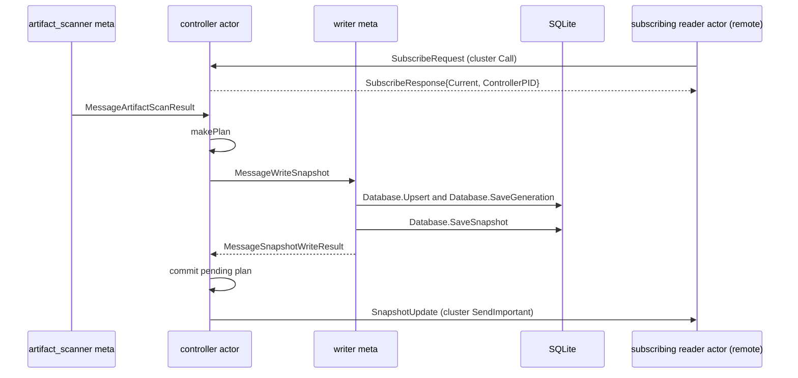
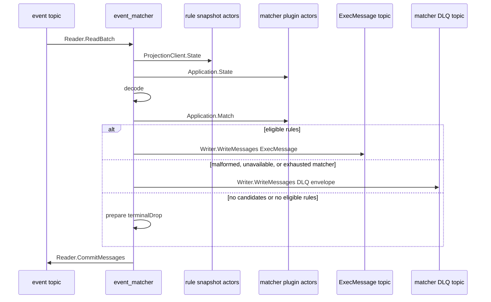

# Message flow

Two services are documented here. The controller publishes desired-state snapshots. `event_matcher` consumes events against matcher and rule runtime state. Process configuration is in the [services index](../services/README.md), [controller service](../services/controller.md), and [event_matcher service](event_matcher.md).

## Controller publication and distribution

The controller runs one application per catalog namespace. Reconciliation derives a sorted effective snapshot, reserves a new generation only when it changes, persists it to SQLite, and then pushes it to every subscribed executor directly, over the native Ergo cluster - there is no broker in this path.

| Message                                      | Direction                                    | Meaning                                                               |
| ----------------------------------------------- | ------------------------------------------------ | -------------------------------------------------------------------------- |
| `SubscribeRequest`/`Response`                | reader actor ↔ controller actor (cluster)      | Registers a subscriber PID and returns the current committed snapshot.  |
| `MessageArtifactScanResult`                  | artifact_scanner meta → controller actor       | Delivers the complete effective catalog used by reconciliation.         |
| `makePlan`                                   | controller actor → controller actor            | Derives the pending records, entries, diff, and next generation.        |
| `MessageWriteSnapshot`                       | controller actor → snapshot writer meta        | Queues the pending plan.                                                |
| `Database.Upsert`, `Database.SaveGeneration` | snapshot writer meta → SQLite                  | Persists records and reserves the generation.                           |
| `Database.SaveSnapshot`                      | snapshot writer meta → SQLite                  | Saves the aggregate snapshot.                                           |
| `MessageSnapshotWriteResult`                 | snapshot writer meta → controller actor        | Final success lets the actor commit its pending plan and generation.    |
| `SnapshotUpdate`                             | controller actor → subscriber PID (cluster)    | Pushes the newly committed snapshot to every registered subscriber.     |

- The actor commits its in-memory generation only on final SQLite success, then calls `notifySubscribers` to push it. A subscriber applies a pushed (or initial `SubscribeResponse`) snapshot only if its generation is strictly newer than the last one it published - so a redundant or duplicate push, or a `SubscribeResponse.Current` the subscriber already has, is a no-op. Backwards generations never happen: SQLite is the only writer of the generation counter.
- Readiness needs a complete artifact_scanner result and a loaded, ready writer.
- Persistence gets five exponential attempts. An exhausted writer is replaced and the pending plan retained. Worker replacement uses bounded exponential backoff, and the service runner retries a failed attempt with 1 s-60 s jittered backoff until cancellation.
- On cancellation the service seals writer I/O, drains the actor, cancels restart timers and worker metas, waits for accepted writer I/O to quiesce, then closes resources. Subscribers are not explicitly torn down - a `SendImportant` to a dead subscriber surfaces as a monitored `gen.MessageDownPID`, which removes it.

Lifecycle, fencing, persistence order, and retry budgets: [controller runtime](controller-runtime.md).

## Event processing

`event_matcher` starts a matcher plugin runtime tree and a separate rule snapshot tree. The matcher tree commits externally, only once its actor runtime, resolved artifacts, catalog, and generation agree. The rule tree commits a valid parsed generation directly. The service snapshots both committed views once per fetched batch.

| Message                  | Direction                             | Meaning                                                                        |
| ------------------------ | ---------------------------------------- | ------------------------------------------------------------------------------------ |
| `Reader.ReadBatch`       | event topic → event_matcher           | Fetches one input batch.                                                       |
| `ProjectionClient.State` | event_matcher → rule snapshot actors  | Reads the committed rule projection for that batch.                            |
| `Application.State`      | event_matcher → matcher plugin actors | Reads the committed matcher projection for that batch.                         |
| `decode`                 | event_matcher → event_matcher         | Decodes input and resolves rule candidates by `log_type`.                      |
| `Application.Match`      | event_matcher → matcher plugin actors | Invokes grouped matcher candidates.                                            |
| `Writer.WriteMessages`   | event_matcher → `ExecMessage` topic   | Writes a keyed `ExecMessage` for eligible rules.                               |
| `Writer.WriteMessages`   | event_matcher → matcher DLQ topic     | Writes a keyed DLQ envelope for malformed, unavailable, or exhausted matching. |
| `prepare`                | event_matcher → event_matcher         | Assigns `terminalDrop` when no candidate or rule is eligible.                  |
| `Reader.CommitMessages`  | event_matcher → event topic           | Commits the batch only after every input has a terminal result.               |

### Admission and routing

Before creating its event consumer, `event_matcher` needs both projections ready and holding a primary. A degraded committed rule projection stays routable but reports not ready. An unavailable one fails the service attempt. The matcher runtime waits briefly through plugin unavailability; any other runtime-state error fails the attempt.

Candidates come from the committed rule projection by `log_type`. Candidates sharing a matcher take one invocation, and a rule with several matchers needs all of them to pass. Routing, admission, plugin processes, rollout, invocation fencing, and cancellation belong to the actor runtime - see [plugin runtime](plugin-runtime.md). The subscription-based reader, generation fencing, typed projection, commit modes, and cancellation are in [snapshot runtime](snapshot-runtime.md).

### Terminals, retries, and commits

Each fetched input reaches exactly one terminal state before its offset is eligible to commit:

| Terminal      | Cause                                                                                | Broker action                                                            |
| ------------- | -------------------------------------------------------------------------------------- | ---------------------------------------------------------------------------- |
| `ExecMessage` | Eligible rule IDs remain                                                             | Write protobuf output with the original input key.                       |
| DLQ           | Invalid input, invalid matcher reference, unavailable matcher, or exhausted matching | Write a source-faithful DLQ envelope with the original key.              |
| Drop          | No candidate or no eligible rule; or an output/DLQ encoding failure                  | No output. Encoding failures drop to prevent deterministic replay loops. |

A matcher call retries only its pending failures, and a whole-call or result-shape failure retries the current pending set. The default is three attempts, with jittered exponential delays from 100 ms to 5 s. Publication retries within its own bounded policy, and exhaustion fails the service attempt with no input commit. Prepared non-drop terminals are written serially in fetched order.

Output acknowledgement and source-offset commit are separate, so delivery is at least once. A crash, cancellation, or commit failure after an acknowledged write can replay and duplicate an `ExecMessage` or DLQ record. Cancellation, read failure, preparation failure, write failure, and commit failure all leave unresolved input offsets uncommitted.

The downstream record preserves the input Kafka key and contains the source event plus eligible rule IDs. DLQ envelopes preserve the input key and include the original payload, source, stage, reason, attempts, and timestamp. A record that cannot be encoded as either normal or DLQ output is dropped to prevent an infinite replay loop.

Service lifecycle, probes, configuration, and source maps: [event_matcher](event_matcher.md). Two-service overview: [Blink services](../services/README.md).
