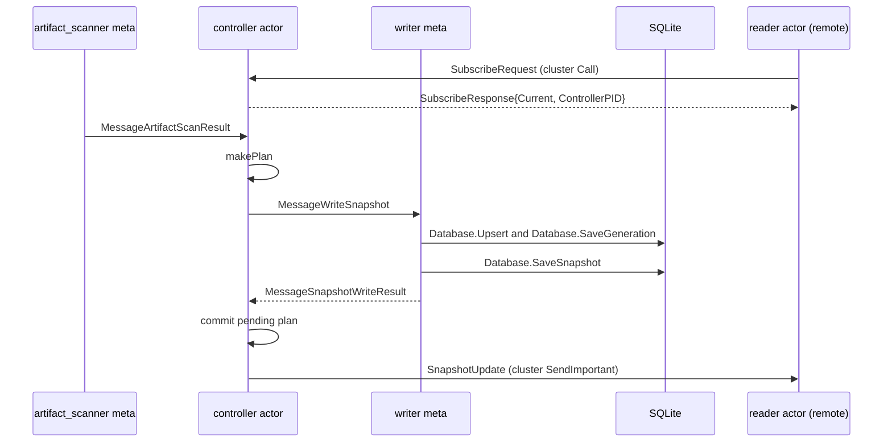
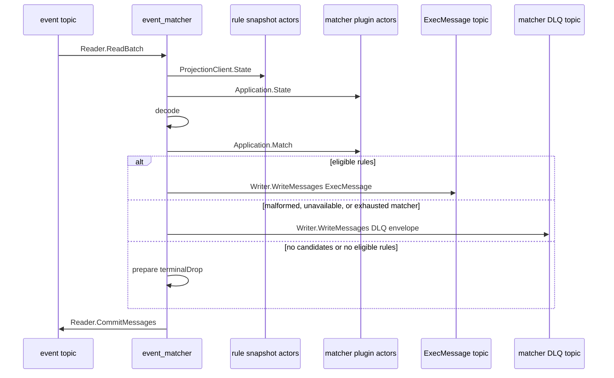

# Message flow

[Internals index](README.md) · [Controller runtime](controller-runtime.md) · [Plugin runtime](plugin-runtime.md)

The controller publishes desired-state snapshots. `event_matcher` consumes events against matcher and rule runtime state.

## Controller publication and distribution

One application runs per catalog namespace. Reconciliation reserves a generation only when the sorted effective snapshot changes.

| Message                                      | Direction                                   | Meaning                                                       |
| -------------------------------------------- | ------------------------------------------- | ------------------------------------------------------------- |
| `SubscribeRequest`/`Response`                | reader actor ↔ controller actor (cluster)   | Registers a subscriber PID; returns the committed snapshot.   |
| `MessageArtifactScanResult`                  | artifact_scanner meta → controller actor    | Delivers the effective catalog used by reconciliation.        |
| `makePlan`                                   | controller actor → controller actor         | Derives pending records, entries, diff, next generation.      |
| `MessageWriteSnapshot`                       | controller actor → snapshot writer meta     | Queues the pending plan.                                      |
| `Database.Upsert`, `Database.SaveGeneration` | snapshot writer meta → SQLite               | Persists records; reserves the generation.                    |
| `Database.SaveSnapshot`                      | snapshot writer meta → SQLite               | Saves the aggregate snapshot.                                 |
| `MessageSnapshotWriteResult`                 | snapshot writer meta → controller actor     | Final success commits the plan and generation.                |
| `SnapshotUpdate`                             | controller actor → subscriber PID (cluster) | Pushes the committed snapshot to every registered subscriber. |

- The in-memory generation commits only on final SQLite success, then `notifySubscribers` pushes it.
- A subscriber applies a pushed snapshot or initial `SubscribeResponse.Current` only if strictly newer than the last published. SQLite alone writes the generation counter, so generations never go backwards.
- Readiness needs a complete artifact_scanner result and a loaded, ready writer.
- Persistence gets five exponential attempts; an exhausted writer is replaced, its pending plan retained.
- Worker replacement uses bounded exponential backoff; the runner retries with 1 s-60 s jittered backoff until cancellation.
- On cancellation: seal writer I/O, drain the actor, cancel restart timers and metas, wait for accepted I/O to quiesce, close resources.
- A `SendImportant` to a dead subscriber surfaces as `gen.MessageDownPID`, which removes it.

Lifecycle, fencing, and retry budgets: [controller runtime](controller-runtime.md).

## Event processing

`event_matcher` runs a matcher plugin runtime tree and a rule snapshot tree. The matcher tree commits externally once its actor runtime, resolved artifacts, catalog, and generation agree; the rule tree commits a valid parsed generation directly. Both views are read once per fetched batch.

| Message                  | Direction                             | Meaning                                                                        |
| ------------------------ | ------------------------------------- | ------------------------------------------------------------------------------ |
| `Reader.ReadBatch`       | event topic → event_matcher           | Fetches one input batch.                                                       |
| `ProjectionClient.State` | event_matcher → rule snapshot actors  | Reads the committed rule projection for the batch.                             |
| `Application.State`      | event_matcher → matcher plugin actors | Reads the committed matcher projection for the batch.                          |
| `decode`                 | event_matcher → event_matcher         | Decodes input; resolves rule candidates by `log_type`.                         |
| `Application.Match`      | event_matcher → matcher plugin actors | Invokes grouped matcher candidates.                                            |
| `Writer.WriteMessages`   | event_matcher → `ExecMessage` topic   | Writes a keyed `ExecMessage` for eligible rules.                               |
| `Writer.WriteMessages`   | event_matcher → matcher DLQ topic     | Writes a keyed DLQ envelope for malformed, unavailable, or exhausted matching. |
| `prepare`                | event_matcher → event_matcher         | Assigns `terminalDrop` when no candidate or rule is eligible.                  |
| `Reader.CommitMessages`  | event_matcher → event topic           | Commits the batch once every input has a terminal result.                      |

### Admission and routing

- The event consumer starts only with both projections ready and holding a primary.
- A degraded committed rule projection stays routable but not ready; an unavailable one fails the attempt.
- The matcher runtime waits briefly through plugin unavailability; any other runtime-state error fails the attempt.
- Candidates come from the committed rule projection by `log_type`; those sharing a matcher take one invocation, and a rule with several matchers needs all to pass.

Routing, rollout, and invocation fencing: [plugin runtime](plugin-runtime.md). Subscription reader and generation fencing: [snapshot runtime](snapshot-runtime.md).

### Terminals, retries, and commits

Every input reaches one terminal state before its offset can commit:

| Terminal      | Cause                                                                                | Broker action                                                            |
| ------------- | ------------------------------------------------------------------------------------ | ------------------------------------------------------------------------ |
| `ExecMessage` | Eligible rule IDs remain                                                             | Write protobuf output with the original input key.                       |
| DLQ           | Invalid input, invalid matcher reference, unavailable matcher, or exhausted matching | Write a source-faithful DLQ envelope with the original key.              |
| Drop          | No candidate or no eligible rule; or an output/DLQ encoding failure                  | No output. Encoding failures drop to prevent deterministic replay loops. |

- A matcher call retries only its pending failures; a whole-call or result-shape failure retries the pending set. Default three attempts, jittered exponential 100 ms to 5 s.
- Publication retries within its own bounded policy; exhaustion fails the attempt with no input commit. Prepared non-drop terminals are written serially in fetched order.
- Acknowledgement and offset commit are separate, so delivery is at least once. Cancellation, read, preparation, write, and commit failures leave unresolved offsets uncommitted.
- The downstream record keeps the input Kafka key and carries the source event plus eligible rule IDs. DLQ envelopes keep the key and add payload, source, stage, reason, attempts, timestamp.

Configuration: [controller](../services/controller.md), [event_matcher](../services/event_matcher.md), [Blink services](../services/README.md).
