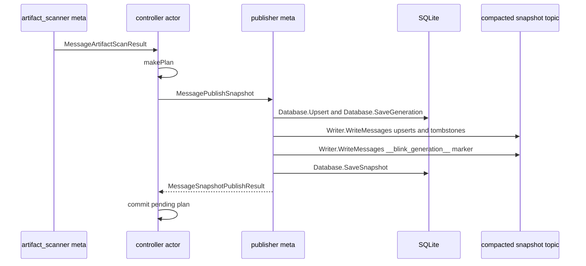
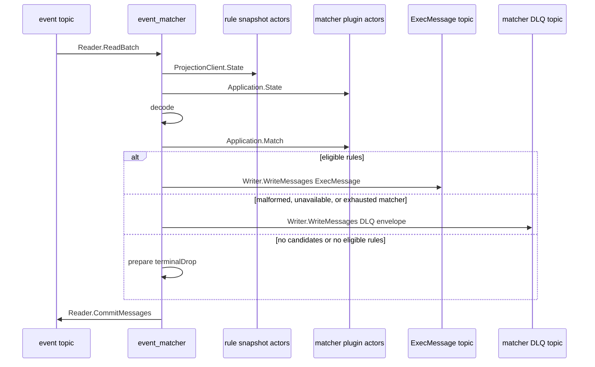

# Message flow

This page covers the two currently documented services: the controller publishes compacted desired-state snapshots, and `event_matcher` consumes events using matcher and rule runtime state. See the [services index](../services/README.md), [controller service](../services/controller.md), and [event_matcher service](../services/event_matcher.md) for process configuration.

## Controller publication

The controller runs one application per catalog namespace. For matcher and rule catalogs, reconciliation derives a sorted effective snapshot, reserves a new generation only when it changes, and publishes keyed records to the respective compacted snapshot topic.

| Message                                      | Direction                                          | Meaning                                                                              |
| -------------------------------------------- | -------------------------------------------------- | ------------------------------------------------------------------------------------ |
| `MessageArtifactScanResult`                  | artifact_scanner meta → controller actor           | Delivers the complete effective catalog used by reconciliation.                      |
| `makePlan`                                   | controller actor → controller actor                | Derives the pending records, entries, diff, and next generation.                     |
| `MessagePublishSnapshot`                     | controller actor → snapshot publisher meta         | Queues the pending plan.                                                             |
| `Database.Upsert`, `Database.SaveGeneration` | snapshot publisher meta → SQLite                   | Persists records and reserves the generation before broker publication.              |
| `Writer.WriteMessages`                       | snapshot publisher meta → compacted snapshot topic | Writes keyed upserts, tombstones, and the `__blink_generation__` marker in one call. |
| `Database.SaveSnapshot`                      | snapshot publisher meta → SQLite                   | Saves the aggregate snapshot after the Kafka write.                                  |
| `MessageSnapshotPublishResult`               | snapshot publisher meta → controller actor         | Final success lets the actor commit its pending plan and generation.                 |

- Entry records use their logical IDs as Kafka keys. A `nil` value is a tombstone. The non-entry key `__blink_generation__` carries the reserved generation as an 8-byte big-endian `int64` and fences a complete publication.
- The actor commits its in-memory generation only after the publisher reports final success. A consumer reconstructs entries from the compacted topic and makes a snapshot visible only after both catch-up and a generation marker; backwards generations are rejected.
- Controller readiness requires a complete artifact_scanner result and a loaded, ready publisher. A publication has five exponential attempts; an exhausted publisher is replaced while the pending plan is retained. Worker replacement uses bounded exponential backoff, and the service runner retries failed attempts with 1 s--60 s jittered backoff until cancellation.
- On cancellation, the service seals publication, drains the actor, cancels restart timers and worker metas, waits for accepted publisher I/O to quiesce, then closes resources.

The lifecycle, fencing, persistence order, and retry budgets are defined in [controller runtime](controller-runtime.md).

## Event processing

`event_matcher` starts a matcher plugin runtime tree and a separate rule snapshot tree. The matcher tree externally commits a projection only after its actor runtime, resolved artifacts, catalog, and generation agree; the rule tree directly commits a valid parsed generation. The service snapshots both committed views once per fetched batch.

| Message                  | Direction                             | Meaning                                                                        |
| ------------------------ | ------------------------------------- | ------------------------------------------------------------------------------ |
| `Reader.ReadBatch`       | event topic → event_matcher           | Fetches one input batch.                                                       |
| `ProjectionClient.State` | event_matcher → rule snapshot actors  | Reads the committed rule projection for that batch.                            |
| `Application.State`      | event_matcher → matcher plugin actors | Reads the committed matcher projection for that batch.                         |
| `decode`                 | event_matcher → event_matcher         | Decodes input and resolves rule candidates by `log_type`.                      |
| `Application.Match`      | event_matcher → matcher plugin actors | Invokes grouped matcher candidates.                                            |
| `Writer.WriteMessages`   | event_matcher → `ExecMessage` topic   | Writes a keyed `ExecMessage` for eligible rules.                               |
| `Writer.WriteMessages`   | event_matcher → matcher DLQ topic     | Writes a keyed DLQ envelope for malformed, unavailable, or exhausted matching. |
| `prepare`                | event_matcher → event_matcher         | Assigns `terminalDrop` when no candidate or rule is eligible.                  |
| `Reader.CommitMessages`  | event_matcher → event topic           | Commits the batch only after every input has a terminal result.                |

### Admission and routing

Before creating its event consumer, `event_matcher` requires both projections to be ready and to contain a primary. A degraded committed rule projection can remain routable but makes readiness false; an unavailable rule projection fails the service attempt. The matcher runtime waits briefly through plugin unavailability, while other runtime-state errors fail the attempt.

Candidates come from the committed rule projection by `log_type`. Candidates sharing a matcher use one invocation; a rule with multiple matchers requires all of them to pass. Runtime routing, admission, plugin processes, rollout, invocation fencing, and cancellation are owned by the current actor runtime, documented in [plugin runtime](plugin-runtime.md). The compacted reader, generation fencing, typed projection, direct/external commit modes, and cancellation behavior are documented in [snapshot runtime](snapshot-runtime.md).

### Terminals, retries, and commits

Each fetched input reaches exactly one terminal state before its offset is eligible to commit:

| Terminal      | Cause                                                                                | Broker action                                                            |
| ------------- | ------------------------------------------------------------------------------------ | ------------------------------------------------------------------------ |
| `ExecMessage` | Eligible rule IDs remain                                                             | Write protobuf output with the original input key.                       |
| DLQ           | Invalid input, invalid matcher reference, unavailable matcher, or exhausted matching | Write a source-faithful DLQ envelope with the original key.              |
| Drop          | No candidate or no eligible rule; or an output/DLQ encoding failure                  | No output. Encoding failures drop to prevent deterministic replay loops. |

Matcher calls retry only pending failures; whole-call and result-shape failures retry the current pending set. The default maximum is three attempts, with jittered exponential delays from 100 ms to 5s. Publication also retries within its bounded attempt policy; exhaustion fails the service attempt without an input commit. Prepared non-drop terminals are written serially in fetched order.

Output acknowledgement and source-offset commit are separate operations, so the flow is at least once: a crash, cancellation, or commit failure after an acknowledged write can replay and duplicate an `ExecMessage` or DLQ record. Cancellation, read failure, preparation failure, write failure, or commit failure leaves unresolved input offsets uncommitted.

For detailed service lifecycle, probe behavior, configuration, and source maps, see [event_matcher](../services/event_matcher.md). For the two-service overview, see [Blinkservices](../services/README.md).
