# Plugin runtime

[Internals index](README.md) · [Controller runtime](controller-runtime.md) · [Snapshot runtime](snapshot-runtime.md) · [Concurrency knobs](concurrency-knobs.md)

`internal/runtime/plugin` owns local plugin deployment. One `plugin.Application[P,M]` bridges callers to one runtime supervisor on the process-owned Ergo node.

## Composition

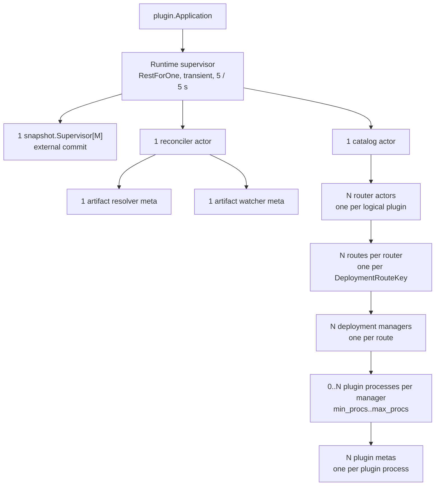
```mermaid
flowchart TB
  app["plugin.Application"]
  supervisor["Runtime supervisor\nRestForOne, transient, 5 / 5 s"]
  snapshot["1 snapshot.Supervisor[M]\nexternal commit"]
  reconciler["1 reconciler actor"]
  resolver["1 artifact resolver meta"]
  watcher["1 artifact watcher meta"]
  catalog["1 catalog actor"]
  routers["N router actors\none per logical plugin"]
  routes["N routes per router\none per DeploymentRouteKey"]
  managers["N deployment managers\none per route"]
  procs["0..N plugin processes per manager\nmin_procs..max_procs"]
  metas["N plugin metas\none per plugin process"]
  app --> supervisor
  supervisor --> snapshot
  supervisor --> reconciler
  supervisor --> catalog
  reconciler --> resolver
  reconciler --> watcher
  catalog --> routers --> routes --> managers --> procs --> metas
```

- Supervisor semantics exist only in the runtime supervisor and the snapshot subtree. Snapshot, reconciler, and catalog are static children; routers, routes, and managers are dynamic router mechanisms; plugin processes are manager-spawned and manager-monitored; metas are actor-spawned.
- RestForOne order: snapshot, reconciler, catalog. Transient, intensity 5 in 5 s, handles child lifecycle itself, no auto-shutdown. Subtree policy: [snapshot-runtime.md](snapshot-runtime.md).
- No actor pool between a manager and its processes: each process advertises `calls_per_process` and the manager schedules against it.

## Messages

| Message                     | Direction                                                                                                | Meaning                                                                         |
| --------------------------- | -------------------------------------------------------------------------------------------------------- | ------------------------------------------------------------------------------- |
| Admission and invocation    | caller → application → supervisor → catalog → router → manager → process                                 | One admitted production or shadow call.                                         |
| Desired-state promotion     | reconciler → supervisor → catalog → router                                                               | A desired revision through the drain, freshness, and projection-commit barrier. |
| Status and readiness        | child/meta/process → parent owner                                                                        | Fenced lifecycle, activity, availability facts, aggregated upward.              |
| Drain                       | application → supervisor → catalog → router → manager                                                    | Closes admission, drains owned work top-down.                                   |
| Completion and cancellation | process → manager → router → catalog → supervisor; application → supervisor → catalog → router → manager | One idempotent result, or the fenced accepted/pending cancel path.              |

## Roles

| Role                   | Default name or identity                             | Owner                  | Responsibility                                                         |
| ---------------------- | ---------------------------------------------------- | ---------------------- | ---------------------------------------------------------------------- |
| Plugin Application     | `plugin-<namespace>-application` application name    | Ergo application group | Caller lifecycle, production/shadow admission, async-result ownership. |
| Runtime Supervisor     | `plugin-<namespace>-supervisor` (registered)         | Plugin Application     | Snapshot, reconciler, catalog, desired-state promotion, drain.         |
| Snapshot Supervisor    | `snapshot-<namespace>-supervisor` (registered)       | Runtime Supervisor     | Reader/projection state, external projection commit.                   |
| Reconciler Actor       | `plugin-<namespace>-reconciler` child name           | Runtime Supervisor     | Resolves snapshot and local artifacts into desired router state.       |
| Artifact Resolver Meta | dynamic `gen.Alias`                                  | Reconciler Actor       | Resolves locally valid artifacts and desired routes.                   |
| Artifact Watcher Meta  | dynamic `gen.Alias`                                  | Reconciler Actor       | Reports artifact-directory watch/poll drift.                           |
| Catalog Actor          | `plugin-<namespace>-catalog` child name              | Runtime Supervisor     | Owns router incarnations, aggregates router status.                    |
| Router Actor           | dynamic PID/generation/epoch per plugin              | Catalog Actor          | Selects rollout routes, owns deployment routes.                        |
| Deployment Route       | stable SHA-256-derived atom per `DeploymentRouteKey` | Router Actor           | Creates, respawns, drains, removes one manager route.                  |
| Deployment Manager     | dynamic route process PID                            | Deployment Route       | Queueing, capacity-aware dispatch, scaling, process recovery, drain.   |
| Plugin Process         | dynamic linked-and-monitored actor PID               | Deployment Manager     | Serves up to `calls_per_process` invocations, recovers its session.    |
| Plugin Meta            | dynamic `gen.Alias`                                  | Plugin Process         | Owns one plugin subprocess and RPC session.                            |
| Invocation             | `callID` and one `runtime.Invocation` handle         | caller                 | Its `AsyncResult` stays owned by the runtime tree.                     |

Only the two supervisors are registered; every other name is a child or dynamic identity. `ApplicationOptions.Namespace` is required and is the only configured name: `ApplicationName`, `SupervisorName`, `ReconcilerActorName`, `CatalogActorName`, and the snapshot subtree derive from it, so `SnapshotReader` configures only the subscription.

## Readiness

- Admission requires the expected projection generation ready and committed, an idle desired-state barrier, and a running application.
- The supervisor is ready when projection and catalog generations/revisions agree, both are routable, and it is not draining. It gates on catalog routability, not catalog readiness; per-call admission rejects a dead route with `ErrPluginUnavailable`.
- Availability is unavailable during a transition/drain or with projection/catalog missing, degraded when dependencies exist but are not all ready. No extra lifecycle constants.

## Plugin application

### Lifecycle

Single-use: `New → Running → Stopping → Terminated`. `Start` marks it running only after registered-supervisor lookup succeeds.

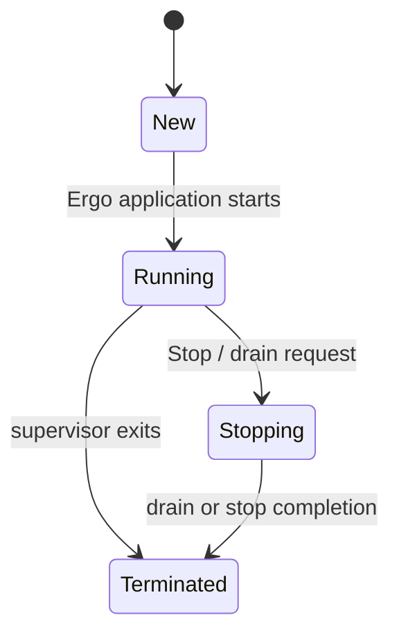
```mermaid
stateDiagram-v2
    [*] --> New
    New --> Running: Ergo application starts
    Running --> Stopping: Stop / drain request
    Running --> Terminated: supervisor exits
    Stopping --> Terminated: drain or stop completion
```

### Messages

| Message                   | Direction                                 | Meaning                                                                                            |
| ------------------------- | ----------------------------------------- | -------------------------------------------------------------------------------------------------- |
| `Start`                   | Ergo app lifecycle → `plugin.Application` | Starts the single-use application after its registered supervisor is found.                        |
| `Stop`                    | Ergo app lifecycle → `plugin.Application` | Closes admission, begins drain within Ergo's stop deadline.                                        |
| `DrainRequest`/`Response` | `plugin.Application` → supervisor         | Requests bounded graceful drain.                                                                   |
| `Terminate`               | Ergo app lifecycle → `plugin.Application` | Completes pending calls with `ErrRuntimeStopped`, or `ErrPluginUnavailable` when already stopping. |

### Readiness

Admission takes two permits. `Submit` reserves the plugin's share, `maxOutstandingInvocationsPerPlugin`, rejecting with `ErrQueueFull` when full, then acquires the blocking application-wide `maxOutstandingInvocations` permit, which includes queue waiters. `SubmitShadow` uses a separate non-blocking budget and returns `ErrShadowDropped` when full. The per-plugin share rejects rather than waits, so it is sized from the widest fan-out one caller batch can produce.

| Budget                               | Size                                                           | Why                                                                         |
| ------------------------------------ | -------------------------------------------------------------- | --------------------------------------------------------------------------- |
| `maxOutstandingInvocationsPerPlugin` | `min(MaxBatchSize, MaxDeploymentProcs+1) * MaxConcurrentCalls` | One shard per process a deployment may run, or the batch's own event count. |
| `maxOutstandingInvocations`          | `perPlugin * MaxConcurrentCalls`                               | Plugins per batch unknown here; blocking process-wide ceiling.              |
| Shadow budget                        | a sixteenth of the shared one                                  | Best-effort, not production-sized.                                          |
| `QueueSize` (deployment manager)     | rises with the per-plugin share                                | One plugin's whole fan-out lands on one manager.                            |

- `MaxDeploymentProcs + 1` covers the process count and the two routing groups a batch can split into. A caller declaring no `MaxBatchSize` gets the widest fan-out allowed.
- Callers request `min(share, Application.CallBudget)`; a deployment declaring more spends the rest over further calls. Raising batch size or concurrency requires passing both.
- Budgets bound concurrent calls, not batch pieces: an oversized batch is cut under the transport limit and run through a bounded pool, so pieces can outnumber capacity while live invocations do not.
- `ProcessBudget` (see Deployment manager) bounds subprocesses instead, sized from CPUs. [concurrency-knobs.md](concurrency-knobs.md) tabulates every knob that moves call counts.

## Runtime supervisor

### Lifecycle

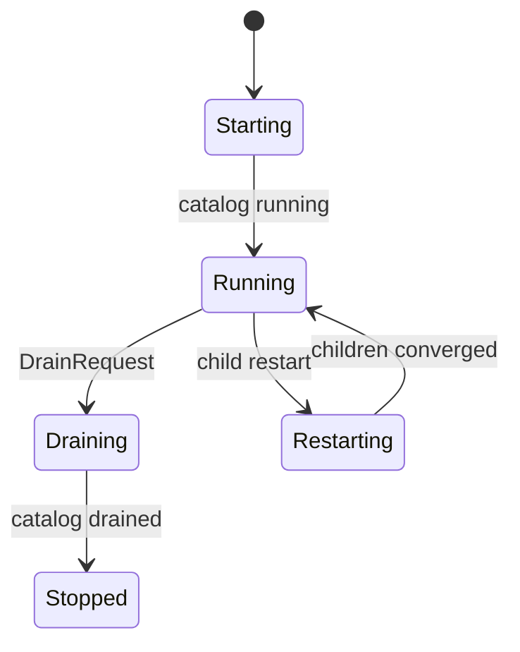
```mermaid
stateDiagram-v2
    [*] --> Starting
    Starting --> Running: catalog running
    Running --> Draining: DrainRequest
    Draining --> Stopped: catalog drained
    Running --> Restarting: child restart
    Restarting --> Running: children converged
```

### Messages

| Message                                        | Direction                            | Meaning                                                                          |
| ---------------------------------------------- | ------------------------------------ | -------------------------------------------------------------------------------- |
| `MessageCatalogActivate`                       | supervisor → catalog                 | Permits catalog status publication.                                              |
| `DrainRequest`/`Response`                      | application → supervisor             | Starts the downward drain.                                                       |
| `MessageDrain`                                 | supervisor → catalog                 | Drains the catalog once admission closes.                                        |
| `SupervisorStatusRequest`/`Response`           | `plugin.Application` → supervisor    | Reads the availability/status snapshot.                                          |
| `SupervisorStateRequest`/`Response`            | `plugin.Application` → supervisor    | Reads the admission-ready generation.                                            |
| `HandleChildStart`                             | Ergo supervisor runtime → supervisor | Records a snapshot, reconciler, or catalog incarnation; activates or replays it. |
| `HandleChildTerminate`                         | Ergo supervisor runtime → supervisor | Retires a child incarnation, recomputes availability.                            |
| `MessageReconcilerActorStatusChanged`          | reconciler → supervisor              | Updates reconciler readiness and transition state.                               |
| `MessageCatalogStatusChanged`                  | catalog → supervisor                 | Updates catalog revision/readiness, completes transition checks.                 |
| `MessageCatalogDrained`                        | catalog → supervisor                 | Completes drain waiters, then terminates.                                        |
| `snapshot.MessageProjectionActorStatusChanged` | snapshot supervisor → supervisor     | Updates committed/ready projection state.                                        |
| `MessageProjectionCommitRetry`                 | supervisor → supervisor              | Token-fenced deferred commit retry.                                              |
| `MessageProjectionCommitDeadline`              | supervisor → supervisor              | Token-, PID-, and generation-fenced commit expiry.                               |
| `MessageRadarTick`                             | supervisor → supervisor              | Self-scheduled radar collector registration retry.                               |

### Readiness

The exact state reader requires a nonzero ready generation equal to the committed generation, a routable committed projection, matching desired snapshot generation and catalog revision, a routable catalog, an idle transition, and a non-draining lifecycle.

Once the catalog reports drained, the supervisor fails remaining calls, answers drain waiters, and terminates. Retry domains are independent and finite; cancelling a retry invalidates its token.

## Desired-state transition

### Lifecycle

The reconciler proposes a monotonic desired revision once resolution is complete and non-deferred. The supervisor holds it until tracked invocations drain, applies it to the catalog, has the reconciler confirm freshness, then commits the matching projection generation.

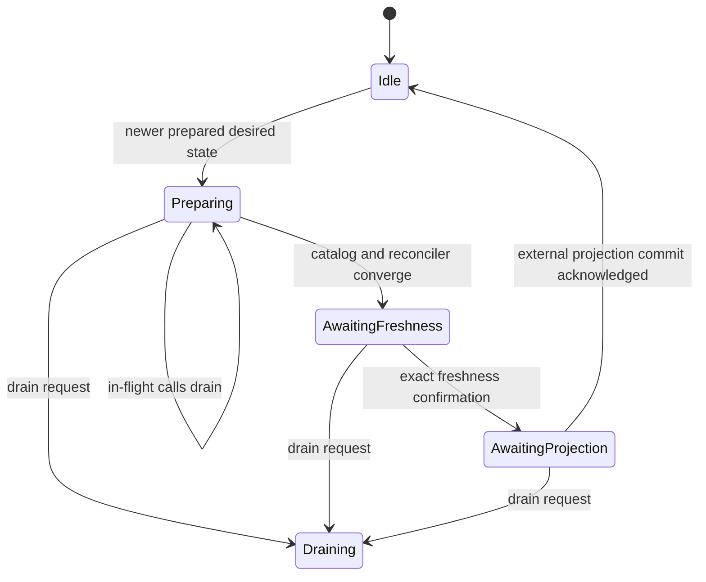
```mermaid
stateDiagram-v2
    [*] --> Idle
    Idle --> Preparing: newer prepared desired state
    Preparing --> Preparing: in-flight calls drain
    Preparing --> AwaitingFreshness: catalog and reconciler converge
    AwaitingFreshness --> AwaitingProjection: exact freshness confirmation
    AwaitingProjection --> Idle: external projection commit acknowledged
    Preparing --> Draining: drain request
    AwaitingFreshness --> Draining: drain request
    AwaitingProjection --> Draining: drain request
```

### Messages

| Message                           | Direction                        | Meaning                                                                |
| --------------------------------- | -------------------------------- | ---------------------------------------------------------------------- |
| `MessageProposeDesiredState`      | reconciler → supervisor          | Offers a resolved, monotonic desired revision.                         |
| `MessageApplyCatalogDesiredState` | supervisor → catalog             | Applies the revision after tracked calls drain.                        |
| `MessageDesiredStateFreshness`    | supervisor → reconciler          | Challenges the proposed generation/revision after catalog convergence. |
| `MessageDesiredStateFreshness`    | reconciler → supervisor          | Confirms that exact generation/revision is current and locally ready.  |
| `MessageProjectionCommit`         | supervisor → snapshot supervisor | Requests external commit of the matching projection generation.        |
| `MessageProjectionCommitResult`   | snapshot supervisor → supervisor | Acknowledges the PID/generation-fenced commit.                         |

### Readiness

Admission reopens only after projection, reconciler, catalog, generation, and revision agree. This is admission readiness, not an extra lifecycle enum.

The catalog side of the barrier is convergence, not aggregate health: every router must report the desired revision and be either ready or terminally failed (deployment circuit open). A router still starting holds the transition.

## Reconciler actor

### Lifecycle

The reconciler monitors the snapshot subtree's buffered snapshot/status events, starts the resolver and watcher metas, and coalesces snapshot and filesystem changes.

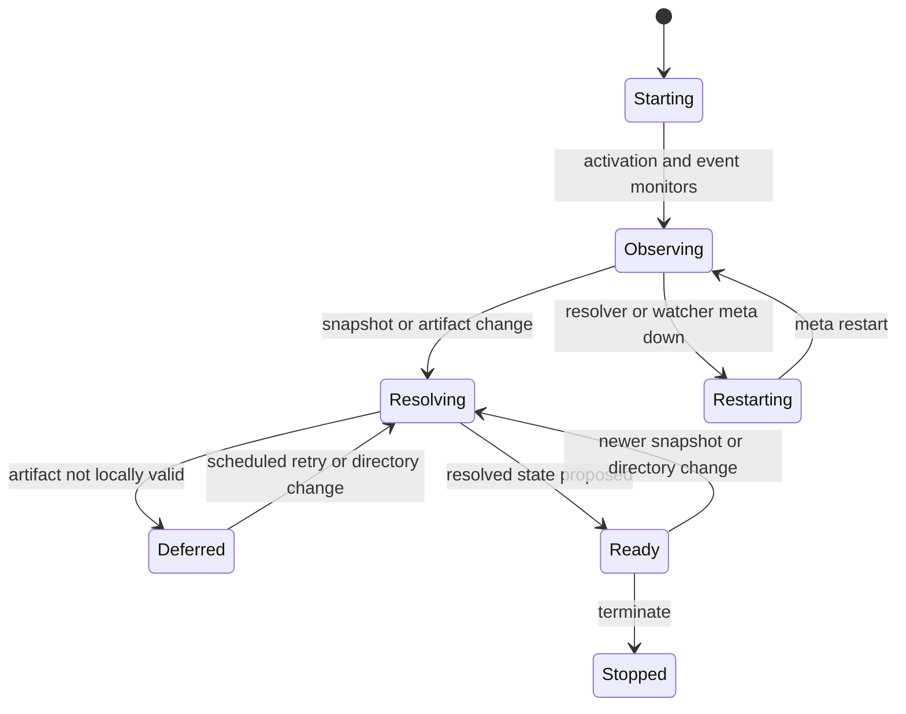
```mermaid
stateDiagram-v2
    [*] --> Starting
    Starting --> Observing: activation and event monitors
    Observing --> Resolving: snapshot or artifact change
    Resolving --> Deferred: artifact not locally valid
    Deferred --> Resolving: scheduled retry or directory change
    Resolving --> Ready: resolved state proposed
    Ready --> Resolving: newer snapshot or directory change
    Observing --> Restarting: resolver or watcher meta down
    Restarting --> Observing: meta restart
    Ready --> Stopped: terminate
```

### Messages

| Message                               | Direction                                          | Meaning                                                             |
| ------------------------------------- | -------------------------------------------------- | ------------------------------------------------------------------- |
| `MessageReconcilerActorActivate`      | supervisor → reconciler                            | Activates event monitoring, sets the revision base.                 |
| `MessageResolveArtifacts`             | reconciler → resolver meta                         | Requests resolution for the current snapshot.                       |
| `MessageArtifactResolutionResult`     | resolver meta → reconciler                         | Alias-, generation-, and dirtiness-fenced desired routes.           |
| `MessageArtifactDirectoryChanged`     | watcher meta → reconciler                          | Marks artifact state dirty, triggers resolution.                    |
| `MessageResolutionRetry`              | reconciler → reconciler                            | Token-fenced retry for deferred or failed resolution.               |
| `MessageArtifactResolverMetaRestart`  | reconciler → reconciler                            | Token-fenced timer restarting the resolver meta.                    |
| `MessageArtifactWatcherMetaRestart`   | reconciler → reconciler                            | Token-fenced timer restarting the watcher meta.                     |
| `gen.MessageEvent`                    | snapshot supervisor event → reconciler             | Buffered and live snapshot/reader-status events.                    |
| `gen.MessageDownAlias`                | Ergo meta monitor → reconciler                     | Marks resolver or watcher unavailable, schedules its restart.       |
| `MessageReconcilerActorStatusChanged` | reconciler → supervisor                            | Publishes reconciler lifecycle, availability, generation, revision. |
| `SendExitMeta`                        | reconciler → Ergo meta runtime                     | Requests resolver/watcher termination on replacement or shutdown.   |
| `Terminate`                           | Ergo meta runtime → artifact resolver/watcher meta | Invokes meta cleanup after the parent's exit request.               |

### Readiness

Resolver and watcher facts are fenced by meta alias. Resolution results are also fenced by snapshot generation and discarded once a newer filesystem or snapshot change made them dirty. Resolver, watcher, and resolution retries use separate shared scheduled-backoff instances; retry timers carry tokens. Exhaustion is an actor failure.

## Artifact resolver meta

### Lifecycle

One-slot job channel. It validates local names/specs, enabled state, and SHA-256 before producing desired primary/candidate routes.

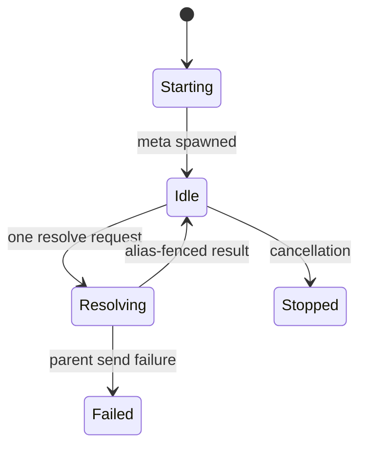
```mermaid
stateDiagram-v2
    [*] --> Starting
    Starting --> Idle: meta spawned
    Idle --> Resolving: one resolve request
    Resolving --> Idle: alias-fenced result
    Idle --> Stopped: cancellation
    Resolving --> Failed: parent send failure
```

### Messages

| Message                           | Direction                         | Meaning                                           |
| --------------------------------- | --------------------------------- | ------------------------------------------------- |
| `MessageResolveArtifacts`         | reconciler → resolver meta        | Supplies the snapshot to resolve.                 |
| `MessageArtifactResolutionResult` | resolver meta → reconciler        | Resolved/deferred route candidates for its alias. |
| `SendExitMeta`                    | reconciler → Ergo meta runtime    | Requests termination of the resolver meta.        |
| `Terminate`                       | Ergo meta runtime → resolver meta | Invokes cleanup for the in-flight resolution.     |

### Readiness

Invalid or absent artifacts are deferred, not deployed. A successful alias-fenced result makes the current resolver meta ready for the reconciler's freshness check.

## Artifact watcher meta

### Lifecycle

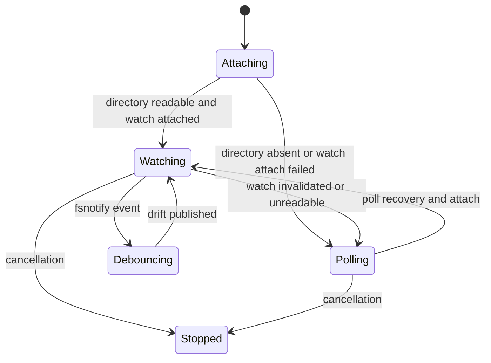
```mermaid
stateDiagram-v2
    [*] --> Attaching
    Attaching --> Watching: directory readable and watch attached
    Attaching --> Polling: directory absent or watch attach failed
    Watching --> Debouncing: fsnotify event
    Debouncing --> Watching: drift published
    Watching --> Polling: watch invalidated or unreadable
    Polling --> Watching: poll recovery and attach
    Watching --> Stopped: cancellation
    Polling --> Stopped: cancellation
```

### Messages

| Message                              | Direction                        | Meaning                                         |
| ------------------------------------ | -------------------------------- | ----------------------------------------------- |
| `MessageArtifactDirectoryChanged`    | watcher meta → reconciler        | A debounced filesystem or poll-detected change. |
| `MessageArtifactWatcherStateChanged` | watcher meta → reconciler        | Watch/poll availability and drift state.        |
| `SendExitMeta`                       | reconciler → Ergo meta runtime   | Requests termination of the watcher meta.       |
| `Terminate`                          | Ergo meta runtime → watcher meta | Invokes cleanup for fsnotify and polling.       |

### Readiness

The watcher combines fsnotify with a five-second metadata-fingerprint poll and a 300 ms notification debounce. A missing or unreadable directory is drift: it reports state and keeps polling. The resolver, not the watcher fingerprint, is the authority for content checksum.

## Catalog actor

### Lifecycle

Activation enables status publication. The catalog applies only nondecreasing desired revisions and creates one router incarnation per logical plugin ID. Removed routers are marked retiring, drained, then removed.

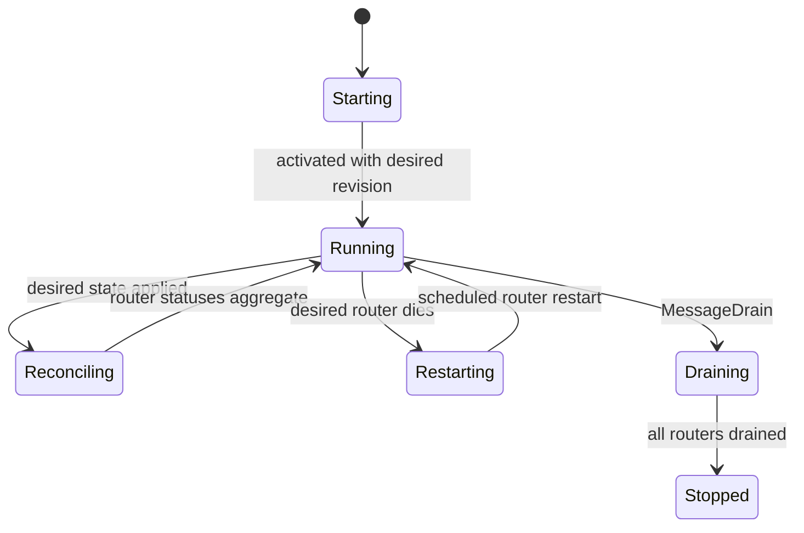
```mermaid
stateDiagram-v2
    [*] --> Starting
    Starting --> Running: activated with desired revision
    Running --> Reconciling: desired state applied
    Reconciling --> Running: router statuses aggregate
    Running --> Restarting: desired router dies
    Restarting --> Running: scheduled router restart
    Running --> Draining: MessageDrain
    Draining --> Stopped: all routers drained
```

### Messages

| Message                           | Direction              | Meaning                                                     |
| --------------------------------- | ---------------------- | ----------------------------------------------------------- |
| `MessageCatalogActivate`          | supervisor → catalog   | Enables catalog status publication.                         |
| `MessageApplyCatalogDesiredState` | supervisor → catalog   | Adds, updates, retires, or drains logical-plugin routers.   |
| `gen.MessageDownPID`              | Ergo monitor → catalog | A router incarnation death, for PID/generation fencing.     |
| `MessageRouterRestart`            | catalog → catalog      | Token-fenced retry creating a desired router.               |
| `MessageDrain`                    | supervisor → catalog   | Retires/drains every live router, suppresses restart.       |
| `MessageRouterStatusChanged`      | router → catalog       | Updates the PID/generation/epoch-fenced router aggregate.   |
| `MessageRouterDrained`            | router → catalog       | Retires a draining router, advances drain/replacement work. |
| `MessageCatalogStatusChanged`     | catalog → supervisor   | Publishes the epoch-ordered aggregate catalog state.        |
| `MessageCatalogDrained`           | catalog → supervisor   | Every live router has drained.                              |

### Readiness

Router facts are accepted only from the current PID, generation, and increasing epoch. PID identifies the live process, generation the catalog-created incarnation, and epoch orders that incarnation's status facts. On router loss the catalog fails calls assigned to that PID.

## Router actor

### Lifecycle

Each router creates primary, canary, and shadow deployment routes from its desired state. A production call uses primary unless its rollout bucket selects an active canary. `SubmitShadow` fans out best-effort only to an active shadow candidate.

The router routes a whole call by the single rollout key that call carries:

- Callers gate submissions on `ProjectionData.RolloutByID[id].Shadow`; a plugin with no shadow candidate is never cloned.
- The same entry's `CanaryPct` gates the split. `runtime.RouteSides` takes that percentage and the batch's rollout keys: no candidate, or one at 100% (elected primary), yields no groups and the batch is sent as it stands; a partial canary yields two, the buckets the candidate wins and the rest. The percentage is checked before the batch is walked.
- A shadow candidate's own `rollout_pct` is not recorded there; shadow calls are never routed by bucket.
- A candidate appearing mid-batch moves the committed generation. Calls from a retired generation are rejected.
- The entry also carries the shape a caller shards against: `MaxProcs` and `CallsPerProcess` are the larger of what the artifacts under that id declare, defaulted as their deployments default them; `Capacity()` is their product.

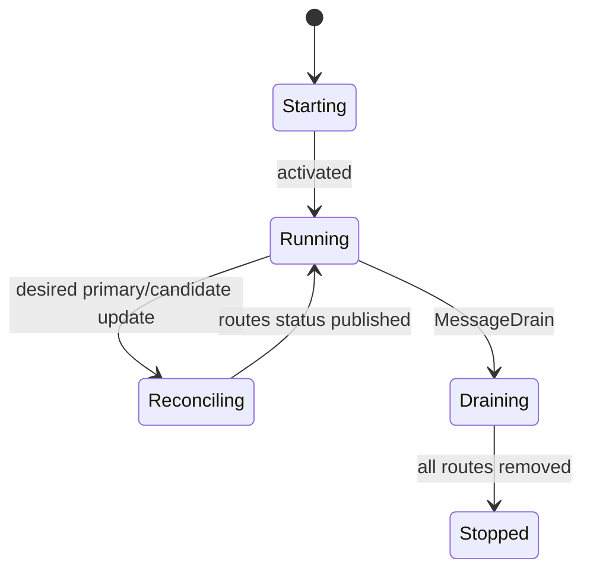
```mermaid
stateDiagram-v2
    [*] --> Starting
    Starting --> Running: activated
    Running --> Reconciling: desired primary/candidate update
    Reconciling --> Running: routes status published
    Running --> Draining: MessageDrain
    Draining --> Stopped: all routes removed
```

### Messages

| Message                                 | Direction        | Meaning                                                       |
| --------------------------------------- | ---------------- | ------------------------------------------------------------- |
| `MessageRouterActivate`                 | catalog → router | Fences the new incarnation with its catalog generation.       |
| `MessageApplyRouterDesiredState`        | catalog → router | Creates/updates primary, canary, and shadow route intent.     |
| `MessageInvokePlugin`                   | catalog → router | Routes production or shadow work to an eligible route.        |
| `MessageInvocationTimedOut`             | router → router  | Expires an unacknowledged route acceptance.                   |
| `MessageDrain`                          | catalog → router | Drains and removes all deployment routes.                     |
| `MessageDeploymentManagerStatusChanged` | manager → router | Updates a live route's manager status and rollout selection.  |
| `MessageDeploymentManagerDrained`       | manager → router | Permits removal of a draining route.                          |
| `MessageDeploymentManagerTerminated`    | manager → router | Fences manager loss, schedules an active-route recovery step. |
| `MessageRouterStatusChanged`            | router → catalog | Publishes router availability, rollout, and route state.      |
| `MessageRouterDrained`                  | router → catalog | All routes were removed during drain.                         |

### Readiness

The router records an acceptance deadline before routing. Unaccepted, route-failed, stale, or timed-out calls complete as unavailable. Cancellation goes to the accepted manager, or to the current route manager while acknowledgement is pending.

## Deployment route

### Lifecycle

A route has a stable SHA-256-derived atom for one concrete `DeploymentRouteKey`. It is a dynamic router route, not a supervisor. Status, acceptance, and termination are accepted only from the live manager PID; past manager PIDs are retained to fence late termination facts.

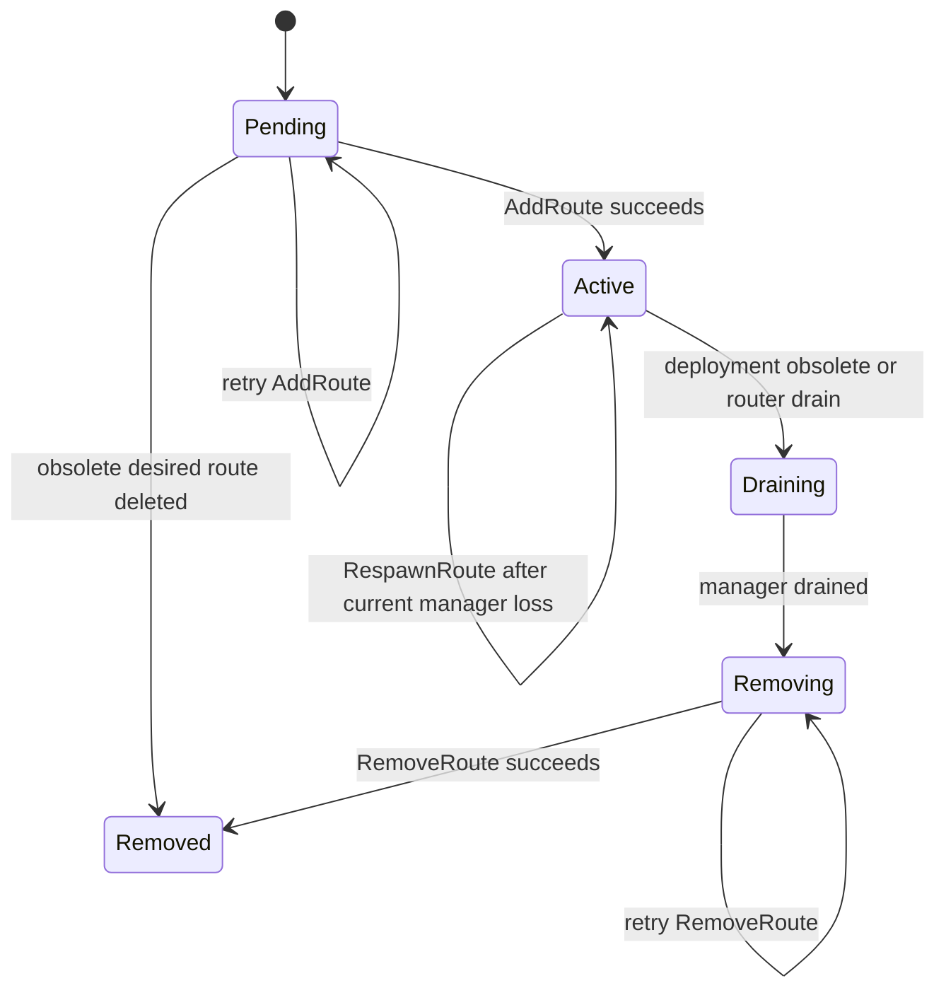
```mermaid
stateDiagram-v2
    [*] --> Pending
    Pending --> Active: AddRoute succeeds
    Pending --> Pending: retry AddRoute
    Pending --> Removed: obsolete desired route deleted
    Active --> Active: RespawnRoute after current manager loss
    Active --> Draining: deployment obsolete or router drain
    Draining --> Removing: manager drained
    Removing --> Removed: RemoveRoute succeeds
    Removing --> Removing: retry RemoveRoute
```

### Messages

| Message                                 | Direction             | Meaning                                                           |
| --------------------------------------- | --------------------- | ----------------------------------------------------------------- |
| `AddRoute`                              | router → `act.Router` | Registers the stable route atom, starts its manager factory.      |
| `MessageRetryRouteStep`                 | router → router       | Token-fenced retry for `AddRoute`, respawn, drain, or removal.    |
| `MessageDeploymentManagerStatusChanged` | manager → router      | Drives active-route readiness and router status.                  |
| `MessageDeploymentManagerTerminated`    | manager → router      | Fences manager loss, schedules route recovery.                    |
| `RespawnRoute`                          | router → `act.Router` | Recreates the manager after the retry step, or to finish a drain. |
| `MessageDeploymentManagerDrained`       | manager → router      | Permits route removal after graceful manager drain.               |
| `RemoveRoute`                           | router → `act.Router` | Removes the drained route; failures retry.                        |

### Readiness

Each route has its own `MessageRetryRouteStep` backoff. A pending route made obsolete is deleted directly. On active-manager loss the retry timer runs before `RespawnRoute`. Draining with no live manager respawns a draining manager so the drain protocol can complete.

## Deployment manager

### Lifecycle

- Validates `0 <= MinProcs <= max(1, MaxProcs) <= 100` and `MaxConcurrentCallsPerProcess <= MaxDeploymentCallsPerProcess` (64). `CapacityPerProcess()` is read at each use, not cached, and returns the declared figure or the default `32`.
- Acknowledges an invocation before queue admission, then rejects draining calls, open-circuit calls, and a full `QueueSize` queue with `ErrQueueFull`. The queue links the call entries themselves, so unlinking a cancelled or expired call is O(1).
- Spawns each plugin process with `LinkParent` then `MonitorPID`: the link carries manager termination downward, the monitor reports a death upward.

A slot is a stable identity outliving the PIDs filling it: its process's last report, its assigned invocations, and the retry budget owing it the next process.

| Field       | Holds                                     |
| ----------- | ----------------------------------------- |
| `processes` | slot state by monotonic slot id           |
| `order`     | slot ids in the sequence they were opened |
| `byPID`     | a child's PID resolved back to its slot   |

A dying process empties its slot instead of dropping it. Slot ids are counted, not positional, and only grow, so the newest slot is the highest id. Shrinking retires the newest empty slot; a process above the desired count is retired at its next completion.

Committed capacity is `ready processes x callsPerProcess`. `selectProcess` picks the ready process holding the fewest invocations - least-loaded, not round-robin. Demand is active plus dispatching plus queued invocations; `requiredProcs` is `ceil(demand / callsPerProcess)` clamped to `MinProcs..max(1, MaxProcs)`.

| Direction | Conditions                                                                                             | Step                                           |
| --------- | ------------------------------------------------------------------------------------------------------ | ---------------------------------------------- |
| Growth    | every ready process at capacity, a call still waiting, every desired process ready, 1 s scale cooldown | straight to the required count in one pass     |
| Shrink    | required below desired, queue empty, nothing dispatching, 30 s idle, a process holding no invocation   | one process per cooldown, arming the next pass |

Shrink gives back only an empty process; at a zero minimum the last one goes too and the deployment sleeps holding nothing.

`MaxProcs` is only this deployment's ceiling. Growth past its reserved `max(1, MinProcs)` also needs a permit from one `ProcessBudget` shared by every manager in the process, sized `GOMAXPROCS x DefaultRuntimeProcessGrowthPerProc` (2).

- Reservations sit outside the budget: `MinProcs` is always granted, and a `MinProcs=0` route always gets the one process a queued call wakes.
- Reservations are counted only to warn. Exceeding the budget logs `reserved plugin processes exceed the process budget` and starts anyway.
- A denied permit is not an error: calls stay queued and the cooldown paces the next attempt.
- Permits return on shrink, on circuit open, and on manager termination.

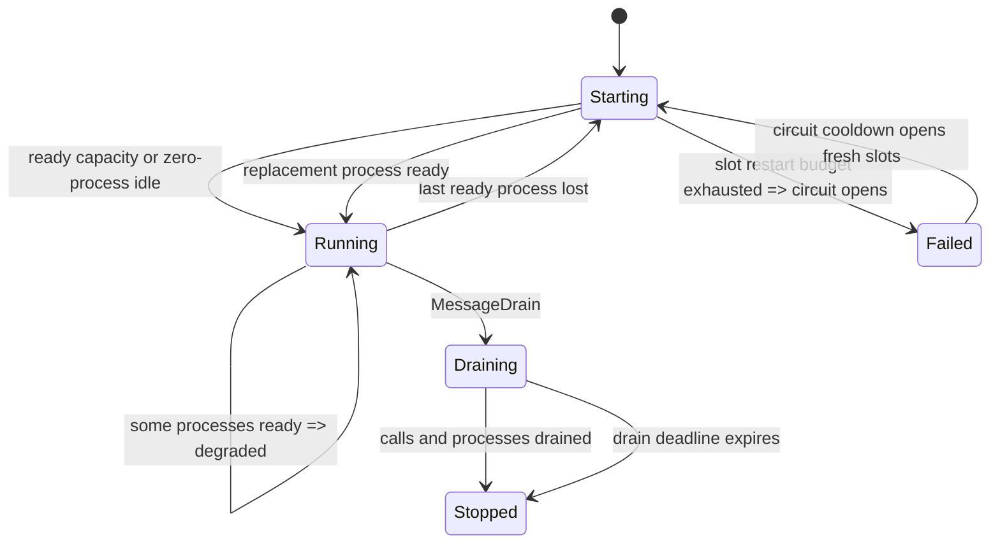
```mermaid
stateDiagram-v2
    [*] --> Starting
    Starting --> Running: ready capacity or zero-process idle
    Running --> Running: some processes ready => degraded
    Running --> Starting: last ready process lost
    Starting --> Running: replacement process ready
    Starting --> Failed: slot restart budget exhausted => circuit opens
    Failed --> Starting: circuit cooldown opens fresh slots
    Running --> Draining: MessageDrain
    Draining --> Stopped: calls and processes drained
    Draining --> Stopped: drain deadline expires
```

### Messages

| Message                                    | Direction                                                      | Meaning                                                                                                             |
| ------------------------------------------ | -------------------------------------------------------------- | ------------------------------------------------------------------------------------------------------------------- |
| `MessageInvokePlugin`                      | supervisor → catalog → router → manager                        | Acknowledges ownership, then queues or rejects the call.                                                            |
| `MessageInvocationAccepted`                | manager → router                                               | Binds the completion/cancellation path to this manager PID.                                                         |
| `MessageCancelInvocation`                  | `plugin.Application` → supervisor → catalog → router → manager | Cancels the accepted or pending invocation at its fenced manager.                                                   |
| `MessageDeploymentManagerDispatchDeadline` | manager → manager                                              | Times out an invocation awaiting process acceptance.                                                                |
| `MessageDeploymentManagerRestart`          | manager → manager                                              | Token-fenced retry refilling one named slot.                                                                        |
| `MessageDeploymentManagerReconcile`        | manager → manager                                              | Token-fenced autoscaling pass.                                                                                      |
| `MessageDeploymentManagerCircuitCooldown`  | manager → manager                                              | Token-fenced circuit re-arm: opens fresh slots after the cooldown.                                                  |
| `MessageDeploymentManagerDrainDeadline`    | manager → manager                                              | Cancels remaining work with `context.DeadlineExceeded`.                                                             |
| `MessageDrain`                             | router → manager                                               | Stops new work, cancels recovery/scale activity, starts drain.                                                      |
| `MessageInvokePlugin`                      | manager → process                                              | Dispatches one queued call to the least-loaded ready process.                                                       |
| `MessageStop`                              | manager → process                                              | Asks a retired process to finish after its last invocation.                                                         |
| `MessagePluginProcessStatusChanged`        | process → manager                                              | Drives capacity, availability, dispatch, scaling; reaching ready resets that slot's budget.                         |
| `MessageInvocationStarted`                 | process → manager                                              | Clears the dispatch deadline, marks the call active.                                                                |
| `MessageInvocationFinished`                | process → manager                                              | Returns the result, frees that much process capacity.                                                               |
| `MessagePluginProcessRestartExhausted`     | process → manager                                              | Retires only the spent process, owes it a backoff-paced replacement.                                                |
| `MessagePluginProcessStopped`              | process → manager                                              | Fails calls dispatched to a stopping process before its DOWN arrives.                                               |
| `gen.MessageDownPID`                       | Ergo monitor → manager                                         | Empties the lost process's slot, starts its bounded replacement when unexpected.                                    |
| `MessageDeploymentManagerStatusChanged`    | manager → router                                               | Publishes process, lifecycle, availability changes; queue counters ride along, unchanged status is not republished. |
| `MessageDeploymentManagerDrained`          | manager → router                                               | No invocation or process remains.                                                                                   |
| `MessageRetryDeployment`                   | no production sender                                           | Defined router control message; no production path emits it.                                                        |
| `MessageDeploymentManagerRetry`            | router → manager                                               | Authenticated circuit reset if a caller sends the unproduced retry message.                                         |

### Readiness

`MinProcs=0` starts no process; the first queued call wakes one. Dispatch requires available capacity beyond active plus dispatching calls. Each invocation is bounded by the process's own invocation timeout.

Two recovery budgets are independent:

| Budget                             | Paces                                           | Owner   |
| ---------------------------------- | ----------------------------------------------- | ------- |
| `ProcessOptions.RetryMin/RetryMax` | one process restarting its own subprocess       | process |
| manager `RetryMin/RetryMax`        | refilling a slot whose process the manager lost | slot    |

Each slot owns one manager budget; a process reporting ready resets it. A process reporting restart exhaustion is retired alone and its replacement owed rather than started: the slot counts toward `runningProcs` until its DOWN arrives, then waits on its own backoff. The rest keep serving, so a partially broken deployment reports `running` with degraded availability.

Exhausting any one slot's budget opens the deployment's circuit: it fails every tracked invocation, drops the desired count to `MinProcs`, returns every grown permit, releases every slot, and stops recovery. `openCircuit` schedules a token-fenced `MessageDeploymentManagerCircuitCooldown` after `CircuitCooldown` (default 5 minutes); handling it reconciles and opens fresh slots with fresh budgets. Drain and terminate cancel the pending cooldown. `MessageDeploymentManagerRetry` resets the circuit immediately; no production sender emits `MessageRetryDeployment`.

An active route changes only when desired state removes or replaces it. `Recovering` is composite-state prose, not a `DeploymentManagerLifecycle` constant - those are `starting`, `running`, `draining`, `failed`, and `stopped`.

Availability: ready when the ready count covers a nonzero `MinProcs`; degraded when only some are ready or while draining; unavailable while starting with none ready or while the circuit is open. A `MinProcs=0` deployment holding no process, call, pending retry, or error is ready.

Status is published only when health changes: lifecycle, availability, desired or ready counts, per-process capacity, total capacity, last error, or any owned process's status. Queue depth, dispatching, active, and available capacity ride along.

## Plugin process

### Lifecycle

Each plugin process owns one replaceable meta alias, uses independent normal and health restart budgets, and has `idle`/`busy`/`saturated` activity separate from lifecycle. A ready process periodically pings the meta; a ping timeout or error retires its alias and takes the health-recovery path. Exhaustion marks the process failed and notifies its manager, which replaces that process alone, not the deployment.

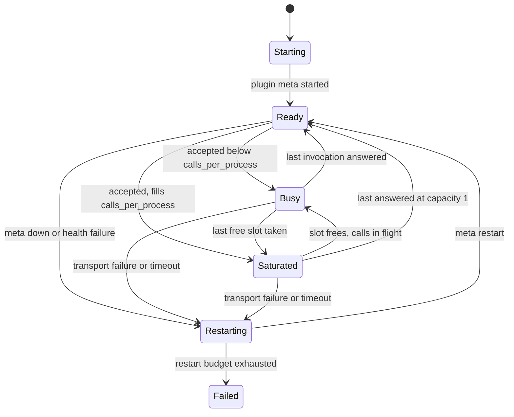
```mermaid
stateDiagram-v2
    [*] --> Starting
    Starting --> Ready: plugin meta started
    Ready --> Busy: accepted below calls_per_process
    Ready --> Saturated: accepted, fills calls_per_process
    Busy --> Saturated: last free slot taken
    Saturated --> Busy: slot frees, calls in flight
    Busy --> Ready: last invocation answered
    Saturated --> Ready: last answered at capacity 1
    Ready --> Restarting: meta down or health failure
    Busy --> Restarting: transport failure or timeout
    Saturated --> Restarting: transport failure or timeout
    Restarting --> Ready: meta restart
    Restarting --> Failed: restart budget exhausted
```

### Messages

| Message                                | Direction                   | Meaning                                                          |
| -------------------------------------- | --------------------------- | ---------------------------------------------------------------- |
| `MessageInvokePlugin`                  | manager → process           | Delivers one dispatched call to the owning process.              |
| `MessageInvocationStarted`             | process → manager           | Confirms acceptance, clears the dispatch deadline.               |
| `MessageInvocationFinished`            | process → manager           | Returns the one-shot invocation result.                          |
| `MessagePluginMetaRestart`             | process → process           | Token-fenced normal or health restart timer.                     |
| `MessagePluginMetaHealthTick`          | process → process           | Drives the next meta Ping attempt.                               |
| `MessagePluginMetaHealthTimeout`       | process → process           | Retires an unanswered meta health check.                         |
| `MessagePluginMetaInvokeTimeout`       | process → process           | Per-call backstop for an invocation the meta never answered.     |
| `MessagePluginMetaStartResult`         | meta → process              | Drives ready state or normal restart.                            |
| `MessagePluginMetaPing`                | process → meta              | Performs the parent-authorized health RPC.                       |
| `MessagePluginMetaPingResult`          | meta → process              | Drives health confirmation or health restart.                    |
| `gen.MessageDownAlias`                 | Ergo meta monitor → process | Retires the current meta, starts normal/health recovery.         |
| `MessagePluginProcessStatusChanged`    | process → manager           | Publishes lifecycle, availability, idle/busy/saturated activity. |
| `MessagePluginProcessStopped`          | process → manager           | Reports shutdown so its calls fail at once.                      |
| `MessagePluginProcessRestartExhausted` | process → manager           | Escalates exhausted local recovery for this process alone.       |
| `MessageStop`                          | manager → process           | Stops normally after retirement and its last call.               |
| `SendExitMeta`                         | process → Ergo meta runtime | Requests plugin-meta termination before recovery.                |
| `Terminate`                            | Ergo meta runtime → meta    | Invokes meta cleanup after the process's exit request.           |

### Readiness

Ready only when its current meta alias is ready. Lifecycle, availability, and idle/busy/saturated activity are distinct parts of one composite state.

`invoke` does not block: it reports `MessageInvocationStarted`, wraps the caller's context in the process's own `InvocationTimeout`, records the call in `p.calls`, and sends `pluginMetaInvoke` to the meta alias; the answer returns as `pluginMetaInvokeResult`. Each entry records a monotone `generation`, bumped when a new alias is adopted, so an answer from a replaced subprocess finds no live entry and is dropped.

Three things end a call:

- **Its answer.** On `recycle` the process reports itself unavailable to its manager first; the call reports its own failure and only its siblings inherit the generic `ErrProcessRecycle`. Retiring the meta reports the same unavailability, so `reportUnavailable` is idempotent.
- **A retired or DOWN meta.** `failGenerationCalls` fails those calls with `ErrProcessRecycle`.
- **`MessagePluginMetaInvokeTimeout`,** armed for the caller's remaining deadline plus `pluginMetaCancelGrace` plus a second of slack. It carries only the call id; a completed call is untracked and ids are never reused.

Shutdown cancels every in-flight call's context.

Capacity is the deployment's `calls_per_process`, `32` unless the artifact declared its own. Nothing here serializes invocations: `p.calls` holds every call in flight, each a message to the meta alias. One plugin object serves them all and gRPC gives every RPC its own goroutine, so plugins must be concurrency-safe; one that is not declares `calls_per_process: 1`. A call beyond capacity is refused with `ErrQueueFull`, the last check `invoke` makes after a dead context, a missing callback, unreadiness, and a duplicate call ID.

`refreshActivity` labels the process `saturated` once `len(p.calls)` reaches capacity, `busy` below that, `idle` at none, sampling `inFlight` and `capacity` on every change. At a declared capacity of one, busy never appears. Only a label change publishes a status; the counters ride along.

## Plugin meta

### Lifecycle

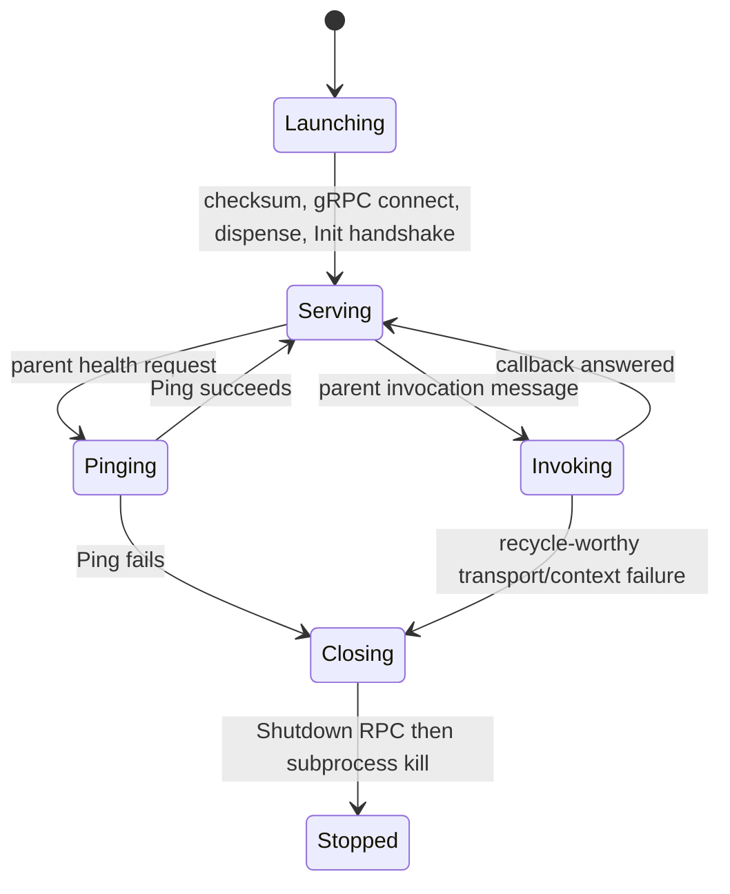
```mermaid
stateDiagram-v2
    [*] --> Launching
    Launching --> Serving: checksum, gRPC connect, dispense, Init handshake
    Serving --> Pinging: parent health request
    Pinging --> Serving: Ping succeeds
    Pinging --> Closing: Ping fails
    Serving --> Invoking: parent invocation message
    Invoking --> Serving: callback answered
    Invoking --> Closing: recycle-worthy transport/context failure
    Closing --> Stopped: Shutdown RPC then subprocess kill
```

### Messages

| Message                        | Direction                   | Meaning                                                               |
| ------------------------------ | --------------------------- | --------------------------------------------------------------------- |
| `MessagePluginMetaStartResult` | meta → process              | Checksum/handshake/session startup outcome for its alias.             |
| `MessagePluginMetaPing`        | process → meta              | Requests a parent-authorized health RPC.                              |
| `MessagePluginMetaPingResult`  | meta → process              | The alias-fenced Ping result.                                         |
| `pluginMetaInvoke`             | process → meta              | Parent-only callback invocation, blocking neither side.               |
| `pluginMetaInvokeResult`       | meta → process              | One call's result and whether the session must be recycled.           |
| `Shutdown`                     | meta → plugin RPC           | Bounded session shutdown before client kill.                          |
| `SendExitMeta`                 | process → Ergo meta runtime | Requests meta termination after a recycle-worthy failure or shutdown. |
| `Terminate`                    | Ergo meta runtime → meta    | Invokes session close after the process's exit request.               |

### Readiness

The meta verifies the artifact checksum before `exec.CommandContext`, requires the configured gRPC handshake, and runs `Init`. Only its parent plugin process may call or ping it. On close it sends `Shutdown` with a three-second bound, then kills the client. Plugin `Unavailable`, malformed responses, transport failures, and health failures retire the alias and enter bounded health recovery.

`classifyInvocation` recycles on `Unavailable`, and on `Canceled` or `DeadlineExceeded` only when the caller's own context is still live.

When the caller's context ends mid-callback, the meta waits out `pluginMetaCancelGrace` (one second) before deciding. The context the plugin sees carries the caller's deadline but not the grace. The owner arms an independent backstop timer past the grace, and substitutes the caller's reason only when the call returned nothing. An answer is sent to the owner before a fatal one closes the session.

## Invocation

### Lifecycle

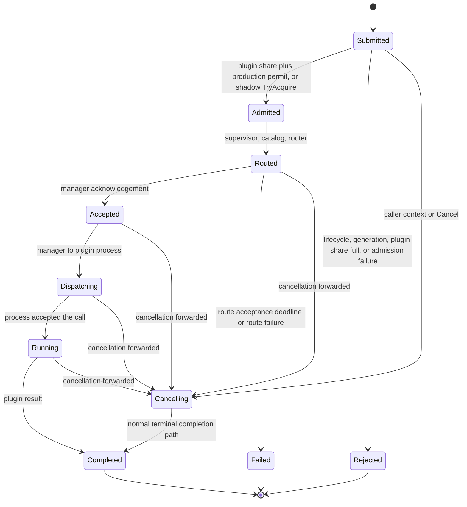
```mermaid
stateDiagram-v2
    [*] --> Submitted
    Submitted --> Admitted: plugin share plus production permit, or shadow TryAcquire
    Submitted --> Rejected: lifecycle, generation, plugin share full, or admission failure
    Admitted --> Routed: supervisor, catalog, router
    Routed --> Accepted: manager acknowledgement
    Routed --> Failed: route acceptance deadline or route failure
    Accepted --> Dispatching: manager to plugin process
    Dispatching --> Running: process accepted the call
    Running --> Completed: plugin result
    Submitted --> Cancelling: caller context or Cancel
    Routed --> Cancelling: cancellation forwarded
    Accepted --> Cancelling: cancellation forwarded
    Dispatching --> Cancelling: cancellation forwarded
    Running --> Cancelling: cancellation forwarded
    Cancelling --> Completed: normal terminal completion path
    Completed --> [*]
    Failed --> [*]
    Rejected --> [*]
```

### Messages

| Message                      | Direction                                                      | Meaning                                              |
| ---------------------------- | -------------------------------------------------------------- | ---------------------------------------------------- |
| `Submit`                     | caller → `plugin.Application`                                  | Acquires the blocking production permit.             |
| `SubmitShadow`               | caller → `plugin.Application`                                  | Uses the separate non-blocking shadow permit.        |
| `MessageSubmitInvocation`    | `plugin.Application` → supervisor                              | Enters an admitted invocation into the runtime tree. |
| `MessageInvokePlugin`        | supervisor → catalog → router → manager → process              | Carries the routed call to one plugin process.       |
| `MessageCancelInvocation`    | `plugin.Application` → supervisor → catalog → router → manager | Follows the fenced accepted/pending manager path.    |
| `MessageInvocationAccepted`  | manager → router                                               | Binds the routed call to its manager.                |
| `MessageInvocationStarted`   | process → manager                                              | Moves the call from dispatching to running.          |
| `MessageInvocationFinished`  | process → manager                                              | Returns the plugin invocation result.                |
| `MessageInvocationCompleted` | manager → router → catalog → supervisor                        | Completes the idempotent `runtime.AsyncResult` once. |

### Readiness

Submission requires a running application and a runtime whose expected generation is exactly ready and committed; draining or a desired-state barrier rejects it as unavailable. Every terminal path enters the idempotent `runtime.AsyncResult`, and `Invocation` closes `Done` only when that result completes.

Call IDs bind one supervisor, catalog, router, manager, and plugin-process path. PID/alias plus generation/epoch checks reject stale completion, status, and recovery facts. The manager accepts an invocation fact only from the process it dispatched that call to.

## Telemetry

Every layer publishes into the node's radar application, labelled by `namespace`: the controller namespace this runtime follows, the same value the controller's and snapshot subtree's series carry. The plumbing is `internal/runtime/telemetry`, shared with the controller and snapshot runtimes; only names and specs live here.

| Layer              | Registers       | Publishes through | Notes                                                                                                        |
| ------------------ | --------------- | ----------------- | ------------------------------------------------------------------------------------------------------------ |
| Runtime Supervisor | every collector | itself            | Registers through `gen.Node`; publishes every gauge.                                                         |
| Reconciler Actor   | -               | itself            | Resolution outcomes, retries, artifact meta restarts; carries a copy of the supervisor's `telemetry.Labels`. |
| Catalog Actor      | -               | itself            | Router starts, restarts, terminations.                                                                       |
| Router Actor       | -               | itself            | Rollout target per invocation; calls with no route or no manager acknowledgement.                            |
| Deployment Manager | -               | itself            | Queue rejects, dispatch timeouts, process churn, circuit opens, scaling, invocation histogram.               |

| Metric                                                                                                                                                                                          | Published by       | Meaning                                                                                                                                         |
| ----------------------------------------------------------------------------------------------------------------------------------------------------------------------------------------------- | ------------------ | ----------------------------------------------------------------------------------------------------------------------------------------------- |
| `blink_plugin_supervisor_lifecycle`, `blink_plugin_availability`, `blink_plugin_transition`                                                                                                     | runtime supervisor | 0 starting / 1 running / 2 draining; 0 unavailable / 1 degraded / 2 ready; 0 idle / 1 preparing / 2 awaiting freshness / 3 awaiting projection. |
| `blink_plugin_desired_revision`, `blink_plugin_projection_ready_generation`, `blink_plugin_projection_committed_generation`                                                                     | runtime supervisor | Revision being moved to; generation calls are admitted against; generation the snapshot subtree was asked to commit.                            |
| `blink_plugin_in_flight_calls`, `blink_plugin_invocations_total{result}`, `blink_plugin_invocations_rejected_total{reason}`                                                                     | runtime supervisor | Calls a transition waits on; completions by result; admissions refused as `closed` or `context`.                                                |
| `blink_plugin_reconciler_availability`, `blink_plugin_reconciler_generation`, `blink_plugin_reconciler_revision`, `blink_plugin_catalog_availability`                                           | runtime supervisor | Each child's own readiness, and how far the reconciler has resolved.                                                                            |
| `blink_plugin_routers_desired`, `blink_plugin_routers_routable`, `blink_plugin_routers_settled`, `blink_plugin_routers_unavailable`                                                             | runtime supervisor | Plugins the revision asks for, against routers accepting work, done moving, and serving nothing.                                                |
| `blink_plugin_processes_ready`, `blink_plugin_processes_desired`, `blink_plugin_queue_depth`, `blink_plugin_active_calls`                                                                       | runtime supervisor | Summed over every route on both sides of a rollout.                                                                                             |
| `blink_plugin_projection_commits_total{result}`, `blink_plugin_desired_state_promotions_total`, `blink_plugin_child_starts_total{child}`, `blink_plugin_child_terminations_total{child,reason}` | runtime supervisor | Commit requests; revisions promoted into the catalog; snapshot/reconciler/catalog churn.                                                        |
| `blink_plugin_resolutions_total{result}`, `blink_plugin_resolution_retries_total`, `blink_plugin_artifact_worker_restarts_total{worker}`                                                        | reconciler actor   | Result is `proposed`, `unchanged`, `deferred`, or `stale`; retries are deferred ones returning; workers are `resolver` and `watcher`.           |
| `blink_plugin_router_starts_total`, `blink_plugin_router_restarts_total`, `blink_plugin_router_terminations_total{reason}`                                                                      | catalog actor      | Router incarnations spawned, replacements after a loss, exits by reason.                                                                        |
| `blink_plugin_routed_total{target}`, `blink_plugin_unroutable_total`, `blink_plugin_acceptance_timeouts_total`                                                                                  | router actor       | Rollout decision `primary`, `candidate`, or `shadow`; calls with no active route; routed calls no manager acknowledged.                         |
| `blink_plugin_queue_rejects_total`, `blink_plugin_dispatch_timeouts_total`, `blink_plugin_circuit_opens_total`, `blink_plugin_scale_events_total{direction}`                                    | deployment manager | Full queue; dispatch no process started; spent restart budget; autoscaling `up` or `down`.                                                      |
| `blink_plugin_process_starts_total`, `blink_plugin_process_restarts_total`, `blink_plugin_process_terminations_total{reason}`                                                                   | deployment manager | Plugin process churn against the slot retry budget the circuit opens on.                                                                        |
| `blink_plugin_invocation_seconds`                                                                                                                                                               | deployment manager | Accept to completion, queueing included. A rejected call was never accepted, so it contributes no sample.                                       |

`MessageRadarTick` drives registration: sent to itself from `Init`, then retried every `telemetry.RadarTickInterval` (30 s) until radar accepts the collectors. Registration goes through `gen.Node` because radar deletes a dead registrant's metrics, and the supervisor monitors `radar_metrics` so a radar restart re-registers on the next tick.

Emission is best-effort. An unreachable radar produces a discarded `Send` error, and a zero `telemetry.Labels` stays silent, since a mismatched label count panics radar's metrics actor. Counters increment only once the named operation happened. Gauges are republished on every supervisor state change and on the radar tick.

## Source references

- [`internal/runtime/plugin/runtime_application.go`](../../internal/runtime/plugin/runtime_application.go) - application lifecycle, admission, State, submit, completion.
- [`internal/runtime/plugin/runtime_supervisor.go`](../../internal/runtime/plugin/runtime_supervisor.go) - RestForOne tree, desired-state barrier, projection commit, drain.
- [`internal/runtime/plugin/reconciler_actor.go`](../../internal/runtime/plugin/reconciler_actor.go), [`artifact_resolver_meta.go`](../../internal/runtime/plugin/artifact_resolver_meta.go), [`artifact_watcher_meta.go`](../../internal/runtime/plugin/artifact_watcher_meta.go) - desired state and local artifact facts.
- [`internal/runtime/plugin/catalog_actor.go`](../../internal/runtime/plugin/catalog_actor.go), [`router_actor.go`](../../internal/runtime/plugin/router_actor.go) - router ownership, route lifecycle, rollout, fences.
- [`internal/runtime/plugin/deployment_manager.go`](../../internal/runtime/plugin/deployment_manager.go), [`process_budget.go`](../../internal/runtime/plugin/process_budget.go), [`plugin_process.go`](../../internal/runtime/plugin/plugin_process.go), [`plugin_process_meta.go`](../../internal/runtime/plugin/plugin_process_meta.go) - queue, dispatch, plugin processes, subprocess, recovery, drain.
- [`internal/runtime/invocation.go`](../../internal/runtime/invocation.go), [`internal/runtime/backoff.go`](../../internal/runtime/backoff.go) - one-shot completion and shared scheduled backoff.
- [`internal/runtime/plugin/metrics.go`](../../internal/runtime/plugin/metrics.go), [`internal/runtime/telemetry/metrics.go`](../../internal/runtime/telemetry/metrics.go) - the `blink_plugin_*` specs and gauge publishing.
- [`internal/runtime/plugin/defaults.go`](../../internal/runtime/plugin/defaults.go) - namespace-derived subtree names and the option defaults every layer is sized by.
