# Plugin Runtime

`internal/runtime/plugin` owns local plugin deployment, not an executor or a process pool. One `plugin.Application[P,M]` bridges callers to one runtime supervisor on the process-owned Ergo node. Dynamic deployment routes are a router mechanism, **not supervisors**. Snapshot, reconciler, and catalog are supervisor children; routers, routes, and managers are dynamically created; plugin processes are manager-spawned and manager-monitored; metas are actor-spawned. Only the declared runtime and snapshot supervisor trees have supervisor semantics.

There is no actor pool between a manager and its plugin processes. A pool is the right abstraction only while one pooled process is one unit of work capacity, and a plugin process advertises its own `calls_per_process` instead, so the manager schedules against advertised capacity rather than against a count of interchangeable slots.

## Composition

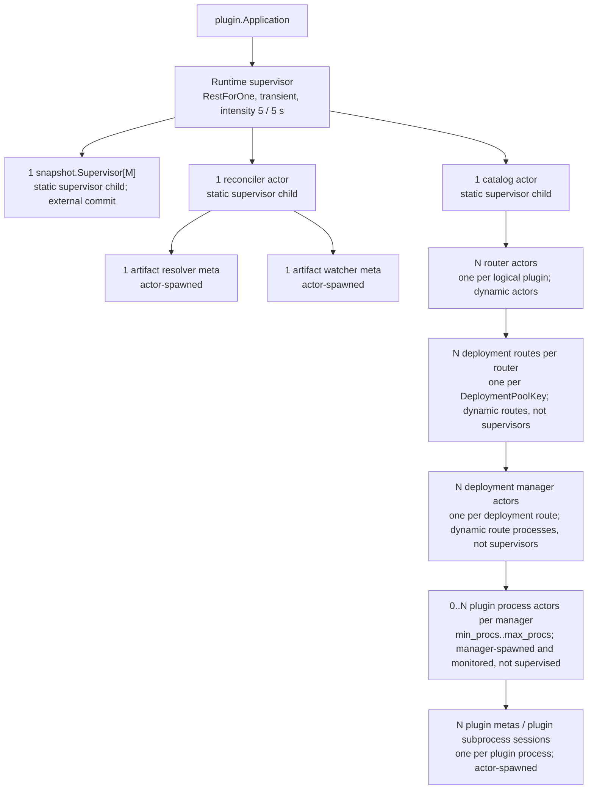

The runtime supervisor's RestForOne child order is snapshot, reconciler, catalog. A prior child restart restarts later children. It is transient, has intensity 5 in 5 seconds, handles child lifecycle itself, and does not auto-shutdown. The snapshot subtree's policy is documented in [snapshot-runtime.md](snapshot-runtime.md).

## Messages

| Message                     | Direction                                                                               | Meaning                                                                                        |
| --------------------------- | --------------------------------------------------------------------------------------- | ---------------------------------------------------------------------------------------------- |
| Admission and invocation    | caller → application → runtime supervisor → catalog → router → manager → plugin process | Carries an admitted production or shadow invocation to one plugin process.                     |
| Desired-state promotion     | reconciler → runtime supervisor → catalog → router                                      | Moves a resolved desired revision through the drain, freshness, and projection-commit barrier. |
| Status and readiness        | child/meta/plugin process → parent owner                                                | Aggregates fenced lifecycle, activity, and availability facts upward.                          |
| Drain                       | application → runtime supervisor → catalog → router → manager                           | Stops admission and drains dynamically owned work from the top down.                           |
| Completion and cancellation | plugin process → manager → runtime supervisor; application → runtime supervisor         | Completes one result idempotently or follows the fenced accepted/pending path to cancel it.    |

## Roles

| Role                   | Default name or identity                             | Owner                  | Responsibility                                                                        |
| ---------------------- | ---------------------------------------------------- | ---------------------- | ------------------------------------------------------------------------------------- |
| Plugin Application     | `<runtime-name>-application` application name        | Ergo application group | Caller lifecycle, production/shadow admission, and async-result ownership.            |
| Runtime Supervisor     | configured `<runtime-name>` (registered)             | Plugin Application     | Coordinates snapshot, reconciler, catalog, desired-state promotion, and drain.        |
| Snapshot Supervisor    | configured `<runtime-name>-snapshot` (registered)    | Runtime Supervisor     | Supplies reader/projection state with external projection commit.                     |
| Reconciler Actor       | `<runtime-name>-desired-state-reconciler` child name | Runtime Supervisor     | Resolves snapshot and local artifacts into desired router state.                      |
| Artifact Resolver Meta | dynamic `gen.Alias`                                  | Reconciler Actor       | Resolves locally valid artifacts and desired routes.                                  |
| Artifact Watcher Meta  | dynamic `gen.Alias`                                  | Reconciler Actor       | Reports artifact-directory watch/poll drift.                                          |
| Catalog Actor          | `<runtime-name>-catalog` child name                  | Runtime Supervisor     | Owns router incarnations and aggregates router status.                                |
| Router Actor           | dynamic PID/generation/epoch per plugin              | Catalog Actor          | Selects rollout routes and owns dynamic deployment routes.                            |
| Deployment Route       | stable SHA-256-derived atom per `DeploymentPoolKey`  | Router Actor           | Creates, respawns, drains, and removes one manager route.                             |
| Deployment Manager     | dynamic route process PID                            | Deployment Route       | Owns bounded queueing, capacity-aware dispatch, scaling, process recovery, and drain. |
| Plugin Process         | dynamic linked-and-monitored actor PID               | Deployment Manager     | Serves up to `calls_per_process` invocations and recovers its plugin session.         |
| Plugin Meta            | dynamic `gen.Alias`                                  | Plugin Process         | Owns one plugin subprocess and RPC session.                                           |
| Invocation             | `callID` and one `runtime.Invocation` handle         | caller                 | Its `AsyncResult` remains owned by the application/runtime tree.                      |

The runtime and snapshot supervisors are registered; all remaining listed names are child or dynamic identities.

## Readiness

The runtime admits work only when its expected projection generation is ready and committed, the desired-state barrier is idle, and the application is running.

The supervisor is ready only when projection and catalog generations/revisions agree, catalog and projection are routable, and it is not draining. Catalog routability rather than catalog readiness is deliberate: one dead plugin must not withhold state from callers invoking the healthy ones, and per-call admission rejects the dead route with `ErrPluginUnavailable` anyway. During a transition/drain or when projection/catalog is missing, runtime availability is unavailable; it is degraded when dependencies exist but are not all ready. Component readiness below contributes to this operational/composite state rather than defining extra lifecycle constants.

## Plugin Application

### Lifecycle

The application is single-use: `New → Running → Stopping → Terminated`. `Start` marks it running only after registered-supervisor lookup succeeds.
`Terminate` completes pending calls with `ErrRuntimeStopped`, or `ErrPluginUnavailable` when already stopping.

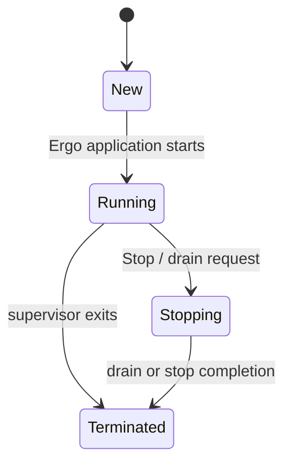

### Messages

| Message        | Direction                                         | Meaning                                                                                            |
| -------------- | ------------------------------------------------- | -------------------------------------------------------------------------------------------------- |
| `Start`        | Ergo application lifecycle → `plugin.Application` | Starts the single-use application after Ergo starts its group and finds its registered supervisor. |
| `Stop`         | Ergo application lifecycle → `plugin.Application` | Closes admission and begins runtime drain within Ergo's stop deadline.                             |
| `DrainRequest` | `plugin.Application` → runtime supervisor         | Requests bounded graceful drain.                                                                   |
| `Terminate`    | Ergo application lifecycle → `plugin.Application` | Completes pending calls with `ErrRuntimeStopped`, or `ErrPluginUnavailable` when already stopping. |

### Readiness

`Start` marks the application running only after lookup of its registered supervisor succeeds. Production `Submit` first reserves the plugin's own share of the budget, `MaxOutstandingInvocationsPerPlugin`, rejecting with `ErrQueueFull` when that share is full, and only then acquires the application-wide blocking `MaxOutstandingInvocations` permit, which includes queue waiters. The per-plugin share is what stops one saturated plugin - a stalled deployment holding its whole queue plus its plugin processes - from consuming the shared budget and blocking every other plugin's caller until that caller's own deadline expires; it fails its own calls fast instead. `SubmitShadow` uses a separate non-blocking budget and returns `ErrShadowDropped` when full.

Because that share rejects rather than waits, it must cover the widest fan-out one caller batch can legitimately produce, times the batches the caller runs at once, so the budgets are derived from `MaxBatchSize` and `MaxConcurrentCalls` rather than fixed. One call is at most `MaxDeploymentProcs + 1` invocations - a shard per plugin process, plus the one more an uneven two-way rollout split costs - or the batch's own event count, since a shard needs an event to carry, so the per-plugin share defaults to `min(MaxBatchSize, MaxDeploymentProcs+1) * MaxConcurrentCalls` and a caller that declares no `MaxBatchSize` is sized for the widest `max_procs` a deployment may legally declare rather than for an assumed event count it may exceed. Both bounds are properties of the call rather than of the rollout shape, so the share tracks a fan-out the caller can actually reach at every batch size. The shared budget cannot be derived the same way, because nothing here knows how many plugins a batch touches; it only blocks, so it is a process-wide ceiling of `perPlugin * MaxConcurrentCalls` - a smaller one would serialise batches that the caller has already bounded - and the shadow budget a sixteenth of it. The deployment manager's `QueueSize` default rises with the per-plugin share, since one plugin's whole fan-out lands on one manager and everything past its running capacity waits in its queue; a smaller queue would only move the same `ErrQueueFull` one layer down. A service that raises its batch size or concurrency therefore raises these budgets by passing both; explicitly set budgets are always left alone, and a shared budget too small for one fan-out simply gives a single plugin all of it, because the per-plugin share isolates plugins from each other rather than rejecting a caller's own batch. These budgets bound calls, which are cheap to hold; the separate `ProcessBudget` described under Deployment Manager bounds the subprocesses that serve them, which is why it is sized from CPUs instead of from the batch. [concurrency-knobs.md](concurrency-knobs.md) tabulates these budgets against every other knob that moves call counts.

## Runtime Supervisor

### Lifecycle

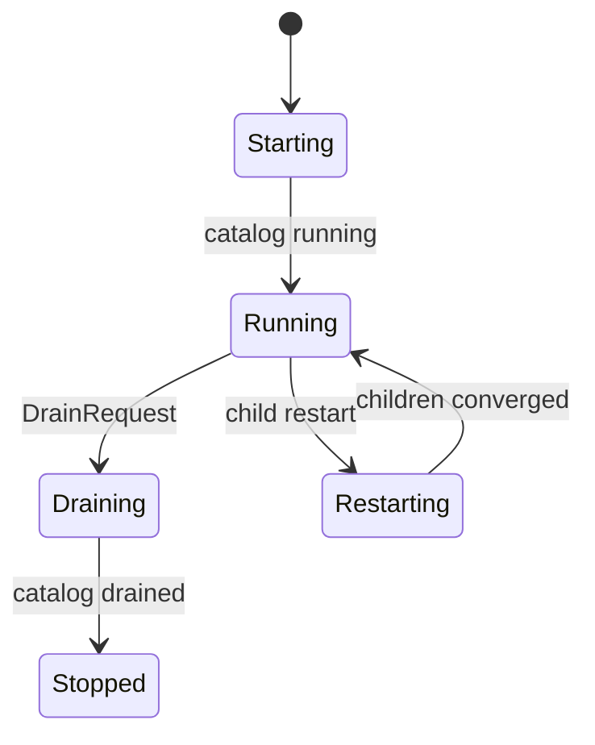

### Messages

| Message                                        | Direction                                    | Meaning                                                                                   |
| ---------------------------------------------- | -------------------------------------------- | ----------------------------------------------------------------------------------------- |
| `MessageCatalogActivate`                       | runtime supervisor → catalog                 | Permits catalog status publication after child setup.                                     |
| `DrainRequest`                                 | application → runtime supervisor             | Starts the runtime's downward drain.                                                      |
| `MessageDrain`                                 | runtime supervisor → catalog                 | Drains the catalog after admission closes.                                                |
| `SupervisorStatusRequest`                      | `plugin.Application` → runtime supervisor    | Reads the availability/status snapshot.                                                   |
| `SupervisorStateRequest`                       | `plugin.Application` → runtime supervisor    | Reads the ready generation used for admission.                                            |
| `HandleChildStart`                             | Ergo supervisor runtime → runtime supervisor | Records each snapshot, reconciler, or catalog child incarnation and activates/replays it. |
| `HandleChildTerminate`                         | Ergo supervisor runtime → runtime supervisor | Retires a child incarnation and recomputes runtime availability.                          |
| `MessageReconcilerActorStatusChanged`          | reconciler → runtime supervisor              | Updates reconciler readiness and transition state.                                        |
| `MessageCatalogStatusChanged`                  | catalog → runtime supervisor                 | Updates catalog revision/readiness and completes transition checks.                       |
| `MessageCatalogDrained`                        | catalog → runtime supervisor                 | Completes drain waiters and terminates the runtime after calls are failed.                |
| `snapshot.MessageProjectionActorStatusChanged` | snapshot supervisor → runtime supervisor     | Updates committed/ready projection state for the external-commit subtree.                 |
| `MessageProjectionCommitRetry`                 | runtime supervisor → runtime supervisor      | Token-fenced deferred projection-commit retry.                                            |
| `MessageProjectionCommitDeadline`              | runtime supervisor → runtime supervisor      | Token-, PID-, and generation-fenced pending projection-commit expiry.                     |

### Readiness

The supervisor accepts `SupervisorStatusRequest` and `SupervisorStateRequest`. Its exact state reader requires a nonzero ready generation equal to the committed generation, a routable committed projection, matching desired snapshot generation and catalog revision, a routable catalog, an idle transition, and a non-draining lifecycle. After Catalog reports drained, the supervisor fails remaining calls, answers drain waiters, and terminates. The subtree uses independent finite retry domains; cancelling a scheduled retry invalidates its token.

## Desired-State Transition

### Lifecycle

The reconciler proposes a monotonic desired revision only after artifact resolution is complete and non-deferred. The supervisor holds a newer proposal until tracked invocations drain, applies it to the catalog, asks the reconciler to confirm freshness, then externally commits the matching projection generation.

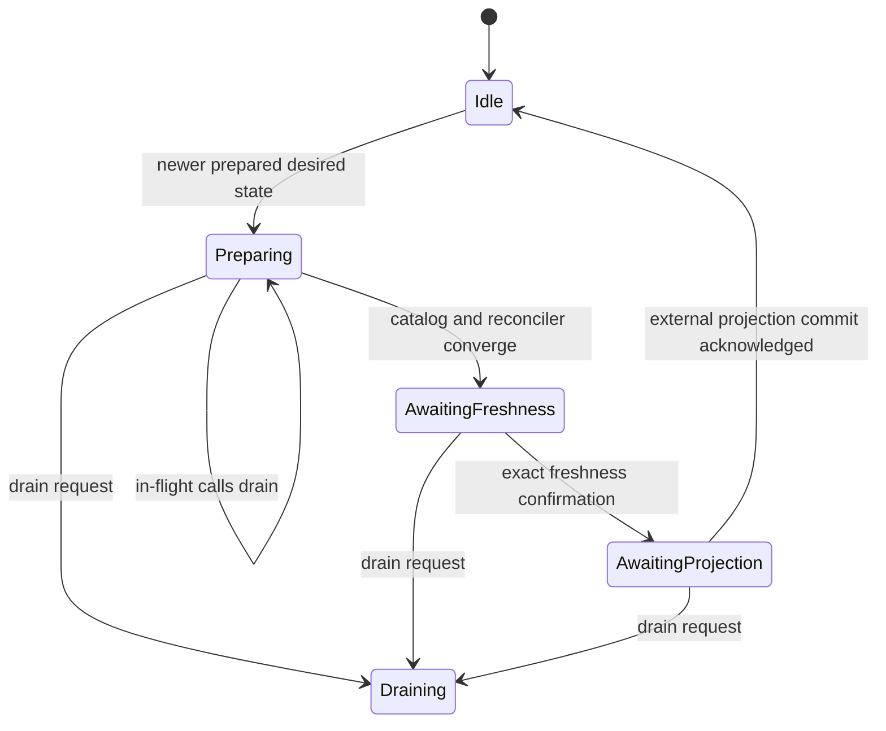

### Messages

| Message                           | Direction                                | Meaning                                                                   |
| --------------------------------- | ---------------------------------------- | ------------------------------------------------------------------------- |
| `MessageProposeDesiredState`      | reconciler → runtime supervisor          | Offers a resolved, monotonic desired revision.                            |
| `MessageApplyCatalogDesiredState` | runtime supervisor → catalog             | Applies the revision after tracked calls drain.                           |
| `MessageDesiredStateFreshness`    | runtime supervisor → reconciler          | Challenges the proposed generation/revision after catalog convergence.    |
| `MessageDesiredStateFreshness`    | reconciler → runtime supervisor          | Confirms the exact generation/revision remains current and locally ready. |
| `MessageProjectionCommit`         | runtime supervisor → snapshot supervisor | Requests external commit of the matching projection generation.           |
| `MessageProjectionCommitResult`   | snapshot supervisor → runtime supervisor | Acknowledges the PID/generation-fenced projection commit.                 |

### Readiness

Admission reopens only after projection, reconciler, catalog, generation, and revision agree. This is transition/admission readiness, not an additional lifecycle enum.

The catalog side of that barrier is convergence, not aggregate health: every router must report the desired revision and be either ready or terminally failed (its deployment circuit open). A router still starting or restarting holds the transition until it resolves either way, but a plugin whose restart budget is spent never becomes healthy on its own, so gating on aggregate readiness would let one broken deployment freeze every later generation.

## Reconciler Actor

### Lifecycle

The reconciler monitors the snapshot subtree's buffered snapshot/status events, starts resolver and watcher metas, and coalesces snapshot/filesystem changes.

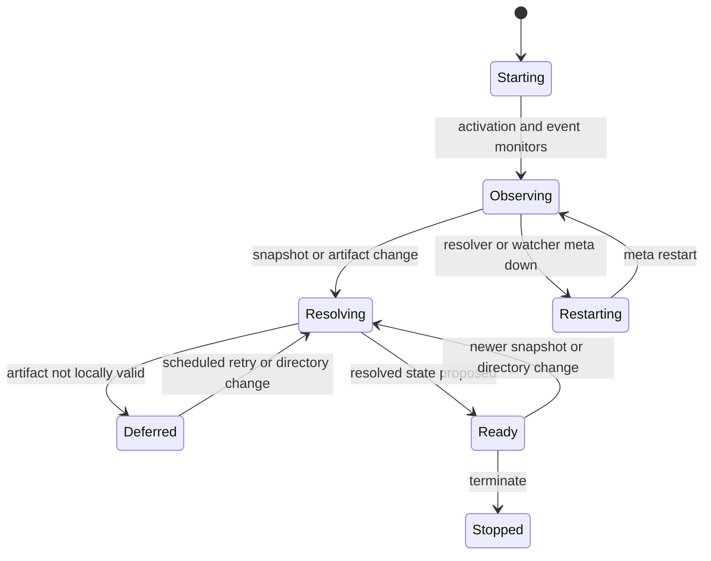

### Messages

| Message                               | Direction                                          | Meaning                                                                         |
| ------------------------------------- | -------------------------------------------------- | ------------------------------------------------------------------------------- |
| `MessageReconcilerActorActivate`      | runtime supervisor → reconciler                    | Activates event monitoring and sets the revision base.                          |
| `MessageResolveArtifacts`             | reconciler → artifact resolver meta                | Requests resolution for the current snapshot.                                   |
| `MessageArtifactResolutionResult`     | artifact resolver meta → reconciler                | Returns alias-, generation-, and dirtiness-fenced desired routes.               |
| `MessageArtifactDirectoryChanged`     | artifact watcher meta → reconciler                 | Marks artifact state dirty and triggers resolution.                             |
| `MessageResolutionRetry`              | reconciler → reconciler                            | Token-fenced retry timer for deferred or failed resolution.                     |
| `MessageArtifactResolverMetaRestart`  | reconciler → reconciler                            | Token-fenced timer that restarts the resolver meta.                             |
| `MessageArtifactWatcherMetaRestart`   | reconciler → reconciler                            | Token-fenced timer that restarts the watcher meta.                              |
| `gen.MessageEvent`                    | snapshot supervisor event → reconciler             | Buffered and live snapshot/reader-status events drive resolution and readiness. |
| `gen.MessageDownAlias`                | Ergo meta monitor → reconciler                     | Marks the resolver or watcher unavailable and schedules its restart.            |
| `MessageReconcilerActorStatusChanged` | reconciler → runtime supervisor                    | Publishes reconciler lifecycle, availability, generation, and revision.         |
| `SendExitMeta`                        | reconciler → Ergo meta runtime                     | Requests resolver/watcher meta termination during replacement or shutdown.      |
| `Terminate`                           | Ergo meta runtime → artifact resolver/watcher meta | Invokes meta cleanup after the parent's exit request.                           |

### Readiness

Resolver and watcher facts are fenced by meta alias. Resolution results are also fenced by snapshot generation and discarded when a newer filesystem or snapshot change made them dirty. Resolver, watcher, and resolution retries use separate shared scheduled-backoff instances; retry timers carry tokens. Exhaustion is an actor failure, not an unbounded loop.

## Artifact Resolver Meta

### Lifecycle

The resolver has a one-slot job channel. It validates local names/specs, enabled state, and SHA-256 before producing desired primary/candidate routes.

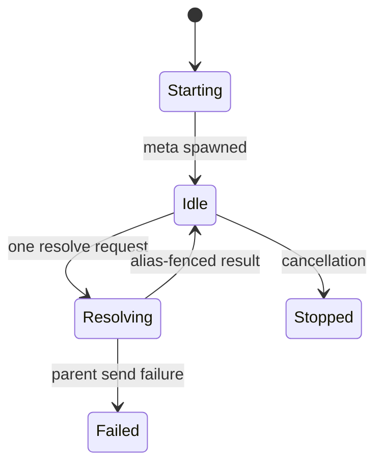

### Messages

| Message                           | Direction                                  | Meaning                                                        |
| --------------------------------- | ------------------------------------------ | -------------------------------------------------------------- |
| `MessageResolveArtifacts`         | reconciler → artifact resolver meta        | Supplies the snapshot to resolve.                              |
| `MessageArtifactResolutionResult` | artifact resolver meta → reconciler        | Returns resolved/deferred route candidates for its meta alias. |
| `SendExitMeta`                    | reconciler → Ergo meta runtime             | Requests termination of the resolver meta.                     |
| `Terminate`                       | Ergo meta runtime → artifact resolver meta | Invokes cleanup for the resolver's one-slot worker.            |

### Readiness

Invalid or absent artifacts are deferred, not deployed. A successful alias-fenced result makes the current resolver meta ready for the reconciler's freshness check.

## Artifact Watcher Meta

### Lifecycle

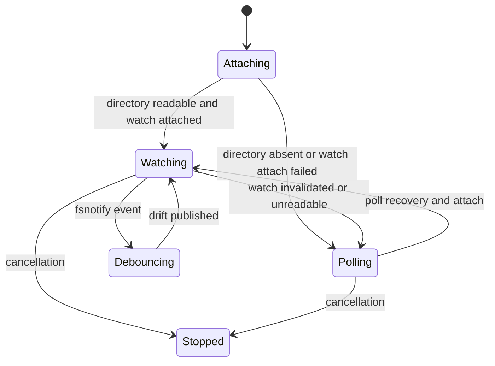

### Messages

| Message                              | Direction                                 | Meaning                                                 |
| ------------------------------------ | ----------------------------------------- | ------------------------------------------------------- |
| `MessageArtifactDirectoryChanged`    | artifact watcher meta → reconciler        | Reports a debounced filesystem or poll-detected change. |
| `MessageArtifactWatcherStateChanged` | artifact watcher meta → reconciler        | Reports watch/poll availability and drift state.        |
| `SendExitMeta`                       | reconciler → Ergo meta runtime            | Requests termination of the watcher meta.               |
| `Terminate`                          | Ergo meta runtime → artifact watcher meta | Invokes cleanup for fsnotify and polling.               |

### Readiness

The watcher combines fsnotify with a five-second metadata-fingerprint poll and 300 ms notification debounce. A missing or unreadable directory is drift: it reports state and continues polling rather than terminating. The resolver is the authority for content checksum, not the watcher fingerprint.

## Catalog Actor

### Lifecycle

Catalog activation enables status publication. It applies only nondecreasing desired revisions, dynamically creates one router incarnation per logical plugin ID, marks removed routers retiring, drains them, and removes their state.

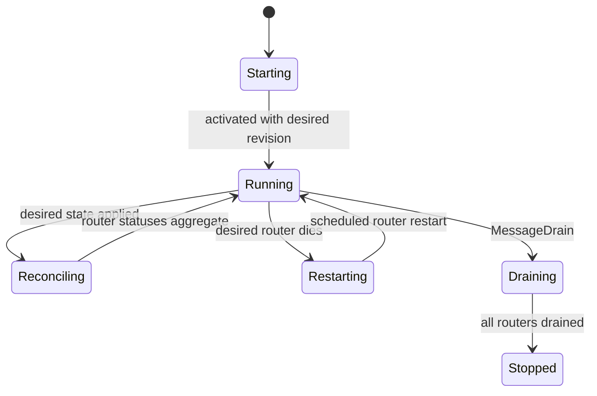

### Messages

| Message                           | Direction                    | Meaning                                                                |
| --------------------------------- | ---------------------------- | ---------------------------------------------------------------------- |
| `MessageCatalogActivate`          | runtime supervisor → catalog | Enables catalog status publication.                                    |
| `MessageApplyCatalogDesiredState` | runtime supervisor → catalog | Adds, updates, retires, or drains logical-plugin routers.              |
| `gen.MessageDownPID`              | Ergo monitor → catalog       | Reports a router incarnation death for PID/generation fencing.         |
| `MessageRouterRestart`            | catalog → catalog            | Token-fenced timer that retries creating a desired router.             |
| `MessageDrain`                    | runtime supervisor → catalog | Retires/drains every live router and suppresses restart.               |
| `MessageRouterStatusChanged`      | router → catalog             | Updates the PID/generation/epoch-fenced router aggregate.              |
| `MessageRouterDrained`            | router → catalog             | Retires a draining router and advances catalog drain/replacement work. |
| `MessageCatalogStatusChanged`     | catalog → runtime supervisor | Publishes the epoch-ordered aggregate catalog state.                   |
| `MessageCatalogDrained`           | catalog → runtime supervisor | Reports that every live router has drained.                            |

### Readiness

Router facts are accepted only from the current PID, generation, and increasing epoch. PID identifies the live process, generation identifies the Catalog-created incarnation, and epoch orders that incarnation's status facts, so late messages cannot revive or overwrite a replacement. On router loss, Catalog fails calls assigned to that PID and uses token-fenced `MessageRouterRestart` for a non-retiring desired router; draining suppresses restart.

## Router Actor

### Lifecycle

Each router dynamically creates primary, canary, and shadow deployment routes from its desired state. A normal production call uses primary unless its rollout bucket selects an active canary; `SubmitShadow` independently makes best-effort fan-out only to an active shadow candidate, so a full shadow budget never consumes production capacity. Callers gate their own submissions on `ProjectionData.RolloutByID[id].Shadow`, so a plugin with no shadow candidate never clones a batch for a call the router would discard as unroutable. The same entry's `HasCandidate` and `Shadow` gate the rollout split itself for the same reason: a batch only has to be cut where its routing decision changes, so a plugin with no canary candidate takes its whole batch as one group, and one with a canary is cut in two - the buckets the candidate wins and the rest - rather than once per bucket, since the router re-derives the decision from the one rollout key the call carries. A candidate appearing mid-batch moves the committed generation, and calls from a retired generation are rejected so the caller re-resolves against fresh state, which is what makes that collapse safe.

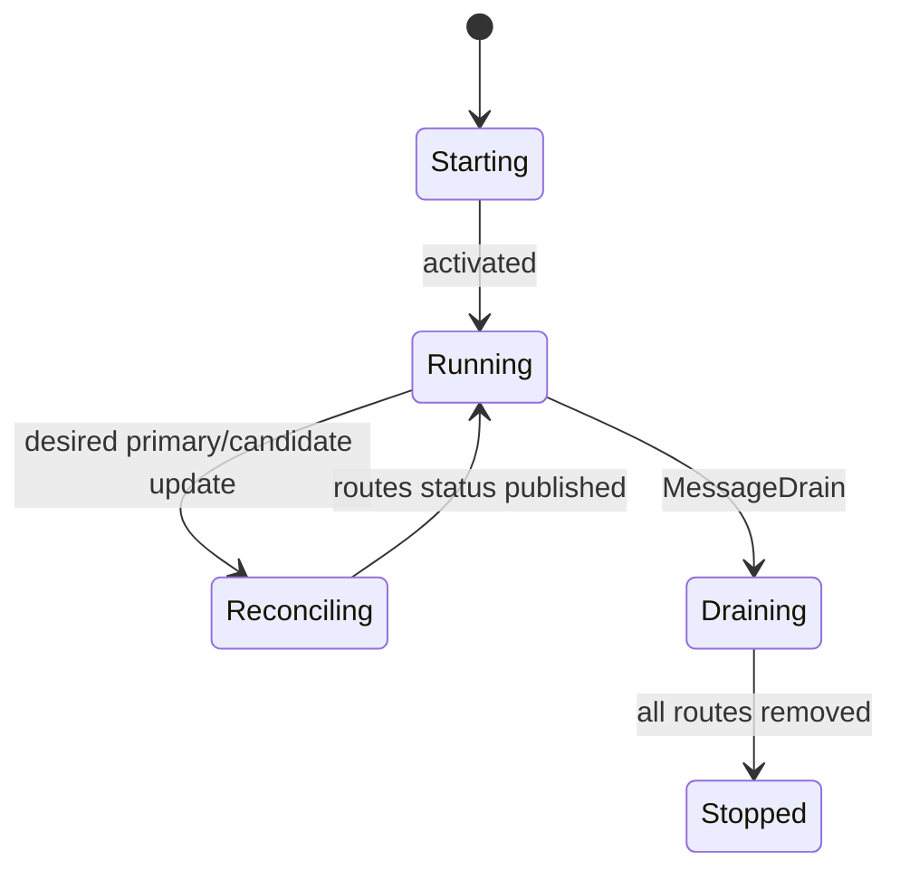

### Messages

| Message                                 | Direction                   | Meaning                                                             |
| --------------------------------------- | --------------------------- | ------------------------------------------------------------------- |
| `MessageRouterActivate`                 | catalog → router            | Fences the new router incarnation with its Catalog generation.      |
| `MessageApplyRouterDesiredState`        | catalog → router            | Creates/updates primary, canary, and shadow route intent.           |
| `MessageInvokePlugin`                   | catalog → router            | Routes production or shadow work to an eligible deployment route.   |
| `MessageInvocationTimedOut`             | router → router             | Expires an unacknowledged route acceptance.                         |
| `MessageDrain`                          | catalog → router            | Drains and removes all deployment routes.                           |
| `MessageDeploymentManagerStatusChanged` | deployment manager → router | Updates a live route's manager status and active rollout selection. |
| `MessageDeploymentManagerDrained`       | deployment manager → router | Permits removal of a draining route.                                |
| `MessageDeploymentManagerTerminated`    | deployment manager → router | Fences manager loss and schedules an active-route recovery step.    |
| `MessageRouterStatusChanged`            | router → catalog            | Publishes router availability, rollout, and route state.            |
| `MessageRouterDrained`                  | router → catalog            | Reports that all routes were removed during drain.                  |

### Readiness

The router records an acceptance deadline before routing. A manager must acknowledge the call; unaccepted, route-failed, stale, or timed-out calls complete as unavailable. Cancellation goes to the accepted manager, or the current route manager while acknowledgement is pending.

## Deployment Route

### Lifecycle

A route has a stable SHA-256-derived atom for one concrete `DeploymentPoolKey`; it is a dynamic router route, not a supervisor. Route status,
acceptance, and termination are accepted only from the live manager PID; known past manager PIDs are retained solely to fence late termination facts.

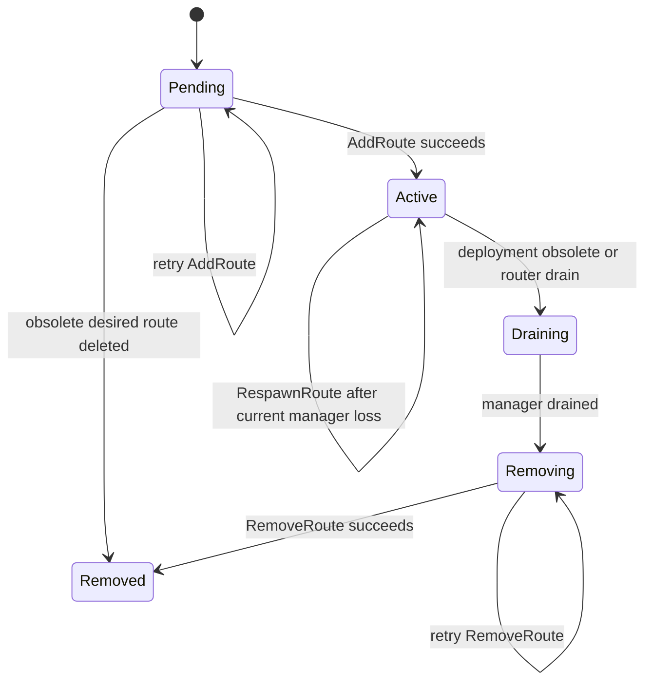

### Messages

| Message                                 | Direction                   | Meaning                                                                             |
| --------------------------------------- | --------------------------- | ----------------------------------------------------------------------------------- |
| `AddRoute`                              | router → `act.Router`       | Registers the stable route atom and starts its manager factory.                     |
| `MessageRetryRouteStep`                 | router → router             | Token-fenced retry for `AddRoute`, manager respawn, drain, or removal.              |
| `MessageDeploymentManagerStatusChanged` | deployment manager → router | Drives active-route readiness and router status.                                    |
| `MessageDeploymentManagerTerminated`    | manager → router            | Fences manager loss and schedules route recovery.                                   |
| `RespawnRoute`                          | router → `act.Router`       | Recreates the manager only after the active-route retry step, or to finish a drain. |
| `MessageDeploymentManagerDrained`       | manager → router            | Permits route removal after graceful manager drain.                                 |
| `RemoveRoute`                           | router → `act.Router`       | Removes the drained route; failures retry.                                          |

### Readiness

`AddRoute`, `RespawnRoute`, and `RemoveRoute` each retry through the route's independent `MessageRetryRouteStep` backoff. A pending route made
obsolete is deleted directly. On active-manager loss, the retry timer runs before `RespawnRoute`; draining with no live manager respawns a draining manager to complete the normal drain protocol.

## Deployment Manager

### Lifecycle

The manager validates `0 <= MinProcs <= max(1, MaxProcs) <= 100` and `MaxConcurrentCallsPerProcess <= MaxDeploymentCallsPerProcess` (64), then clamps
the declared per-process capacity to `supportedCallsPerProcess` - what one process really serves, 1 today - and warns when the two differ, so an
operator learns a declared 16 is not running from a log rather than from throughput that never arrives. It accepts an invocation before queue admission
so the router can bind its completion path, then rejects draining/open-circuit calls and a full pending queue with `ErrQueueFull`. Queue depth is
bounded by `QueueSize`, and the queue links the call entries themselves, so unlinking a cancelled or expired call costs the same wherever it sits: a
plugin's queue is sized from its admission budget and runs thousands of entries deep, while callers cancel calls that are nowhere near the head.

The manager owns its plugin processes directly; nothing sits between them. Each is spawned with `LinkParent` and then `MonitorPID`, so the link carries
manager termination downward while the monitor is what reports a process death upward - one dying subprocess never takes its deployment with it.
`processes` holds what each one last reported plus the invocations assigned to it, and `order` records the sequence they started in, so shrinking
retires the newest rather than whichever one a map iteration reached first: a deployment that grew under load gives back what it just took.

Dispatch is capacity-aware rather than slot-shaped, which is why there is no actor pool here. Committed capacity is `ready processes x
callsPerProcess`, and `selectProcess` hands the call to the ready process holding the fewest invocations. Least-loaded rather than round-robin: a
process that serves several calls at once still finishes them at different times, and stacking the next call behind a busy one while a quiet process
waits is latency the deployment already paid for.

Queue pressure can scale up only to `max(1, MaxProcs)`, and every reconciliation moves the desired count by exactly one process. The default scale
cooldown is one second, and growth also requires every desired process to be ready and committed capacity to be fully committed, so a deployment grows
only when the processes it already has cannot absorb the queue. After 30 seconds idle it removes one process - but not while an invocation is still
active, since that call's completion reconciles the manager again and waiting costs one more idle period rather than the call. At a zero minimum the
last process goes with it and the deployment sleeps holding nothing.

`MaxProcs` is only this deployment's own ceiling. Because every plugin process is a subprocess, growth past a deployment's reserved `max(1, MinProcs)`
also needs a permit from one `ProcessBudget` shared by every manager in the process, sized `GOMAXPROCS x DefaultRuntimeProcessGrowthPerProc` (2) so the
count follows the container's CPU limit rather than the node's core count. The reservations are outside the budget: desired state always gets its
`MinProcs`, and a `MinProcs=0` route always gets the one process a queued call wakes, because a route that could start no process at all would fail
every call routed to it. Reservations are counted only to warn - a catalog whose reservations already exceed the budget logs `reserved plugin processes
exceed the process budget` and starts anyway. A denied permit is not an error either: the calls stay queued and the cooldown paces the next
attempt, and every permit is returned when the deployment shrinks, when its circuit opens, or when the manager terminates, so a process at its budget
still moves growth to whichever deployment has queued work.

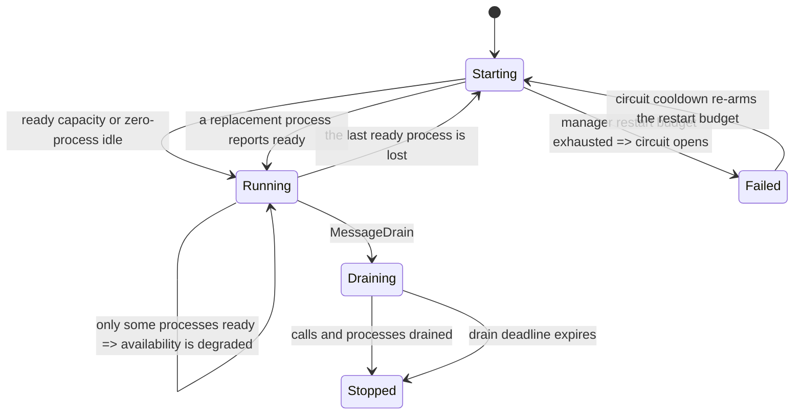

### Messages

| Message                                    | Direction                                                                         | Meaning                                                                                                                        |
| ------------------------------------------ | --------------------------------------------------------------------------------- | ------------------------------------------------------------------------------------------------------------------------------ |
| `MessageInvokePlugin`                      | runtime supervisor → catalog → router → deployment manager                        | Acknowledges ownership, then queues or rejects the routed call.                                                                |
| `MessageInvocationAccepted`                | deployment manager → router                                                       | Binds the router's completion/cancellation path to this manager PID.                                                           |
| `MessageCancelInvocation`                  | `plugin.Application` → runtime supervisor → catalog → router → deployment manager | Cancels the accepted or pending invocation at its fenced manager.                                                              |
| `MessageDeploymentManagerDispatchDeadline` | manager → manager                                                                 | Times out an invocation awaiting process acceptance.                                                                           |
| `MessageDeploymentManagerRestart`          | manager → manager                                                                 | Token-fenced plugin-process-creation retry.                                                                                    |
| `MessageDeploymentManagerReconcile`        | deployment manager → deployment manager                                           | Token-fenced autoscaling pass.                                                                                                 |
| `MessageDeploymentManagerCircuitCooldown`  | manager → manager                                                                 | Token-fenced circuit re-arm: restores the process restart budget after the cooldown.                                           |
| `MessageDeploymentManagerDrainDeadline`    | manager → manager                                                                 | Cancels remaining work with `context.DeadlineExceeded`.                                                                        |
| `MessageDrain`                             | router → deployment manager                                                       | Stops new work, cancels recovery/scale activity, and starts graceful drain.                                                    |
| `MessageInvokePlugin`                      | deployment manager → plugin process                                               | Dispatches one queued call to the least-loaded ready process.                                                                  |
| `MessageStop`                              | deployment manager → plugin process                                               | Asks a retired process to finish once its last invocation completes.                                                           |
| `MessagePluginProcessStatusChanged`        | plugin process → deployment manager                                               | Drives capacity, availability, dispatch, and scaling; a process reaching ready resets the restart budget.                      |
| `MessageInvocationStarted`                 | plugin process → deployment manager                                               | Clears the dispatch deadline and marks the call active.                                                                        |
| `MessageInvocationFinished`                | plugin process → deployment manager                                               | Returns the invocation result and frees that process's slot.                                                                   |
| `MessagePluginProcessRestartExhausted`     | plugin process → deployment manager                                               | Retires only the spent process and owes it a backoff-paced replacement.                                                        |
| `MessagePluginProcessStopped`              | plugin process → deployment manager                                               | Fails calls dispatched to a stopping process before its DOWN arrives.                                                          |
| `gen.MessageDownPID`                       | Ergo monitor → deployment manager                                                 | Drops the lost process and starts bounded replacement when unexpected.                                                         |
| `MessageDeploymentManagerStatusChanged`    | deployment manager → router                                                       | Publishes process, lifecycle, and availability changes; queue counters ride along, and an unchanged status is not republished. |
| `MessageDeploymentManagerDrained`          | deployment manager → router                                                       | Reports that no invocation or process remains.                                                                                 |
| `MessageRetryDeployment`                   | no production sender                                                              | Defined router control message; no production path emits it.                                                                   |
| `MessageDeploymentManagerRetry`            | router → deployment manager                                                       | Authenticated circuit reset if a caller sends the otherwise unproduced retry message.                                          |

### Readiness

`MinProcs=0` starts no process; the first queued call wakes one. Dispatch requires available capacity beyond active plus dispatching calls and has `MessageDeploymentManagerDispatchDeadline`; each invocation is bounded by the process's own invocation timeout; graceful drain has `MessageDeploymentManagerDrainDeadline`.

The two recovery budgets are independent and deliberately so: `ProcessOptions.RetryMin/RetryMax` paces one process restarting its own subprocess, while the manager's `RetryMin/RetryMax` paces replacing a process it lost. A process reporting ready resets the manager's budget, so a deployment that loses one process a day does not eventually open its circuit for a fault it recovered from every time. A process that reports restart exhaustion is retired alone, and its replacement is owed rather than started: the retiring process keeps its slot in `runningProcs` until its DOWN arrives, so the backoff and not the next reconcile pass decides when the successor starts. The deployment's remaining processes keep serving the calls they hold, which is why a partially broken deployment reports `running` with degraded availability instead of failing as a whole.

Exhausting the manager's own budget opens the circuit, which fails every tracked invocation, drops the desired count back to `MinProcs`, returns every grown permit to the process budget, retires every process, and stops recovery. An open circuit re-arms itself: `openCircuit` schedules a token-fenced `MessageDeploymentManagerCircuitCooldown` after `CircuitCooldown` (default 5 minutes), and handling it restores the full restart budget and reconciles, so a deployment broken by a transient host problem recovers without an operator and one that is genuinely broken simply re-opens the circuit. Drain and terminate cancel the pending cooldown. `MessageDeploymentManagerRetry` resets the circuit immediately, but no production sender currently emits `MessageRetryDeployment`. An existing active route is otherwise unchanged by the circuit; it changes only when desired state removes or replaces that route. `Recovering` is useful operational/composite-state prose for unavailable process recovery, but it is not a `DeploymentManagerLifecycle` constant; declared lifecycle/status values remain `starting`, `running`, `draining`, `failed`, and `stopped`.

A deployment is ready when its ready process count covers a nonzero `MinProcs`, degraded when only some of its processes are ready or while it drains, and unavailable while it starts with none ready or while its circuit is open. A `MinProcs=0` deployment holding no process, no call, no pending retry, and no error is ready rather than unavailable: it is asleep, not broken. Status is published only when that health changes - lifecycle, availability, desired or ready counts, per-process capacity, total capacity, last error, or any owned process's own status. Queue depth, dispatching, active, and available capacity ride along with the next health change rather than publishing one of their own, because every accepted, dispatched, and completed invocation reconciles this manager and the router recomputes its own status - and the catalog and supervisor above it - for each fact it receives.

## Plugin Process

### Lifecycle

Each plugin process owns one replaceable meta alias, uses independent normal and health restart budgets, and has `idle`/`busy` activity separate from lifecycle. A ready process periodically pings the meta; ping timeout/error retires its alias and takes the health-recovery path. Exhaustion marks the process failed and notifies its manager, which replaces that one process rather than the deployment.

### Messages

| Message                                | Direction                           | Meaning                                                                 |
| -------------------------------------- | ----------------------------------- | ----------------------------------------------------------------------- |
| `MessageInvokePlugin`                  | deployment manager → plugin process | Delivers one dispatched call to the process that owns the subprocess.   |
| `MessageInvocationStarted`             | plugin process → deployment manager | Confirms acceptance and clears the dispatch deadline.                   |
| `MessageInvocationFinished`            | plugin process → deployment manager | Returns the one-shot invocation result.                                 |
| `MessagePluginMetaRestart`             | plugin process → plugin process     | Token-fenced normal or health restart timer.                            |
| `MessagePluginMetaHealthTick`          | plugin process → plugin process     | Drives the next meta Ping attempt.                                      |
| `MessagePluginMetaHealthTimeout`       | plugin process → plugin process     | Retires an unanswered meta health check.                                |
| `MessagePluginMetaStartResult`         | plugin meta → plugin process        | Drives ready state or normal restart.                                   |
| `MessagePluginMetaPing`                | plugin process → plugin meta        | Performs the parent-authorized health RPC.                              |
| `MessagePluginMetaPingResult`          | plugin meta → plugin process        | Drives health confirmation or health restart.                           |
| `gen.MessageDownAlias`                 | Ergo meta monitor → plugin process  | Retires the current meta and starts normal/health recovery.             |
| `MessagePluginProcessStatusChanged`    | plugin process → deployment manager | Publishes lifecycle, availability, and idle/busy activity.              |
| `MessagePluginProcessStopped`          | plugin process → deployment manager | Reports process shutdown so its calls fail at once.                     |
| `MessagePluginProcessRestartExhausted` | plugin process → deployment manager | Escalates exhausted local recovery for this process alone.              |
| `MessageStop`                          | deployment manager → plugin process | Stops normally after the manager retired it and its last call finished. |
| `SendExitMeta`                         | plugin process → Ergo meta runtime  | Requests plugin-meta termination before recovery.                       |
| `Terminate`                            | Ergo meta runtime → plugin meta     | Invokes meta cleanup after the process's exit request.                  |

### Readiness

The process is ready only when its current meta alias is ready. Its lifecycle, availability, and idle/busy activity are distinct parts of its operational/composite state.

Its invocation capacity is `supportedCallsPerProcess`, which is 1 today: `HandleMessage` runs the call to completion through a synchronous `CallWithTimeout` on the meta, and an actor takes one message at a time, so a second call reaches this subprocess only after the first returns. Capacity is a property of this layer rather than of the manager's arithmetic, which is why the manager clamps a deployment's declared `calls_per_process` to it - a declared capacity can never overstate what the runtime will actually run. Raising it belongs with the asynchronous invocation path that removes the serialization, not with the scheduler that would dispatch into it.

## Plugin Meta

### Lifecycle

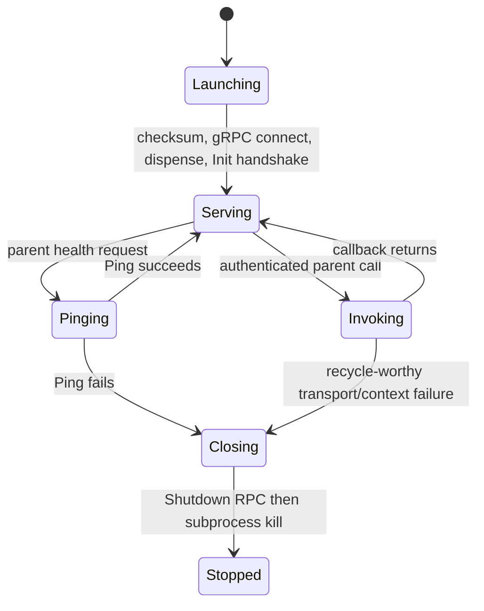

### Messages

| Message                        | Direction                          | Meaning                                                               |
| ------------------------------ | ---------------------------------- | --------------------------------------------------------------------- |
| `MessagePluginMetaStartResult` | plugin meta → plugin process       | Reports checksum/handshake/session startup outcome for its alias.     |
| `MessagePluginMetaPing`        | plugin process → plugin meta       | Requests a parent-authorized health RPC.                              |
| `MessagePluginMetaPingResult`  | plugin meta → plugin process       | Returns the alias-fenced Ping result.                                 |
| `pluginMetaInvoke`             | plugin process → plugin meta       | Synchronous parent-only callback invocation.                          |
| `pluginMetaInvokeResult`       | plugin meta → plugin process       | Returns the plugin result and whether the session must be recycled.   |
| `Shutdown`                     | plugin meta → plugin RPC           | Bounded session shutdown before client kill.                          |
| `SendExitMeta`                 | plugin process → Ergo meta runtime | Requests meta termination after a recycle-worthy failure or shutdown. |
| `Terminate`                    | Ergo meta runtime → plugin meta    | Invokes session close after the process's exit request.               |

### Readiness

The meta verifies the artifact checksum before `exec.CommandContext`, requires the configured gRPC handshake, and runs `Init`. Only its parent plugin process may call or ping it. It sends `Shutdown` with a three-second bound then kills the client on close. Plugin `Unavailable`, malformed responses, transport failures, and health failures retire the alias and enter bounded health recovery.

Cancellation and deadlines are classified rather than assumed fatal, because killing the subprocess is the only isolation mechanism this layer has and a shared subprocess would make every sibling call pay for one caller's withdrawal. A cancelled or expired call is local to that call whenever the plugin answers it: `classifyInvocation` recycles on `Unavailable`, and on `Canceled` or `DeadlineExceeded` only when the caller's own context is still live, since that is the transport reporting its own failure rather than a caller withdrawing a request. When the caller's context ends while the callback is still running, the meta waits out `pluginMetaCancelGrace` (one second) before deciding: a plugin that honours its RPC context returns inside that window and keeps its subprocess, while one that ignores cancellation can be stopped no other way, because Go cannot kill the goroutine running an arbitrary callback. The parent process actor adds that grace to its own Ergo call timeout so its timeout never races this decision, and it no longer treats a dead caller context as evidence against the subprocess - it substitutes the caller's reason only when the call itself returned nothing.

## Invocation

### Lifecycle

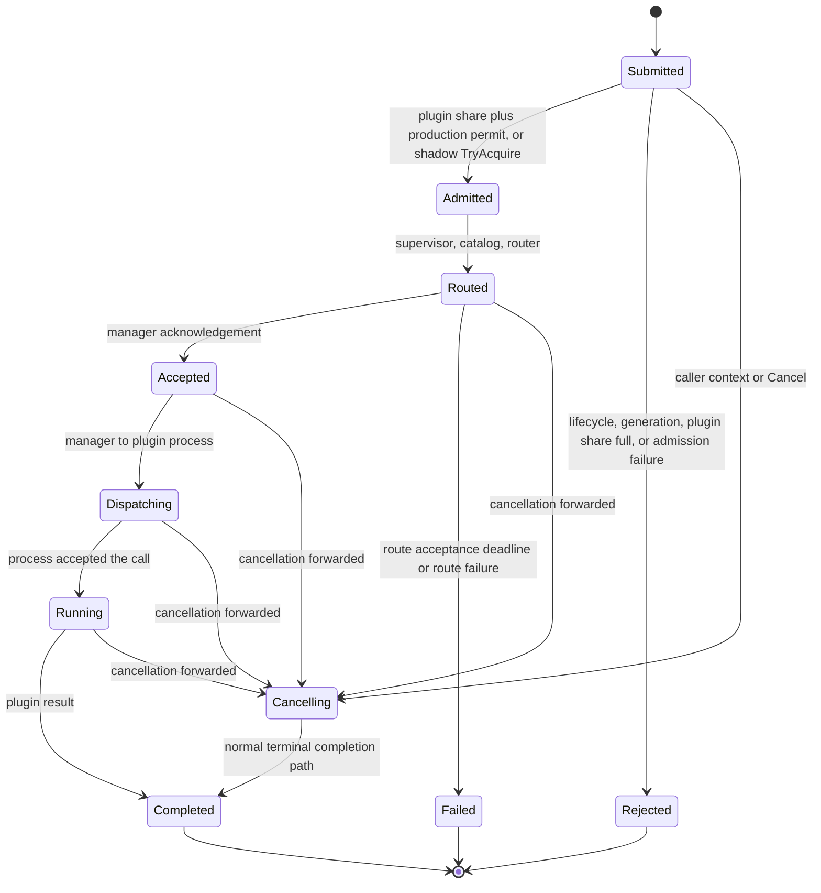

### Messages

| Message                      | Direction                                                                         | Meaning                                                              |
| ---------------------------- | --------------------------------------------------------------------------------- | -------------------------------------------------------------------- |
| `Submit`                     | caller → `plugin.Application`                                                     | Acquires the blocking production permit.                             |
| `SubmitShadow`               | caller → `plugin.Application`                                                     | Uses the separate non-blocking best-effort shadow permit.            |
| `MessageSubmitInvocation`    | `plugin.Application` → runtime supervisor                                         | Enters an admitted invocation into the runtime tree.                 |
| `MessageInvokePlugin`        | runtime supervisor → catalog → router → deployment manager → plugin process       | Carries the routed call to one plugin process.                       |
| `MessageCancelInvocation`    | `plugin.Application` → runtime supervisor → catalog → router → deployment manager | Follows the fenced accepted/pending manager path.                    |
| `MessageInvocationAccepted`  | deployment manager → router                                                       | Binds the routed call to its manager before completion/cancellation. |
| `MessageInvocationStarted`   | plugin process → deployment manager                                               | Moves the accepted call from dispatching to running.                 |
| `MessageInvocationFinished`  | plugin process → deployment manager                                               | Returns the plugin invocation result.                                |
| `MessageInvocationCompleted` | manager → router → catalog → runtime supervisor                                   | Completes the idempotent `runtime.AsyncResult` once.                 |

### Readiness

Submission requires a running application and a runtime whose expected generation is exactly ready and committed; draining or a desired-state barrier rejects it as unavailable. Every terminal path enters the idempotent `runtime.AsyncResult`; `Invocation` closes `Done` only when that result completes. Call IDs bind one supervisor, catalog, router, manager, and plugin-process path; PID/alias plus generation/epoch checks reject stale completion, status, and recovery facts, and the manager accepts an invocation fact only from the process it dispatched that call to.

## References

- [`internal/runtime/plugin/runtime_application.go`](../../internal/runtime/plugin/runtime_application.go) - application lifecycle, admission, State,
  submit, completion.
- [`internal/runtime/plugin/runtime_supervisor.go`](../../internal/runtime/plugin/runtime_supervisor.go) - RestForOne tree, desired-state barrier,
  projection commit, drain.
- [`internal/runtime/plugin/reconciler_actor.go`](../../internal/runtime/plugin/reconciler_actor.go),
  [`artifact_resolver_meta.go`](../../internal/runtime/plugin/artifact_resolver_meta.go), and
  [`artifact_watcher_meta.go`](../../internal/runtime/plugin/artifact_watcher_meta.go) - desired state and local artifact facts.
- [`internal/runtime/plugin/catalog_actor.go`](../../internal/runtime/plugin/catalog_actor.go) and
  [`router_actor.go`](../../internal/runtime/plugin/router_actor.go) - router ownership, route lifecycle, rollout, and fences.
- [`internal/runtime/plugin/deployment_manager.go`](../../internal/runtime/plugin/deployment_manager.go),
  [`process_budget.go`](../../internal/runtime/plugin/process_budget.go),
  [`plugin_process.go`](../../internal/runtime/plugin/plugin_process.go), and
  [`plugin_process_meta.go`](../../internal/runtime/plugin/plugin_process_meta.go) - queue, capacity-aware dispatch, plugin processes, subprocess,
  recovery, and drain.
- [`internal/runtime/invocation.go`](../../internal/runtime/invocation.go) and
  [`internal/runtime/backoff.go`](../../internal/runtime/backoff.go) - one-shot completion and shared scheduled backoff.
