# Plugin Runtime

`internal/runtime/plugin` owns local plugin deployment, not an executor or a process pool. One `plugin.Application[P,M]` bridges callers to one runtime supervisor on the process-owned Ergo node. Dynamic deployment routes and deployment pools are router/pool mechanisms, **not supervisors**. Snapshot, reconciler, and catalog are supervisor children; routers, routes, managers, and pools are dynamically created; workers are actor-pool-created; metas are actor-spawned. Only the declared runtime and snapshot supervisor trees have supervisor semantics.

## Composition

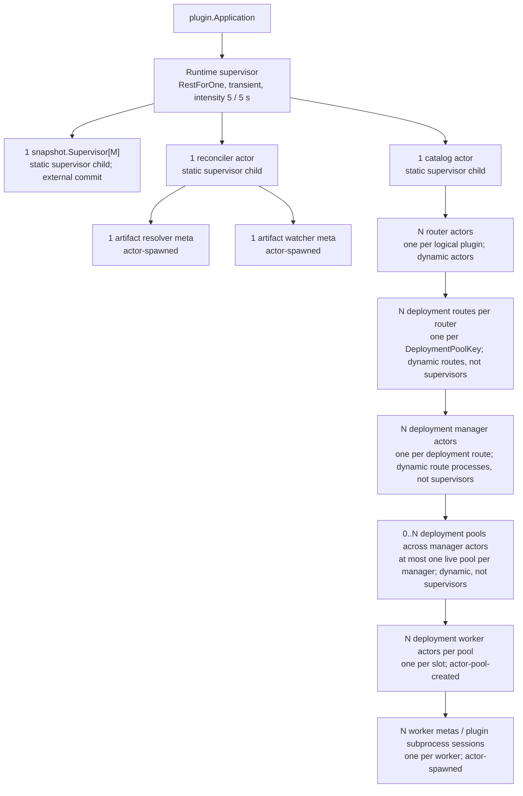
```mermaid
flowchart TB
  app["plugin.Application"]
  supervisor["Runtime supervisor\nRestForOne, transient, intensity 5 / 5 s"]
  snapshot["1 snapshot.Supervisor[M]\nstatic supervisor child; external commit"]
  reconciler["1 reconciler actor\nstatic supervisor child"]
  resolver["1 artifact resolver meta\nactor-spawned"]
  watcher["1 artifact watcher meta\nactor-spawned"]
  catalog["1 catalog actor\nstatic supervisor child"]
  routers["N router actors\none per logical plugin; dynamic actors"]
  routes["N deployment routes per router\none per DeploymentPoolKey; dynamic routes, not supervisors"]
  managers["N deployment manager actors\none per deployment route; dynamic route processes, not supervisors"]
  pools["0..N deployment pools across manager actors\nat most one live pool per manager; dynamic, not supervisors"]
  workers["N deployment worker actors per pool\none per slot; actor-pool-created"]
  metas["N worker metas / plugin subprocess sessions\none per worker; actor-spawned"]
  app --> supervisor
  supervisor --> snapshot
  supervisor --> reconciler
  supervisor --> catalog
  reconciler --> resolver
  reconciler --> watcher
  catalog --> routers --> routes --> managers --> pools --> workers --> metas
```

The runtime supervisor's RestForOne child order is snapshot, reconciler, catalog. A prior child restart restarts later children. It is transient, has intensity 5 in 5 seconds, handles child lifecycle itself, and does not auto-shutdown. The snapshot subtree's policy is documented in [snapshot-runtime.md](snapshot-runtime.md).

## Messages

| Message | Direction | Meaning |
| --- | --- | --- |
| Admission and invocation | caller → application → runtime supervisor → catalog → router → manager → pool → worker | Carries an admitted production or shadow invocation to one worker. |
| Desired-state promotion | reconciler → runtime supervisor → catalog → router | Moves a resolved desired revision through the drain, freshness, and projection-commit barrier. |
| Status and readiness | child/meta/worker → parent owner | Aggregates fenced lifecycle, activity, and availability facts upward. |
| Drain | application → runtime supervisor → catalog → router → manager | Stops admission and drains dynamically owned work from the top down. |
| Completion and cancellation | worker → runtime supervisor; application → runtime supervisor | Completes one result idempotently or follows the fenced accepted/pending path to cancel it. |

## Roles

| Role | Default name or identity | Owner | Responsibility |
| --- | --- | --- |
| Plugin Application | `<runtime-name>-application` application name | Ergo application group | Caller lifecycle, production/shadow admission, and async-result ownership. |
| Runtime Supervisor | configured `<runtime-name>` (registered) | Plugin Application | Coordinates snapshot, reconciler, catalog, desired-state promotion, and drain. |
| Snapshot Supervisor | configured `<runtime-name>-snapshot` (registered) | Runtime Supervisor | Supplies reader/projection state with external projection commit. |
| Reconciler Actor | `<runtime-name>-desired-state-reconciler` child name | Runtime Supervisor | Resolves snapshot and local artifacts into desired router state. |
| Artifact Resolver Meta | dynamic `gen.Alias` | Reconciler Actor | Resolves locally valid artifacts and desired routes. |
| Artifact Watcher Meta | dynamic `gen.Alias` | Reconciler Actor | Reports artifact-directory watch/poll drift. |
| Catalog Actor | `<runtime-name>-catalog` child name | Runtime Supervisor | Owns router incarnations and aggregates router status. |
| Router Actor | dynamic PID/generation/epoch per plugin | Catalog Actor | Selects rollout routes and owns dynamic deployment routes. |
| Deployment Route | stable SHA-256-derived atom per `DeploymentPoolKey` | Router Actor | Creates, respawns, drains, and removes one manager route. |
| Deployment Manager | dynamic route process PID | Deployment Route | Owns bounded queueing, dispatch, scaling, pool recovery, and drain. |
| Deployment Pool | dynamic actor-pool PID | Deployment Manager | Places workers and aggregates their health; it is not a supervisor. |
| Deployment Worker | dynamic pool worker PID | Deployment Pool | Delivers one invocation at a time and recovers its plugin session. |
| Worker Meta | dynamic `gen.Alias` | Deployment Worker | Owns one plugin subprocess and RPC session. |
| Invocation | `callID` and one `runtime.Invocation` handle | caller | Its `AsyncResult` remains owned by the application/runtime tree. |

The runtime and snapshot supervisors are registered; all remaining listed names are child or dynamic identities.

## Readiness

The runtime admits work only when its expected projection generation is ready and committed, the desired-state barrier is idle, and the application is running. The supervisor is ready only when projection and catalog generations/revisions agree, catalog is ready, projection is routable, and it is not draining. During a transition/drain or when projection/catalog is missing, runtime availability is unavailable; it is degraded when dependencies exist but are not all ready. Component readiness below contributes to this operational/composite state rather than defining extra lifecycle constants.

## Plugin Application

### Lifecycle

The application is single-use: `New → Running → Stopping → Terminated`. `Start` marks it running only after registered-supervisor lookup succeeds.
`Terminate` completes pending calls with `ErrRuntimeStopped`, or `ErrPluginUnavailable` when already stopping.

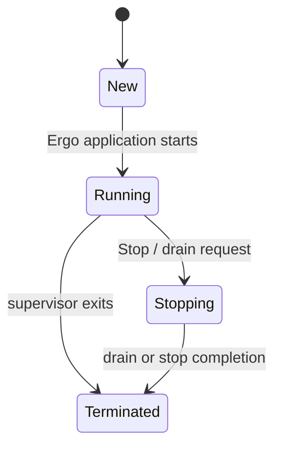
```mermaid
stateDiagram-v2
    [*] --> New
    New --> Running: Ergo application starts
    Running --> Stopping: Stop / drain request
    Running --> Terminated: supervisor exits
    Stopping --> Terminated: drain or stop completion
```

### Messages

| Message | Direction | Meaning |
| --- | --- | --- |
| `Start` | Ergo application lifecycle → `plugin.Application` | Starts the single-use application after Ergo starts its group and finds its registered supervisor. |
| `Stop` | Ergo application lifecycle → `plugin.Application` | Closes admission and begins runtime drain within Ergo's stop deadline. |
| `DrainRequest` | `plugin.Application` → runtime supervisor | Requests bounded graceful drain. |
| `Terminate` | Ergo application lifecycle → `plugin.Application` | Completes pending calls with `ErrRuntimeStopped`, or `ErrPluginUnavailable` when already stopping. |

### Readiness

`Start` marks the application running only after lookup of its registered supervisor succeeds. Production `Submit` acquires the application-wide blocking `MaxOutstandingInvocations` permit, including queue waiters. `SubmitShadow` uses a separate non-blocking budget and returns `ErrShadowDropped` when full.

## Runtime Supervisor

### Lifecycle

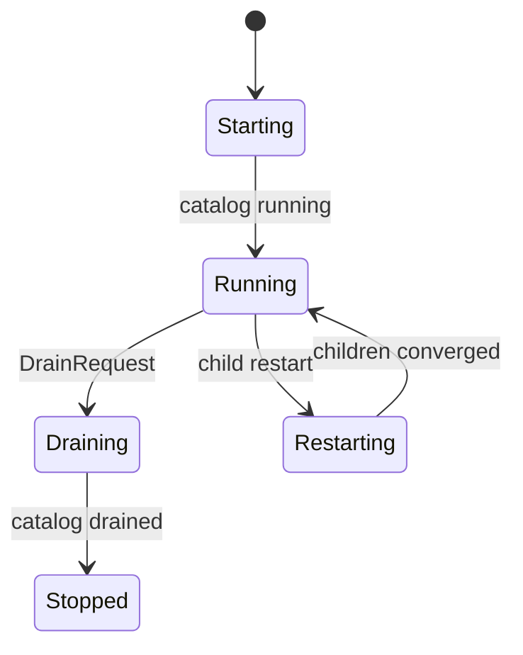
```mermaid
stateDiagram-v2
    [*] --> Starting
    Starting --> Running: catalog running
    Running --> Draining: DrainRequest
    Draining --> Stopped: catalog drained
    Running --> Restarting: child restart
    Restarting --> Running: children converged
```

### Messages

| Message | Direction | Meaning |
| --- | --- | --- |
| `MessageCatalogActivate` | runtime supervisor → catalog | Permits catalog status publication after child setup. |
| `DrainRequest` | application → runtime supervisor | Starts the runtime's downward drain. |
| `MessageDrain` | runtime supervisor → catalog | Drains the catalog after admission closes. |
| `SupervisorStatusRequest` | `plugin.Application` → runtime supervisor | Reads the availability/status snapshot. |
| `SupervisorStateRequest` | `plugin.Application` → runtime supervisor | Reads the ready generation used for admission. |
| `HandleChildStart` | Ergo supervisor runtime → runtime supervisor | Records each snapshot, reconciler, or catalog child incarnation and activates/replays it. |
| `HandleChildTerminate` | Ergo supervisor runtime → runtime supervisor | Retires a child incarnation and recomputes runtime availability. |
| `MessageReconcilerActorStatusChanged` | reconciler → runtime supervisor | Updates reconciler readiness and transition state. |
| `MessageCatalogStatusChanged` | catalog → runtime supervisor | Updates catalog revision/readiness and completes transition checks. |
| `MessageCatalogDrained` | catalog → runtime supervisor | Completes drain waiters and terminates the runtime after calls are failed. |
| `snapshot.MessageProjectionActorStatusChanged` | snapshot supervisor → runtime supervisor | Updates committed/ready projection state for the external-commit subtree. |
| `MessageProjectionCommitRetry` | runtime supervisor → runtime supervisor | Token-fenced deferred projection-commit retry. |
| `MessageProjectionCommitDeadline` | runtime supervisor → runtime supervisor | Token-, PID-, and generation-fenced pending projection-commit expiry. |

### Readiness

The supervisor accepts `SupervisorStatusRequest` and `SupervisorStateRequest`. Its exact state reader requires a nonzero ready generation equal to the committed generation, a routable committed projection, matching desired snapshot generation and catalog revision, catalog readiness, an idle transition, and a non-draining lifecycle. After Catalog reports drained, the supervisor fails remaining calls, answers drain waiters, and terminates. The subtree uses independent finite retry domains; cancelling a scheduled retry invalidates its token.

## Desired-State Transition

### Lifecycle

The reconciler proposes a monotonic desired revision only after artifact resolution is complete and non-deferred. The supervisor holds a newer proposal until tracked invocations drain, applies it to the catalog, asks the reconciler to confirm freshness, then externally commits the matching projection generation.

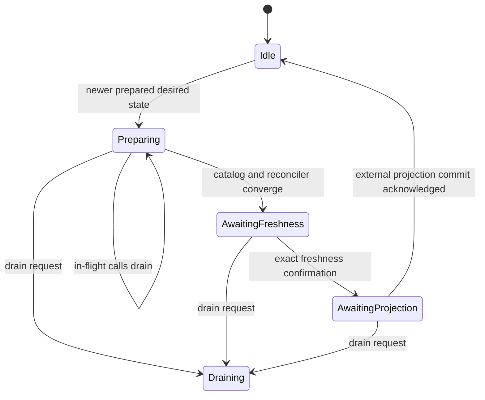
```mermaid
stateDiagram-v2
    [*] --> Idle
    Idle --> Preparing: newer prepared desired state
    Preparing --> Preparing: in-flight calls drain
    Preparing --> AwaitingFreshness: catalog and reconciler converge
    AwaitingFreshness --> AwaitingProjection: exact freshness confirmation
    AwaitingProjection --> Idle: external projection commit acknowledged
    Preparing --> Draining: drain request
    AwaitingFreshness --> Draining: drain request
    AwaitingProjection --> Draining: drain request
```

### Messages

| Message | Direction | Meaning |
| --- | --- | --- |
| `MessageProposeDesiredState` | reconciler → runtime supervisor | Offers a resolved, monotonic desired revision. |
| `MessageApplyCatalogDesiredState` | runtime supervisor → catalog | Applies the revision after tracked calls drain. |
| `MessageDesiredStateFreshness` | runtime supervisor → reconciler | Challenges the proposed generation/revision after catalog convergence. |
| `MessageDesiredStateFreshness` | reconciler → runtime supervisor | Confirms the exact generation/revision remains current and locally ready. |
| `MessageProjectionCommit` | runtime supervisor → snapshot supervisor | Requests external commit of the matching projection generation. |
| `MessageProjectionCommitResult` | snapshot supervisor → runtime supervisor | Acknowledges the PID/generation-fenced projection commit. |

### Readiness

Admission reopens only after projection, reconciler, catalog, generation, and revision agree. This is transition/admission readiness, not an additional lifecycle enum.

## Reconciler Actor

### Lifecycle

The reconciler monitors the snapshot subtree's buffered snapshot/status events, starts resolver and watcher metas, and coalesces snapshot/filesystem changes.

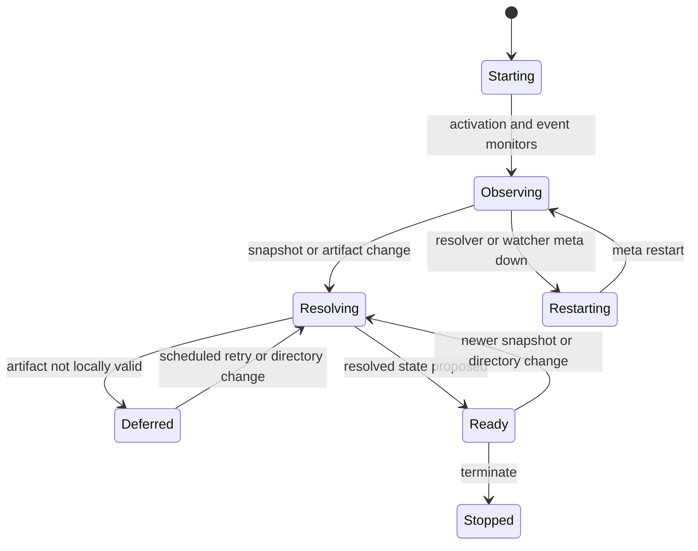
```mermaid
stateDiagram-v2
    [*] --> Starting
    Starting --> Observing: activation and event monitors
    Observing --> Resolving: snapshot or artifact change
    Resolving --> Deferred: artifact not locally valid
    Deferred --> Resolving: scheduled retry or directory change
    Resolving --> Ready: resolved state proposed
    Ready --> Resolving: newer snapshot or directory change
    Observing --> Restarting: resolver or watcher meta down
    Restarting --> Observing: meta restart
    Ready --> Stopped: terminate
```

### Messages

| Message | Direction | Meaning |
| --- | --- | --- |
| `MessageReconcilerActorActivate` | runtime supervisor → reconciler | Activates event monitoring and sets the revision base. |
| `MessageResolveArtifacts` | reconciler → artifact resolver meta | Requests resolution for the current snapshot. |
| `MessageArtifactResolutionResult` | artifact resolver meta → reconciler | Returns alias-, generation-, and dirtiness-fenced desired routes. |
| `MessageArtifactDirectoryChanged` | artifact watcher meta → reconciler | Marks artifact state dirty and triggers resolution. |
| `MessageResolutionRetry` | reconciler → reconciler | Token-fenced retry timer for deferred or failed resolution. |
| `MessageArtifactResolverMetaRestart` | reconciler → reconciler | Token-fenced timer that restarts the resolver meta. |
| `MessageArtifactWatcherMetaRestart` | reconciler → reconciler | Token-fenced timer that restarts the watcher meta. |
| `gen.MessageEvent` | snapshot supervisor event → reconciler | Buffered and live snapshot/reader-status events drive resolution and readiness. |
| `gen.MessageDownAlias` | Ergo meta monitor → reconciler | Marks the resolver or watcher unavailable and schedules its restart. |
| `MessageReconcilerActorStatusChanged` | reconciler → runtime supervisor | Publishes reconciler lifecycle, availability, generation, and revision. |
| `SendExitMeta` | reconciler → Ergo meta runtime | Requests resolver/watcher meta termination during replacement or shutdown. |
| `Terminate` | Ergo meta runtime → artifact resolver/watcher meta | Invokes meta cleanup after the parent's exit request. |

### Readiness

Resolver and watcher facts are fenced by meta alias. Resolution results are also fenced by snapshot generation and discarded when a newer filesystem or snapshot change made them dirty. Resolver, watcher, and resolution retries use separate shared scheduled-backoff instances; retry timers carry tokens. Exhaustion is an actor failure, not an unbounded loop.

## Artifact Resolver Meta

### Lifecycle

The resolver has a one-slot job channel. It validates local names/specs, enabled state, and SHA-256 before producing desired primary/candidate routes.

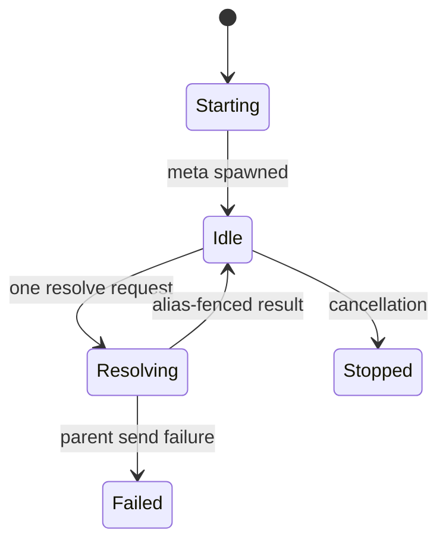
```mermaid
stateDiagram-v2
    [*] --> Starting
    Starting --> Idle: meta spawned
    Idle --> Resolving: one resolve request
    Resolving --> Idle: alias-fenced result
    Idle --> Stopped: cancellation
    Resolving --> Failed: parent send failure
```

### Messages

| Message | Direction | Meaning |
| --- | --- | --- |
| `MessageResolveArtifacts` | reconciler → artifact resolver meta | Supplies the snapshot to resolve. |
| `MessageArtifactResolutionResult` | artifact resolver meta → reconciler | Returns resolved/deferred route candidates for its meta alias. |
| `SendExitMeta` | reconciler → Ergo meta runtime | Requests termination of the resolver meta. |
| `Terminate` | Ergo meta runtime → artifact resolver meta | Invokes cleanup for the resolver's one-slot worker. |

### Readiness

Invalid or absent artifacts are deferred, not deployed. A successful alias-fenced result makes the current resolver meta ready for the reconciler's freshness check.

## Artifact Watcher Meta

### Lifecycle

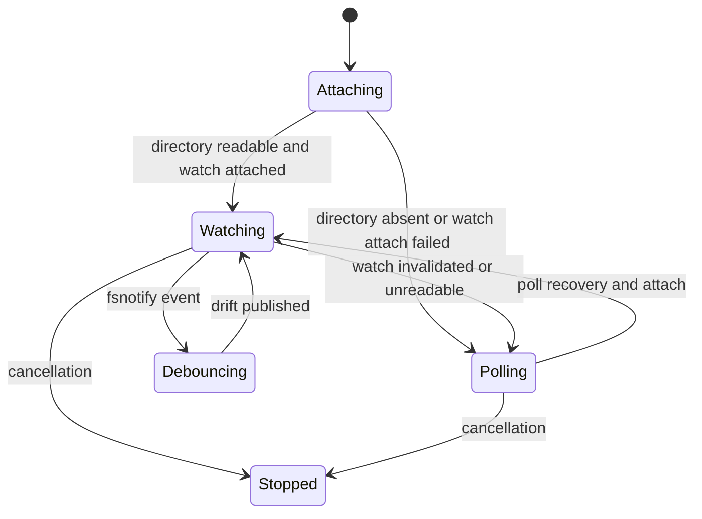
```mermaid
stateDiagram-v2
    [*] --> Attaching
    Attaching --> Watching: directory readable and watch attached
    Attaching --> Polling: directory absent or watch attach failed
    Watching --> Debouncing: fsnotify event
    Debouncing --> Watching: drift published
    Watching --> Polling: watch invalidated or unreadable
    Polling --> Watching: poll recovery and attach
    Watching --> Stopped: cancellation
    Polling --> Stopped: cancellation
```

### Messages

| Message | Direction | Meaning |
| --- | --- | --- |
| `MessageArtifactDirectoryChanged` | artifact watcher meta → reconciler | Reports a debounced filesystem or poll-detected change. |
| `MessageArtifactWatcherStateChanged` | artifact watcher meta → reconciler | Reports watch/poll availability and drift state. |
| `SendExitMeta` | reconciler → Ergo meta runtime | Requests termination of the watcher meta. |
| `Terminate` | Ergo meta runtime → artifact watcher meta | Invokes cleanup for fsnotify and polling. |

### Readiness

The watcher combines fsnotify with a five-second metadata-fingerprint poll and 300 ms notification debounce. A missing or unreadable directory is drift: it reports state and continues polling rather than terminating. The resolver is the authority for content checksum, not the watcher fingerprint.

## Catalog Actor

### Lifecycle

Catalog activation enables status publication. It applies only nondecreasing desired revisions, dynamically creates one router incarnation per logical plugin ID, marks removed routers retiring, drains them, and removes their state.

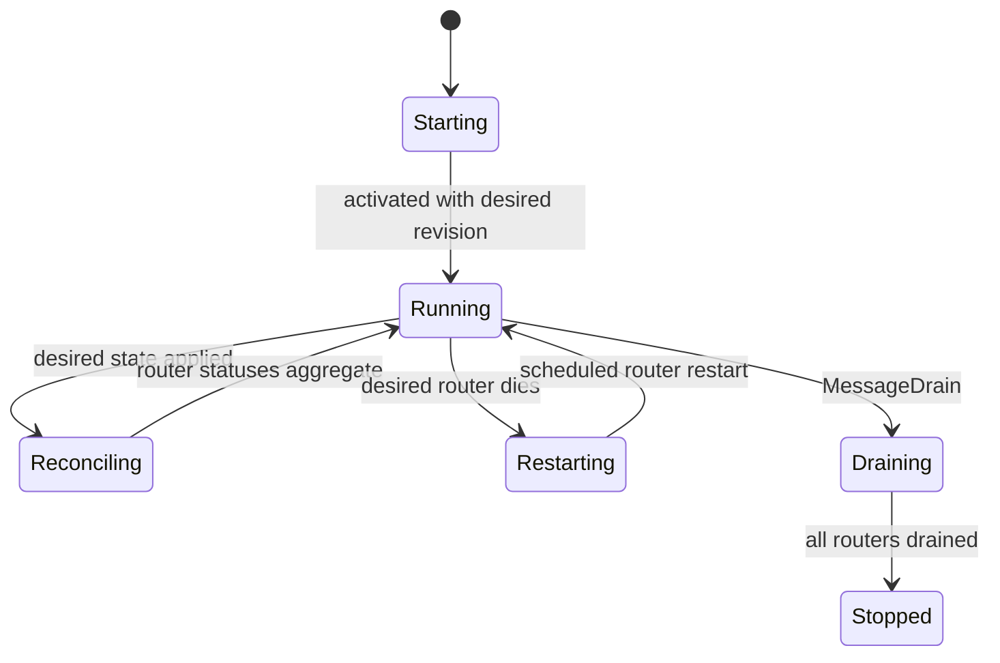
```mermaid
stateDiagram-v2
    [*] --> Starting
    Starting --> Running: activated with desired revision
    Running --> Reconciling: desired state applied
    Reconciling --> Running: router statuses aggregate
    Running --> Restarting: desired router dies
    Restarting --> Running: scheduled router restart
    Running --> Draining: MessageDrain
    Draining --> Stopped: all routers drained
```

### Messages

| Message | Direction | Meaning |
| --- | --- | --- |
| `MessageCatalogActivate` | runtime supervisor → catalog | Enables catalog status publication. |
| `MessageApplyCatalogDesiredState` | runtime supervisor → catalog | Adds, updates, retires, or drains logical-plugin routers. |
| `gen.MessageDownPID` | Ergo monitor → catalog | Reports a router incarnation death for PID/generation fencing. |
| `MessageRouterRestart` | catalog → catalog | Token-fenced timer that retries creating a desired router. |
| `MessageDrain` | runtime supervisor → catalog | Retires/drains every live router and suppresses restart. |
| `MessageRouterStatusChanged` | router → catalog | Updates the PID/generation/epoch-fenced router aggregate. |
| `MessageRouterDrained` | router → catalog | Retires a draining router and advances catalog drain/replacement work. |
| `MessageCatalogStatusChanged` | catalog → runtime supervisor | Publishes the epoch-ordered aggregate catalog state. |
| `MessageCatalogDrained` | catalog → runtime supervisor | Reports that every live router has drained. |

### Readiness

Router facts are accepted only from the current PID, generation, and increasing epoch. PID identifies the live process, generation identifies the Catalog-created incarnation, and epoch orders that incarnation's status facts, so late messages cannot revive or overwrite a replacement. On router loss, Catalog fails calls assigned to that PID and uses token-fenced `MessageRouterRestart` for a non-retiring desired router; draining suppresses restart.

## Router Actor

### Lifecycle

Each router dynamically creates primary, canary, and shadow deployment routes from its desired state. A normal production call uses primary unless its rollout bucket selects an active canary; `SubmitShadow` independently makes best-effort fan-out only to an active shadow candidate, so a full shadow budget never consumes production capacity.

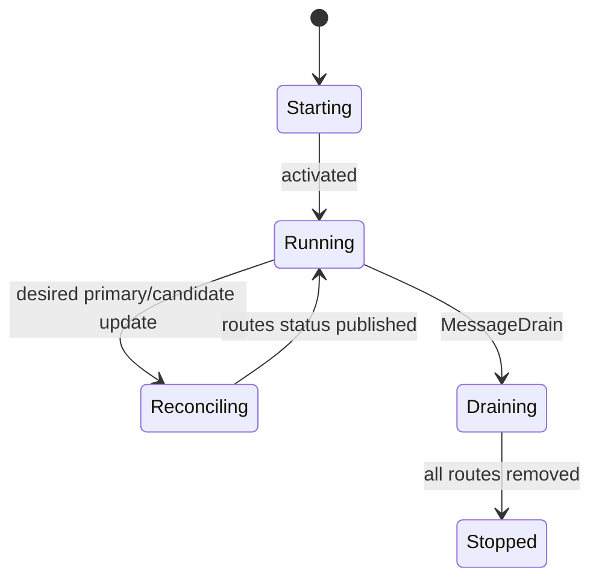
```mermaid
stateDiagram-v2
    [*] --> Starting
    Starting --> Running: activated
    Running --> Reconciling: desired primary/candidate update
    Reconciling --> Running: routes status published
    Running --> Draining: MessageDrain
    Draining --> Stopped: all routes removed
```

### Messages

| Message | Direction | Meaning |
| --- | --- | --- |
| `MessageRouterActivate` | catalog → router | Fences the new router incarnation with its Catalog generation. |
| `MessageApplyRouterDesiredState` | catalog → router | Creates/updates primary, canary, and shadow route intent. |
| `MessageInvokePlugin` | catalog → router | Routes production or shadow work to an eligible deployment route. |
| `MessageInvocationTimedOut` | router → router | Expires an unacknowledged route acceptance. |
| `MessageDrain` | catalog → router | Drains and removes all deployment routes. |
| `MessageDeploymentManagerStatusChanged` | deployment manager → router | Updates a live route's manager status and active rollout selection. |
| `MessageDeploymentManagerDrained` | deployment manager → router | Permits removal of a draining route. |
| `MessageDeploymentManagerTerminated` | deployment manager → router | Fences manager loss and schedules an active-route recovery step. |
| `MessageRouterStatusChanged` | router → catalog | Publishes router availability, rollout, and route state. |
| `MessageRouterDrained` | router → catalog | Reports that all routes were removed during drain. |

### Readiness

The router records an acceptance deadline before routing. A manager must acknowledge the call; unaccepted, route-failed, stale, or timed-out calls complete as unavailable. Cancellation goes to the accepted manager, or the current route manager while acknowledgement is pending.

## Deployment Route

### Lifecycle

A route has a stable SHA-256-derived atom for one concrete `DeploymentPoolKey`; it is a dynamic router route, not a supervisor. Route status,
acceptance, and termination are accepted only from the live manager PID; known past manager PIDs are retained solely to fence late termination facts.

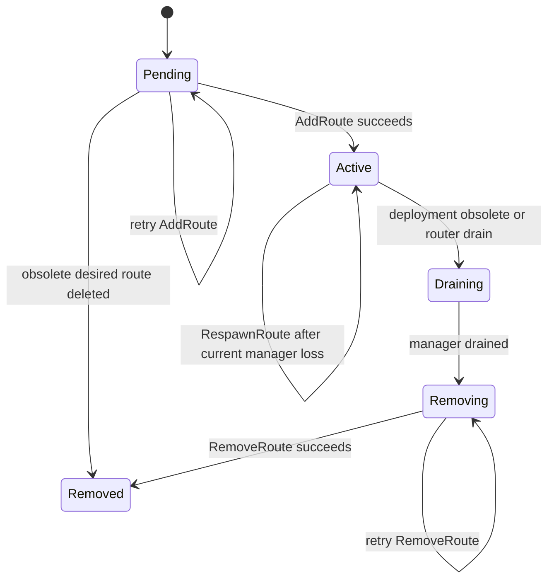
```mermaid
stateDiagram-v2
    [*] --> Pending
    Pending --> Active: AddRoute succeeds
    Pending --> Pending: retry AddRoute
    Pending --> Removed: obsolete desired route deleted
    Active --> Active: RespawnRoute after current manager loss
    Active --> Draining: deployment obsolete or router drain
    Draining --> Removing: manager drained
    Removing --> Removed: RemoveRoute succeeds
    Removing --> Removing: retry RemoveRoute
```

### Messages

| Message | Direction | Meaning |
| --- | --- | --- |
| `AddRoute` | router → `act.Router` | Registers the stable route atom and starts its manager factory. |
| `MessageRetryRouteStep` | router → router | Token-fenced retry for `AddRoute`, manager respawn, drain, or removal. |
| `MessageDeploymentManagerStatusChanged` | deployment manager → router | Drives active-route readiness and router status. |
| `MessageDeploymentManagerTerminated` | manager → router | Fences manager loss and schedules route recovery. |
| `RespawnRoute` | router → `act.Router` | Recreates the manager only after the active-route retry step, or to finish a drain. |
| `MessageDeploymentManagerDrained` | manager → router | Permits route removal after graceful manager drain. |
| `RemoveRoute` | router → `act.Router` | Removes the drained route; failures retry. |

### Readiness

`AddRoute`, `RespawnRoute`, and `RemoveRoute` each retry through the route's independent `MessageRetryRouteStep` backoff. A pending route made
obsolete is deleted directly. On active-manager loss, the retry timer runs before `RespawnRoute`; draining with no live manager respawns a draining manager to complete the normal drain protocol.

## Deployment Manager

### Lifecycle

The manager validates `0 <= MinProcs <= max(1, MaxProcs) <= 100`. It accepts an invocation before queue admission so the router can bind its
completion path, then rejects draining/open-circuit calls and a full pending queue with `ErrQueueFull`. Queue depth is bounded by `QueueSize`.

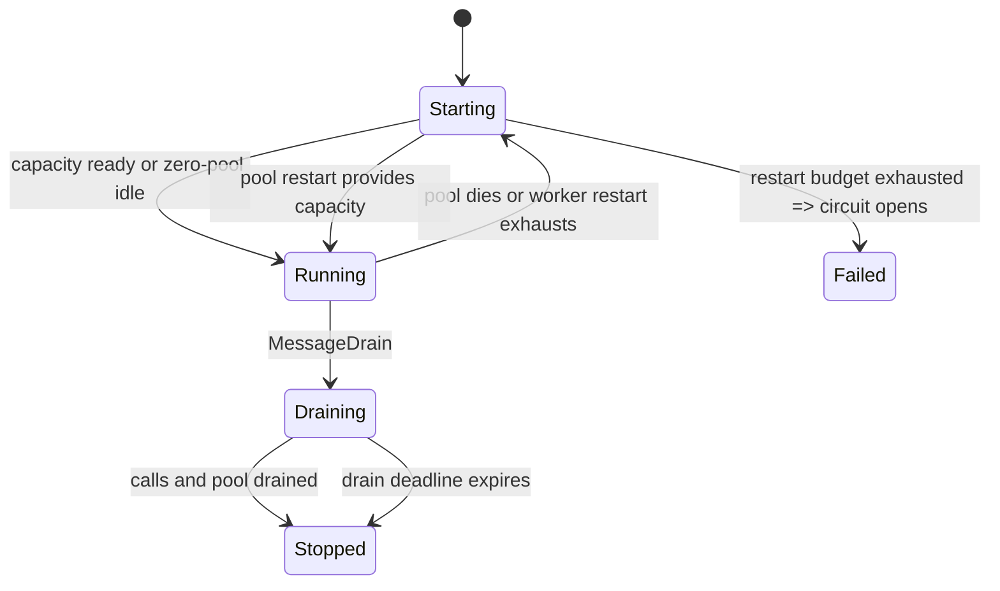
```mermaid
stateDiagram-v2
    [*] --> Starting
    Starting --> Running: capacity ready or zero-pool idle
    Running --> Starting: pool dies or worker restart exhausts
    Starting --> Running: pool restart provides capacity
    Starting --> Failed: restart budget exhausted => circuit opens
    Running --> Draining: MessageDrain
    Draining --> Stopped: calls and pool drained
    Draining --> Stopped: drain deadline expires
```

### Messages

| Message | Direction | Meaning |
| --- | --- | --- |
| `MessageInvokePlugin` | runtime supervisor → catalog → router → deployment manager | Acknowledges ownership, then queues or rejects the routed call. |
| `MessageInvocationAccepted` | deployment manager → router | Binds the router's completion/cancellation path to this manager PID. |
| `MessageCancelInvocation` | `plugin.Application` → runtime supervisor → catalog → router → deployment manager | Cancels the accepted or pending invocation at its fenced manager. |
| `MessageDeploymentManagerDispatchDeadline` | manager → manager | Times out an invocation awaiting worker start. |
| `MessageDeploymentManagerRestart` | manager → manager | Token-fenced pool-creation retry. |
| `MessageDeploymentManagerReconcile` | deployment manager → deployment manager | Token-fenced autoscaling pass. |
| `MessageDeploymentManagerDrainDeadline` | manager → manager | Cancels remaining work with `context.DeadlineExceeded`. |
| `MessageDrain` | router → deployment manager | Stops new work, cancels recovery/scale activity, and starts graceful drain. |
| `MessageDeploymentPoolStatusChanged` | deployment pool → deployment manager | Drives capacity, availability, dispatch, and scaling decisions. |
| `MessageDeploymentWorkerRestartExhausted` | deployment worker → deployment pool → deployment manager | Replaces the exhausted pool or opens the manager circuit if recovery cannot proceed. |
| `MessageDeploymentWorkerStopped` | deployment worker → deployment pool → deployment manager | Fails calls active on a stopped worker. |
| `gen.MessageDownPID` | Ergo monitor → deployment manager | Marks the current pool down and starts bounded pool recovery when unexpected. |
| `MessageDeploymentManagerStatusChanged` | deployment manager → router | Publishes queue, worker, lifecycle, and availability state. |
| `MessageDeploymentManagerDrained` | deployment manager → router | Reports that calls and pool work are drained. |
| `MessageRetryDeployment` | no production sender | Defined router control message; no production path emits it. |
| `MessageDeploymentManagerRetry` | router → deployment manager | Authenticated circuit reset if a caller sends the otherwise unproduced retry message. |

### Readiness

`MinProcs=0` creates no initial pool; the first queued call creates one worker. Dispatch requires ready capacity beyond active plus dispatching calls and has `MessageDeploymentManagerDispatchDeadline`; each worker invocation is bounded by its invocation timeout; graceful drain has `MessageDeploymentManagerDrainDeadline`. Pool recovery uses a finite scheduled backoff; exhaustion opens the circuit, and
`MessageDeploymentManagerRetry` resets it. No production sender currently emits `MessageRetryDeployment`. An existing active route remains
open-circuited; it changes only when desired state removes or replaces that route. `Recovering` is useful operational/composite-state prose for unavailable pool recovery, but it is not a `DeploymentManagerLifecycle` constant; declared lifecycle/status values remain `starting`, `running`, `draining`, `failed`, and `stopped`.

## Deployment Pool

### Lifecycle

Queue pressure can scale up only to `max(1, MaxProcs)`, and every reconciliation adds or removes exactly one worker. The default scale cooldown is one second. After 30 seconds idle, scale-down removes one worker; at zero minimum it terminates the final idle pool rather than asking the pool to remove its last worker. Manager pool recovery, worker normal restart, and worker health restart each have independent bounded backoffs.

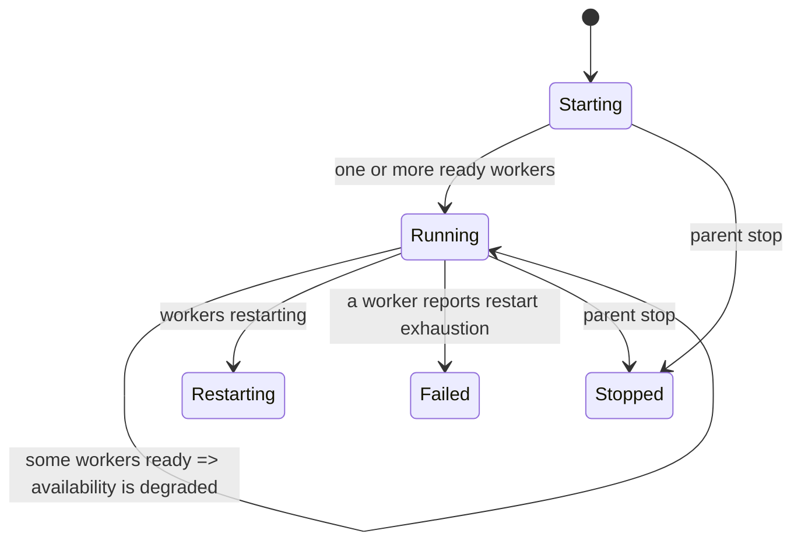
```mermaid
stateDiagram-v2
    [*] --> Starting
    Starting --> Running: one or more ready workers
    Running --> Running: some workers ready => availability is degraded
    Running --> Restarting: workers restarting
    Running --> Failed: a worker reports restart exhaustion
    Starting --> Stopped: parent stop
    Running --> Stopped: parent stop
```

### Messages

| Message | Direction | Meaning |
| --- | --- | --- |
| `MessageDeploymentPoolAddWorker` | deployment manager → deployment pool | Requests exactly one additional worker. |
| `MessageDeploymentPoolRemoveWorker` | deployment manager → deployment pool | Requests exactly one fewer worker, never the final worker. |
| `MessageDeploymentPoolResized` | deployment pool → deployment manager | Reports the one-worker resize result. |
| `MessageDeploymentPoolStatusChanged` | deployment pool → deployment manager | Reports aggregated worker lifecycle and availability. |
| `MessageDeploymentWorkerStatusChanged` | deployment worker → deployment pool | Updates worker health before aggregate pool status is published. |
| `MessageDeploymentWorkerStopped` | deployment worker → deployment pool → deployment manager | Removes the worker and reports calls that can no longer complete. |
| `MessageDeploymentWorkerRestartExhausted` | deployment worker → deployment pool → deployment manager | Escalates exhausted worker recovery to pool replacement. |
| `MessageInvokePlugin` | deployment manager → deployment pool → deployment worker | Pool-routes one manager-dispatched call to a mailbox-size-one worker. |

### Readiness

`deploymentPool` is an Ergo actor pool with mailbox size 1 and parent-authorized one-worker resize operations. It is ready when all desired workers are healthy, degraded when some are healthy, and unavailable while starting, restarting, or failed.

## Deployment Worker

### Lifecycle

Each worker owns one replaceable meta alias, uses independent normal and health restart budgets, and has `idle`/`busy` activity separate from lifecycle. A ready worker periodically pings the meta; ping timeout/error retires its alias and takes the health-recovery path. Exhaustion marks the worker failed and notifies its pool.

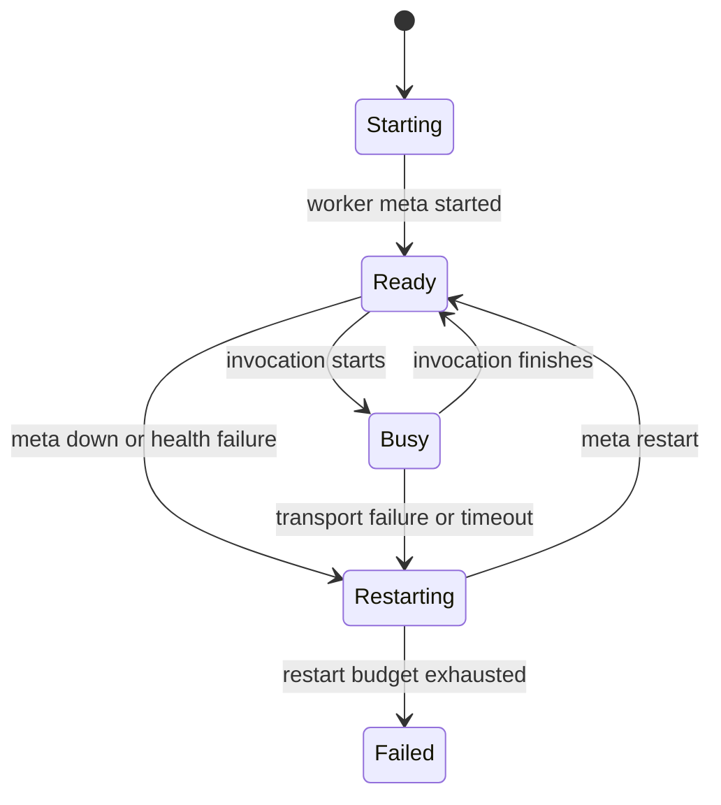
```mermaid
stateDiagram-v2
    [*] --> Starting
    Starting --> Ready: worker meta started
    Ready --> Busy: invocation starts
    Busy --> Ready: invocation finishes
    Ready --> Restarting: meta down or health failure
    Busy --> Restarting: transport failure or timeout
    Restarting --> Ready: meta restart
    Restarting --> Failed: restart budget exhausted
```

### Messages

| Message | Direction | Meaning |
| --- | --- | --- |
| `MessageInvokePlugin` | deployment manager → deployment pool → deployment worker | Delivers one routed call to a mailbox-size-one worker. |
| `MessageInvocationStarted` | deployment worker → deployment manager | Confirms worker start and clears dispatch deadline. |
| `MessageInvocationFinished` | deployment worker → deployment manager | Returns the one-shot invocation result. |
| `MessageWorkerMetaRestart` | deployment worker → deployment worker | Token-fenced normal or health restart timer. |
| `MessageWorkerMetaHealthTick` | deployment worker → deployment worker | Drives the next meta Ping attempt. |
| `MessageWorkerMetaHealthTimeout` | deployment worker → deployment worker | Retires an unanswered meta health check. |
| `MessageWorkerMetaStartResult` | worker meta → deployment worker | Drives ready state or normal restart. |
| `MessageWorkerMetaPing` | deployment worker → worker meta | Performs the parent-authorized health RPC. |
| `MessageWorkerMetaPingResult` | worker meta → deployment worker | Drives health confirmation or health restart. |
| `gen.MessageDownAlias` | Ergo meta monitor → deployment worker | Retires the current meta and starts normal/health recovery. |
| `MessageDeploymentWorkerStatusChanged` | deployment worker → deployment pool | Publishes lifecycle, availability, and idle/busy activity. |
| `MessageDeploymentWorkerStopped` | deployment worker → deployment pool | Reports worker shutdown. |
| `MessageDeploymentWorkerRestartExhausted` | deployment worker → deployment pool → deployment manager | Escalates exhausted local recovery. |
| `SendExitMeta` | deployment worker → Ergo meta runtime | Requests worker-meta termination before recovery. |
| `Terminate` | Ergo meta runtime → worker meta | Invokes meta cleanup after the worker's exit request. |

### Readiness

The worker is ready only when its current meta alias is ready. Its lifecycle, availability, and idle/busy activity are distinct parts of its operational/composite state.

## Worker Meta

### Lifecycle

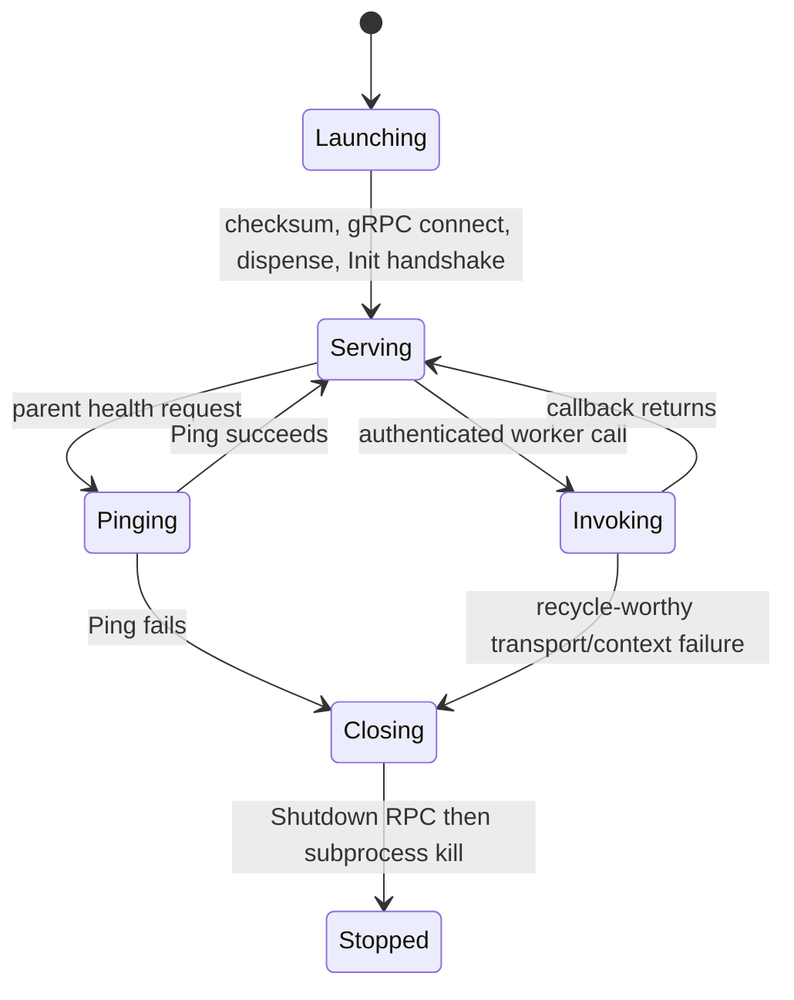
```mermaid
stateDiagram-v2
    [*] --> Launching
    Launching --> Serving: checksum, gRPC connect, dispense, Init handshake
    Serving --> Pinging: parent health request
    Pinging --> Serving: Ping succeeds
    Pinging --> Closing: Ping fails
    Serving --> Invoking: authenticated worker call
    Invoking --> Serving: callback returns
    Invoking --> Closing: recycle-worthy transport/context failure
    Closing --> Stopped: Shutdown RPC then subprocess kill
```

### Messages

| Message | Direction | Meaning |
| --- | --- | --- |
| `MessageWorkerMetaStartResult` | worker meta → deployment worker | Reports checksum/handshake/session startup outcome for its alias. |
| `MessageWorkerMetaPing` | deployment worker → worker meta | Requests a parent-authorized health RPC. |
| `MessageWorkerMetaPingResult` | worker meta → deployment worker | Returns the alias-fenced Ping result. |
| `workerInvokeCall` | deployment worker → worker meta | Synchronous parent-only callback invocation. |
| `Shutdown` | worker meta → plugin RPC | Bounded session shutdown before client kill. |
| `SendExitMeta` | deployment worker → Ergo meta runtime | Requests meta termination after a recycle-worthy failure or shutdown. |
| `Terminate` | Ergo meta runtime → worker meta | Invokes session close after the worker's exit request. |

### Readiness

The meta verifies the artifact checksum before `exec.CommandContext`, requires the configured gRPC handshake, and runs `Init`. Only its parent worker may call or ping it. It sends `Shutdown` with a three-second bound then kills the client on close. Plugin `Unavailable`, malformed responses, transport failures, invocation cancellation/timeouts, and health failures retire the alias and enter bounded health recovery.

## Invocation

### Lifecycle

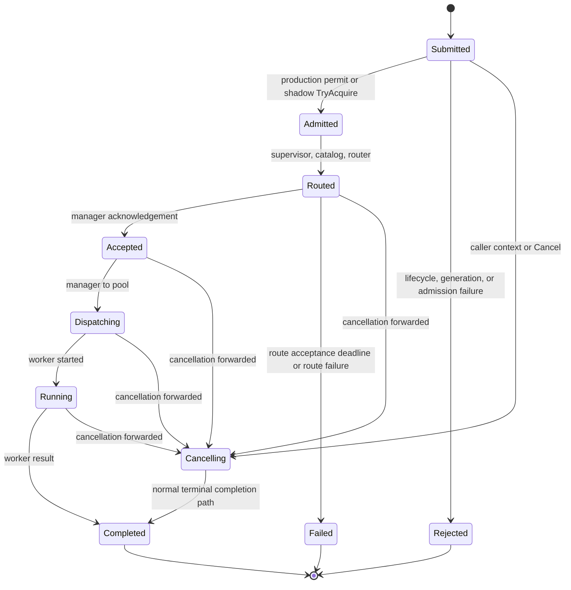
```mermaid
stateDiagram-v2
    [*] --> Submitted
    Submitted --> Admitted: production permit or shadow TryAcquire
    Submitted --> Rejected: lifecycle, generation, or admission failure
    Admitted --> Routed: supervisor, catalog, router
    Routed --> Accepted: manager acknowledgement
    Routed --> Failed: route acceptance deadline or route failure
    Accepted --> Dispatching: manager to pool
    Dispatching --> Running: worker started
    Running --> Completed: worker result
    Submitted --> Cancelling: caller context or Cancel
    Routed --> Cancelling: cancellation forwarded
    Accepted --> Cancelling: cancellation forwarded
    Dispatching --> Cancelling: cancellation forwarded
    Running --> Cancelling: cancellation forwarded
    Cancelling --> Completed: normal terminal completion path
    Completed --> [*]
    Failed --> [*]
    Rejected --> [*]
```

### Messages

| Message | Direction | Meaning |
| --- | --- | --- |
| `Submit` | caller → `plugin.Application` | Acquires the blocking production permit. |
| `SubmitShadow` | caller → `plugin.Application` | Uses the separate non-blocking best-effort shadow permit. |
| `MessageSubmitInvocation` | `plugin.Application` → runtime supervisor | Enters an admitted invocation into the runtime tree. |
| `MessageInvokePlugin` | runtime supervisor → catalog → router → deployment manager → deployment pool → deployment worker | Carries the routed call to one worker. |
| `MessageCancelInvocation` | `plugin.Application` → runtime supervisor → catalog → router → deployment manager | Follows the fenced accepted/pending manager path. |
| `MessageInvocationAccepted` | deployment manager → router | Binds the routed call to its manager before completion/cancellation. |
| `MessageInvocationStarted` | deployment worker → deployment manager | Moves the accepted call from dispatching to running. |
| `MessageInvocationFinished` | deployment worker → deployment manager | Returns the worker invocation result. |
| `MessageInvocationCompleted` | manager → router → catalog → runtime supervisor | Completes the idempotent `runtime.AsyncResult` once. |

### Readiness

Submission requires a running application and a runtime whose expected generation is exactly ready and committed; draining or a desired-state barrier rejects it as unavailable. Every terminal path enters the idempotent `runtime.AsyncResult`; `Invocation` closes `Done` only when that result completes. Call IDs bind one supervisor, catalog, router, manager, and worker path; PID/alias plus generation/epoch checks reject stale completion, status, and recovery facts.

## References

- [`internal/runtime/plugin/runtime_application.go`](../../internal/runtime/plugin/runtime_application.go) - application lifecycle, admission, State,
  submit, completion.
- [`internal/runtime/plugin/runtime_supervisor.go`](../../internal/runtime/plugin/runtime_supervisor.go) - RestForOne tree, desired-state barrier,
  projection commit, drain.
- [`internal/runtime/plugin/reconciler_actor.go`](../../internal/runtime/plugin/reconciler_actor.go),
  [`artifact_resolver_meta.go`](../../internal/runtime/plugin/artifact_resolver_meta.go), and
  [`artifact_watcher_meta.go`](../../internal/runtime/plugin/artifact_watcher_meta.go) - desired state and local artifact facts.
- [`internal/runtime/plugin/catalog_actor.go`](../../internal/runtime/plugin/catalog_actor.go) and
  [`router_actor.go`](../../internal/runtime/plugin/router_actor.go) - router ownership, route lifecycle, rollout, and fences.
- [`internal/runtime/plugin/deployment_manager.go`](../../internal/runtime/plugin/deployment_manager.go),
  [`deployment_pool.go`](../../internal/runtime/plugin/deployment_pool.go),
  [`deployment_worker.go`](../../internal/runtime/plugin/deployment_worker.go), and
  [`worker_meta.go`](../../internal/runtime/plugin/worker_meta.go) - queue, workers, subprocess, recovery, and drain.
- [`internal/runtime/invocation.go`](../../internal/runtime/invocation.go) and
  [`internal/runtime/backoff.go`](../../internal/runtime/backoff.go) - one-shot completion and shared scheduled backoff.
