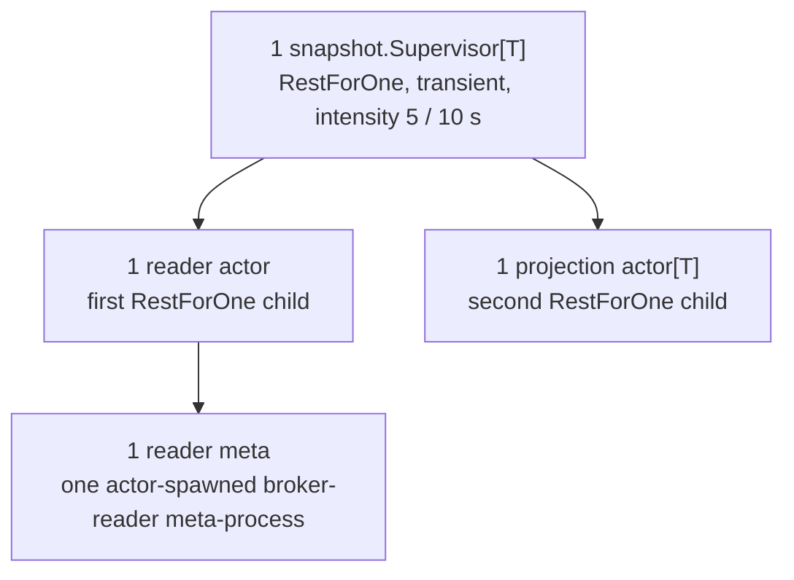
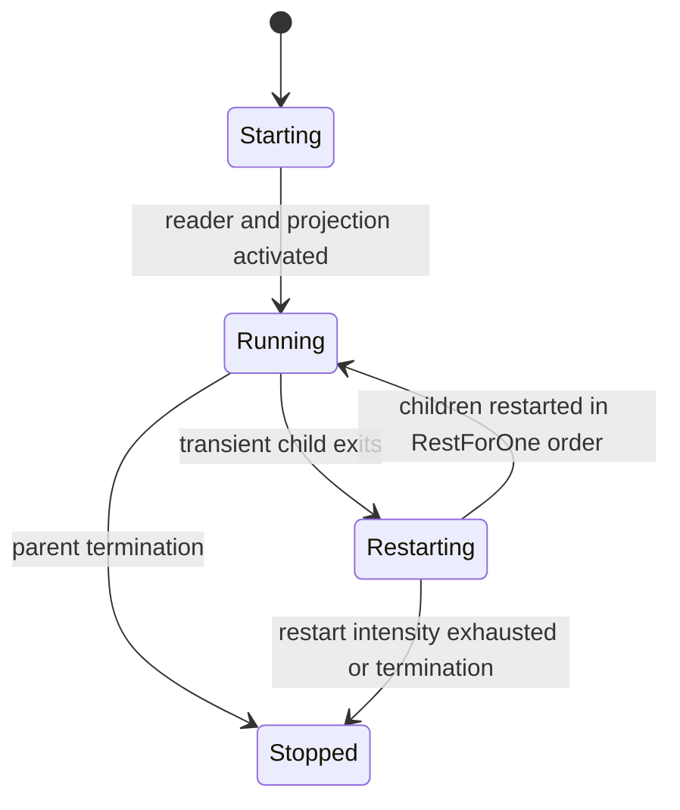
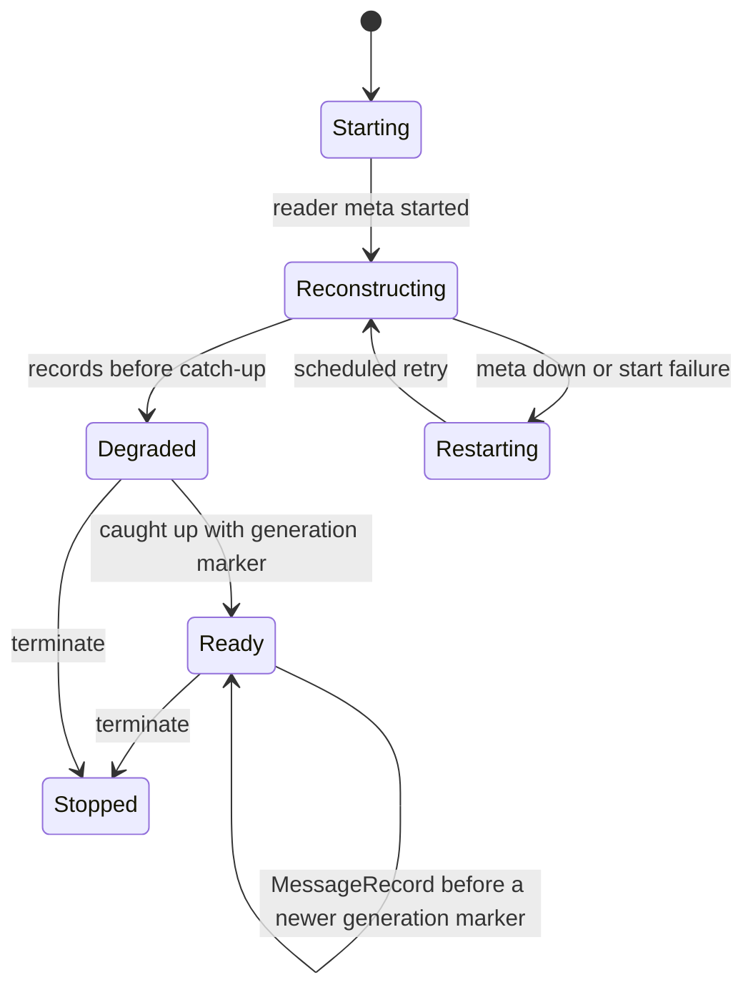
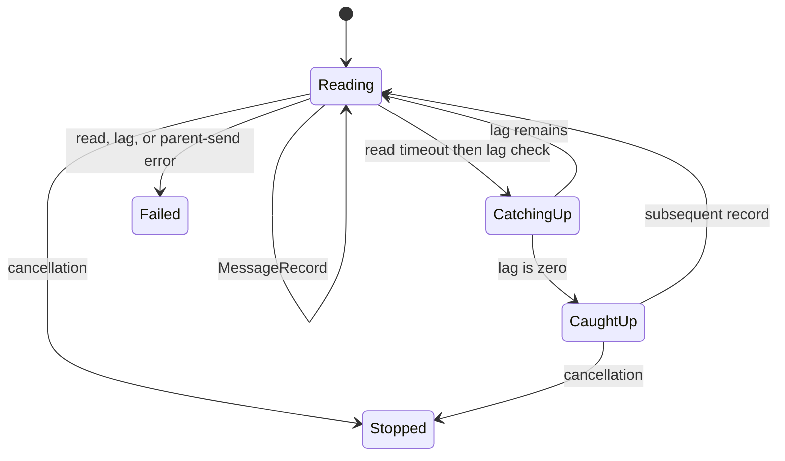
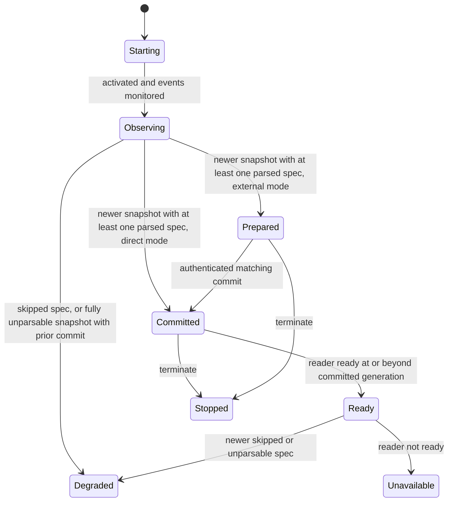

# Snapshot Runtime

The generic `internal/runtime/snapshot` subtree reconstructs a compacted snapshot topic and exposes a typed, immutable projection. It is instantiated once for matcher metadata inside the plugin runtime (external commit) and once for rule metadata in `event_matcher` (direct commit). It is not a process pool.

## Composition

Rest-for-one ordering is significant: a reader restart restarts the following projection; a projection restart does not restart the reader. The supervisor does not auto-shutdown and retains only the latest snapshot and reader-status events (buffer size 1).

## Messages

| Message                               | Direction                                                | Meaning                                                                           |
| ------------------------------------- | -------------------------------------------------------- | --------------------------------------------------------------------------------- |
| `MessageReaderActorActivate`          | snapshot supervisor → reader actor                       | Authenticates reader-meta startup and supplies the snapshot event identity.       |
| `MessageProjectionActorActivate`      | snapshot supervisor → projection actor                   | Authorizes buffered snapshot/status event monitoring.                             |
| `MessageReaderActorStatusChanged`     | reader actor → snapshot supervisor                       | Publishes the current reader lifecycle, availability, and committed generation.   |
| `MessageProjectionActorStatusChanged` | projection actor → snapshot supervisor                   | Publishes projection lifecycle, availability, and committed/prepared generations. |
| `MessageProjectionCommit`             | external parent → snapshot supervisor → projection actor | Requests a PID/generation-fenced commit in external-commit mode only.             |
| `MessageProjectionCommitResult`       | projection actor → snapshot supervisor → external parent | Returns the PID/generation-fenced external-commit result.                         |

## Roles

| Role                | Default name or identity                              | Owner               | Responsibility                                                             |
| ------------------- | ----------------------------------------------------- | ------------------- | -------------------------------------------------------------------------- |
| Snapshot supervisor | registered `SupervisorOptions.Name`                   | parent runtime      | Owns child PIDs, stable events, and external-commit forwarding.            |
| Reader actor        | child PID named `<SupervisorOptions.Name>-reader`     | snapshot supervisor | Owns effective entries, the committed generation, and reader-meta restart. |
| Reader meta         | `gen.Alias` returned by `SpawnMeta`                   | reader actor        | Owns blocking broker reads and catch-up detection.                         |
| Projection actor    | child PID named `<SupervisorOptions.Name>-projection` | snapshot supervisor | Owns typed parsed committed/prepared state.                                |

## Readiness

The matcher runtime uses `ProjectionCommitExternal`, so its parent coordinates visibility; the rule tree uses `ProjectionCommitDirect`, so a complete parsed snapshot becomes visible immediately. A projection is `Ready` only with a committed generation, a ready reader, and reader and observed generations at or beyond that commit.

## Snapshot Supervisor

### Lifecycle

### Messages

| Message                | Direction                                     | Meaning                                                                                    |
| ---------------------- | --------------------------------------------- | ------------------------------------------------------------------------------------------ |
| `HandleChildStart`     | Ergo supervisor runtime → snapshot supervisor | Records and activates the reader or projection child incarnation.                          |
| `HandleChildTerminate` | Ergo supervisor runtime → snapshot supervisor | Marks a child unavailable and reports external commit failure for a terminated projection. |

### Readiness

The supervisor reports only the latest reader status through its buffered status event. In external-commit mode, it stamps projection status with the current projection PID and forwards status and matching commit results to its parent.

## Reader Actor

### Lifecycle

The reader actor starts a reader meta only after parent activation. It fences `MessageRecord` and `MessageCaughtUp` by the current meta alias. Records update an in-memory effective-entry map; a generation marker creates a sorted, cloned committed snapshot. Tombstones remove entries. A backwards generation is rejected, and malformed entries or markers are logged and ignored.

### Messages

| Message                    | Direction                                            | Meaning                                                               |
| -------------------------- | ---------------------------------------------------- | --------------------------------------------------------------------- |
| `MessageRecord`            | reader meta → reader actor                           | Alias-fenced compacted-topic record or generation marker.             |
| `MessageCaughtUp`          | reader meta → reader actor                           | Alias-fenced zero-lag boundary that permits readiness after a marker. |
| `MessageReaderMetaRestart` | reader actor → reader actor                          | Token-fenced reader-meta restart timer.                               |
| `gen.MessageDownAlias`     | Ergo meta monitor → reader actor                     | Marks the reader meta unavailable and schedules retry.                |
| `SendEvent`                | reader actor → snapshot supervisor event subscribers | Publishes a committed snapshot to buffered and live consumers.        |

### Readiness

The reader publishes only after both a generation marker and catch-up. Once ready, later records retain `Ready` and the prior committed generation until a newer generation marker commits the next snapshot; records alone do not degrade reader availability.

## Reader Meta

### Lifecycle

The meta polls up to 250 ms while catching up, then checks lag. It copies broker bytes before sending records to its parent actor.

### Messages

| Message        | Direction                   | Meaning                                                                       |
| -------------- | --------------------------- | ----------------------------------------------------------------------------- |
| `ReadMessage`  | reader meta → broker reader | Reads one compacted-topic record without committing offsets.                  |
| `ReadLag`      | reader meta → broker reader | Checks lag after a read timeout.                                              |
| `SendExitMeta` | reader actor → Ergo runtime | Requests reader-meta termination during replacement or shutdown.              |
| `Terminate`    | Ergo runtime → reader meta  | Cancels reads and closes the concrete reader after the parent's exit request. |

### Readiness

The reader actor owns reader-meta creation, restart/backoff, public status, snapshot state, and publication. The meta reports records and catch-up facts only; its alias prevents a replaced meta from changing the current reader state.

## Projection Actor

### Lifecycle

The projection actor monitors buffered snapshot and reader-status events. It parses every artifact spec through its typed loader. A spec that fails to parse is skipped rather than discarding the generation: the remaining plugins are prepared or committed as usual, the joined parse errors are retained, and the actor reports degraded until a later generation parses cleanly. A generation in which nothing parsed carries no usable projection, so it leaves the last committed projection intact and reports degraded. `ProjectionClient` uses the stable projection child name and returns a deep clone.

### Messages

| Message                  | Direction                                    | Meaning                                                                         |
| ------------------------ | -------------------------------------------- | ------------------------------------------------------------------------------- |
| `gen.MessageEvent`       | snapshot supervisor event → projection actor | Buffered and live snapshot events drive observed, prepared, or committed state. |
| `gen.MessageEvent`       | snapshot supervisor event → projection actor | Buffered and live reader-status events drive readiness.                         |
| `ProjectionStateRequest` | `ProjectionClient.State` → projection actor  | Reads a deep-cloned current committed projection.                               |
| `gen.MessageDownEvent`   | Ergo event monitor → projection actor        | Terminates the projection when a monitored snapshot or status event ends.       |

### Readiness

Direct mode commits a complete parsed generation on receipt. In external mode, commit succeeds when the requested generation matches observed and is prepared or already committed; otherwise it returns `ErrProjectionNotPrepared`. External-mode parents receive stamped projection PIDs and commit results, preventing a stale child from being acknowledged.

## Retry and Shutdown

No actor accepts an unrelated synchronous call. Reader restart uses the shared `runtime.ScheduledBackoff`: exponential multiplier 2, configured min/max, five retries, and token invalidation on cancellation or reset. Parent termination marks reader and projection stopped/unavailable; an optional `Stopped` channel receives the reason without blocking shutdown.

## Source Map

- [`internal/runtime/snapshot/snapshot_supervisor.go`](../../internal/runtime/snapshot/snapshot_supervisor.go) - child order, RestForOne policy, event registration,
  and external commit fencing.
- [`internal/runtime/snapshot/snapshot_reader_actor.go`](../../internal/runtime/snapshot/snapshot_reader_actor.go) - snapshot construction, reader status, alias
  fencing, and restart.
- [`internal/runtime/snapshot/snapshot_reader_meta.go`](../../internal/runtime/snapshot/snapshot_reader_meta.go) - blocking reads, catch-up/lag protocol, and close.
- [`internal/runtime/snapshot/projection_actor.go`](../../internal/runtime/snapshot/projection_actor.go) - projection modes, state call, parse, and commit semantics.
- [`internal/runtime/backoff.go`](../../internal/runtime/backoff.go) and [`internal/runtime/snapshot/options.go`](../../internal/runtime/snapshot/options.go) - shared
  retry policy and configuration.
