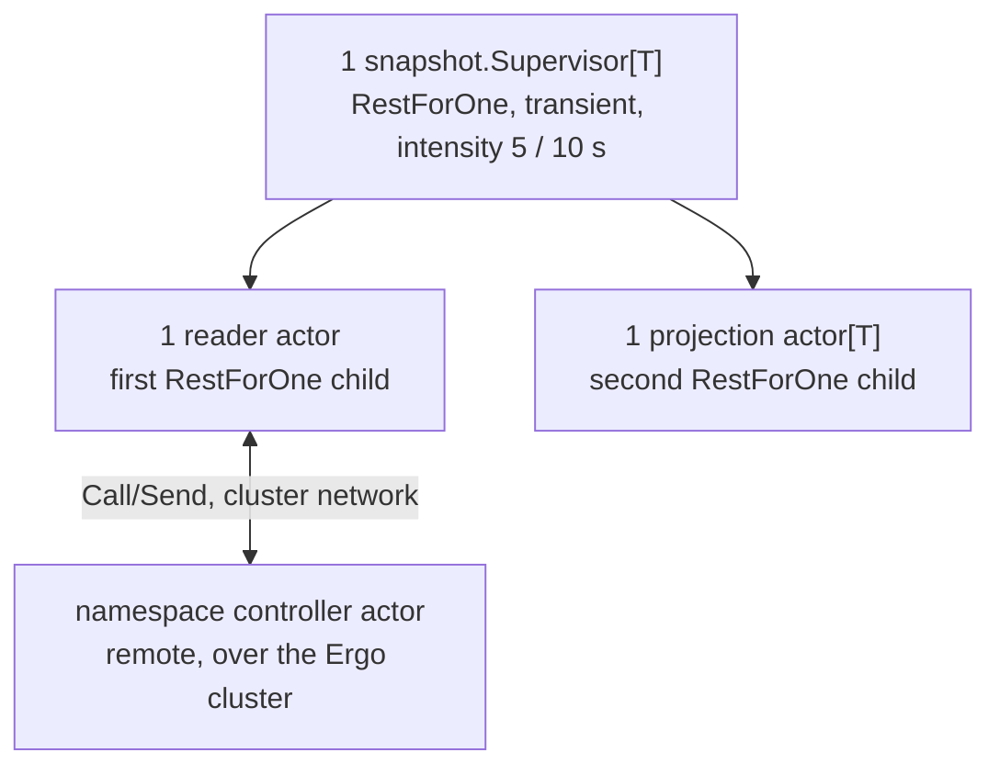
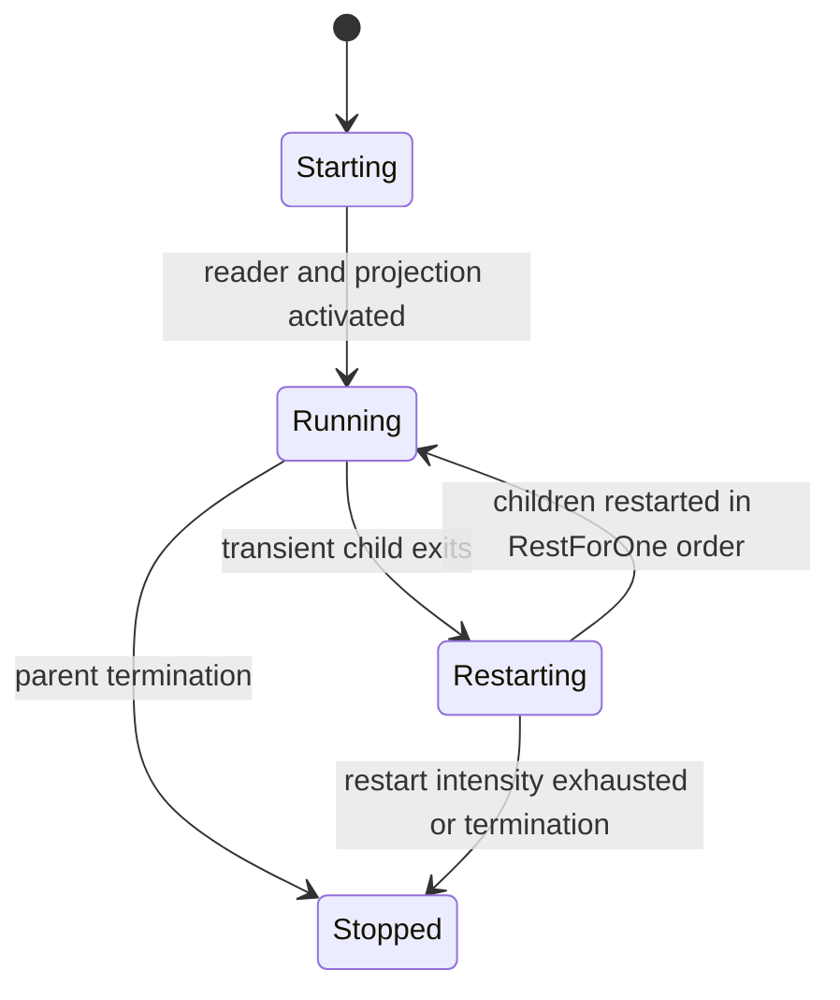
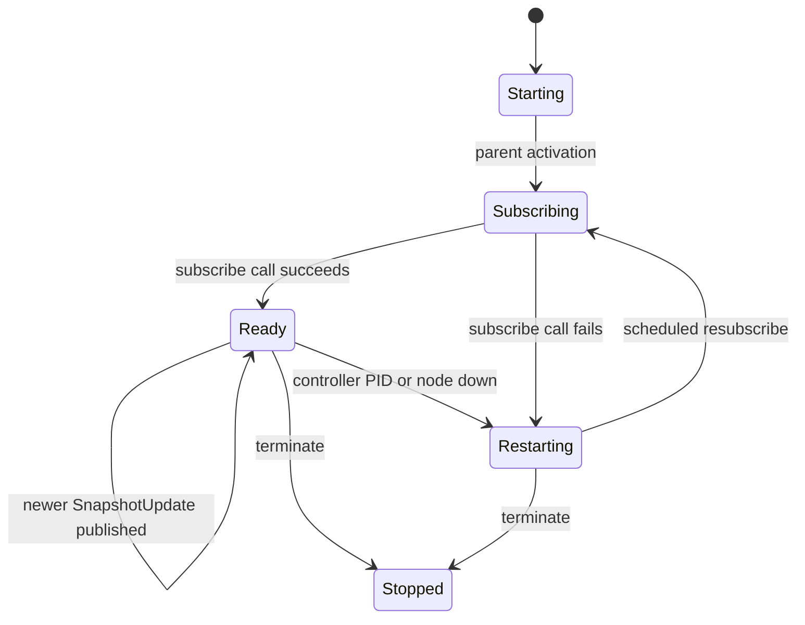
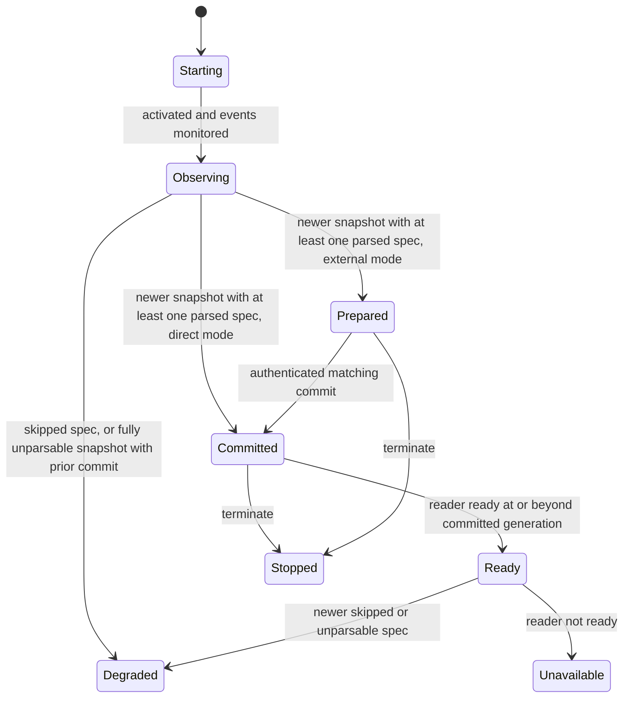

# Snapshot Runtime

The generic `internal/runtime/snapshot` subtree subscribes to one namespace's controller actor over the native Ergo cluster and exposes a typed, immutable projection. Two instances exist: matcher metadata inside the plugin runtime (external commit), and rule metadata in `event_matcher` (direct commit). It is not a process pool.

## Composition

Rest-for-one ordering matters. A reader restart restarts the projection behind it; a projection restart leaves the reader alone. The supervisor does not auto-shutdown, and keeps only the latest snapshot and reader-status events (buffer size 1).

There is no meta process in this subtree. Ergo remote delivery is push-based - a message lands directly in the reader actor's mailbox - so the reader needs no blocking read loop to bridge into the actor mailbox, unlike a pull-based transport.

## Messages

| Message                               | Direction                                                | Meaning                                                                           |
| -------------------------------------- | -------------------------------------------------------- | ---------------------------------------------------------------------------------- |
| `MessageReaderActorActivate`          | snapshot supervisor → reader actor                       | Authenticates reader startup and supplies the snapshot event identity.            |
| `MessageProjectionActorActivate`      | snapshot supervisor → projection actor                   | Authorizes buffered snapshot/status event monitoring.                             |
| `MessageReaderActorStatusChanged`     | reader actor → snapshot supervisor                       | Publishes the current reader lifecycle, availability, and committed generation.   |
| `MessageProjectionActorStatusChanged` | projection actor → snapshot supervisor                   | Publishes projection lifecycle, availability, and committed/prepared generations. |
| `MessageProjectionCommit`             | external parent → snapshot supervisor → projection actor | Requests a PID/generation-fenced commit in external-commit mode only.             |
| `MessageProjectionCommitResult`       | projection actor → snapshot supervisor → external parent | Returns the PID/generation-fenced external-commit result.                         |

## Roles

| Role                | Default name or identity                              | Owner               | Responsibility                                                                    |
| -------------------- | ------------------------------------------------------ | -------------------- | ------------------------------------------------------------------------------------ |
| Snapshot supervisor | registered `SupervisorOptions.Name`                   | parent runtime      | Owns child PIDs, stable events, and external-commit forwarding.                   |
| Reader actor        | child PID named `<SupervisorOptions.Name>-reader`     | snapshot supervisor | Subscribes to the namespace controller actor and owns the committed generation, controller-loss detection, and resubscribe backoff. |
| Projection actor    | child PID named `<SupervisorOptions.Name>-projection` | snapshot supervisor | Owns typed parsed committed/prepared state.                                        |

## Readiness

The matcher runtime uses `ProjectionCommitExternal`, so its parent coordinates visibility. The rule tree uses `ProjectionCommitDirect`, so a complete parsed snapshot is visible at once. A projection is `Ready` only with a committed generation, a ready reader, and reader and observed generations at or beyond that commit.

## Snapshot Supervisor

### Lifecycle

### Messages

| Message                | Direction                                     | Meaning                                                                                    |
| ---------------------- | --------------------------------------------- | ------------------------------------------------------------------------------------------ |
| `HandleChildStart`     | Ergo supervisor runtime → snapshot supervisor | Records and activates the reader or projection child incarnation.                          |
| `HandleChildTerminate` | Ergo supervisor runtime → snapshot supervisor | Marks a child unavailable and reports external commit failure for a terminated projection. |

### Readiness

The supervisor reports only the latest reader status, through its buffered status event. In external-commit mode it stamps projection status with the current projection PID, and forwards status and matching commit results to its parent.

## Reader Actor

### Lifecycle

On parent activation, the reader actor issues one bounded `Call` (`SubscribeRequest{ExecutorID, KnownGeneration, Role}`) directly to `ReaderActorOptions.Endpoint` - the target namespace's controller actor, addressed by `gen.ProcessID{Name, Node}` across the cluster. Actors (unlike meta processes) may originate a `Call`; it is bounded by an explicit timeout, so it never blocks the mailbox unboundedly.

The `SubscribeResponse` carries the controller's current committed snapshot (`Current`, possibly nil if the controller hasn't bootstrapped yet) and its own PID (`ControllerPID`). If `Current.Generation` is newer than the last one this reader published, it publishes immediately - the synchronous response *is* the catch-up signal, with no separate polling phase. The reader then `MonitorPID`s the controller and `MonitorNode`s its cluster node, and thereafter passively receives pushed `SnapshotUpdate` messages: each is published only if its generation is newer than the last one seen, so a redundant or duplicate push is a no-op.

On `gen.MessageDownPID` (controller process died) or `gen.MessageDownNode` (controller's node left the cluster), the reader marks itself unsubscribed and schedules a resubscribe attempt, carrying its last known generation as `KnownGeneration` - the controller's `SubscribeRequest` handler does not currently read this field and always returns the full committed snapshot; the reader itself skips republishing a burst that is not newer than `lastGeneration`. On `Terminate`, it best-effort notifies the controller (`UnsubscribeRequest`) before exiting.

### Messages

| Message                    | Direction                                            | Meaning                                                                            |
| -------------------------- | ----------------------------------------------------- | ------------------------------------------------------------------------------------ |
| `SubscribeRequest`/`Response` | reader actor ↔ controller actor (cluster `Call`)   | Bounded handshake: registers the reader as a subscriber and returns the current committed snapshot. |
| `SnapshotUpdate`            | controller actor → reader actor (cluster `SendImportant`) | One commit's full state, pushed to every subscriber; applied only if newer than the last seen generation. |
| `UnsubscribeRequest`        | reader actor → controller actor (cluster `Send`)      | Best-effort cleanup hint on shutdown; `MonitorPID` on the controller side is the authoritative removal path. |
| `MessageReaderRestart`      | reader actor → reader actor                           | Token-fenced resubscribe timer.                                                      |
| `gen.MessageDownPID`, `gen.MessageDownNode` | Ergo cluster monitor → reader actor  | Marks the controller unreachable and schedules a resubscribe.                        |
| `SendEvent`                 | reader actor → snapshot supervisor event subscribers | Publishes a committed snapshot to buffered and live consumers.                       |

### Readiness

The reader reports `Ready` only while subscribed; a controller-loss or a failed (re)subscribe attempt reports `Unavailable`. Because a `SnapshotUpdate`/initial `Current` is only published when its generation is strictly newer, a reader that is subscribed but has received nothing yet cannot itself make the downstream projection appear ready - the projection only advances on an actual publish.

## Projection Actor

### Lifecycle

The projection actor monitors buffered snapshot and reader-status events, and parses every artifact spec through its typed loader.

- A spec that fails to parse is skipped, not fatal to the generation. The rest are prepared or committed as usual, the joined parse errors are kept, and the actor reports degraded until a later generation parses cleanly.
- A generation where nothing parsed carries no usable projection. It leaves the last committed projection intact and reports degraded.

`ProjectionClient` uses the stable projection child name and returns a deep clone.

### Messages

| Message                  | Direction                                    | Meaning                                                                         |
| ------------------------- | ---------------------------------------------- | ---------------------------------------------------------------------------------- |
| `gen.MessageEvent`       | snapshot supervisor event → projection actor | Buffered and live snapshot events drive observed, prepared, or committed state. |
| `gen.MessageEvent`       | snapshot supervisor event → projection actor | Buffered and live reader-status events drive readiness.                        |
| `ProjectionStateRequest` | `ProjectionClient.State` → projection actor  | Reads a deep-cloned current committed projection.                              |
| `gen.MessageDownEvent`   | Ergo event monitor → projection actor        | Terminates the projection when a monitored snapshot or status event ends.      |

### Readiness

Direct mode commits a complete parsed generation on receipt. External mode commits when the requested generation matches observed and is prepared or already committed, and returns `ErrProjectionNotPrepared` otherwise. Its parents get stamped projection PIDs and commit results, so a stale child is never acknowledged.

## Retry and Shutdown

No actor accepts an unrelated synchronous call. Reader resubscribe uses the shared `runtime.ScheduledBackoff`: exponential multiplier 2, configured min and max, five retries, token invalidated on cancellation or reset. Parent termination marks reader and projection stopped and unavailable. An optional `Stopped` channel receives the reason without blocking shutdown.

## Source Map

- [`internal/runtime/snapshot/snapshot_supervisor.go`](../../internal/runtime/snapshot/snapshot_supervisor.go) - child order, RestForOne policy, event registration, and external commit fencing.
- [`internal/runtime/snapshot/snapshot_reader_actor.go`](../../internal/runtime/snapshot/snapshot_reader_actor.go) - subscribe/resubscribe, controller-loss detection, snapshot publication, and reader status.
- [`internal/runtime/snapshot/subscription.go`](../../internal/runtime/snapshot/subscription.go) - the wire vocabulary (`SubscribeRequest`/`Response`, `SnapshotUpdate`, `UnsubscribeRequest`) shared with the controller actor, and its EDF type registration list.
- [`internal/runtime/snapshot/projection_actor.go`](../../internal/runtime/snapshot/projection_actor.go) - projection modes, state call, parse, and commit semantics.
- [`internal/runtime/backoff.go`](../../internal/runtime/backoff.go) and [`internal/runtime/snapshot/options.go`](../../internal/runtime/snapshot/options.go) - shared retry policy and configuration.
