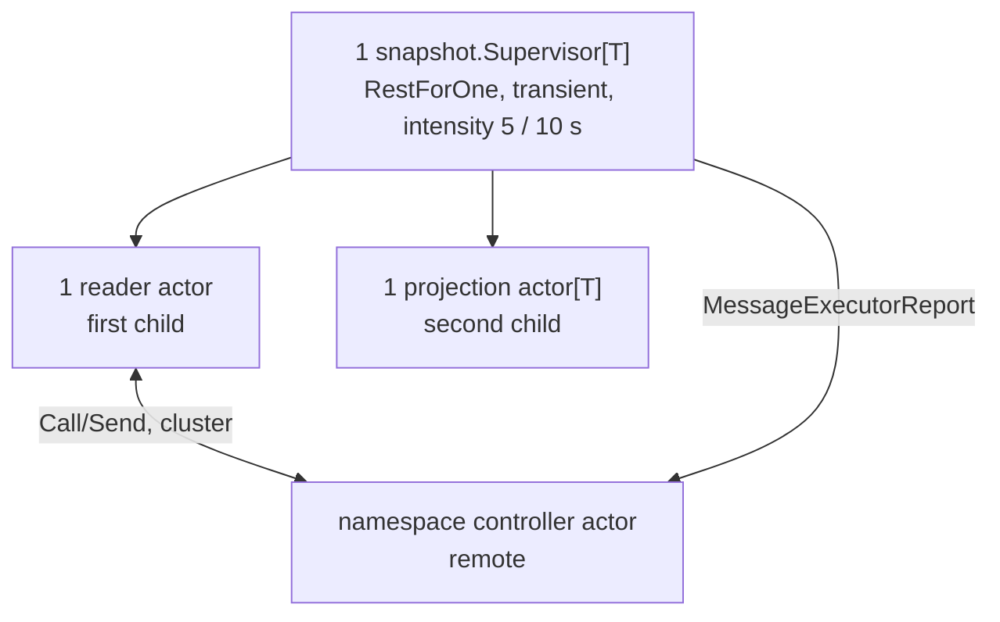
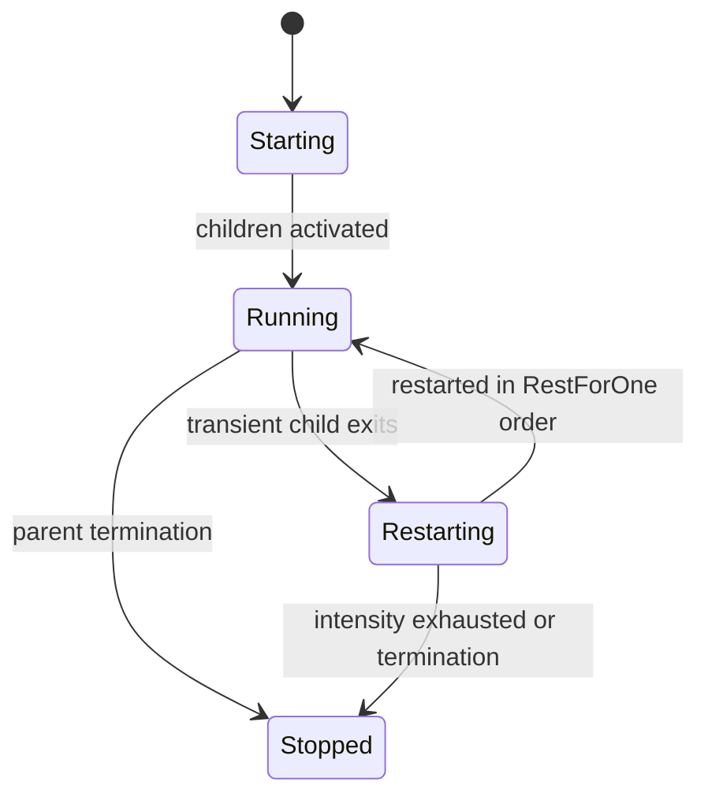
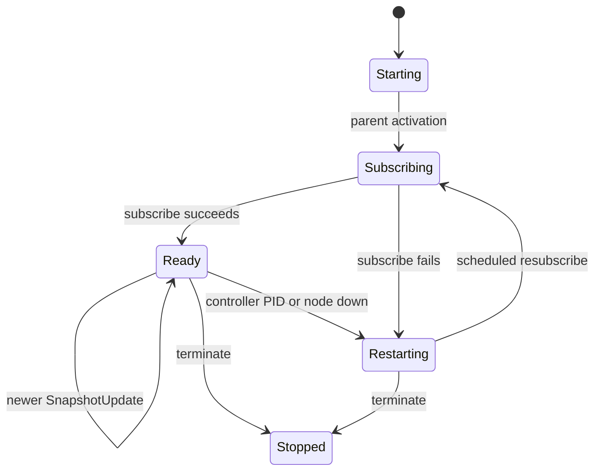
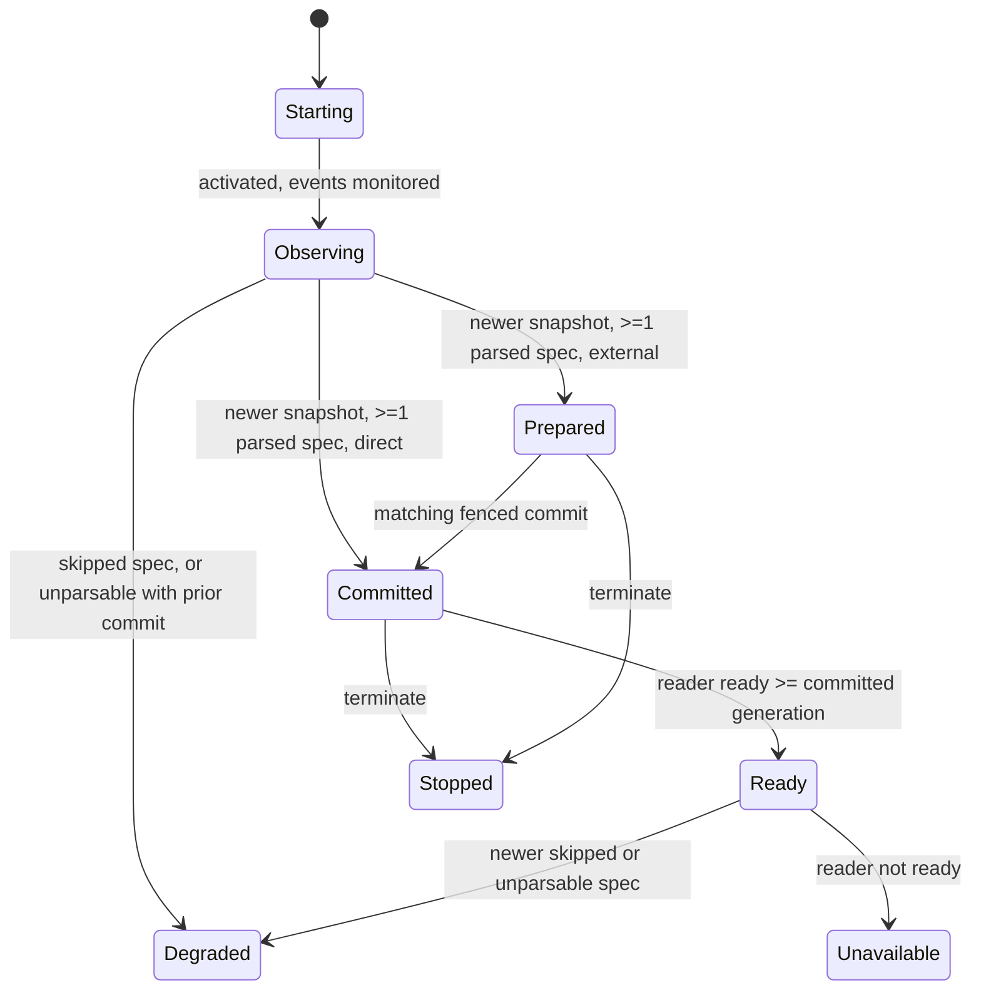

# Snapshot runtime

[Internals index](README.md) · [Controller runtime](controller-runtime.md) · [Plugin runtime](plugin-runtime.md)

The `internal/runtime/snapshot` subtree subscribes to one namespace's controller actor over the Ergo cluster and exposes a typed, immutable projection. Two instances: matcher metadata in the plugin runtime (external commit), rules in `event_matcher` (direct commit).

## Composition

- A reader restart restarts the projection behind it; a projection restart does not.
- No auto-shutdown. The supervisor keeps only the latest snapshot and reader-status events (buffer size 1).
- No meta process: Ergo pushes remote messages into the reader's mailbox.

## Messages

| Message                               | Direction                                                | Meaning                                                                       |
| ------------------------------------- | -------------------------------------------------------- | ----------------------------------------------------------------------------- |
| `MessageReaderActorActivate`          | snapshot supervisor → reader actor                       | Authorizes the controller subscription.                                       |
| `MessageProjectionActorActivate`      | snapshot supervisor → projection actor                   | Authorizes snapshot/status event monitoring.                                  |
| `MessageReaderActorStatusChanged`     | reader actor → snapshot supervisor                       | Publishes reader lifecycle, availability, committed generation.               |
| `MessageProjectionActorStatusChanged` | projection actor → snapshot supervisor                   | Publishes projection lifecycle, availability, committed/prepared generations. |
| `MessageProjectionCommit`             | external parent → snapshot supervisor → projection actor | Requests a PID/generation-fenced commit, external-commit mode only.           |
| `MessageProjectionCommitResult`       | projection actor → snapshot supervisor → external parent | Returns the fenced external-commit result.                                    |
| `MessageExecutorReportTick`           | snapshot supervisor → snapshot supervisor                | Periodic convergence-report timer.                                            |
| `MessageRadarTick`                    | snapshot supervisor → snapshot supervisor                | Periodic radar collector registration retry.                                  |
| `MessageExecutorReport`               | snapshot supervisor → controller actor (cluster `Send`)  | Convergence report: generation received, generation held live.                |

## Roles

| Role                | Default name or identity                | Owner               | Responsibility                                                                      |
| ------------------- | --------------------------------------- | ------------------- | ----------------------------------------------------------------------------------- |
| Snapshot supervisor | `snapshot-<namespace>-supervisor`       | parent runtime      | Child PIDs, stable events, commit forwarding, convergence reporting.                |
| Reader actor        | `snapshot-<namespace>-reader-actor`     | snapshot supervisor | Controller subscription, committed generation, loss detection, resubscribe backoff. |
| Projection actor    | `snapshot-<namespace>-projection-actor` | snapshot supervisor | Typed parsed committed/prepared state.                                              |

- Names derive from `SupervisorOptions.Namespace` (the subtree's own, and the controller namespace its reader follows) via `SupervisorName`, `ReaderActorName`, `ProjectionActorName`, mirroring `controller-<namespace>-*`. None is configurable.
- `ReaderActorOptions` carries `Endpoint` and `ExecutorID`. The typed loader is a `NewSupervisor` parameter, not an option.
- Children get event identities at construction: the projection its two monitored names, the reader its one publication (name plus the `gen.Ref` token `SendEvent` requires).
- `ControllerActorName` names the subscription's far end.

## Readiness

`ProjectionCommitExternal` (matcher runtime) defers visibility to the parent; `ProjectionCommitDirect` (rule tree) makes a complete parsed snapshot visible at once. `Ready` needs a committed generation, a ready reader, and reader and observed generations at or beyond that commit.

## Snapshot supervisor

### Lifecycle

### Messages

| Message                | Direction                                     | Meaning                                                                                 |
| ---------------------- | --------------------------------------------- | --------------------------------------------------------------------------------------- |
| `HandleChildStart`     | Ergo supervisor runtime → snapshot supervisor | Records and activates a child incarnation.                                              |
| `HandleChildTerminate` | Ergo supervisor runtime → snapshot supervisor | Marks a child unavailable; reports external commit failure for a terminated projection. |

### Readiness

Only the latest reader status is reported. External-commit mode stamps projection status with the current PID, and forwards status and matching commit results upward.

### Executor reporting

The supervisor is the sole producer of `MessageExecutorReport{ExecutorID, Heartbeat, Applied, LastError}`, which the namespace controller folds into executor-convergence tracking (`/status`, `blink_controller_executors`, `blink_controller_executors_drifting`).

| Field                           | Source                                                                      | Meaning                                                                                                        |
| ------------------------------- | --------------------------------------------------------------------------- | -------------------------------------------------------------------------------------------------------------- |
| `Heartbeat.CommittedGeneration` | reader status `Generation`                                                  | The newest generation the controller has pushed here.                                                          |
| `Heartbeat.ReadyGeneration`     | projection status `CommittedGeneration`                                     | The generation this executor actually holds live.                                                              |
| `Heartbeat.Availability`        | projection availability, capped at `degraded` while the reader is not ready | A live projection with a dead reader still serves its last generation, but can no longer receive the next one. |
| `Applied`                       | a projection commit that advanced the generation                            | Edge event; `Admitted` is false when the generation went live degraded.                                        |
| `LastError`                     | reader status `LastError`                                                   | Why the reader is not subscribed.                                                                              |

Under `ProjectionCommitExternal` the two diverge while the parent fetches binaries; only its commit makes the new generation live.

Reports are fire-and-forget, sent every `executorReportInterval` (30 s, a quarter of the controller's stale threshold) on a self-scheduled `MessageExecutorReportTick`, and immediately when a commit advances, reader availability changes, or the reader terminates.

## Reader actor

### Lifecycle

- On activation: one bounded `Call` (`SubscribeRequest{ExecutorID, KnownGeneration}`) to `ReaderActorOptions.Endpoint`, the controller actor at `gen.ProcessID{Name, Node}`.
- `SubscribeResponse` returns the committed snapshot (`Current`, nil before bootstrap) and `ControllerPID`; a `Current.Generation` newer than the last published is published at once.
- It `MonitorPID`s the controller and `MonitorNode`s its node, then publishes pushed `SnapshotUpdate`s newer than the last generation seen.
- `gen.MessageDownPID` (controller died) or `gen.MessageDownNode` (its node left) marks the reader unsubscribed and schedules a resubscribe carrying the last generation as `KnownGeneration`.
- The controller's `SubscribeRequest` handler does not currently read `KnownGeneration` and always returns the full committed snapshot. The reader skips republishing a burst that is not newer than `lastGeneration`.
- `Terminate` best-effort notifies the controller (`UnsubscribeRequest`).

### Messages

| Message                                     | Direction                                                 | Meaning                                                                                        |
| ------------------------------------------- | --------------------------------------------------------- | ---------------------------------------------------------------------------------------------- |
| `SubscribeRequest`/`Response`               | reader actor ↔ controller actor (cluster `Call`)          | Bounded handshake: registers the subscriber, returns the committed snapshot.                   |
| `SnapshotUpdate`                            | controller actor → reader actor (cluster `SendImportant`) | One commit's full state, pushed to every subscriber; applied only if newer than the last seen. |
| `UnsubscribeRequest`                        | reader actor → controller actor (cluster `Send`)          | Best-effort shutdown hint; controller-side `MonitorPID` is the authoritative removal path.     |
| `MessageSubscribeRestart`                   | reader actor → reader actor                               | Token-fenced resubscribe timer.                                                                |
| `gen.MessageDownPID`, `gen.MessageDownNode` | Ergo cluster monitor → reader actor                       | Marks the controller unreachable and schedules a resubscribe.                                  |
| `SendEvent`                                 | reader actor → snapshot supervisor event subscribers      | Publishes a committed snapshot to buffered and live consumers.                                 |

### Readiness

`Ready` only while subscribed; a controller loss or failed (re)subscribe reports `Unavailable`.

## Projection actor

### Lifecycle

It monitors buffered snapshot and reader-status events and parses every spec through its typed loader.

- A failed spec is skipped; the rest are prepared or committed, joined parse errors kept, and the actor reports degraded until a later generation parses cleanly.
- A generation with nothing parsed leaves the last commit intact and reports degraded.

`ProjectionClient` uses the stable child name and returns a deep clone.

### Messages

| Message                  | Direction                                    | Meaning                                                       |
| ------------------------ | -------------------------------------------- | ------------------------------------------------------------- |
| `gen.MessageEvent`       | snapshot supervisor event → projection actor | Snapshot events drive observed, prepared, or committed state. |
| `gen.MessageEvent`       | snapshot supervisor event → projection actor | Reader-status events drive readiness.                         |
| `ProjectionStateRequest` | `ProjectionClient.State` → projection actor  | Reads a deep-cloned current committed projection.             |
| `gen.MessageDownEvent`   | Ergo event monitor → projection actor        | Terminates the projection when a monitored event ends.        |

### Readiness

Direct mode commits a complete parsed generation on receipt. External mode commits when the requested generation matches observed and is prepared or already committed, otherwise `ErrProjectionNotPrepared`. Parents get stamped PIDs and commit results.

## Telemetry

Every layer publishes into the node's radar application, labelled by `namespace` from `SupervisorOptions.Namespace`, which `Init` requires. Plumbing: `internal/runtime/telemetry`, shared with the controller runtime.

| Layer            | Registers       | Publishes through | Notes                                                                                                        |
| ---------------- | --------------- | ----------------- | ------------------------------------------------------------------------------------------------------------ |
| Supervisor       | every collector | itself            | Registers through `gen.Node`. Publishes every gauge.                                                         |
| Reader actor     | -               | itself            | Subscribe results, accepted and dropped pushes, controller loss. Copies the supervisor's `telemetry.Labels`. |
| Projection actor | -               | itself            | Parse duration, result, per-spec failures, commit results.                                                   |

| Metric                                                                                                                                                                 | Published by     | Meaning                                                                                                        |
| ---------------------------------------------------------------------------------------------------------------------------------------------------------------------- | ---------------- | -------------------------------------------------------------------------------------------------------------- |
| `blink_snapshot_supervisor_lifecycle`                                                                                                                                  | supervisor       | 0 starting, 1 running, 2 stopping. Running once both children are up; no demotion on rest-for-one replacement. |
| `blink_snapshot_reader_availability`, `blink_snapshot_projection_availability`, `blink_snapshot_reported_availability`                                                 | supervisor       | 0 unavailable, 1 degraded, 2 ready; the third is what this executor reports.                                   |
| `blink_snapshot_reader_generation`, `blink_snapshot_projection_committed_generation`, `blink_snapshot_projection_prepared_generation`, `blink_snapshot_generation_lag` | supervisor       | Delivered, serving, awaiting-commit generations, and the local half of controller-side drift.                  |
| `blink_snapshot_commit_pending`, `blink_snapshot_executor_reports_total`                                                                                               | supervisor       | Generation whose external commit is in flight; convergence reports sent.                                       |
| `blink_snapshot_child_starts_total{child}`, `blink_snapshot_child_terminations_total{child,reason}`                                                                    | supervisor       | Reader and projection churn.                                                                                   |
| `blink_snapshot_subscribe_attempts_total{result}`, `blink_snapshot_controller_down_total{scope}`                                                                       | reader actor     | Subscribe outcomes; controller lost as process or whole node.                                                  |
| `blink_snapshot_updates_total`, `blink_snapshot_updates_ignored_total{reason}`                                                                                         | reader actor     | Pushed commits applied; drops as unsubscribed, wrong-sender, empty, or stale.                                  |
| `blink_snapshot_parses_total{result}`, `blink_snapshot_parse_failures_total`, `blink_snapshot_parse_seconds`                                                           | projection actor | A generation parses `ok`, `partial`, or `failed`. The failure counter is per spec.                             |
| `blink_snapshot_commits_total{result}`                                                                                                                                 | projection actor | External commit requests; `error` when not prepared.                                                           |

`MessageRadarTick` drives registration: sent from `Init`, retried every `telemetry.RadarTickInterval` (30 s) until radar accepts them. The supervisor monitors `radar_metrics` and clears `collectorsRegistered` on `gen.MessageDownProcessID`. No readiness signal here; the subtree reports through `MessageExecutorReport`.

Emission is best-effort: an unreachable radar discards the `Send` error, a zero `telemetry.Labels` stays silent. Gauges republish on state changes and on each executor-report tick.

## Retry and shutdown

Lifecycle is `starting`, `running`, `stopping`. No draining stage; a stop is immediate.

- No actor accepts an unrelated synchronous call.
- Reader resubscribe uses `runtime.ScheduledBackoff`: multiplier 2, configured min and max, five retries, token invalidated on cancel or reset.
- Parent termination marks reader and projection stopped and unavailable.
- An optional `Stopped` channel receives the reason without blocking shutdown.

## Source references

- [`internal/runtime/snapshot/snapshot_supervisor.go`](../../internal/runtime/snapshot/snapshot_supervisor.go) - children, events, commit fencing.
- [`internal/runtime/snapshot/snapshot_reader_actor.go`](../../internal/runtime/snapshot/snapshot_reader_actor.go) - subscribe, controller loss, publication.
- [`internal/runtime/snapshot/subscription.go`](../../internal/runtime/snapshot/subscription.go) - `SubscribeRequest`/`Response`, `SnapshotUpdate`, `UnsubscribeRequest`, `MessageExecutorReport`, EDF.
- [`internal/runtime/snapshot/projection_actor.go`](../../internal/runtime/snapshot/projection_actor.go) - modes, parse, commit.
- [`internal/runtime/snapshot/metrics.go`](../../internal/runtime/snapshot/metrics.go) - metric specs.
- [`internal/runtime/telemetry/metrics.go`](../../internal/runtime/telemetry/metrics.go) - radar plumbing.
- [`internal/runtime/backoff.go`](../../internal/runtime/backoff.go), [`internal/runtime/snapshot/options.go`](../../internal/runtime/snapshot/options.go) - retry, options.
