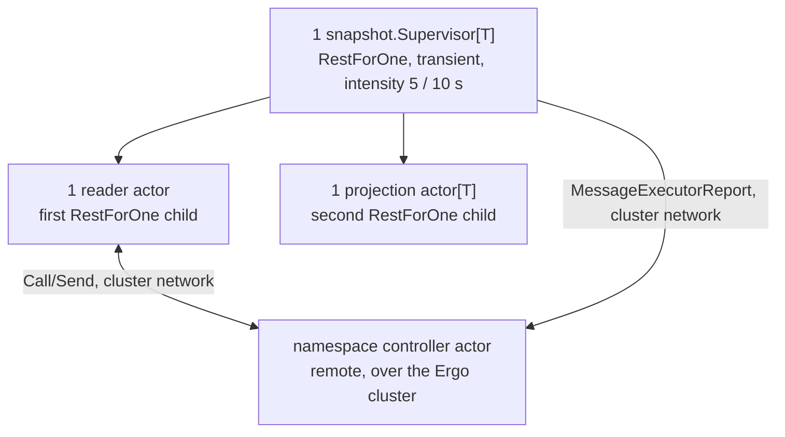
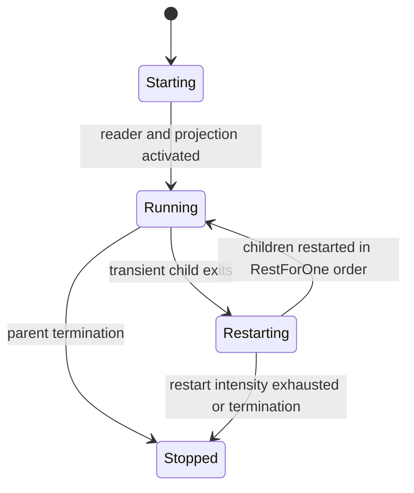
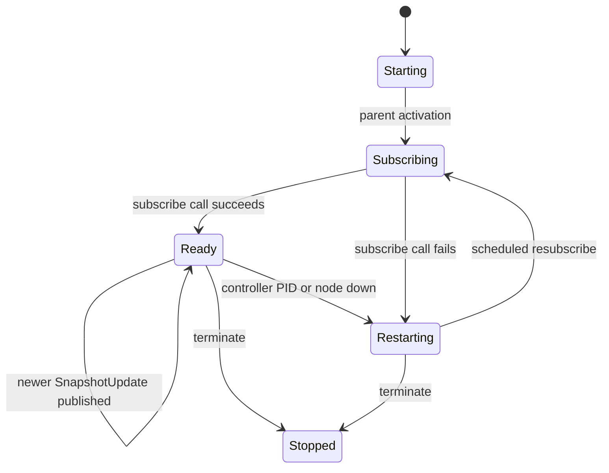
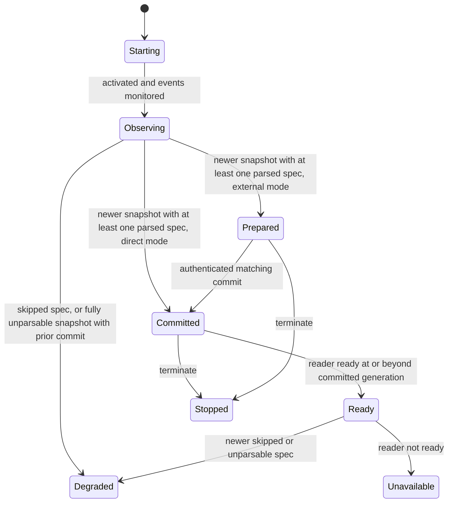

# Snapshot Runtime

The generic `internal/runtime/snapshot` subtree subscribes to one namespace's controller actor over the native Ergo cluster and exposes a typed, immutable projection. Two instances exist: matcher metadata inside the plugin runtime (external commit), and rule metadata in `event_matcher` (direct commit). It is not a process pool.

## Composition

Rest-for-one ordering matters. A reader restart restarts the projection behind it; a projection restart leaves the reader alone. The supervisor does not auto-shutdown, and keeps only the latest snapshot and reader-status events (buffer size 1).

There is no meta process in this subtree. Ergo remote delivery is push-based - a message lands directly in the reader actor's mailbox - so the reader needs no blocking read loop to bridge into the actor mailbox, unlike a pull-based transport.

## Messages

| Message                               | Direction                                                | Meaning                                                                                                |
| ------------------------------------- | -------------------------------------------------------- | ------------------------------------------------------------------------------------------------------ |
| `MessageReaderActorActivate`          | snapshot supervisor → reader actor                       | Authorizes the controller subscription; the snapshot event it publishes through comes at construction. |
| `MessageProjectionActorActivate`      | snapshot supervisor → projection actor                   | Authorizes buffered snapshot/status event monitoring.                                                  |
| `MessageReaderActorStatusChanged`     | reader actor → snapshot supervisor                       | Publishes the current reader lifecycle, availability, and committed generation.                        |
| `MessageProjectionActorStatusChanged` | projection actor → snapshot supervisor                   | Publishes projection lifecycle, availability, and committed/prepared generations.                      |
| `MessageProjectionCommit`             | external parent → snapshot supervisor → projection actor | Requests a PID/generation-fenced commit in external-commit mode only.                                  |
| `MessageProjectionCommitResult`       | projection actor → snapshot supervisor → external parent | Returns the PID/generation-fenced external-commit result.                                              |
| `MessageExecutorReportTick`           | snapshot supervisor → snapshot supervisor                | Periodic convergence-report timer.                                                                     |
| `MessageExecutorReport`               | snapshot supervisor → controller actor (cluster `Send`)  | Reports the generation this executor received and the one it holds live.                               |

## Roles

| Role                | Default name or identity                | Owner               | Responsibility                                                                                                                      |
| ------------------- | --------------------------------------- | ------------------- | ----------------------------------------------------------------------------------------------------------------------------------- |
| Snapshot supervisor | `snapshot-<namespace>-supervisor`       | parent runtime      | Owns child PIDs, stable events, external-commit forwarding, and convergence reporting to the controller.                            |
| Reader actor        | `snapshot-<namespace>-reader-actor`     | snapshot supervisor | Subscribes to the namespace controller actor and owns the committed generation, controller-loss detection, and resubscribe backoff. |
| Projection actor    | `snapshot-<namespace>-projection-actor` | snapshot supervisor | Owns typed parsed committed/prepared state.                                                                                         |

Every name comes from `SupervisorOptions.Namespace` - the subtree's own, and the controller namespace its reader follows - through `SupervisorName`/`ReaderActorName`/`ProjectionActorName`, mirroring the controller's `controller-<namespace>-*`, so a caller addresses one without being told what it was called. No name is configurable: the registered supervisor's and both children's are derived. `ReaderActorOptions` carries the subscription alone - `Endpoint` and `ExecutorID` - since the reader never needs the namespace itself. The typed loader is a `NewSupervisor` parameter, not an option: it is the projection child's dependency, as the plugin runtime's loader is its own. Both children take their event identities at construction too, from the supervisor that registered them: the projection the two names it monitors, the reader the `runtime.EventPublication` - name plus token - it publishes through, so no token reaches a process that never publishes. `ControllerActorName` names the other end of the subscription the same way, so an executor builds its endpoint without linking the controller package.

## Readiness

The matcher runtime uses `ProjectionCommitExternal`, so its parent coordinates visibility. The rule tree uses `ProjectionCommitDirect`, so a complete parsed snapshot is visible at once. A projection is `Ready` only with a committed generation, a ready reader, and reader and observed generations at or beyond that commit.

## Snapshot Supervisor

### Lifecycle

### Messages

| Message                | Direction                                     | Meaning                                                                                    |
| ---------------------- | --------------------------------------------- | ------------------------------------------------------------------------------------------ |
| `HandleChildStart`     | Ergo supervisor runtime → snapshot supervisor | Records and activates the reader or projection child incarnation.                          |
| `HandleChildTerminate` | Ergo supervisor runtime → snapshot supervisor | Marks a child unavailable and reports external commit failure for a terminated projection. |

### Readiness

The supervisor reports only the latest reader status, through its buffered status event. In external-commit mode it stamps projection status with the current projection PID, and forwards status and matching commit results to its parent.

### Executor reporting

The supervisor is also the sole producer of `MessageExecutorReport{ExecutorID, Heartbeat, Applied, LastError}`, the report the namespace controller folds into its own executor-convergence tracking (`/status`, `blink_controller_executors`, `blink_controller_executors_drifting`). It reports rather than the reader because it is the only process holding both halves:

| Field                           | Source                                                                      | Meaning                                                                                                        |
| ------------------------------- | --------------------------------------------------------------------------- | -------------------------------------------------------------------------------------------------------------- |
| `Heartbeat.CommittedGeneration` | reader status `Generation`                                                  | The newest generation the controller has pushed here.                                                          |
| `Heartbeat.ReadyGeneration`     | projection status `CommittedGeneration`                                     | The generation this executor actually holds live.                                                              |
| `Heartbeat.Availability`        | projection availability, capped at `degraded` while the reader is not ready | A live projection with a dead reader still serves its last generation, but can no longer receive the next one. |
| `Applied`                       | a projection commit that advanced the generation                            | Edge event; `Admitted` is false when the generation went live degraded.                                        |
| `LastError`                     | reader status `LastError`                                                   | Why the reader is not subscribed, which silence alone cannot say.                                              |

Under `ProjectionCommitExternal` the two generations diverge by design: the reader has the new generation while the parent runtime is still fetching binaries, and only its commit makes it live. A reader-side heartbeat would have to claim a `ReadyGeneration` it cannot observe, masking exactly that gap.

Reports are fire-and-forget - the controller keeps them for observability only, and the next one supersedes a lost one. They go out every `executorReportInterval` (30 s, a quarter of the controller's stale threshold) on a self-scheduled `MessageExecutorReportTick`, and immediately on any change that alters what the controller can conclude: a projection commit advancing, reader availability changing, or the reader terminating.

## Reader Actor

### Lifecycle

On parent activation, the reader actor issues one bounded `Call` (`SubscribeRequest{ExecutorID, KnownGeneration}`) directly to `ReaderActorOptions.Endpoint` - the target namespace's controller actor, addressed by `gen.ProcessID{Name, Node}` across the cluster. Actors (unlike meta processes) may originate a `Call`; it is bounded by an explicit timeout, so it never blocks the mailbox unboundedly.

The `SubscribeResponse` carries the controller's current committed snapshot (`Current`, possibly nil if the controller hasn't bootstrapped yet) and its own PID (`ControllerPID`). If `Current.Generation` is newer than the last one this reader published, it publishes immediately - the synchronous response _is_ the catch-up signal, with no separate polling phase. The reader then `MonitorPID`s the controller and `MonitorNode`s its cluster node, and thereafter passively receives pushed `SnapshotUpdate` messages: each is published only if its generation is newer than the last one seen, so a redundant or duplicate push is a no-op.

On `gen.MessageDownPID` (controller process died) or `gen.MessageDownNode` (controller's node left the cluster), the reader marks itself unsubscribed and schedules a resubscribe attempt, carrying its last known generation as `KnownGeneration` - the controller's `SubscribeRequest` handler does not currently read this field and always returns the full committed snapshot; the reader itself skips republishing a burst that is not newer than `lastGeneration`. On `Terminate`, it best-effort notifies the controller (`UnsubscribeRequest`) before exiting.

### Messages

| Message                                     | Direction                                                 | Meaning                                                                                                      |
| ------------------------------------------- | --------------------------------------------------------- | ------------------------------------------------------------------------------------------------------------ |
| `SubscribeRequest`/`Response`               | reader actor ↔ controller actor (cluster `Call`)          | Bounded handshake: registers the reader as a subscriber and returns the current committed snapshot.          |
| `SnapshotUpdate`                            | controller actor → reader actor (cluster `SendImportant`) | One commit's full state, pushed to every subscriber; applied only if newer than the last seen generation.    |
| `UnsubscribeRequest`                        | reader actor → controller actor (cluster `Send`)          | Best-effort cleanup hint on shutdown; `MonitorPID` on the controller side is the authoritative removal path. |
| `MessageReaderRestart`                      | reader actor → reader actor                               | Token-fenced resubscribe timer.                                                                              |
| `gen.MessageDownPID`, `gen.MessageDownNode` | Ergo cluster monitor → reader actor                       | Marks the controller unreachable and schedules a resubscribe.                                                |
| `SendEvent`                                 | reader actor → snapshot supervisor event subscribers      | Publishes a committed snapshot to buffered and live consumers.                                               |

### Readiness

The reader reports `Ready` only while subscribed; a controller-loss or a failed (re)subscribe attempt reports `Unavailable`. Because a `SnapshotUpdate`/initial `Current` is only published when its generation is strictly newer, a reader that is subscribed but has received nothing yet cannot itself make the downstream projection appear ready - the projection only advances on an actual publish.

## Projection Actor

### Lifecycle

The projection actor monitors buffered snapshot and reader-status events, and parses every artifact spec through its typed loader.

- A spec that fails to parse is skipped, not fatal to the generation. The rest are prepared or committed as usual, the joined parse errors are kept, and the actor reports degraded until a later generation parses cleanly.
- A generation where nothing parsed carries no usable projection. It leaves the last committed projection intact and reports degraded.

`ProjectionClient` uses the stable projection child name and returns a deep clone.

### Messages

| Message                  | Direction                                    | Meaning                                                                         |
| ------------------------ | -------------------------------------------- | ------------------------------------------------------------------------------- |
| `gen.MessageEvent`       | snapshot supervisor event → projection actor | Buffered and live snapshot events drive observed, prepared, or committed state. |
| `gen.MessageEvent`       | snapshot supervisor event → projection actor | Buffered and live reader-status events drive readiness.                         |
| `ProjectionStateRequest` | `ProjectionClient.State` → projection actor  | Reads a deep-cloned current committed projection.                               |
| `gen.MessageDownEvent`   | Ergo event monitor → projection actor        | Terminates the projection when a monitored snapshot or status event ends.       |

### Readiness

Direct mode commits a complete parsed generation on receipt. External mode commits when the requested generation matches observed and is prepared or already committed, and returns `ErrProjectionNotPrepared` otherwise. Its parents get stamped projection PIDs and commit results, so a stale child is never acknowledged.

## Telemetry

Every layer publishes into the node's radar application, labelled by `namespace` - the subtree's `SupervisorOptions.Namespace`, the controller namespace it follows, so an executor's series join its controller's on one label. `Init` rejects a subtree that left it unset, since every name and every label would be missing with it. The plumbing is `internal/runtime/telemetry`, shared with the controller runtime; only the names and their specs live here.

| Layer            | Registers       | Publishes through | Notes                                                                                                                                                       |
| ---------------- | --------------- | ----------------- | ----------------------------------------------------------------------------------------------------------------------------------------------------------- |
| Supervisor       | every collector | itself            | Registers through `gen.Node` so no child's exit deletes a collector, and publishes every gauge, since it is the one process holding both children's status. |
| Reader actor     | -               | itself            | Subscribe results, accepted and dropped pushes, and controller loss; it carries a copy of the supervisor's `telemetry.Labels`.                              |
| Projection actor | -               | itself            | Parse duration, result, and per-spec failures, plus external commit results.                                                                                |

| Metric                                                                                                                                                                 | Published by     | Meaning                                                                                                                                                  |
| ---------------------------------------------------------------------------------------------------------------------------------------------------------------------- | ---------------- | -------------------------------------------------------------------------------------------------------------------------------------------------------- |
| `blink_snapshot_supervisor_lifecycle`                                                                                                                                  | supervisor       | 0 starting, 1 running, 2 stopping; running once both children are up, and it does not demote when rest-for-one replaces one.                             |
| `blink_snapshot_reader_availability`, `blink_snapshot_projection_availability`, `blink_snapshot_reported_availability`                                                 | supervisor       | 0 unavailable, 1 degraded, 2 ready; the third is what this executor tells its controller.                                                                |
| `blink_snapshot_reader_generation`, `blink_snapshot_projection_committed_generation`, `blink_snapshot_projection_prepared_generation`, `blink_snapshot_generation_lag` | supervisor       | Delivered, serving, and awaiting-commit generations, and the local half of controller-side drift.                                                        |
| `blink_snapshot_commit_pending`, `blink_snapshot_executor_reports_total`                                                                                               | supervisor       | The generation whose external commit is in flight, and convergence reports sent.                                                                         |
| `blink_snapshot_child_starts_total{child}`, `blink_snapshot_child_terminations_total{child,reason}`                                                                    | supervisor       | Reader and projection churn under a supervisor that outlives both.                                                                                       |
| `blink_snapshot_subscribe_attempts_total{result}`, `blink_snapshot_controller_down_total{scope}`                                                                       | reader actor     | Subscribe outcomes, and whether the controller was lost as a process or a whole node.                                                                    |
| `blink_snapshot_updates_total`, `blink_snapshot_updates_ignored_total{reason}`                                                                                         | reader actor     | Pushed commits applied, and those dropped as unsubscribed, wrong-sender, empty, or stale.                                                                |
| `blink_snapshot_parses_total{result}`, `blink_snapshot_parse_failures_total`, `blink_snapshot_parse_seconds`                                                           | projection actor | A generation parses `ok`, `partial`, or `failed`; the failure counter is per spec, so one broken file is visible inside an otherwise serving generation. |
| `blink_snapshot_commits_total{result}`                                                                                                                                 | projection actor | External commit requests, `error` when the generation was not prepared.                                                                                  |

`MessageRadarTick` drives registration: sent to itself from `Init` so collectors exist before a child emits, then retried every `telemetry.RadarTickInterval` (30 s) until radar accepts them. There is no readiness signal here - an executor's readiness is the plugin runtime's to report, and this subtree reports into it through `MessageExecutorReport` instead. The supervisor monitors `radar_metrics` and clears `collectorsRegistered` on `gen.MessageDownProcessID` so a radar restart re-registers on the next tick.

Every layer emits best-effort: an unreachable radar produces a discarded `Send` error, and a zero `telemetry.Labels` stays silent, since a label count that does not match the registered collector panics radar's metrics actor. Gauges are republished on the supervisor's own state changes and on its executor-report tick, so a converged subtree still reports fresh series.

## Retry and Shutdown

The subtree's lifecycle is `starting`, `running`, `stopping`: no child holds external I/O a shutdown must wait out, so there is no draining stage and a stop is immediate.

No actor accepts an unrelated synchronous call. Reader resubscribe uses the shared `runtime.ScheduledBackoff`: exponential multiplier 2, configured min and max, five retries, token invalidated on cancellation or reset. Parent termination marks reader and projection stopped and unavailable. An optional `Stopped` channel receives the reason without blocking shutdown.

## Source Map

- [`internal/runtime/snapshot/snapshot_supervisor.go`](../../internal/runtime/snapshot/snapshot_supervisor.go) - child order, RestForOne policy, event registration, external commit fencing, and convergence reporting.
- [`internal/runtime/snapshot/snapshot_reader_actor.go`](../../internal/runtime/snapshot/snapshot_reader_actor.go) - subscribe/resubscribe, controller-loss detection, snapshot publication, and reader status.
- [`internal/runtime/snapshot/subscription.go`](../../internal/runtime/snapshot/subscription.go) - the wire vocabulary (`SubscribeRequest`/`Response`, `SnapshotUpdate`, `UnsubscribeRequest`, `MessageExecutorReport`) shared with the controller actor, and its EDF type registration list.
- [`internal/runtime/snapshot/projection_actor.go`](../../internal/runtime/snapshot/projection_actor.go) - projection modes, state call, parse, and commit semantics.
- [`internal/runtime/snapshot/metrics.go`](../../internal/runtime/snapshot/metrics.go) - radar metric specs and gauge publishing.
- [`internal/runtime/telemetry/metrics.go`](../../internal/runtime/telemetry/metrics.go) - the radar plumbing this shares with the controller runtime: collector specs, one subject's bound label values, and the readiness signal.
- [`internal/runtime/backoff.go`](../../internal/runtime/backoff.go) and [`internal/runtime/snapshot/options.go`](../../internal/runtime/snapshot/options.go) - shared retry policy and configuration.
