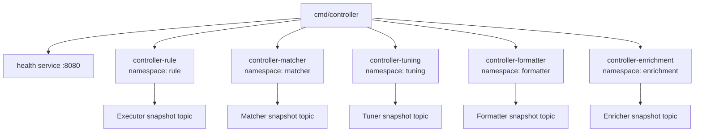
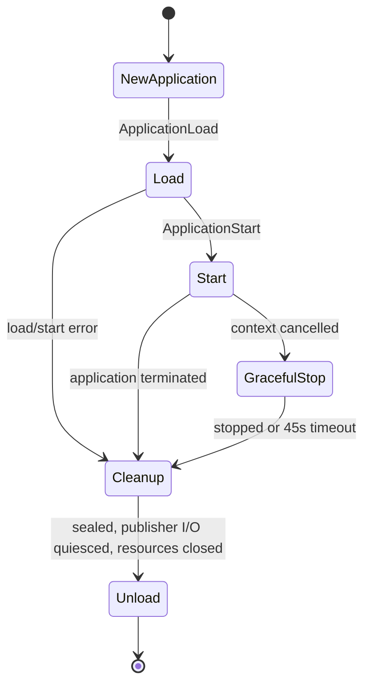

# Controller service

[Services index](README.md) · [Runtime design](../internals/controller-runtime.md)

`cmd/controller` is Blink's control-plane binary. It starts five independent Ergo controller applications, each watching one local artifact catalog, persisting its state, and publishing that catalog's effective entries to its own Kafka topic. It does not process pipeline events or start plugin binaries.

## Process composition

| Message                                             | Direction                                        | Meaning                                                            |
| --------------------------------------------------- | ------------------------------------------------ | ------------------------------------------------------------------ |
| `plugin.Start`                                      | `cmd/controller` → Ergo node                     | Starts `controller@localhost`.                                     |
| `services.Runner.Register`, `controller.NewService` | `cmd/controller` → controller services           | Registers the five namespace-specific controller services.         |
| `services.NewHealthService`                         | `cmd/controller` → health service                | Registers the HTTP health service on `:8080`.                      |
| `Application.Load`, `Broker.NewWriter`              | controller service → namespace application/topic | Creates each application and its configured snapshot-topic writer. |

| Service name            | Namespace    | Catalog directory      | Snapshot topic environment variable | Loader                |
| ----------------------- | ------------ | ---------------------- | ----------------------------------- | --------------------- |
| `controller-rule`       | `rule`       | `RULE_PLUGIN_DIR`      | `KAFKA_TOPIC_EXECUTOR_SNAPSHOT`     | `rules.Loader`        |
| `controller-matcher`    | `matcher`    | `MATCHER_PLUGIN_DIR`   | `KAFKA_TOPIC_MATCHER_SNAPSHOT`      | `matchers.Loader`     |
| `controller-tuning`     | `tuning`     | `TUNER_PLUGIN_DIR`     | `KAFKA_TOPIC_TUNER_SNAPSHOT`        | `tuning_rules.Loader` |
| `controller-formatter`  | `formatter`  | `FORMATTER_PLUGIN_DIR` | `KAFKA_TOPIC_FORMATTER_SNAPSHOT`    | `formatters.Loader`   |
| `controller-enrichment` | `enrichment` | `ENRICHER_PLUGIN_DIR`  | `KAFKA_TOPIC_ENRICHER_SNAPSHOT`     | `enrichments.Loader`  |

All five use `CONTROLLER_DATABASE_DSN`. The database tables are scoped by the namespace, so a shared DSN retains separate catalog records, generations, and snapshots. Kafka connection settings are supplied through the shared service configuration. The controller creates the topics' writers; it does not create or configure Kafka topics.

## Operational lifecycle

The process creates the Ergo node `controller@localhost`, starts the five registered controller services and the health service concurrently, and waits for `SIGINT` or `SIGTERM`. Each controller service constructs a fresh application for every runner attempt.

| Message                                         | Direction                                  | Meaning                                                           |
| ----------------------------------------------- | ------------------------------------------ | ----------------------------------------------------------------- |
| `gen.Node.ApplicationLoad`                      | controller service → Ergo node             | Loads a fresh controller application for the runner attempt.      |
| `gen.Node.ApplicationStart`                     | controller service → Ergo node             | Starts the loaded application.                                    |
| `Application.Seal`                              | controller service → application           | Prevents new publisher I/O after a start error or cancellation.   |
| `Service.gracefulStop`, `plugin.MessageStop`    | controller service → supervisor            | Requests graceful supervisor shutdown after context cancellation. |
| `Application.WaitQuiesced`, `Application.Close` | controller service → application resources | Waits for accepted I/O, then closes the writer and SQLite handle. |
| `gen.Node.ApplicationUnload`                    | controller service → Ergo node             | Unloads the cleaned application.                                  |
| `gen.Node.ApplicationStopForce`                 | controller service → Ergo node             | Forces termination after the 45-second graceful-stop timeout.     |

An application failure is returned to `services.Runner`, which retries its service attempt with exponential delays from 1 second to 60 seconds plus up to 25% jitter. These retries are indefinite while the process context remains live. The runner exposes `blink_runner_service_restarts_total` and `blink_runner_service_restart_delay_seconds`.

## Health and readiness

The health server listens on `:8080`:

| Endpoint        | Current behavior                                                  |
| --------------- | ----------------------------------------------------------------- |
| `/health/live`  | Always HTTP 200 while the health service is serving.              |
| `/health/ready` | Always HTTP 200: `cmd/controller` supplies no readiness function. |
| `/metrics`      | Prometheus metrics, including runner restart metrics.             |

Actor availability is an internal runtime status, not an HTTP readiness gate. An active controller actor reports `ready` only after a complete artifact_scanner result and a loaded, ready publisher; otherwise it reports `degraded` or `unavailable`.

## Storage and Kafka contract

For a namespace, persistence contains controller records, the last reserved generation, and full snapshots. Authored YAML remains the source for catalog content; persistence supplies history and restart recovery.

On a changed snapshot the publisher, in order:

1. upserts controller records;
2. saves the next generation in storage;
3. writes Kafka messages keyed by logical entry ID: protobuf-encoded upserts, `nil`-value tombstones, and the reserved `__blink_generation__` key with an 8-byte big-endian `int64` generation;
4. saves the aggregate snapshot in storage.

The generation marker is not an entry. Consumers must treat it as the fleet generation marker, not decode it as an effective entry. An unchanged plan updates records but skips generation reservation, Kafka, and aggregate-snapshot writes. If Kafka succeeds but aggregate snapshot persistence fails, retrying the same plan reuses the already-reserved generation and rewrites the same keyed state.

## Shutdown and failure behavior

On signal, the runner cancels services. A controller service seals its application, asks its supervisor to drain, waits up to 45 seconds, then forces the Ergo application to stop if needed. Cleanup waits for publisher I/O that was accepted before sealing, closes the Kafka writer and SQLite handle, then unloads the application. Node shutdown has the same 45-second bound.

Within an active application, artifact_scanner and publisher meta-process failures are retried with a bounded exponential schedule (default 100 ms to 5 s; five scheduled retries). A publication itself gets five attempts. An exhausted worker schedule fails its actor instance; the transient supervisor restarts it subject to its restart intensity. Supervisor restart-intensity exhaustion or application
termination ends the application attempt and therefore uses the runner-level retry described above.

## Source references

- `cmd/controller/main.go` - configuration, five service registrations, node, signals, health server, and node close.
- `internal/runtime/controller/service.go` - attempt lifecycle, cleanup, and graceful/forced stop.
- `internal/runtime/controller/controller_application.go` - owned SQLite and writer resources.
- `internal/services/runner.go` and `internal/services/health.go` - process retries and HTTP health behavior.
- `internal/backends/{database.go,sql.go,record.go}` and `internal/snapshot/{snapshot.go,convert.go}` - durable and wire contracts.
