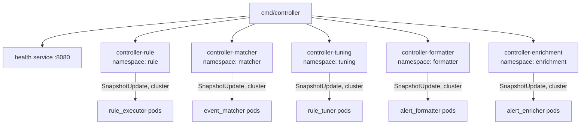
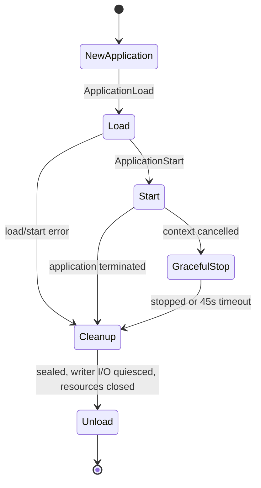

# Controller service

[Services index](README.md) · [Controller runtime](../internals/controller-runtime.md) · [Snapshot runtime](../internals/snapshot-runtime.md)

`cmd/controller` is Blink's control-plane binary. It starts five independent Ergo controller applications. Each watches one local artifact catalog, persists state to SQLite, and pushes that catalog's effective entries to subscribed executors over the native Ergo cluster. No pipeline events, no plugin binaries, no broker.

## Process composition

| Message                                             | Direction                                                           | Meaning                                                                             |
| --------------------------------------------------- | ------------------------------------------------------------------- | ----------------------------------------------------------------------------------- |
| `plugin.Start`                                      | `main` → Ergo node                                                  | Starts the node with cluster networking, named `controller@<CONTROLLER_NODE_HOST>`. |
| `services.Runner.Register`, `controller.NewService` | `main` → controller services                                        | Registers the five controller services.                                             |
| `services.NewHealthService`                         | `main` → health service                                             | Registers the HTTP health service on `:8080`.                                       |
| `Application.Load`                                  | service → namespace application                                     | Creates it, opens its SQLite handle, registers EDF network types.                   |
| `SubscribeRequest`/`SnapshotUpdate`                 | executor ↔ namespace controller actor (cluster)                     | Registers a subscriber; pushes each completed generation.                           |
| `MessageExecutorReport`                             | executor snapshot supervisor → namespace controller actor (cluster) | That executor's received and live generations, every 30 s and on change.            |

| Service name            | Namespace    | Catalog directory      | Loader                |
| ----------------------- | ------------ | ---------------------- | --------------------- |
| `controller-rule`       | `rule`       | `RULE_PLUGIN_DIR`      | `rules.Loader`        |
| `controller-matcher`    | `matcher`    | `MATCHER_PLUGIN_DIR`   | `matchers.Loader`     |
| `controller-tuning`     | `tuning`     | `TUNER_PLUGIN_DIR`     | `tuning_rules.Loader` |
| `controller-formatter`  | `formatter`  | `FORMATTER_PLUGIN_DIR` | `formatters.Loader`   |
| `controller-enrichment` | `enrichment` | `ENRICHER_PLUGIN_DIR`  | `enrichments.Loader`  |

All five share `CONTROLLER_DATABASE_DSN`; namespace-scoped tables keep separate records, generations, and snapshots. `ETCD_ENDPOINTS`, `CLUSTER_COOKIE`, and `CONTROLLER_NODE_HOST` configure the cluster. Subscribing executors need the same cookie and must resolve `controller@<CONTROLLER_NODE_HOST>` through the same etcd registrar.

## Service lifecycle

The node is named `controller@<CONTROLLER_NODE_HOST>`, a cluster-reachable Service DNS name, not `localhost`. It starts the five controller services and the health service concurrently, then waits for `SIGINT` or `SIGTERM`. Each builds a fresh application per runner attempt.

| Message                                         | Direction             | Meaning                                                       |
| ----------------------------------------------- | --------------------- | ------------------------------------------------------------- |
| `gen.Node.ApplicationLoad`                      | service → Ergo node   | Loads a fresh application for the attempt.                    |
| `gen.Node.ApplicationStart`                     | service → Ergo node   | Starts the loaded application.                                |
| `Application.Seal`                              | service → application | Prevents new writer I/O after a start error or cancellation.  |
| `Service.gracefulStop`, `plugin.MessageStop`    | service → supervisor  | Requests graceful supervisor shutdown after cancellation.     |
| `Application.WaitQuiesced`, `Application.Close` | service → resources   | Waits for accepted I/O, then closes the SQLite handle.        |
| `gen.Node.ApplicationUnload`                    | service → Ergo node   | Unloads the cleaned application.                              |
| `gen.Node.ApplicationStopForce`                 | service → Ergo node   | Forces termination after the 45-second graceful-stop timeout. |

A failed application returns to `services.Runner`, which retries with exponential delays from 1 s to 60 s plus up to 25% jitter, indefinitely while the process context lives. Metrics: `blink_runner_service_restarts_total`, `blink_runner_service_restart_delay_seconds`.

## Health and readiness

Health server, `:8080`, probed by the kubelet:

| Endpoint        | Current behavior                                                                                                                                    |
| --------------- | --------------------------------------------------------------------------------------------------------------------------------------------------- |
| `/health/live`  | Always HTTP 200 while the health service is serving.                                                                                                |
| `/health/ready` | Always HTTP 200: `cmd/controller` supplies no readiness function.                                                                                   |
| `/status`       | JSON per namespace: each subscribed executor's last heartbeat, committed/ready generation, availability, and drift. Same-node `CallProcessID` only. |
| `/metrics`      | Prometheus metrics, including runner restart metrics.                                                                                               |

Radar, `RADAR_HOST:RADAR_PORT`, default `0.0.0.0:9090` (via `services.Common`). An empty host binds all interfaces; radar's own default is `localhost`.

| Endpoint        | Current behavior                                                                                                                                              |
| --------------- | ------------------------------------------------------------------------------------------------------------------------------------------------------------- |
| `/health/live`  | Ignores the controller signals: they register readiness only.                                                                                                 |
| `/health/ready` | HTTP 503 unless every namespace's `controller-<namespace>` signal is up. Each supervisor owns its signal and expires it after 90 seconds without a heartbeat. |
| `/metrics`      | Prometheus metrics for every controller namespace, on radar's own registry.                                                                                   |

Actor availability is internal; the probes never gate on it. An active actor reports `ready` only after a complete artifact_scanner result and a loaded, ready writer, else `degraded` or `unavailable`. `MessageActorStatusChanged` carries it up, so a drain or crash drops the signal before the 90-second deadline.

### Metrics

Every series carries a `namespace` label; radar adds a `node` label from the node name.

| Metric                                                                                                                                                                                                   | Published by          | Meaning                                                                                                                                                                              |
| -------------------------------------------------------------------------------------------------------------------------------------------------------------------------------------------------------- | --------------------- | ------------------------------------------------------------------------------------------------------------------------------------------------------------------------------------ |
| `blink_controller_availability`                                                                                                                                                                          | actor                 | 0 unavailable, 1 degraded, 2 ready.                                                                                                                                                  |
| `blink_controller_generation`, `blink_controller_records`                                                                                                                                                | actor                 | Committed generation and tracked records.                                                                                                                                            |
| `blink_controller_subscribers`, `blink_controller_executors`, `blink_controller_executors_drifting`                                                                                                      | actor                 | Subscribed executors, those converged, and those behind the committed generation past the drift grace. Executors silent past the stale threshold with no subscription are forgotten. |
| `blink_controller_snapshot_commits_total`, `blink_controller_snapshot_writes_total{result}`, `blink_controller_snapshot_write_seconds`                                                                   | actor                 | Generations committed and pushed, write results, dispatch-to-result latency.                                                                                                         |
| `blink_controller_artifact_scans_total{result}`, `blink_controller_worker_restarts_total{worker}`                                                                                                        | actor                 | Scan outcomes and scanner/writer meta restarts.                                                                                                                                      |
| `blink_controller_artifact_scan_seconds`, `blink_controller_artifact_specs`, `blink_controller_artifact_binaries`, `blink_controller_artifact_scan_failures_total{stage}`                                | artifact_scanner meta | Scan duration, index sizes, unindexable files by stage.                                                                                                                              |
| `blink_controller_snapshot_load_seconds`, `blink_controller_snapshot_loads_total{result}`                                                                                                                | snapshot_writer meta  | Startup load of persisted state.                                                                                                                                                     |
| `blink_controller_snapshot_write_queue`, `blink_controller_snapshot_write_rejects_total`, `blink_controller_snapshot_write_attempts_total{result}`                                                       | snapshot_writer meta  | Queue depth, writes rejected by a full queue, database attempts including retries.                                                                                                   |
| `blink_controller_supervisor_lifecycle`, `blink_controller_writer_fences`                                                                                                                                | supervisor            | 0 starting, 1 running, 2 draining, 3 stopping; and writer I/O fences a drain awaits.                                                                                                 |
| `blink_controller_child_starts_total`, `blink_controller_child_terminations_total{reason}`                                                                                                               | supervisor            | Actor churn under a longer-lived supervisor.                                                                                                                                         |
| `blink_controller_application_state`, `blink_controller_application_loads_total{result}`, `blink_controller_application_terminations_total{reason}`, `blink_controller_application_closes_total{result}` | application           | 0 stopped, 1 loaded; load, termination, and resource-close outcomes per attempt.                                                                                                     |

Collectors register through `gen.Node` and survive actor and supervisor restarts: the application at `Load`, the supervisor on its first reachable radar tick. It monitors `radar_metrics` and `radar_health`, re-registering only what a restart dropped.

The Helm chart scrapes this endpoint and ships a Grafana dashboard - see [the runbook](../../deployments/README.md#monitoring).

## Storage and distribution contract

Per namespace, SQLite holds controller records, the last reserved generation, and full snapshots. Authored YAML remains the source for catalog content.

On a changed snapshot the writer, in order:

1. upserts controller records;
2. saves the next generation;
3. saves the aggregate snapshot.

Only then does the actor push `SnapshotUpdate{Snapshot, Changes, Tombstones}` to every registered subscriber PID via `SendImportant`. `SubscribeRequest` instead returns it. Either path applies a snapshot only if its generation is strictly newer than the subscriber's.

An unchanged plan updates records only: no generation reservation, no aggregate-snapshot write, no push.

## Shutdown and failure behavior

On signal the runner cancels services. Each service seals its application, drains its supervisor for up to 45 seconds, then forces the Ergo application to stop. Cleanup waits for I/O accepted before sealing, closes the SQLite handle, then unloads; node shutdown has the same 45-second bound. Subscribers are not torn down; each `MonitorPID` surfaces a `gen.MessageDownPID` and schedules a resubscribe.

artifact_scanner and writer meta-process failures retry on a bounded exponential schedule (default 100 ms to 5 s, five retries); a write gets five attempts. An exhausted schedule fails the actor instance; the transient supervisor restarts it within its restart intensity. Restart-intensity exhaustion or application termination ends the attempt, falling back to the runner retry.

## Source references

- `cmd/controller/main.go` - config, service registration, cluster/etcd wiring, node, signals.
- `internal/runtime/controller/service.go` - attempt lifecycle, cleanup, stop.
- `internal/runtime/controller/controller_application.go` - SQLite resources, EDF network types.
- `internal/runtime/controller/controller_actor.go` - subscribers, `notifySubscribers`, drift tracking.
- `internal/runtime/plugin/node.go` - `EtcdClusterConfig`, `NewEtcdRegistrar`, cluster networking.
- `internal/services/runner.go`, `internal/services/health.go` - retries, HTTP health.
- `internal/backends/{database.go,sql.go,record.go}` - persistence, schema.
