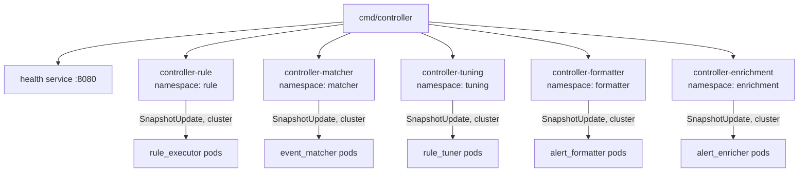
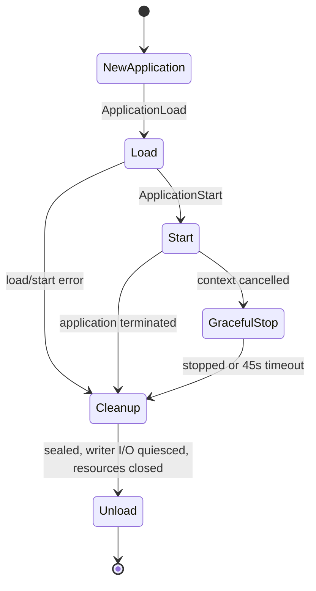

# Controller service

[Services index](README.md) · [Runtime design](../internals/controller-runtime.md)

`cmd/controller` is Blink's control-plane binary. It starts five independent Ergo controller applications, each watching one local artifact catalog, persisting its state to SQLite, and pushing that catalog's effective entries directly to every subscribed executor over the native Ergo cluster. It does not process pipeline events or start plugin binaries, and there is no broker in its distribution path.

## Process composition

| Message                                             | Direction                              | Meaning                                                              |
| ----------------------------------------------------- | ------------------------------------------ | ------------------------------------------------------------------------- |
| `plugin.Start`                                      | `cmd/controller` → Ergo node            | Starts the node, cluster networking enabled, named `controller@<CONTROLLER_NODE_HOST>`. |
| `services.Runner.Register`, `controller.NewService` | `cmd/controller` → controller services  | Registers the five namespace-specific controller services.          |
| `services.NewHealthService`                         | `cmd/controller` → health service       | Registers the HTTP health service on `:8080`.                        |
| `Application.Load`                                  | controller service → namespace application | Creates each application, opens its SQLite handle, and registers its EDF network types. |
| `SubscribeRequest`/`SnapshotUpdate`                 | subscribing executor ↔ namespace controller actor (cluster) | Registers a subscriber and pushes each completed generation to it. |

| Service name            | Namespace    | Catalog directory      | Loader                |
| ------------------------- | -------------- | ------------------------- | ------------------------ |
| `controller-rule`       | `rule`       | `RULE_PLUGIN_DIR`      | `rules.Loader`        |
| `controller-matcher`    | `matcher`    | `MATCHER_PLUGIN_DIR`   | `matchers.Loader`     |
| `controller-tuning`     | `tuning`     | `TUNER_PLUGIN_DIR`     | `tuning_rules.Loader` |
| `controller-formatter`  | `formatter`  | `FORMATTER_PLUGIN_DIR` | `formatters.Loader`   |
| `controller-enrichment` | `enrichment` | `ENRICHER_PLUGIN_DIR`  | `enrichments.Loader`  |

All five use `CONTROLLER_DATABASE_DSN`. The database tables are scoped by the namespace, so a shared DSN retains separate catalog records, generations, and snapshots. `ETCD_ENDPOINTS`, `CLUSTER_COOKIE`, and `CONTROLLER_NODE_HOST` configure the cluster the process joins - every executor subscribing to this controller must share the same cookie and be able to resolve `controller@<CONTROLLER_NODE_HOST>` through the same etcd registrar.

## Operational lifecycle

The process creates an Ergo node named `controller@<CONTROLLER_NODE_HOST>` (its stable, cluster-reachable Service DNS name - not `localhost`, since executors on other pods must reach it), starts the five registered controller services and the health service concurrently, and waits for `SIGINT` or `SIGTERM`. Each controller service constructs a fresh application for every runner attempt.

| Message                                         | Direction                                  | Meaning                                                           |
| --------------------------------------------------- | --------------------------------------------- | ------------------------------------------------------------------- |
| `gen.Node.ApplicationLoad`                      | controller service → Ergo node             | Loads a fresh controller application for the runner attempt.      |
| `gen.Node.ApplicationStart`                     | controller service → Ergo node             | Starts the loaded application.                                    |
| `Application.Seal`                              | controller service → application           | Prevents new writer I/O after a start error or cancellation.      |
| `Service.gracefulStop`, `plugin.MessageStop`    | controller service → supervisor            | Requests graceful supervisor shutdown after context cancellation. |
| `Application.WaitQuiesced`, `Application.Close` | controller service → application resources | Waits for accepted I/O, then closes the SQLite handle.            |
| `gen.Node.ApplicationUnload`                    | controller service → Ergo node             | Unloads the cleaned application.                                  |
| `gen.Node.ApplicationStopForce`                 | controller service → Ergo node             | Forces termination after the 45-second graceful-stop timeout.     |

An application failure is returned to `services.Runner`, which retries its service attempt with exponential delays from 1 second to 60 seconds plus up to 25% jitter. These retries are indefinite while the process context remains live. The runner exposes `blink_runner_service_restarts_total` and `blink_runner_service_restart_delay_seconds`.

## Health and readiness

The health server listens on `:8080`:

| Endpoint        | Current behavior                                                                                                  |
| ------------------ | ---------------------------------------------------------------------------------------------------------------------- |
| `/health/live`  | Always HTTP 200 while the health service is serving.                                                             |
| `/health/ready` | Always HTTP 200: `cmd/controller` supplies no readiness function.                                                |
| `/status`       | JSON, per namespace: every subscribed executor's last heartbeat, committed/ready generation, availability, and drift. Queried by a same-node `CallProcessID`, never crosses the cluster. |
| `/metrics`      | Prometheus metrics, including runner restart metrics.                                                             |

Actor availability is an internal runtime status, not an HTTP readiness gate. An active controller actor reports `ready` only after a complete artifact_scanner result and a loaded, ready writer; otherwise it reports `degraded` or `unavailable`.

## Storage and distribution contract

For a namespace, persistence contains controller records, the last reserved generation, and full snapshots - all in SQLite. Authored YAML remains the source for catalog content; persistence supplies history and restart recovery.

On a changed snapshot the writer, in order:

1. upserts controller records;
2. saves the next generation in storage;
3. saves the aggregate snapshot in storage.

Only once all three succeed does the controller actor push `SnapshotUpdate{Snapshot, Changes, Tombstones}` to every subscriber PID it has registered (`SendImportant`, so remote delivery failure is reported rather than silently dropped). A subscriber that first calls `SubscribeRequest` gets the current committed snapshot in the response - the same acceptance test applies both ways: a snapshot (pushed or returned from `SubscribeRequest`) is applied only if its generation is strictly newer than the one the subscriber already has, so redundant delivery from either path is a no-op. An unchanged plan updates records but skips generation reservation, the aggregate-snapshot write, and any push - there is nothing new to distribute.

## Shutdown and failure behavior

On signal, the runner cancels services. A controller service seals its application, asks its supervisor to drain, waits up to 45 seconds, then forces the Ergo application to stop if needed. Cleanup waits for writer I/O that was accepted before sealing, closes the SQLite handle, then unloads the application. Node shutdown has the same 45-second bound. Subscribers are not explicitly torn down on controller shutdown; each one's own `MonitorPID` on the controller surfaces a `gen.MessageDownPID` and schedules its own resubscribe.

Within an active application, artifact_scanner and writer meta-process failures are retried with a bounded exponential schedule (default 100 ms to 5 s; five scheduled retries). A write itself gets five attempts. An exhausted worker schedule fails its actor instance; the transient supervisor restarts it subject to its restart intensity. Supervisor restart-intensity exhaustion or application
termination ends the application attempt and therefore uses the runner-level retry described above.

## Source references

- `cmd/controller/main.go` - configuration, five service registrations, cluster/etcd wiring, node, signals, health server, and node close.
- `internal/runtime/controller/service.go` - attempt lifecycle, cleanup, and graceful/forced stop.
- `internal/runtime/controller/controller_application.go` - owned SQLite resources and EDF network type registration.
- `internal/runtime/controller/controller_actor.go` - subscriber registration, `notifySubscribers`, and executor drift tracking.
- `internal/runtime/plugin/node.go` - `EtcdClusterConfig`, `NewEtcdRegistrar`, and cluster networking setup shared by every binary.
- `internal/services/runner.go` and `internal/services/health.go` - process retries and HTTP health behavior.
- `internal/backends/{database.go,sql.go,record.go}` - durable persistence and schema.
