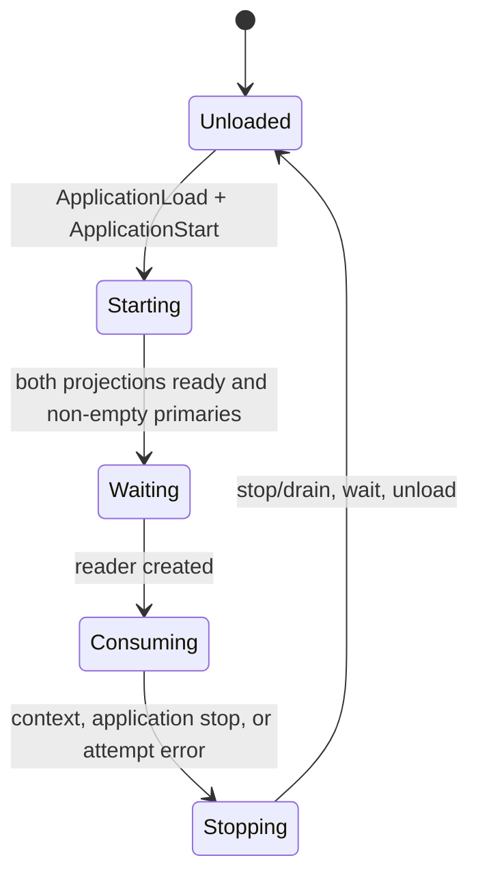
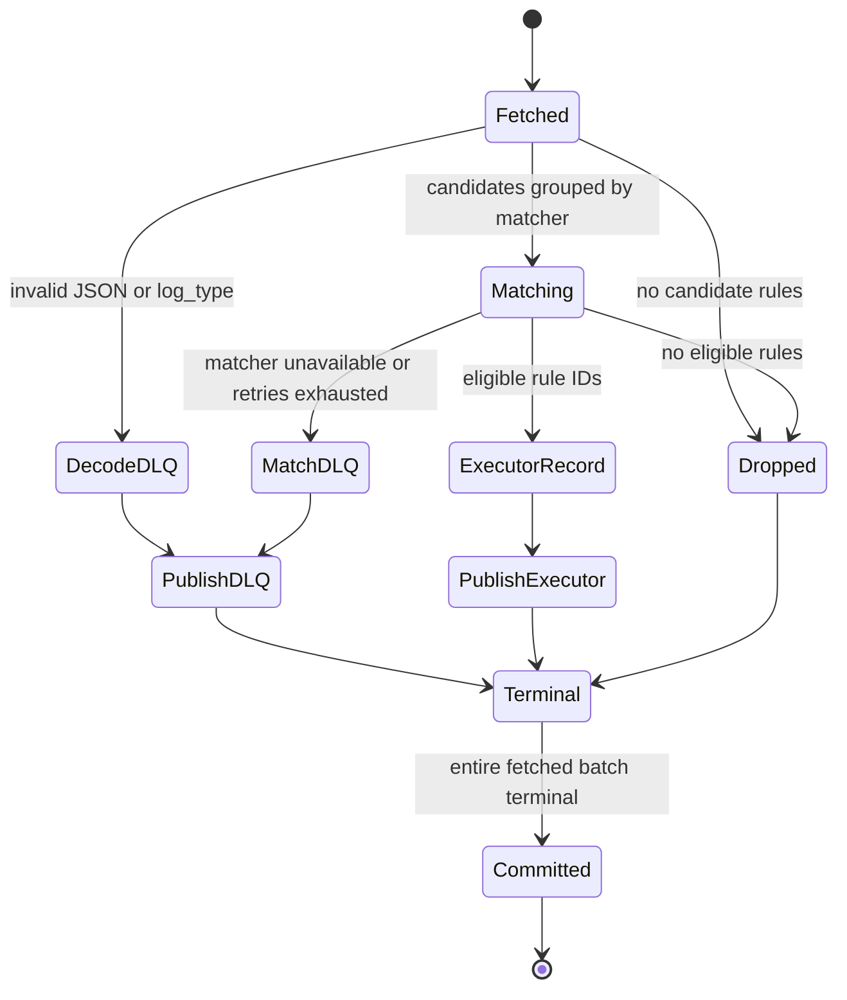

# event_matcher

`event_matcher` consumes raw JSON events, selects rules whose matchers pass, and publishes protobuf `execpb.ExecMessage` records for downstream consumers. It has no executor or process-pool: matcher execution is owned by the actor runtime described in [plugin-runtime.md](../internals/plugin-runtime.md).

## Outer composition

`cmd/event_matcher/main.go` creates one shared Ergo node, a matcher service, a health service, and an `internal/services.Runner`. The Runner starts registered services concurrently; a returned service error restarts that service with its own exponential, jittered backoff (1 s base, 60 s cap). SIGINT/SIGTERM cancels the Runner; node close is bounded to 45 seconds.

```text
Runner
├── matcher.Service (restartable attempt)
│   └── Ergo application: event-matcher-runtime-application
│       ├── matcher plugin runtime
│       │   └── generic snapshot supervisor, external projection commit
│       └── rule snapshot supervisor, direct projection commit
└── HealthService (:8080)
```

The matcher application is attempt-owned: `Run` loads and starts it, then on exit stops/drains, waits, and unloads it. The matcher snapshot is read from `KAFKA_TOPIC_MATCHER_SNAPSHOT`; the rule snapshot is read from `KAFKA_TOPIC_EXECUTOR_SNAPSHOT`. Both are broadcast readers. Local matcher artifacts are in `MATCHER_PLUGIN_DIR`; rules are not loaded from a local config directory.

### Matcher service attempt lifecycle



| Message                      | Direction                                | Meaning                                                  |
| ---------------------------- | ---------------------------------------- | -------------------------------------------------------- |
| `ApplicationLoad`            | matcher service → Ergo node              | Loads the attempt-owned matcher application.             |
| `ApplicationStart`           | matcher service → Ergo node              | Starts both snapshot subtrees and plugin runtime.        |
| `ProjectionStateRequest`     | matcher service → snapshot projection    | Waits for both projections to be ready with primaries.   |
| `ctx.Done()`                 | Runner/service context → matcher service | Stops consumer work and begins cleanup.                  |
| `ApplicationStopWithTimeout` | matcher service → Ergo node              | Drains/stops the application before `ApplicationUnload`. |

## Readiness and admission

`/health/live` is always 200 while the health server runs. `/health/ready` is a cached matcher-service verdict, refreshed every 500 ms: the attempt must exist and both projections must be `Ready`. An unreadable projection is tolerated for two seconds before readiness falls, avoiding rollout-transition flapping.

Before creating the consumer-group reader, startup additionally requires both projections to be `Ready` with at least one primary. A later degraded rule projection remains routable on its last committed generation but is not ready; an unavailable rule projection fails the attempt rather than silently dropping all events. Matcher runtime state reads wait through `ErrPluginUnavailable` for at most `MATCHER_TIMEOUT_SEC + 1s`; other errors fail the attempt.

The service limits concurrent calls into the matcher application with `MATCHER_CONCURRENCY`. Runtime admission, route queues, workers, rollout, and subprocess ownership are internal details; see [plugin-runtime.md](../internals/plugin-runtime.md#invocation).

## Kafka batch contract

The group reader fetches up to `MATCHER_BATCH_SIZE` (default 50) from `KAFKA_TOPIC_MATCHER` using `KAFKA_GROUP_MATCHER`. Each batch snapshots matcher and rule state once, then processes input positions independently but publishes non-drop records serially in fetched order. Source offsets are committed only after every record reaches a terminal disposition and every required write is acknowledged. Output writes are synchronous; an acknowledged write followed by a failed commit can be replayed, so delivery is at least once.

### Kafka batch terminal lifecycle



| Message          | Direction                                | Meaning                                                              |
| ---------------- | ---------------------------------------- | -------------------------------------------------------------------- |
| `ReadBatch`      | Kafka group reader → matcher service     | Fetches an uncommitted input batch.                                  |
| `Match`          | matcher service → matcher application    | Evaluates grouped candidate events, with bounded retry.              |
| `WriteMessages`  | matcher service → executor/DLQ writer    | Synchronously writes each non-drop terminal record in fetched order. |
| `CommitMessages` | matcher service → Kafka group reader     | Commits offsets only after all required writes succeed.              |
| `ctx.Done()`     | Runner/service context → matcher service | Exits the attempt with the fetched batch uncommitted.                |

Decode failures and a non-string `log_type` become DLQ records. Missing or disabled matcher references are deterministic matcher DLQ records with zero attempts. A matcher call retries only its failed subset; whole-call and result shape failures retry all pending items. `MATCHER_MAX_ATTEMPTS` (default 3) is the stop condition. Retry delay starts at `MATCHER_RETRY_BASE_MS` (default 100 ms), has
jitter, and is capped by `MATCHER_RETRY_CAP_MS` (default 5000 ms). After exhaustion, the event is DLQed rather than forwarded. Publication retries under the same attempt limit; publication exhaustion or cancellation exits the service attempt with the fetched batch uncommitted. Redelivery occurs only as a later reader fetch in a later attempt; it is not a `Terminal → Fetched` transition.

The downstream record preserves the input Kafka key and contains the source event plus eligible rule IDs. DLQ envelopes preserve the input key and include the original payload, source, stage, reason, attempts, and timestamp. A record that cannot be encoded as either normal or DLQ output is dropped to prevent an infinite replay loop.

## Matching semantics

Candidate rules come from `rules.RulesForLogTypeIn` over the committed rule projection. Each candidate begins eligible. For each event, rules sharing a matcher share one matcher call; a non-match makes all attached candidates ineligible. A rule with several matchers must pass all of them. Per-event failure selection is deterministic (lowest matcher identifier), despite concurrent matcher
groups.

The matcher application groups events by tenant rollout bucket, shards each group up to the matcher deployment's configured worker count, preserves input order, and validates result cardinality. Shadow calls use a separate, non-blocking admission budget and are best effort; production calls are not consumed by a full shadow budget.

## Source map

- [`cmd/event_matcher/main.go`](../../cmd/event_matcher/main.go) - process wiring, snapshot topics, node and Runner lifecycle.
- [`cmd/event_matcher/matcher/matcher.go`](../../cmd/event_matcher/matcher/matcher.go) - readiness, batch terminals, retry, publication, commit, and cleanup.
- [`pkg/matchers/application.go`](../../pkg/matchers/application.go) - ordered batched matching, rollout grouping, shards, and shadow submissions.
- [`internal/services/runner.go`](../../internal/services/runner.go) - attempt restart policy; [`internal/services/health.go`](../../internal/services/health.go) - probe endpoints.
- [`internal/brokers/broker.go`](../../internal/brokers/broker.go) - reader and writer commit/ack boundary.

## Internals

- [Snapshot runtime](../internals/snapshot-runtime.md) - compacted-topic reader and typed projection lifecycle used twice above.
- [Plugin runtime](../internals/plugin-runtime.md) - desired state, deployment routing, workers, subprocesses, retries, fencing, and shutdown.
