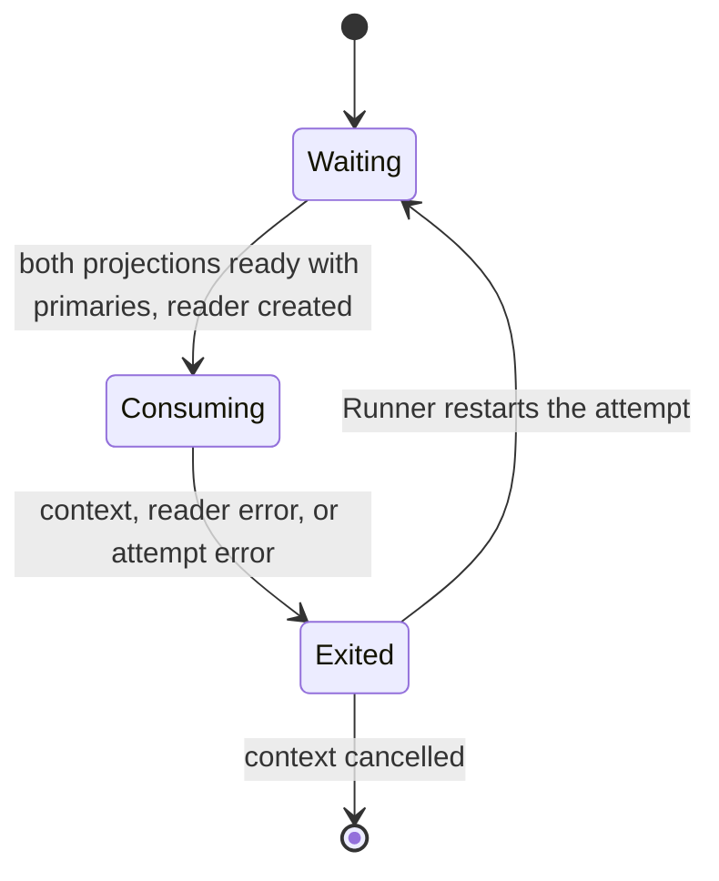
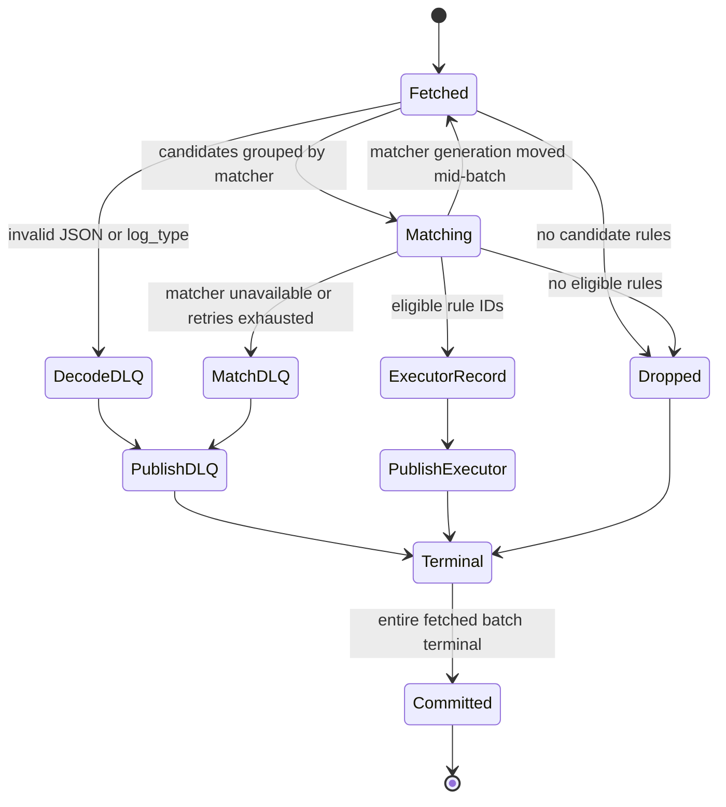

# event_matcher

`event_matcher` consumes raw JSON events, selects rules whose matchers pass, and publishes protobuf `execpb.ExecMessage` records for downstream consumers. It has no executor or process-pool: matcher execution is owned by the actor runtime described in [plugin-runtime.md](../internals/plugin-runtime.md).

## Outer composition

`cmd/event_matcher/main.go` creates one Ergo node with the matcher application already loaded, a matcher service, a health service, and an `internal/services.Runner`. The Runner starts registered services concurrently; a returned service error restarts that service with its own exponential, jittered backoff (1 s base, 60 s cap). SIGINT/SIGTERM cancels the Runner; node close is bounded to 45 seconds.

```text
process
├── Ergo node
│   ├── application: radar (RADAR_HOST:RADAR_PORT, 0.0.0.0:9090) - blink_plugin_*/blink_snapshot_* on /metrics
│   └── application: plugin-matcher-application
│       ├── matcher plugin runtime
│       │   └── generic snapshot supervisor, external projection commit
│       └── rule snapshot supervisor, direct projection commit
└── Runner
    ├── Service (restartable attempt, calls into the runtime above)
    └── HealthService (:8080)
```

The matcher application is process-owned, not attempt-owned: the node starts it, and the service only borrows it through a two-method call surface (`Match`, `State`) plus the rule projection client. A restarted service attempt reuses the running runtime; an application that stops for any reason cancels the Runner and exits the process non-zero, leaving the rebuild to the pod restart. The matcher snapshot and the rule snapshot are each subscribed from their own namespace's controller actor (`controller-matcher-actor`, `controller-rule-actor`) over the native Ergo cluster - not Kafka. Local matcher artifacts are in `MATCHER_PLUGIN_DIR`; rules are not loaded from a local config directory.

### Matcher service attempt lifecycle



| Message                  | Direction                                | Meaning                                                       |
| ------------------------ | ---------------------------------------- | ------------------------------------------------------------- |
| `ProjectionStateRequest` | matcher service → snapshot projections   | Gates consumption on both projections being ready with rules. |
| `Application.Wait`       | `main` → matcher application             | Ends the process when the matcher application stops.          |
| `ctx.Done()`             | Runner/service context → matcher service | Ends the attempt with the fetched batch uncommitted.          |

## Readiness and admission

`/health/live` is always 200 while the health server runs. `/health/ready` is a cached matcher-service verdict, refreshed every 500 ms: the attempt must be live and both projections must be `Ready`. An unreadable projection is tolerated for two seconds before readiness falls, avoiding rollout-transition flapping. Readiness deliberately does not require primaries, so a deployment whose snapshots are legitimately empty reports ready instead of stalling its rollout while startup waits for rules.

Before creating the consumer-group reader, startup additionally requires both projections to be `Ready` with at least one primary, and the matcher runtime's own status to be `Ready` as well. The two are not the same condition: a projection says which matchers are committed, while the runtime status says whether the deployments serving them are routable, and a call routed at a matcher whose route is still starting is rejected outright as unavailable rather than queued. Waiting on the projections alone would leave the first batch racing a subprocess launch. No such wait exists on the rule side, because this service reads rule metadata to decide where an event is forwarded and never invokes a rule, so there is no rule deployment to wait on. A later degraded rule projection remains routable on its last committed generation but is not ready; an unavailable rule projection fails the attempt rather than silently dropping all events. Matcher runtime state reads wait through `ErrPluginUnavailable` for at most `MATCHER_TIMEOUT_SEC + 1s`; other errors fail the attempt.

The service limits concurrent calls into the matcher application with `MAX_CONCURRENT_CALLS`. `MAX_BATCH_SIZE` and `MAX_CONCURRENT_CALLS` are also passed to the runtime as its `MaxBatchSize` and `MaxConcurrentCalls`, which size the admission budgets: a per-plugin budget below `MAX_CONCURRENT_CALLS` `Match` fan-outs would reject a legitimate batch, since that layer rejects rather than waits, and a shared budget below that many again would serialise matcher calls the service is already limiting. One fan-out is bounded by the batch's own size and by the widest invocation capacity a matcher may declare, and a caller never asks for more of a declared capacity than that budget was sized for. Plugin processes are subprocesses rather than calls, so they are budgeted separately: the runtime lets the process grow `GOMAXPROCS x 2` plugin processes past every deployment's `min_procs`. Runtime admission, route queues, plugin processes, rollout, and subprocess ownership are internal details; see [plugin-runtime.md](../internals/plugin-runtime.md#invocation), and [concurrency-knobs.md](../internals/concurrency-knobs.md) for what every knob raises, lowers, and queues.

## Kafka batch contract

The group reader fetches up to `MAX_BATCH_SIZE` (default 50) from `KAFKA_TOPIC_MATCHER` using `KAFKA_GROUP_MATCHER`. Each batch snapshots matcher and rule state once, then processes input positions independently but publishes non-drop records serially in fetched order. Source offsets are committed only after every record reaches a terminal disposition and every required write is acknowledged. Output writes are synchronous; an acknowledged write followed by a failed commit can be replayed, so delivery is at least once.

### Kafka batch terminal lifecycle



| Message          | Direction                                | Meaning                                                              |
| ---------------- | ---------------------------------------- | -------------------------------------------------------------------- |
| `ReadBatch`      | Kafka group reader → matcher service     | Fetches an uncommitted input batch.                                  |
| `Match`          | matcher service → matcher application    | Evaluates grouped candidate events, with bounded retry.              |
| `WriteMessages`  | matcher service → executor/DLQ writer    | Synchronously writes each non-drop terminal record in fetched order. |
| `CommitMessages` | matcher service → Kafka group reader     | Commits offsets only after all required writes succeed.              |
| `ctx.Done()`     | Runner/service context → matcher service | Exits the attempt with the fetched batch uncommitted.                |

Decode failures, a non-string `log_type`, and an event protobuf cannot represent become DLQ records at decode, before any matcher call, since one unencodable event would otherwise fail every call that carried it. Missing or disabled matcher references are deterministic matcher DLQ records with zero attempts. A matcher call retries only its failed subset; whole-call and result shape failures retry all pending items. `MATCHER_MAX_ATTEMPTS` (default 3) is the stop condition. Retry delay starts at `MATCHER_RETRY_BASE_MS` (default 100 ms), has
jitter, and is capped by `MATCHER_RETRY_CAP_MS` (default 5000 ms). After exhaustion, the event is DLQed rather than forwarded. Publication retries under the same attempt limit; publication exhaustion or cancellation exits the service attempt with the fetched batch uncommitted. Once a record is `Terminal`, redelivery occurs only as a later reader fetch in a later attempt.

A promotion between the state snapshot and the calls it authorises retires the routers serving the old generation, so those events are rejected without ever being evaluated. When any call is rejected as unavailable, the service re-reads the runtime state after the batch's own calls have drained: if the committed generation moved, the batch is re-resolved from fresh state instead of dead-lettered - nothing has been published yet, so a replay cannot duplicate output. Anything else keeps its dead-letters, so a plugin failing on one specific event still makes progress. A plugin that is down entirely leaves the rest of the catalog routable, so its events dead-letter while every other matcher keeps matching; only a runtime with nothing routable at all withholds state and stalls the attempt. `MATCHER_MAX_ATTEMPTS` also bounds the replays, so a runtime that never settles ends the attempt with the batch uncommitted.

The downstream record preserves the input Kafka key and contains the source event plus eligible rule IDs. DLQ envelopes preserve the input key and include the original payload, source, stage, reason, attempts, and timestamp. A record that cannot be encoded as either normal or DLQ output is dropped to prevent an infinite replay loop.

## Matching semantics

Candidate rules come from `rules.RulesForLogTypeIn` over the committed rule projection. Each candidate begins eligible. For each event, rules sharing a matcher share one matcher call; a non-match makes all attached candidates ineligible. A rule with several matchers must pass all of them. Per-event failure selection is deterministic (lowest matcher identifier), despite concurrent matcher
groups.

The matcher application splits a batch only where its routing differs, which is two ways at most: while the committed projection carries a canary candidate for that matcher it separates the events whose rollout bucket the candidate wins from the rest, and otherwise takes the whole batch as one group - an answer the rollout gives on its own, so an unsplit batch is never walked to discover it and never copied to describe it. Buckets decide which side an event is on rather than forming groups of their own, since the router picks a deployment from the single rollout key each call carries, so the split does not widen with the tenant count. It then cuts those groups into chunks for two independent reasons and takes the wider: enough chunks to fill the deployment's invocation capacity - its process count times the calls each process serves at once, divided among the groups rather than given whole to each - and enough that no chunk's payload exceeds what the plugin transport accepts, since an oversized request fails outright rather than being rejected into a smaller shape. That second cut is exact rather than estimated: the service encodes each event once when it decodes it, so a batch carries its own per-event byte counts and is cut before the event whose bytes would cross the limit. The encoding is also what every matcher call sends and what the executor record embeds, so an event fanned out to fifty matchers is converted once, not fifty times. Only the second can exceed the capacity, so a bounded worker pool runs the chunks and the capacity stays a ceiling on what is in flight. It preserves input order and validates result cardinality throughout. Shadow calls are submitted only when the committed projection carries a shadow candidate for that matcher; they use a separate, non-blocking admission budget and are best effort, so production calls are not consumed by a full shadow budget.

## Source map

- [`cmd/event_matcher/main.go`](../../cmd/event_matcher/main.go) - process wiring, cluster subscription endpoints, application ownership, node and Runner lifecycle.
- [`cmd/event_matcher/matcher.go`](../../cmd/event_matcher/matcher.go) - readiness, batch terminals, retry, publication, and commit.
- [`pkg/matchers/application.go`](../../pkg/matchers/application.go) - ordered batched matching, rollout grouping, payload-and-capacity chunking, and shadow submissions.
- [`internal/services/runner.go`](../../internal/services/runner.go) - attempt restart policy; [`internal/services/health.go`](../../internal/services/health.go) - probe endpoints.
- [`internal/brokers/broker.go`](../../internal/brokers/broker.go) - reader and writer commit/ack boundary.

## Internals

- [Snapshot runtime](../internals/snapshot-runtime.md) - cluster-subscription reader and typed projection lifecycle used twice above.
- [Plugin runtime](../internals/plugin-runtime.md) - desired state, deployment routing, plugin processes, subprocesses, retries, fencing, and shutdown.
