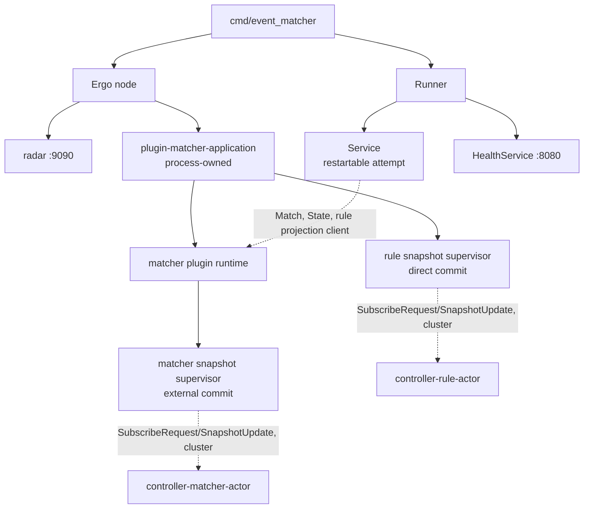
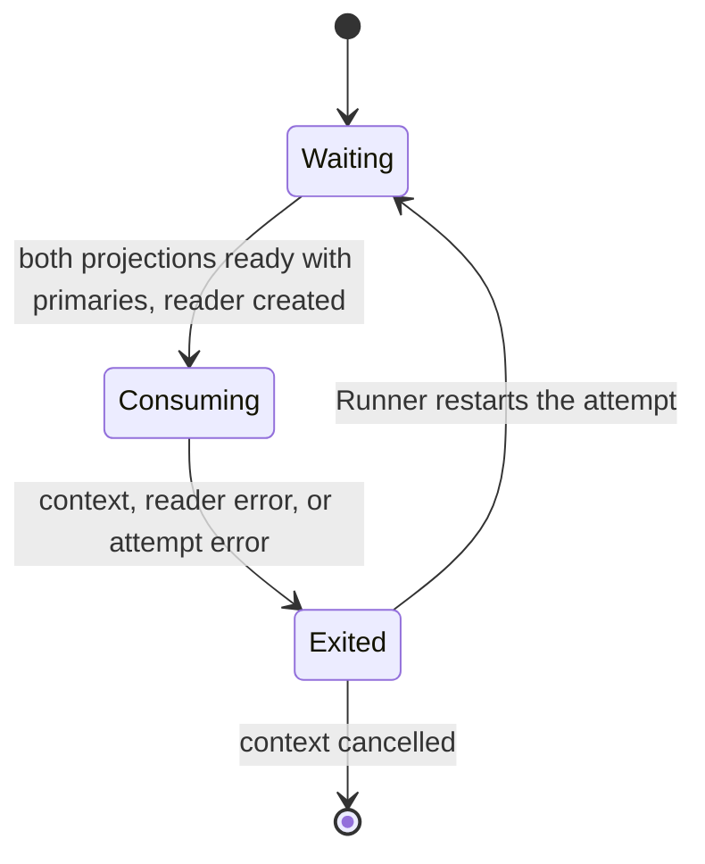
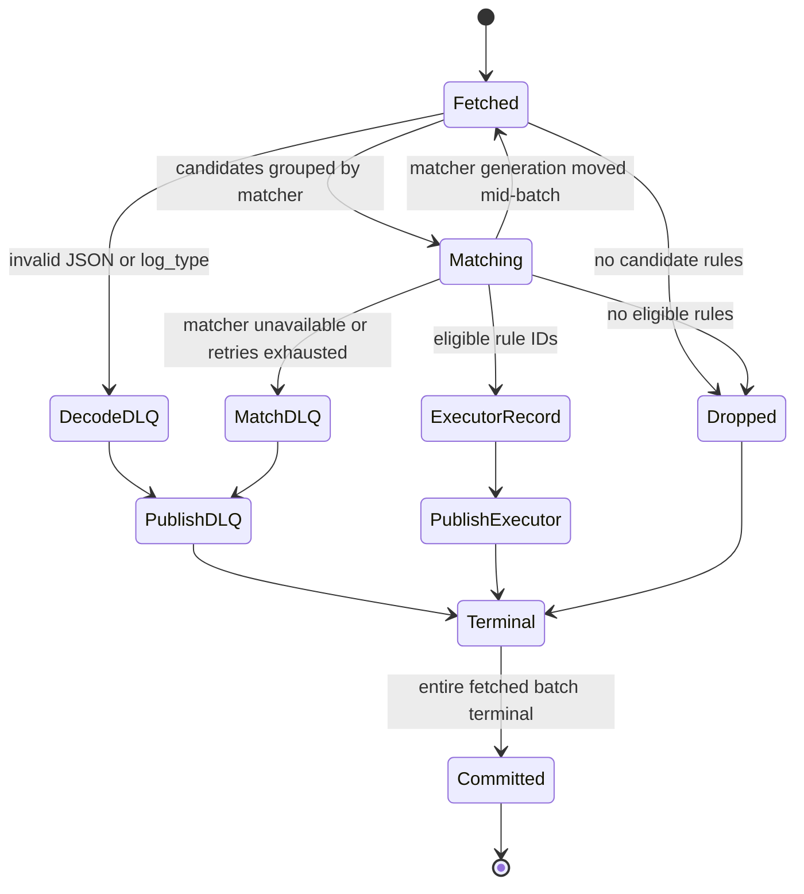

# Event matcher service

[Services index](README.md) · [Plugin runtime](../internals/plugin-runtime.md) · [Snapshot runtime](../internals/snapshot-runtime.md) · [Concurrency knobs](../internals/concurrency-knobs.md)

`event_matcher` consumes raw JSON events, selects rules whose matchers pass, and publishes protobuf `execpb.ExecMessage` records. Matcher execution belongs to the actor runtime in [plugin-runtime.md](../internals/plugin-runtime.md).

## Process composition

`cmd/event_matcher/main.go` creates one Ergo node with the matcher application loaded, a matcher service, a health service, and an `internal/services.Runner`. The Runner starts services concurrently and restarts a failed one with exponential, jittered backoff (1 s base, 60 s cap). `SIGINT`/`SIGTERM` cancels the Runner; node close is bounded to 45 seconds.

| Message                                   | Direction                                                               | Meaning                                                                                                  |
| ----------------------------------------- | ----------------------------------------------------------------------- | -------------------------------------------------------------------------------------------------------- |
| `plugin.Start`                            | `main` → Ergo node                                                      | Starts the node with cluster networking and radar, named `event-matcher-<pod>@<pod ip>`.                 |
| `services.Runner.Register`                | `main` → matcher service, health service                                | Registers the two services.                                                                              |
| `Application` (`matchers.NewApplication`) | `main` → Ergo node                                                      | Loads the process-owned matcher application and the rule snapshot supervisor member, once at node start. |
| `SubscribeRequest`/`SnapshotUpdate`       | matcher/rule snapshot supervisor ↔ namespace controller actor (cluster) | Subscribes to `controller-matcher-actor` and `controller-rule-actor`; receives pushed generations.       |

The matcher application is process-owned, not attempt-owned; the service borrows it through `Match`, `State`, and the rule projection client. A restarted attempt reuses the running runtime; an application that stops cancels the Runner and exits non-zero.

Matcher and rule snapshots come from their own namespace's controller actor over the Ergo cluster, not Kafka. Matcher artifacts live in `MATCHER_PLUGIN_DIR`; rules have no local directory.

## Service lifecycle

| Message                  | Direction                                | Meaning                                                       |
| ------------------------ | ---------------------------------------- | ------------------------------------------------------------- |
| `ProjectionStateRequest` | matcher service → snapshot projections   | Gates consumption on both projections being ready with rules. |
| `Application.Wait`       | `main` → matcher application             | Ends the process when the application stops.                  |
| `ctx.Done()`             | Runner/service context → matcher service | Ends the attempt with the fetched batch uncommitted.          |

## Health and readiness

Health server, `:8080`, probed by the kubelet:

| Endpoint        | Current behavior                                                                                                       |
| --------------- | ---------------------------------------------------------------------------------------------------------------------- |
| `/health/live`  | Always HTTP 200 while the health service is serving.                                                                   |
| `/health/ready` | Cached matcher-service verdict, refreshed every 500 ms: the attempt must be live and both projections must be `Ready`. |
| `/metrics`      | Prometheus metrics for the matcher service and runner.                                                                 |

There is no `/status` endpoint: `event_matcher` registers no `statusFn` with `services.NewHealthService`.

Radar, `RADAR_HOST:RADAR_PORT`, default `0.0.0.0:9090`, carried for every service by `services.Common`:

| Endpoint        | Current behavior                                                                                                                                                              |
| --------------- | ----------------------------------------------------------------------------------------------------------------------------------------------------------------------------- |
| `/health/live`  | Always HTTP 200: no radar readiness signal is registered, and radar reads a signal-less node as healthy.                                                                      |
| `/health/ready` | Always HTTP 200, for the same reason.                                                                                                                                         |
| `/metrics`      | `blink_plugin_*` ([plugin runtime](../internals/plugin-runtime.md#telemetry)) and `blink_snapshot_*` ([snapshot runtime](../internals/snapshot-runtime.md#telemetry)) series. |

### Readiness and admission

An unreadable projection is tolerated for 2 seconds before readiness falls. Readiness does not require primaries.

Startup is stricter. Before creating the consumer-group reader it also requires:

- both projections `Ready` with at least one primary;
- the matcher runtime's own status `Ready`.

The rule side has no such wait. A degraded rule projection stays routable on its last committed generation but is not ready; an unavailable one fails the attempt. Matcher runtime state reads wait through `ErrPluginUnavailable` for at most `MATCHER_TIMEOUT_SEC + 1s`; other errors fail the attempt.

Admission knobs:

- `MAX_CONCURRENT_CALLS` caps concurrent service calls into the matcher application.
- `MAX_BATCH_SIZE` and `MAX_CONCURRENT_CALLS` also pass to the runtime as `MaxBatchSize` and `MaxConcurrentCalls`, sizing its per-plugin and shared admission budgets, which reject rather than wait.
- A fan-out is bounded by the batch size and by the widest invocation capacity a matcher may declare.
- Plugin processes are subprocesses, budgeted separately: up to `GOMAXPROCS x 2` past every deployment's `min_procs`.

See [plugin-runtime.md](../internals/plugin-runtime.md#invocation) and [concurrency-knobs.md](../internals/concurrency-knobs.md).

## Kafka batch contract

The group reader fetches up to `MAX_BATCH_SIZE` (default 50) from `KAFKA_TOPIC_MATCHER` using `KAFKA_GROUP_MATCHER`. Each batch snapshots matcher and rule state once. Positions are processed independently, but non-drop records are published serially in fetched order. Offsets commit only after every record is terminal and every required write is acknowledged. Writes are synchronous, so delivery is at least once.

### Kafka batch terminal lifecycle

| Message          | Direction                                | Meaning                                                              |
| ---------------- | ---------------------------------------- | -------------------------------------------------------------------- |
| `ReadBatch`      | Kafka group reader → matcher service     | Fetches an uncommitted input batch.                                  |
| `Match`          | matcher service → matcher application    | Evaluates grouped candidate events, with bounded retry.              |
| `WriteMessages`  | matcher service → executor/DLQ writer    | Synchronously writes each non-drop terminal record in fetched order. |
| `CommitMessages` | matcher service → Kafka group reader     | Commits offsets only after all required writes succeed.              |
| `ctx.Done()`     | Runner/service context → matcher service | Exits the attempt with the fetched batch uncommitted.                |

Three inputs DLQ at decode, before any matcher call: a decode failure, a non-string `log_type`, or an event the protobuf cannot represent. Missing or disabled matcher references become deterministic matcher DLQ records with zero attempts.

Retry:

- A matcher call retries only its failed subset; whole-call and result-shape failures retry all pending items.
- `MATCHER_MAX_ATTEMPTS` (default 3) is the stop condition.
- The delay starts at `MATCHER_RETRY_BASE_MS` (default 100 ms), carries jitter, and is capped by `MATCHER_RETRY_CAP_MS` (default 5000 ms).
- After exhaustion the event is DLQed.

Publication retries under the same limit; exhaustion or cancellation exits the attempt with the batch uncommitted. A `Terminal` record is redelivered only by a later fetch in a later attempt.

A promotion mid-batch retires the old generation's routers, and those events are rejected unevaluated. On an unavailable rejection the service re-reads runtime state after the batch's calls drain; if the committed generation moved, the batch is re-resolved instead of dead-lettered. Other rejections keep their dead-letters. A plugin that is down leaves the rest of the catalog routable; only a runtime with nothing routable stalls the attempt. `MATCHER_MAX_ATTEMPTS` bounds these replays.

The downstream record preserves the input Kafka key and carries the source event plus eligible rule IDs. DLQ envelopes preserve the key and add the original payload, source, stage, reason, attempts, and timestamp. A record encodable as neither output is dropped.

## Matching semantics

Candidate rules come from `rules.RulesForLogTypeIn` over the committed rule projection. Each candidate begins eligible.

- Rules sharing a matcher share one matcher call per event.
- A non-match makes all attached candidates ineligible.
- A rule with several matchers must pass all of them.
- Per-event failure selection is deterministic: lowest matcher identifier.

The matcher application splits a batch at most two ways, and only where routing differs:

- with a canary candidate committed, events whose rollout bucket the candidate wins are separated from the rest;
- otherwise the whole batch is one group.

Each group is then chunked two ways, and the wider cut wins:

- enough chunks to fill the deployment's invocation capacity: process count times concurrent calls per process, divided among the groups;
- enough that no chunk's payload exceeds what the plugin transport accepts.

The payload cut is exact: each event is encoded once at decode, so the batch carries per-event byte counts and is cut before the event that would cross the limit.

A bounded worker pool runs the chunks, capped by invocation capacity. Chunking preserves input order and validates result cardinality.

Shadow calls go out only when the committed projection carries a shadow candidate, on a separate non-blocking budget, best effort.

## Source references

- [`cmd/event_matcher/main.go`](../../cmd/event_matcher/main.go) - process wiring, subscription endpoints, application ownership, node and Runner lifecycle.
- [`cmd/event_matcher/matcher.go`](../../cmd/event_matcher/matcher.go) - readiness, batch terminals, retry, publication, commit.
- [`pkg/matchers/application.go`](../../pkg/matchers/application.go) - ordered matching, rollout grouping, payload/capacity chunking, shadow submissions.
- [`internal/services/runner.go`](../../internal/services/runner.go) - restart policy; [`internal/services/health.go`](../../internal/services/health.go) - probe endpoints.
- [`internal/brokers/broker.go`](../../internal/brokers/broker.go) - commit/ack boundary.
