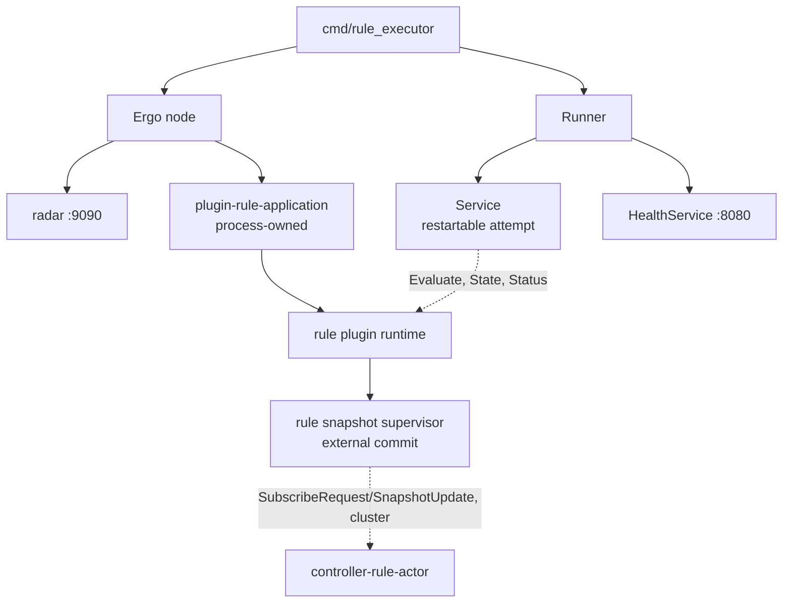
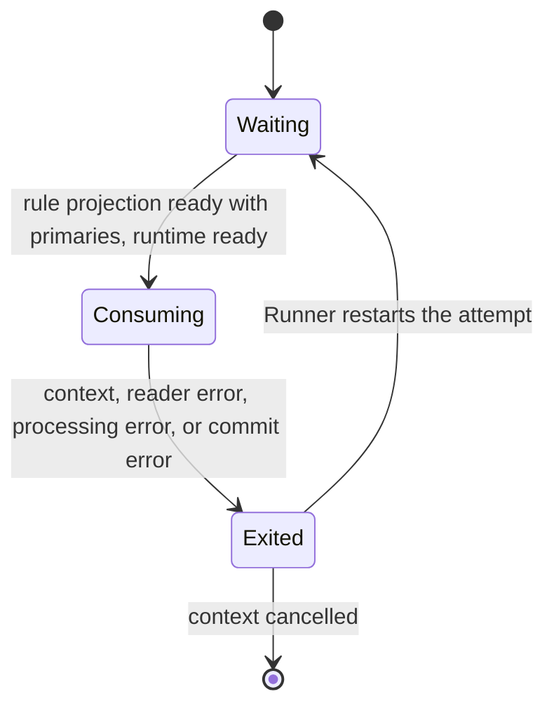
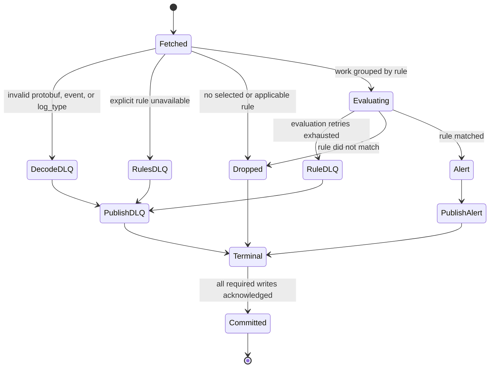

# Rule executor service

[Services index](README.md) · [Plugin runtime](../internals/plugin-runtime.md) · [Snapshot runtime](../internals/snapshot-runtime.md) · [Concurrency knobs](../internals/concurrency-knobs.md)

`rule_executor` consumes protobuf `execpb.ExecMessage` records, evaluates the selected rule plugins, and publishes alerts or executor dead-letter records. Rule execution belongs to the actor runtime in [plugin-runtime.md](../internals/plugin-runtime.md).

## Process composition

`cmd/rule_executor/main.go` creates one Ergo node with the rule application loaded, an executor service, a health service, and an `internal/services.Runner`. The Runner starts services concurrently and restarts a failed one with exponential, jittered backoff (1 s base, 60 s cap). `SIGINT`/`SIGTERM` cancels the Runner; node close is bounded to 45 seconds.

| Message                                | Direction                                       | Meaning                                                                                  |
| -------------------------------------- | ----------------------------------------------- | ---------------------------------------------------------------------------------------- |
| `plugin.Start`                         | `main` → Ergo node                              | Starts the node with cluster networking and radar, named `rule-executor-<pod>@<pod ip>`. |
| `services.Runner.Register`             | `main` → executor service, health service       | Registers the two services.                                                              |
| `Application` (`rules.NewApplication`) | `main` → Ergo node                              | Loads the process-owned rule plugin application once at node start.                      |
| `SubscribeRequest`/`SnapshotUpdate`    | rule snapshot supervisor ↔ controller (cluster) | Subscribes to `controller-rule-actor` and receives pushed generations.                   |

The rule application is process-owned, not attempt-owned. A restarted service attempt reuses the running runtime through `Evaluate`, `State`, and `Status`; an application that stops cancels the Runner and exits non-zero.

Rule artifacts and metadata come from the rule namespace's controller actor over the Ergo cluster, not Kafka. The controller scans `RULE_PLUGIN_DIR`; the executor mounts the same directory so the runtime can resolve and start the binaries named by each snapshot.

## Service lifecycle

| Message              | Direction                                 | Meaning                                                   |
| -------------------- | ----------------------------------------- | --------------------------------------------------------- |
| `Application.State`  | executor service → rule application       | Pins one committed rule projection for the fetched batch. |
| `Application.Status` | executor service → rule application       | Participates in the stricter startup gate.                |
| `Application.Wait`   | `main` → rule application                 | Ends the process when the application stops.              |
| `ctx.Done()`         | Runner/service context → executor service | Ends the attempt with the fetched batch uncommitted.      |

## Health and readiness

Health server, `:8080`, probed by the kubelet:

| Endpoint        | Current behavior                                                                                                  |
| --------------- | ----------------------------------------------------------------------------------------------------------------- |
| `/health/live`  | Always HTTP 200 while the health service is serving.                                                              |
| `/health/ready` | Cached executor-service verdict, refreshed every 500 ms: the attempt must be live and rule state must be `Ready`. |
| `/metrics`      | Prometheus metrics for the executor service and runner.                                                           |

There is no `/status` endpoint: `rule_executor` registers no `statusFn` with `services.NewHealthService`.

Radar, `RADAR_HOST:RADAR_PORT`, default `0.0.0.0:9090`, carried for every service by `services.Common`:

| Endpoint        | Current behavior                                                                                                                                                              |
| --------------- | ----------------------------------------------------------------------------------------------------------------------------------------------------------------------------- |
| `/health/live`  | Always HTTP 200: no radar readiness signal is registered, and radar reads a signal-less node as healthy.                                                                      |
| `/health/ready` | Always HTTP 200, for the same reason.                                                                                                                                         |
| `/metrics`      | `blink_plugin_*` ([plugin runtime](../internals/plugin-runtime.md#telemetry)) and `blink_snapshot_*` ([snapshot runtime](../internals/snapshot-runtime.md#telemetry)) series. |

### Readiness and admission

An unreadable or non-ready rule state is tolerated for 2 seconds before readiness falls. Readiness does not require primaries after startup.

Startup is stricter. Before creating the consumer-group reader it requires:

- the rule projection `Ready` with at least one primary;
- the rule runtime's own status `Ready`.

`EXECUTOR_CONCURRENCY` caps concurrent service calls into the rule application. `EXECUTOR_BATCH_SIZE` and `EXECUTOR_CONCURRENCY` also pass to the runtime as `MaxBatchSize` and `MaxConcurrentCalls`, sizing its per-plugin and shared admission budgets. The application may split one rule's events by rollout side and payload size, but its bounded worker budget limits active invocations.

Plugin processes are subprocesses, budgeted separately: up to `GOMAXPROCS x 2` past every deployment's `min_procs`. See [plugin-runtime.md](../internals/plugin-runtime.md#invocation) and [concurrency-knobs.md](../internals/concurrency-knobs.md).

### Metrics

Two registries. The health server serves the default Go registry; radar serves its own.

| Family                  | Endpoint         | Series                                                         |
| ----------------------- | ---------------- | -------------------------------------------------------------- |
| `blink_rule_executor_*` | `:8080/metrics`  | below                                                          |
| `blink_runner_*`        | `:8080/metrics`  | [shared metrics](README.md#shared-metrics)                     |
| `blink_plugin_*`        | radar `/metrics` | [plugin runtime](../internals/plugin-runtime.md#telemetry)     |
| `blink_snapshot_*`      | radar `/metrics` | [snapshot runtime](../internals/snapshot-runtime.md#telemetry) |

The radar series carry the `rule` namespace label. The `:8080` series carry no namespace label.

| Metric                                                   | Meaning                                                              |
| -------------------------------------------------------- | -------------------------------------------------------------------- |
| `blink_rule_executor_batch_size`                         | Records returned by each successful fetch.                           |
| `blink_rule_executor_events_in_total`                    | Records fetched, including records later dead-lettered or dropped.   |
| `blink_rule_executor_alerts_out_total`                   | Alerts acknowledged by the merger-topic writer.                      |
| `blink_rule_executor_rule_evaluation_seconds{rule}`      | One rule application call, including failed calls.                   |
| `blink_rule_executor_rule_evaluation_errors_total{rule}` | Whole-call failures plus failed result items.                        |
| `blink_rule_executor_read_batch_errors_total`            | Failed batch fetches; context cancellation excluded.                 |
| `blink_rule_executor_read_batch_seconds`                 | Batch-fetch latency, including failed fetches.                       |
| `blink_rule_executor_commit_errors_total`                | Failed source-offset commits; context cancellation excluded.         |
| `blink_rule_executor_commit_seconds`                     | Successful source-offset commit latency.                             |
| `blink_rule_executor_events_parse_errors_total`          | Invalid protobuf, missing event, or event re-encoding failure.       |
| `blink_rule_executor_events_invalid_log_type_total`      | Events whose `log_type` is not a string.                             |
| `blink_rule_executor_events_no_rules_total`              | Valid events with no rules selected before enabled/subkey filtering. |
| `blink_rule_executor_batch_processing_seconds`           | Successful fetch-through-commit latency.                             |
| `blink_rule_executor_rules_per_batch`                    | Distinct rules evaluated in a fetched batch.                         |
| `blink_rule_executor_concurrent_rules`                   | Rule application calls holding a service concurrency permit.         |
| `blink_rule_executor_alerts_write_errors_total`          | Failed merger-topic write attempts.                                  |
| `blink_rule_executor_alerts_write_seconds`               | Successful alert publication latency, including retries.             |
| `blink_rule_executor_dlq_records_total{stage}`           | Serialized executor DLQ records by failure stage.                    |
| `blink_rule_executor_dlq_write_errors_total`             | Failed executor-DLQ write attempts.                                  |
| `blink_rule_executor_rule_matches_total{rule}`           | Matched alerts acknowledged by the merger-topic writer.              |

## Kafka batch contract

The group reader fetches up to `EXECUTOR_BATCH_SIZE` (default 10,000) from `KAFKA_TOPIC_EXECUTOR` using `KAFKA_GROUP_EXECUTOR`. Each batch pins rule state once. Rules evaluate concurrently, while `EXECUTOR_CONCURRENCY` (default 10) bounds active application calls. Offsets commit only after every required alert and DLQ write succeeds. Writes are synchronous with all replicas required, so delivery is at least once.

### Kafka batch terminal lifecycle

| Message          | Direction                                 | Meaning                                                         |
| ---------------- | ----------------------------------------- | --------------------------------------------------------------- |
| `ReadBatch`      | executor topic → executor service         | Fetches an uncommitted protobuf `ExecMessage` batch.            |
| `Evaluate`       | executor service → rule application       | Evaluates one rule's pending events through the plugin runtime. |
| `WriteMessages`  | executor service → merger/DLQ writer      | Writes prepared alerts first, then executor DLQ records.        |
| `CommitMessages` | executor service → executor-topic reader  | Commits offsets only after all required writes succeed.         |
| `ctx.Done()`     | Runner/service context → executor service | Exits the attempt with the fetched batch uncommitted.           |

Three inputs DLQ before any rule call: an invalid `ExecMessage`, a missing event or non-string `log_type`, and an explicitly requested rule unavailable for that log type. A DLQ envelope preserves the input key, payload, topic, partition, offset, stage, reason, attempts, and timestamp.

Evaluation retry:

- Rules run concurrently, with active application calls bounded by `EXECUTOR_CONCURRENCY`.
- A rule call retries only its failed items; whole-call and result-shape failures retry all pending items.
- `EXECUTOR_MAX_ATTEMPTS` (default 3) is the evaluation stop condition.
- The delay starts at `EXECUTOR_RETRY_BASE_MS` (default 100 ms), carries jitter, and is capped by `EXECUTOR_RETRY_CAP_MS` (default 5000 ms).
- After exhaustion, each failed rule-item pair produces a DLQ record; one input can therefore produce several executor DLQs.

Publication uses the same jittered backoff but has no attempt limit; cancellation is its bound. Alerts are prepared before any write, then published by rule and input order; all DLQs follow. A later failure leaves the source batch uncommitted, so already acknowledged outputs can repeat after restart.

Matched alerts use `Alert.MergePartitionKey()` as their Kafka key, not the input key. A rule result may overlay event context, override merge-by keys, and override severity. An invalid severity or alert serialization failure aborts preparation before any write and leaves the batch uncommitted. No-match, disabled, subkey-inapplicable, and no-rule inputs produce no output.

## Rule selection and execution

The committed rule projection is filtered by the event's `log_type`; a rule with no `log_types` applies to all log types. `ExecMessage.rule_ids` narrows that set when present. This lets `event_matcher` forward only rules whose matcher predicates passed, while direct producers may omit IDs and request every rule for the log type.

Selected rules are grouped by rule ID. Each event is encoded once and its bytes are reused for retries. The rule application then:

- mirrors to a shadow candidate on a separate non-blocking budget when configured;
- splits a canary rollout into at most two route groups;
- shards each group to stay below the plugin transport payload limit and declared invocation capacity;
- restores the input item order before returning results.

## Configuration

Required service variables are `KAFKA_BROKERS`, `ETCD_ENDPOINTS`, `CLUSTER_COOKIE`, `RULE_PLUGIN_DIR`, `KAFKA_TOPIC_EXECUTOR`, `KAFKA_GROUP_EXECUTOR`, `KAFKA_TOPIC_MERGER`, and `KAFKA_TOPIC_EXECUTOR_DLQ`. `CONTROLLER_NODE_HOST` defaults to `controller`; Kubernetes supplies `POD_NAME` and `POD_IP` for the node and executor identity.

| Variable                 | Default | Meaning                                                        |
| ------------------------ | ------- | -------------------------------------------------------------- |
| `EXECUTOR_BATCH_SIZE`    | `10000` | Maximum records fetched per source batch.                      |
| `EXECUTOR_CONCURRENCY`   | `10`    | Maximum active service calls into the rule application.        |
| `EXECUTOR_TIMEOUT_SEC`   | `10`    | Deadline for one rule application call.                        |
| `EXECUTOR_MAX_ATTEMPTS`  | `3`     | Evaluation attempts before a failed item is dead-lettered.     |
| `EXECUTOR_RETRY_BASE_MS` | `100`   | Initial evaluation and publication retry delay.                |
| `EXECUTOR_RETRY_CAP_MS`  | `5000`  | Maximum retry delay; raised to the base when configured lower. |

## Source references

- [`cmd/rule_executor/main.go`](../../cmd/rule_executor/main.go) - process wiring, rule application ownership, node, health, and Runner lifecycle.
- [`cmd/rule_executor/executor/executor.go`](../../cmd/rule_executor/executor/executor.go) - readiness, batch processing, retries, alerts, DLQs, publication, and commit.
- [`pkg/rules/application.go`](../../pkg/rules/application.go) - rollout routing, payload/capacity sharding, ordered results, and shadow submissions.
- [`internal/runtime/plugin`](../../internal/runtime/plugin) - plugin supervision, admission, deployment, and subprocess lifecycle.
- [`internal/runtime/snapshot`](../../internal/runtime/snapshot) - controller subscription and committed rule projection.
- [`internal/services/runner.go`](../../internal/services/runner.go) - restart policy; [`internal/services/health.go`](../../internal/services/health.go) - probe endpoints.
- [`internal/brokers/kafka.go`](../../internal/brokers/kafka.go) - synchronous writes and explicit fetch/commit boundary; [`internal/dlq/dlq.go`](../../internal/dlq/dlq.go) - DLQ envelope.
