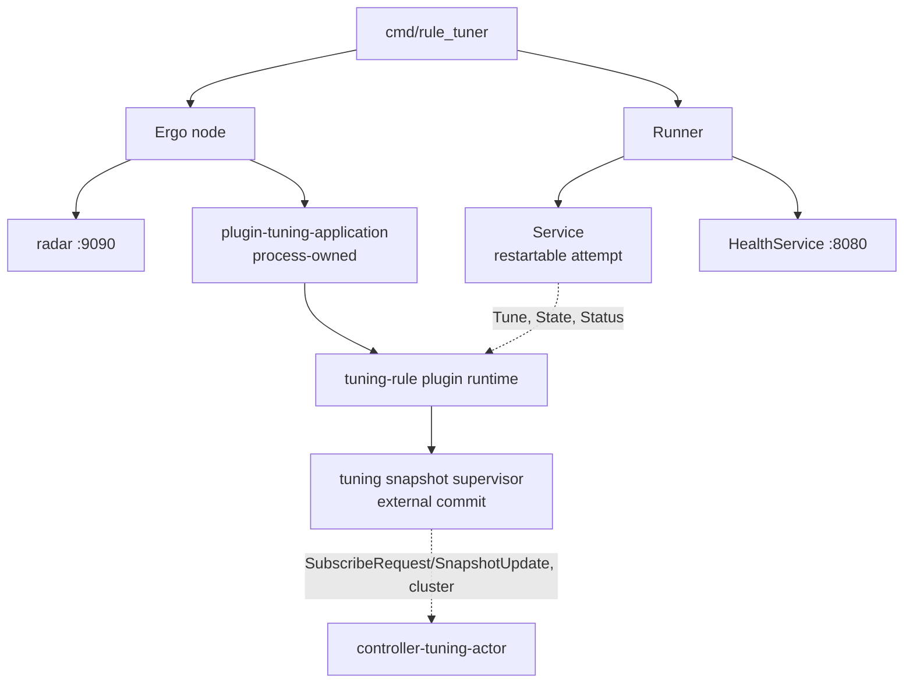
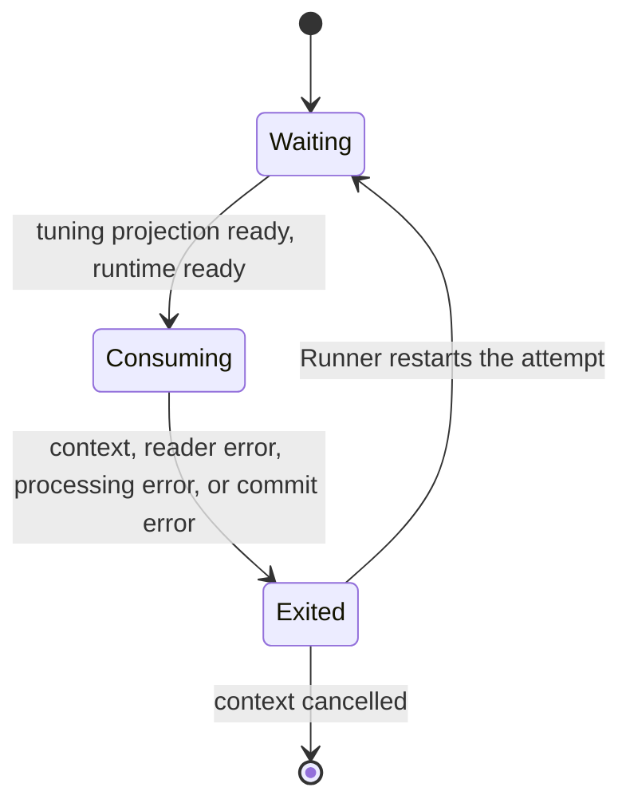
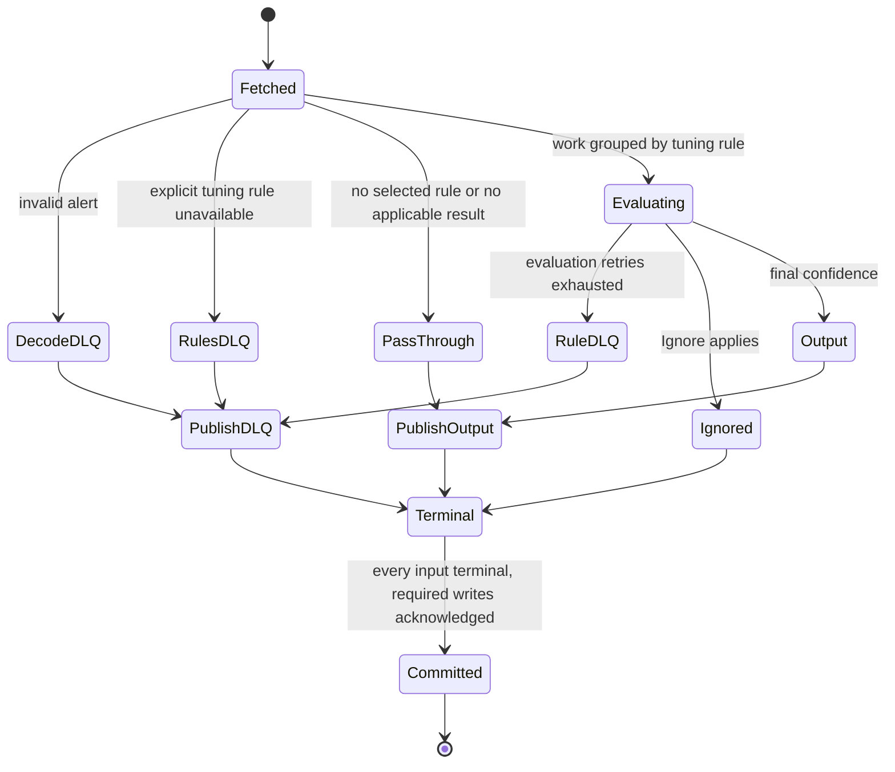

# Rule tuner service

[Services index](README.md) · [Plugin runtime](../internals/plugin-runtime.md) · [Snapshot runtime](../internals/snapshot-runtime.md) · [Concurrency knobs](../internals/concurrency-knobs.md)

`rule_tuner` consumes alerts, applies tuning-rule plugins, and publishes an alert with adjusted confidence, a terminal DLQ record, or no output for an ignored alert. Tuning execution belongs to the actor runtime in [plugin-runtime.md](../internals/plugin-runtime.md).

## Process composition

`cmd/rule_tuner/main.go` creates one Ergo node with the tuning application loaded, a tuner service, a health service, and an `internal/services.Runner`. The Runner starts services concurrently and restarts a failed one with exponential, jittered backoff (1 s base, 60 s cap). `SIGINT`/`SIGTERM` cancels the Runner; node close is bounded to 45 seconds.

| Message                                       | Direction                                         | Meaning                                                                               |
| --------------------------------------------- | ------------------------------------------------- | ------------------------------------------------------------------------------------- |
| `plugin.Start`                                | `main` → Ergo node                                | Starts the node with cluster networking and radar, named `rule-tuner-<pod>@<pod ip>`. |
| `services.Runner.Register`                    | `main` → tuner service, health service            | Registers the two services.                                                           |
| `Application` (`tuning_rules.NewApplication`) | `main` → Ergo node                                | Loads the process-owned tuning-rule application once at node start.                   |
| `SubscribeRequest`/`SnapshotUpdate`           | tuning snapshot supervisor ↔ controller (cluster) | Subscribes to `controller-tuning-actor` and receives pushed generations.              |

The tuning application is process-owned, not attempt-owned. A restarted service attempt reuses the running runtime through `Tune`, `State`, and `Status`; an application that stops cancels the Runner and exits non-zero.

Tuning artifacts and metadata come from the tuning namespace's controller actor over the Ergo cluster, not Kafka. The controller scans `TUNER_PLUGIN_DIR`; the tuner mounts the same directory so the runtime can resolve and start binaries named by each snapshot.

## Service lifecycle

| Message              | Direction                              | Meaning                                                     |
| -------------------- | -------------------------------------- | ----------------------------------------------------------- |
| `Application.State`  | tuner service → tuning application     | Pins one committed tuning projection for the fetched batch. |
| `Application.Status` | tuner service → tuning application     | Participates in the startup gate.                           |
| `Application.Wait`   | `main` → tuning application            | Ends the process when the application stops.                |
| `ctx.Done()`         | Runner/service context → tuner service | Ends the attempt with the fetched batch uncommitted.        |

## Health and readiness

Health server, `:8080`, probed by the kubelet:

| Endpoint        | Current behavior                                                                                                 |
| --------------- | ---------------------------------------------------------------------------------------------------------------- |
| `/health/live`  | Always HTTP 200 while the health service is serving.                                                             |
| `/health/ready` | Cached tuner-service verdict, refreshed every 500 ms: the attempt must be live and tuning state must be `Ready`. |
| `/metrics`      | Prometheus metrics for the tuner service and runner.                                                             |

There is no `/status` endpoint: `rule_tuner` registers no `statusFn` with `services.NewHealthService`.

Radar, `RADAR_HOST:RADAR_PORT`, default `0.0.0.0:9090`, carried for every service by `services.Common`:

| Endpoint        | Current behavior                                                                                                                                                              |
| --------------- | ----------------------------------------------------------------------------------------------------------------------------------------------------------------------------- |
| `/health/live`  | HTTP 200 while Radar is serving; subtree signals affect readiness only.                                                                                                       |
| `/health/ready` | HTTP 503 if any registered subtree readiness signal is down or expires (90 s without a heartbeat).                                                                            |
| `/metrics`      | `blink_plugin_*` ([plugin runtime](../internals/plugin-runtime.md#telemetry)) and `blink_snapshot_*` ([snapshot runtime](../internals/snapshot-runtime.md#telemetry)) series. |

### Readiness and admission

The cached state read runs every 500 ms with a 1 s read deadline. An unreadable or non-ready state is tolerated for 2 s before readiness falls.

Startup waits for the tuning projection and runtime status to be `Ready`, but does **not** require a primary. Unlike the executor's nonempty startup gate, an empty ready tuner is valid because every alert can pass through unchanged.

State reads during a batch retry only `ErrPluginUnavailable` for approximately `TIMEOUT_SEC + 1s`; that is a retry window, not a hard call deadline. Other errors fail the attempt. Unlike matcher, tuner does not replay a batch when a generation moves.

`MAX_CONCURRENT_CALLS` caps concurrent service calls into the tuning application. `MAX_BATCH_SIZE` and `MAX_CONCURRENT_CALLS` also pass to the runtime as `MaxBatchSize` and `MaxConcurrentCalls`, sizing its per-plugin and shared admission budgets. Plugin processes are subprocesses, budgeted separately: a CPU- and memory-derived process budget past every deployment's `min_procs`. See [plugin-runtime.md](../internals/plugin-runtime.md#invocation) and [concurrency-knobs.md](../internals/concurrency-knobs.md).

### Metrics

Two registries. The health server serves the default Go registry; radar serves its own.

| Family               | Endpoint         | Series                                                         |
| -------------------- | ---------------- | -------------------------------------------------------------- |
| `blink_rule_tuner_*` | `:8080/metrics`  | below                                                          |
| `blink_runner_*`     | `:8080/metrics`  | [shared metrics](README.md#shared-metrics)                     |
| `blink_plugin_*`     | radar `/metrics` | [plugin runtime](../internals/plugin-runtime.md#telemetry)     |
| `blink_snapshot_*`   | radar `/metrics` | [snapshot runtime](../internals/snapshot-runtime.md#telemetry) |

The radar series carry the `tuning` namespace label. The `:8080` series carry no namespace label.

The [Kafka-stage metric contract](README.md#kafka-stage-metrics) defines the shared counters, histograms, labels, and measurement points. Use prefix `blink_rule_tuner_`. `destination="output"` means the enricher-topic writer; DLQ stages are `decode`, `tuning_rules`, `encode`, and `tuning_rule`.

| Additional metric                           | Meaning                                                                                                |
| ------------------------------------------- | ------------------------------------------------------------------------------------------------------ |
| `blink_rule_tuner_alerts_out_total{result}` | Alerts acknowledged by output writes: `mutated` iff final confidence differs; otherwise `passthrough`. |

`scope="event", reason="ignored"` counts the Ignore terminal. `scope="event", reason="dlq_encode"` counts an unserializable DLQ envelope. Event-scoped drop metrics do not count no-rule pass-throughs: no rules is an output, not a drop. A pass-through is semantic (the final confidence is unchanged), not a claim that output bytes are identical to input bytes.

## Kafka batch contract

The group reader fetches up to `MAX_BATCH_SIZE` (default 10,000) from `KAFKA_TOPIC_TUNER` using `KAFKA_GROUP_TUNER`. Each batch reads tuning state once. Rules evaluate concurrently, while `MAX_CONCURRENT_CALLS` (default 10) bounds active application calls. All terminals are prepared before any publication; output and DLQ writes then happen serially in fetched input order. Offsets commit only after every input has a terminal and every required write succeeds. Writes are synchronous, so delivery is at least once.

### Kafka batch terminal lifecycle

| Message          | Direction                              | Meaning                                                                |
| ---------------- | -------------------------------------- | ---------------------------------------------------------------------- |
| `ReadBatch`      | tuner topic → tuner service            | Fetches an uncommitted alert batch.                                    |
| `Tune`           | tuner service → tuning application     | Evaluates one tuning rule's pending alerts through the plugin runtime. |
| `WriteMessages`  | tuner service → enricher/DLQ writer    | Writes prepared output or DLQ terminals in fetched input order.        |
| `CommitMessages` | tuner service → tuner-topic reader     | Commits offsets only after all inputs are terminal and writes succeed. |
| `ctx.Done()`     | Runner/service context → tuner service | Exits the attempt with the fetched batch uncommitted.                  |

An invalid alert DLQs at `decode`; an unavailable or disabled explicit reference DLQs at `tuning_rules`; encoding the input alert for rule calls DLQs at `encode`. A failed rule's selected terminal DLQs at `tuning_rule`. DLQ envelopes preserve the source key, payload, topic, partition, offset, stage, reason, attempts, and timestamp. If a DLQ envelope cannot encode, it is event-scoped `dlq_encode` and drops.

Evaluation retries only failed alert-rule pairs; a whole-call or result-shape failure retries all pending items. `MAX_ATTEMPTS` (default 3) limits evaluation only. Delay starts at `RETRY_BASE_MS` (default 100 ms), carries jitter, and is capped at `RETRY_CAP_MS` (default 5000 ms). Publication uses the same backoff but retries until context cancellation. A later write or commit failure leaves the batch uncommitted, so an already acknowledged output or DLQ may repeat after restart.

## Tuning selection and semantics

Enabled global rules run first, followed by the alert's explicit `Rule.TuningRules`, deduplicated by logical rule ID. A missing or disabled explicit rule is a `tuning_rules` DLQ. Every decoded alert with no selected rules publishes unchanged; it is not an ignored or dropped event. The source Kafka key is preserved on every output alert.

Every selected rule receives an encoded alert batch. Rule calls may split by rollout side and shard by payload and invocation capacity; their returned items are restored to input order. `Applies=false` is a pass-through contribution. If any selected rule fails, the input becomes one `tuning_rule` DLQ even if another rule says Ignore; the lexicographically smallest failing rule ID selects that DLQ deterministically.

For successful applicable results, aggregation is ordered:

1. `Ignore` produces the ignored terminal.
2. Otherwise, `SetConfidence` selects the maximum set confidence.
3. Otherwise, results apply in selected-rule order: `IncreaseConfidence` raises only above the current value and `DecreaseConfidence` lowers only below it.

## Configuration

Required service variables are `KAFKA_BROKERS`, `ETCD_ENDPOINTS`, `CLUSTER_COOKIE`, `TUNER_PLUGIN_DIR`, `KAFKA_TOPIC_TUNER`, `KAFKA_GROUP_TUNER`, `KAFKA_TOPIC_ENRICHER`, and `KAFKA_TOPIC_TUNER_DLQ`. `CONTROLLER_NODE_HOST` defaults to `controller`; Kubernetes supplies `POD_NAME` and `POD_IP` for node and tuner identity.

| Variable               | Default | Meaning                                                         |
| ---------------------- | ------- | --------------------------------------------------------------- |
| `MAX_BATCH_SIZE`       | `10000` | Maximum alerts fetched per source batch.                        |
| `MAX_CONCURRENT_CALLS` | `10`    | Maximum active service calls into the tuning application.       |
| `TIMEOUT_SEC`          | `10`    | Deadline for one tuning application call.                       |
| `MAX_ATTEMPTS`         | `3`     | Evaluation attempts before a failed rule-item is dead-lettered. |
| `RETRY_BASE_MS`        | `100`   | Initial evaluation and publication retry delay.                 |
| `RETRY_CAP_MS`         | `5000`  | Maximum retry delay; raised to the base when configured lower.  |

## Source references

- [`cmd/rule_tuner/main.go`](../../cmd/rule_tuner/main.go) - process wiring, tuning application ownership, node, health, and Runner lifecycle.
- [`cmd/rule_tuner/tuner/tuner.go`](../../cmd/rule_tuner/tuner/tuner.go) - readiness, decode/selection/encoding, retries, terminals, publication, metrics, and commit.
- [`pkg/tuning_rules/application.go`](../../pkg/tuning_rules/application.go) - rollout routing, payload/capacity sharding, ordered results, and shadow submissions; [`pkg/tuning_rules/tuning_rule.go`](../../pkg/tuning_rules/tuning_rule.go) - plugin result contract.
- [`internal/runtime/plugin`](../../internal/runtime/plugin) - plugin supervision, admission, deployment, and subprocess lifecycle; [`internal/runtime/snapshot`](../../internal/runtime/snapshot) - controller subscription and committed tuning projection.
- [`internal/services/runner.go`](../../internal/services/runner.go) - restart policy; [`internal/services/health.go`](../../internal/services/health.go) - probe endpoints.
- [`internal/brokers/kafka.go`](../../internal/brokers/kafka.go) - synchronous writes and explicit fetch/commit boundary; [`internal/dlq/dlq.go`](../../internal/dlq/dlq.go) - DLQ envelope.
